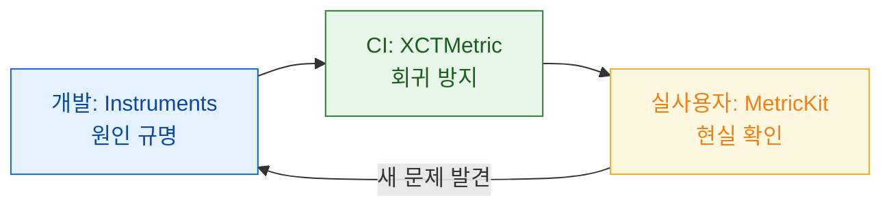

## 성능은 개발·CI·실사용자 세 층에서 측정해야 하고 각 층이 서로를 대체하지 못한다

성능 작업이 실패하는 전형적인 이유는 **한 층만 보기 때문**이다.

| 층 | 도구 | 답하는 질문 | 못 하는 것 |
| :--- | :--- | :--- | :--- |
| **개발 중** | [Instruments](apple-instruments-profiling.md) | **왜** 느린가 | 회귀를 막지 못함 |
| **CI** | [XCTest 성능 측정](performance/xctest-metrics-lock-performance-in-ci.md) | **느려졌는가** | 실기기 분포를 모름 |
| **실사용자** | [MetricKit / Organizer](performance/metrickit-collects-what-you-cannot-reproduce.md) | **실제로 얼마나** 느린가 | 원인을 모름 |



### 정본 노트

**측정 원칙**

- [성능은 평균이 아니라 사용자가 실제로 기다린 시간의 분포로 측정한다](performance/measure-user-perceived-time-not-averages.md) — 첫 프레임이 아니라 **콘텐츠가 유용해질 때까지**, signpost 로 구간 표시.
- [성능 예산은 최저 사양 지원 기기를 기준으로 잡아야 의미가 있다](performance/performance-budgets-need-a-target-device.md) — **120Hz 는 성능이 좋지만 마감이 절반**, 시뮬레이터로 대체 불가한 것.

**자동화**

- [XCTest 성능 측정과 기준선이 성능 회귀를 CI 에서 막는다](performance/xctest-metrics-lock-performance-in-ci.md) — 지표 목록, **기준선은 기기 구성별로 저장된다**.
- [MetricKit 은 개발 기기에서 재현할 수 없는 실사용자 데이터를 모은다](performance/metrickit-collects-what-you-cannot-reproduce.md) — 두 페이로드, Organizer 와의 차이, **행(hang) 스택 수집**.

**디버그 도구**

- [View Debugger 는 배치를, Memory Graph 는 참조를 보여준다](debugging/view-debugger-and-memory-graph-answer-different-questions.md) — 증상별 확인 항목, `Malloc Stack Logging` 필수.
- [Sanitizer 는 테스트가 통과해도 남아 있는 결함을 런타임에 잡는다](debugging/sanitizers-catch-what-tests-miss.md) — 동시에 켜지 않기, **Swift 6 와 TSan 의 역할 분담**.
- [Network Link Conditioner 로 사무실 Wi-Fi 에서는 절대 안 나는 실패를 재현한다](debugging/network-link-conditioner-reproduces-field-failures.md) — 반드시 확인할 6가지 시나리오.

### 증상에서 시작하기

| 증상 | 어느 노트로 |
| :--- | :--- |
| 무엇을 목표로 잡을지 모르겠다 | [측정 원칙](performance/measure-user-perceived-time-not-averages.md) · [성능 예산](performance/performance-budgets-need-a-target-device.md) |
| 조금씩 느려지는데 언제부터인지 모른다 | [CI 기준선](performance/xctest-metrics-lock-performance-in-ci.md) |
| 우리 기기에서는 잘 되는데 문의가 온다 | [MetricKit](performance/metrickit-collects-what-you-cannot-reproduce.md) |
| 요소가 안 보이거나 터치가 안 된다 | [View Debugger](debugging/view-debugger-and-memory-graph-answer-different-questions.md) |
| deinit 이 안 불린다 | [Memory Graph](debugging/view-debugger-and-memory-graph-answer-different-questions.md) |
| 간헐적으로 이상한 값·크래시 | [Thread Sanitizer](debugging/sanitizers-catch-what-tests-miss.md) |
| 느린 네트워크에서만 실패 | [Link Conditioner](debugging/network-link-conditioner-reproduces-field-failures.md) |
| 왜 느린지 원인을 찾아야 한다 | [Instruments](apple-instruments-profiling.md) |

### 진단 런북

증상이 명확하면 런북으로 바로 간다.

- [01-app-launch-slow-or-fails](../00_foundations/diagnostic-runbooks/01-app-launch-slow-or-fails.md)
- [02-watchdog-and-hang](../00_foundations/diagnostic-runbooks/02-watchdog-and-hang.md)
- [03-jetsam-memory-termination](../00_foundations/diagnostic-runbooks/03-jetsam-memory-termination.md)
- [07-scroll-hitches](../00_foundations/diagnostic-runbooks/07-scroll-hitches.md)

### 항상 켜 두는 것

비용이 거의 없어 디버그 빌드에 상시 켜 두는 것이 맞다.

```
Scheme > Run > Diagnostics
  ☑ Main Thread Checker            (백그라운드 UI 접근)
  ☑ Thread Performance Checker     (우선순위 역전 · 협력적 풀 블로킹)
  ☑ Malloc Stack Logging           (메모리 객체 출처 추적)
```

### 관찰 가능한 증거

```bash
# 실사용자 지표는 Xcode Organizer 에서 버전 간 비교
# Window > Organizer > Launch Time / Hangs / Memory / Scrolling / Terminations

xcrun xctrace record --template 'Time Profiler' --attach MyApp --output t.trace
xcodebuild test -scheme MyApp -only-testing:MyAppPerfTests
```

```
Xcode 실행 중 > Debug > Simulate MetricKit Payloads
  → MetricKit 구현을 즉시 검증
```

### 연관 문서

- [apple-instruments-profiling](apple-instruments-profiling.md) - 계측기 선택과 사용
- [apple-testing-and-quality](apple-testing-and-quality.md) - 테스트 전략
- [히치는 평균 FPS 가 아니라 사용자가 실제로 본 지연을 잰다](../01_system_internals/graphics-and-media/hitches-measure-user-visible-jank.md)
- [pre-main 시간은 대부분 dylib 로딩과 static initializer 가 쓴다](../01_system_internals/boot-and-runtime/pre-main-launch-time-budget.md)

공식 문서: [Improving your app's performance](https://developer.apple.com/documentation/xcode/improving-your-app-s-performance) · [MetricKit](https://developer.apple.com/documentation/metrickit)
