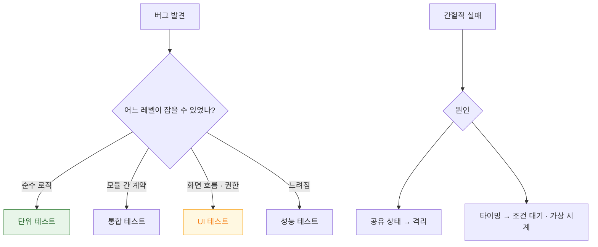

## 테스트는 레벨마다 잡을 수 있는 실패가 다르고 플레이키는 공유 상태와 타이밍에서 나온다

테스트 전략을 "커버리지 몇 %" 나 "피라미드 비율"로 세우면 판단 기준이 없다. 실제로 필요한 판단은 두 가지다.

1. **이 버그를 잡을 수 있는 가장 낮은 레벨은 어디인가**
2. **이 테스트가 간헐적으로 실패한다면 공유 상태인가 타이밍인가**



### 정본 노트

**전략**

- [테스트 레벨은 속도가 아니라 잡을 수 있는 실패의 종류로 나뉜다](testing/test-levels-differ-in-what-they-can-catch.md) — 레벨별 잡는 것/못 잡는 것, iOS 에서만 필요한 레벨, **어느 레벨도 못 잡는 것**.
- [테스트 대역은 무엇을 검증하느냐에 따라 stub·fake·mock 으로 나뉜다](testing/test-doubles-fake-vs-mock-vs-stub.md) — **mock 남용이 만드는 구현 결합**, fake 의 재평가.

**작성**

- [Swift Testing 과 XCTest 는 공존하며 각각 담당하는 영역이 다르다](testing/xctest-and-swift-testing-coexist.md) — 무엇을 어느 프레임워크로, `#expect` 와 `#require`, 병렬 실행의 함의.
- [비동기 테스트는 완료 신호를 명시해야 하며 sleep 으로 기다리면 안 된다](testing/async-tests-need-explicit-completion-signals.md) — expectation·continuation·가상 시계.
- [XCUITest 는 접근성 식별자로 요소를 찾으므로 식별자가 없으면 테스트가 깨진다](testing/xcuitest-depends-on-accessibility-identifiers.md) — launch 인자 주입, 시스템 프롬프트 처리, `debugDescription`.

**안정화**

- [플레이키 테스트는 공유 상태와 타이밍 의존 두 가지에서 나온다](testing/flaky-tests-come-from-shared-state-and-timing.md) — 격리 방법, **원인을 좁히는 5단계 순서**.

### 증상에서 시작하기

| 증상 | 어느 노트로 |
| :--- | :--- |
| 무엇을 어느 레벨로 테스트할지 모르겠다 | [테스트 레벨](testing/test-levels-differ-in-what-they-can-catch.md) |
| 리팩터링하면 테스트가 깨진다 | [테스트 대역](testing/test-doubles-fake-vs-mock-vs-stub.md) (mock 과결합) |
| 테스트가 느리다 | [비동기 테스트](testing/async-tests-need-explicit-completion-signals.md) (`sleep` 사용) |
| CI 에서만 실패한다 | [플레이키](testing/flaky-tests-come-from-shared-state-and-timing.md) (환경 차이) |
| 재시도하면 통과한다 | [플레이키](testing/flaky-tests-come-from-shared-state-and-timing.md) |
| UI 테스트가 요소를 못 찾는다 | [XCUITest](testing/xcuitest-depends-on-accessibility-identifiers.md) (식별자·`debugDescription`) |
| 권한 프롬프트에서 멈춘다 | [XCUITest](testing/xcuitest-depends-on-accessibility-identifiers.md) (`simctl privacy`) |
| 성능 회귀를 못 잡는다 | [성능 지표 고정](performance/xctest-metrics-lock-performance-in-ci.md) |

### 테스트 가능한 설계가 선행 조건이다

레벨을 나누려면 **경계에서 대체 가능**해야 한다. 싱글턴을 직접 참조하면 단위 테스트가 불가능해지고, 결국 모든 것을 느린 UI 테스트로 검증하게 된다.

```swift
protocol UserFetching { func fetchUser() async throws -> User }

final class ProfileViewModel {
    private let api: UserFetching          // 주입
    init(api: UserFetching) { self.api = api }
}
```

### CI 구성

```bash
# 일상 잡 — 빠르게
xcodebuild test -scheme MyApp -parallel-testing-enabled YES \
  -destination 'platform=iOS Simulator,name=iPhone 15,OS=18.0' \
  -enableCodeCoverage YES -resultBundlePath TestResults.xcresult

# 커버리지 (목표가 아니라 신호로)
xcrun xccov view --report TestResults.xcresult

# 플레이키 탐지 (주기적)
xcodebuild test -scheme MyApp -test-iterations 20 -run-tests-until-failure

# 야간 잡 — Sanitizer
xcodebuild test -scheme MyApp -enableThreadSanitizer YES ...
```

**시뮬레이터 모델과 OS 를 고정**한다. 바뀌면 [성능 기준선](performance/xctest-metrics-lock-performance-in-ci.md)이 무의미해지고 플레이키가 늘어난다.

### 접근성도 테스트한다

```swift
func testAccessibility() throws {
    let app = XCUIApplication(); app.launch()
    try app.performAccessibilityAudit()
}
```

레이블 누락·대비·터치 타깃을 자동으로 잡는다. 다만 **구조가 유용한가**는 못 잡으므로 [실기기 VoiceOver 검증](../02_ui_frameworks/apple-accessibility.md)이 여전히 필요하다.

### 연관 문서

- [apple-performance-and-debug](apple-performance-and-debug.md) - 성능 측정과 디버깅
- [apple-instruments-profiling](apple-instruments-profiling.md) - 원인 분석
- [apple-accessibility](../02_ui_frameworks/apple-accessibility.md)
- [android-testing-quality](../../android/06_testing_performance/testing/testing-quality.md) - 안드로이드 대응

공식 문서: [Testing](https://developer.apple.com/documentation/xcode/testing) · [Swift Testing](https://developer.apple.com/documentation/testing) · [XCTest](https://developer.apple.com/documentation/xctest)
