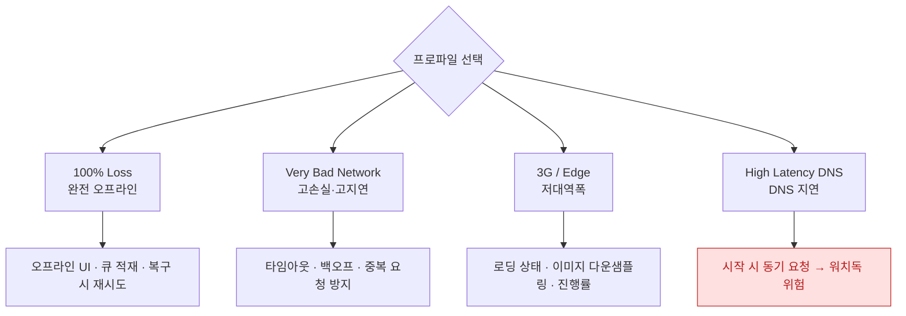

## Network Link Conditioner 로 사무실 Wi-Fi 에서는 절대 안 나는 실패를 재현한다

### 개념 (What)

개발 환경의 빠르고 안정적인 네트워크에서는 **타임아웃·재시도·오프라인 처리 코드가 한 번도 실행되지 않는다.** 그 코드는 검증되지 않은 채 배포된다.

**Network Link Conditioner** 는 대역폭·지연·패킷 손실을 인위적으로 만들어 그 경로를 실제로 실행시킨다.

| 설치 위치 | 대상 |
| :--- | :--- |
| **iOS 기기**: 설정 > 개발자 > Network Link Conditioner | 실기기 |
| **macOS**: Additional Tools for Xcode 에 포함 | 시뮬레이터·맥 |

### 왜 필요한가 (Why)

느린 네트워크에서만 드러나는 실패가 여럿이다.

| 증상 | 왜 좋은 네트워크에서는 안 나나 |
| :--- | :--- |
| **[워치독 종료 `0x8badf00d`](../../01_system_internals/ipc-and-process/watchdog-termination-codes.md)** | 시작 시 동기 요청이 빨리 끝나 버린다 |
| 로딩 인디케이터가 안 보임 | 너무 빨라서 스킵됨 |
| 중복 요청 | 첫 요청이 끝나기 전에 다시 누르지 못함 |
| 경쟁 조건 | 응답 순서가 항상 같음 |
| 부분 실패 처리 누락 | 실패가 안 남 |
| [셀 재사용 이미지 뒤바뀜](../../02_ui_frameworks/uikit/cell-reuse-requires-full-state-reset.md) | 이미지가 즉시 도착 |

### 프로파일별 검증 목표



### 반드시 확인할 시나리오

```
[ ] 앱 시작 중 네트워크가 매우 느림 → 워치독에 걸리지 않는가
[ ] 요청 도중 오프라인 전환 → 오류 처리와 UI 상태
[ ] 오프라인에서 작업 → 온라인 복귀 시 큐가 처리되는가
[ ] 느린 응답 중 화면 이탈 → Task 가 취소되는가
[ ] 느린 응답 중 같은 버튼 재탭 → 중복 요청이 나가는가
[ ] 대용량 업로드 중 오프라인 → 백그라운드 세션이 이어받는가
```

네 번째와 다섯 번째가 특히 자주 빠진다. → [.task 는 뷰 수명에 묶여 자동 취소된다](../../02_ui_frameworks/swiftui/task-modifier-ties-async-to-view-lifetime.md)

### 저데이터 모드도 함께 본다

느린 네트워크와 별개로, 사용자가 **저데이터 모드**를 켜면 시스템이 요청을 막을 수 있다. 이것은 대역폭 문제가 아니라 **정책 문제**다.

```swift
if let e = error as? URLError {
    switch e.networkUnavailableReason {
    case .constrained: showLowDataModeNotice()   // 저데이터 모드
    case .expensive:   deferToWiFi()             // 셀룰러
    default: showGenericError()
    }
}
```

→ [제약 경로와 비용 경로](../../01_system_internals/connectivity/constrained-and-expensive-paths.md)

### 오류를 뭉뚱그리지 않는다

```swift
// ❌ 모두 "네트워크 오류"
catch { showError("네트워크 오류") }

// ✅ 사용자가 할 수 있는 행동이 달라진다
catch let e as URLError {
    switch e.code {
    case .notConnectedToInternet: showOffline()          // 기다리면 됨
    case .timedOut:               showRetry()            // 재시도 가능
    case .cannotFindHost:         showServerIssue()      // 앱 문제 아님
    case .networkConnectionLost:  autoRetryOnce()        // 자동 재시도 적절
    default:                      showGenericError()
    }
}
```

각 분기를 **실제로 실행시켜 본 적이 있는지**가 핵심이다. Link Conditioner 없이는 대부분 미검증 코드로 남는다.

### 관찰 가능한 증거

```bash
# 시뮬레이터는 맥의 Link Conditioner 설정을 따른다
# macOS: 시스템 설정 > 개발자 > Network Link Conditioner

# 네트워크 스택 로그
log stream --device --predicate 'subsystem == "com.apple.network"' --info
```

```swift
// 연결 재사용·DNS·TLS 소요 확인
func urlSession(_ s: URLSession, task: URLSessionTask,
                didFinishCollecting m: URLSessionTaskMetrics) {
    for t in m.transactionMetrics {
        print("reused:", t.isReusedConnection, "fetchStart:", t.fetchStartDate as Any)
    }
}
```

**Instruments의 Network 템플릿**으로 재시도 횟수와 전송량을 확인한다. 느린 네트워크에서 재시도가 폭증하면 백오프가 없는 것이다.

### 연관 문서

- [Sanitizer 는 테스트가 놓치는 것을 런타임에 잡는다](sanitizers-catch-what-tests-miss.md)
- [NWPathMonitor 는 경로 가용성을 보고하지 도달 가능성을 보고하지 않는다](../../01_system_internals/connectivity/nwpathmonitor-reports-path-not-reachability.md)
- [백그라운드 전송은 앱이 아니라 시스템 데몬이 이어서 수행한다](../../01_system_internals/connectivity/background-transfer-daemon.md)
- [02-watchdog-and-hang](../../00_foundations/diagnostic-runbooks/02-watchdog-and-hang.md)

공식 문서: [Testing under adverse network conditions](https://developer.apple.com/documentation/network)
