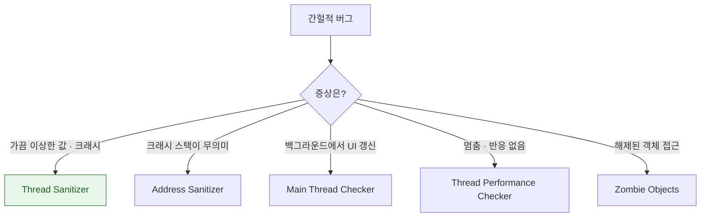

## Sanitizer 는 테스트가 통과해도 남아 있는 결함을 런타임에 잡는다

### 개념 (What)

Sanitizer 는 **컴파일 시 코드에 검사를 삽입**해 실행 중 위반을 즉시 잡는다. 테스트가 통과해도 남아 있는 결함, 특히 **간헐적으로만 드러나는 것**을 확정적으로 노출시킨다.

| 도구 | 잡는 것 | 스킴 위치 |
| :--- | :--- | :--- |
| **Address Sanitizer (ASan)** | 메모리 손상, use-after-free, 버퍼 오버플로 | Diagnostics |
| **Thread Sanitizer (TSan)** | **데이터 경합** | Diagnostics |
| **Undefined Behavior Sanitizer** | 정수 오버플로, 잘못된 캐스팅 | Diagnostics |
| **Main Thread Checker** | 백그라운드에서의 UI 접근 | Diagnostics (기본 켜짐) |
| **Thread Performance Checker** | 우선순위 역전, 협력적 풀 블로킹 | Diagnostics |
| **Zombie Objects** | 해제된 ObjC 객체 접근 | Diagnostics |

### 왜 필요한가 (Why)

데이터 경합은 **재현되지 않는 버그의 대표**다. 100번 중 1번 나타나고, 프로덕션에서만 나고, 스택 트레이스가 엉뚱한 곳을 가리킨다.

TSan 은 실제로 경합이 발생하지 않아도 **경합 가능한 접근 패턴을 감지**하므로, 운에 의존하지 않고 확정적으로 잡는다.



### 사용 규칙

> [!IMPORTANT] 동시에 켜지 않는다
> ASan 과 TSan 은 **함께 켤 수 없다.** 또한 실행 속도가 크게 느려지고 메모리를 많이 쓴다. **평소에는 끄고, 별도 스킴이나 CI 잡에서 주기적으로 돌린다.**

| 도구 | 실행 비용 | 권장 운영 |
| :--- | :--- | :--- |
| ASan | 느려짐 · 메모리 증가 | 별도 CI 잡 |
| TSan | 크게 느려짐 | 별도 CI 잡 (**시뮬레이터·macOS**) |
| Main Thread Checker | 거의 없음 | **항상 켜 둔다** |
| Thread Performance Checker | 거의 없음 | **항상 켜 둔다** |

Main Thread Checker 는 비용이 거의 없으므로 **디버그 빌드에서 항상 켜 두는 것**이 맞다.

### Swift 6 와의 관계

[Swift 6 의 strict concurrency](../../01_language_concurrency/concurrency/swift6-migration-path.md) 는 데이터 경합을 **컴파일 타임**에 잡는다. 그러면 TSan 이 불필요해지는가? 아니다.

| | 잡는 범위 |
| :--- | :--- |
| **Swift 6 컴파일러** | Swift 코드 안의 격리 위반 |
| **TSan** | `@unchecked Sendable`, C/ObjC 코드, 외부 라이브러리 |

**`@unchecked Sendable` 을 쓴 곳이 있다면 TSan 이 유일한 검증 수단**이다. 컴파일러는 그 선언을 그대로 믿기 때문이다.

```bash
# @unchecked Sendable 사용처를 찾아 TSan 검증 대상으로 삼는다
grep -rn "@unchecked Sendable" --include="*.swift" .
```

### 자주 잡히는 것들

```swift
// TSan 이 잡는 전형 — 락 없는 공유 가변 상태
final class Cache {
    private var items: [String: Data] = [:]      // 여러 스레드에서 접근
    func get(_ k: String) -> Data? { items[k] }  // ⚠️ 경합
    func set(_ k: String, _ v: Data) { items[k] = v }
}

// Main Thread Checker 가 잡는 전형
URLSession.shared.dataTask(with: url) { data, _, _ in
    self.label.text = "완료"        // ⚠️ 백그라운드 스레드에서 UI 접근
}.resume()

// Thread Performance Checker 가 잡는 전형
Task {
    semaphore.wait()               // ⚠️ 협력적 풀에서 블로킹
}
```

마지막은 [협력적 스레드 풀](../../01_language_concurrency/concurrency/cooperative-thread-pool.md)에서 특히 위험하다.

### CI 구성 예

```bash
# 평상시 잡 — 빠르게
xcodebuild test -scheme MyApp -destination 'platform=iOS Simulator,name=iPhone 15'

# 야간 잡 — TSan
xcodebuild test -scheme MyApp -enableThreadSanitizer YES \
  -destination 'platform=iOS Simulator,name=iPhone 15'

# 야간 잡 — ASan + UBSan
xcodebuild test -scheme MyApp -enableAddressSanitizer YES \
  -enableUndefinedBehaviorSanitizer YES \
  -destination 'platform=iOS Simulator,name=iPhone 15'
```

**야간 잡으로 분리**하면 일상 CI 속도를 해치지 않으면서 주기적 검증을 얻는다.

### 관찰 가능한 증거

Sanitizer 가 위반을 잡으면 Xcode 의 Issue Navigator 에 **두 개의 스택**이 표시된다.

```
Thread Sanitizer: Data race
  Write of size 8 at 0x... by thread T2:      ← 쓴 곳
  Previous read of size 8 by thread T1:       ← 읽은 곳
  Location: ... allocated by thread T0        ← 할당된 곳
```

**두 스택을 모두 봐야** 어느 두 접근이 충돌했는지 알 수 있다. 하나만 보고 고치면 다른 쪽이 남는다.

### 연관 문서

- [View Debugger 는 배치를, Memory Graph 는 참조를 보여준다](view-debugger-and-memory-graph-answer-different-questions.md)
- [Swift 6 마이그레이션은 경고를 먼저 켜서 모듈 단위로 단계적으로 한다](../../01_language_concurrency/concurrency/swift6-migration-path.md)
- [협력적 스레드 풀은 코어 수만큼만 스레드를 유지한다](../../01_language_concurrency/concurrency/cooperative-thread-pool.md)
- [apple-security-swift6-safety](../../05_security_privacy/apple-security-swift6-safety.md)

공식 문서: [Diagnosing memory, thread, and crash issues early](https://developer.apple.com/documentation/xcode/diagnosing-memory-thread-and-crash-issues-early)
