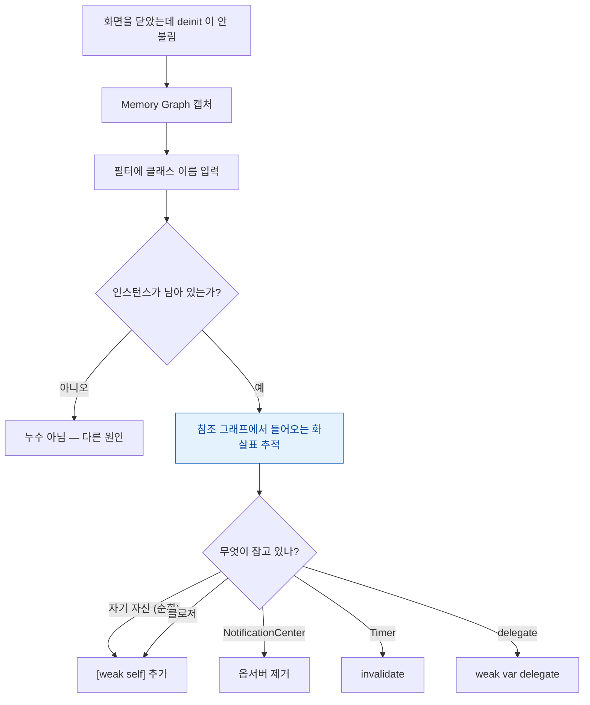

## View Debugger 는 배치를, Memory Graph 는 참조를 보여준다

### 개념 (What)

Xcode 에 내장된 두 디버거는 **완전히 다른 질문**에 답한다. 증상에 맞는 것을 고르는 것만으로 진단 시간이 크게 줄어든다.

| | View Debugger | Memory Graph Debugger |
| :--- | :--- | :--- |
| 답하는 질문 | **왜 이렇게 보이나** | **왜 해제되지 않나** |
| 보여주는 것 | 뷰 계층·프레임·제약 | 객체 간 참조 그래프 |
| 대표 용도 | 안 보임·잘림·터치 안 됨 | 순환 참조·누수 |

### View Debugger — 배치 문제

**Debug > View Debugging > Capture View Hierarchy**

3D 로 분해된 뷰 계층에서 확인할 것들:

| 증상 | 확인 항목 |
| :--- | :--- |
| **요소가 안 보인다** | `isHidden`, `alpha`, 부모 밖으로 나감, 다른 뷰에 가려짐 |
| **터치가 안 먹는다** | `User Interaction Enabled`, 실제 프레임, 부모 bounds |
| **크기가 이상하다** | 적용된 제약과 우선순위, ambiguous 여부 |
| **레이어가 너무 많다** | 계층 깊이 → [합성 비용](../../01_system_internals/graphics-and-media/render-server-composition.md) |

**부모 bounds 밖으로 나간 자식**이 특히 자주 걸린다. `clipsToBounds = false` 라 눈에는 보이지만 [hit-test 는 부모에서 이미 탈락](../../02_ui_frameworks/uikit/responder-chain-routes-events-upward.md)한다. View Debugger 에서 실제 프레임을 보면 즉시 드러난다.

```
# 디버거 콘솔에서
po view.recursiveDescription()
po view.hasAmbiguousLayout
po view.value(forKey: "_autolayoutTrace")
```

SwiftUI 뷰도 캡처되며, [UIHostingController 로 감싼 경우](../../02_ui_frameworks/uikit/uikit-swiftui-interop-bridges-two-lifetimes.md) 중첩 구조를 확인할 수 있다.

### Memory Graph Debugger — 참조 문제

**Debug Navigator 의 메모리 게이지 아래 그래프 아이콘**



**보라색 느낌표(⚠️)** 가 붙은 항목이 Xcode 가 순환으로 의심하는 것이다. 다만 그것만 믿지 말고 **"이 인스턴스가 아직 있는가"** 를 직접 확인하는 것이 확실하다.

### 필수 설정 — 이걸 켜야 출처가 보인다

```
Scheme > Run > Diagnostics
  ☑ Malloc Stack Logging
```

켜지 않으면 객체는 보이는데 **어디서 만들어졌는지 알 수 없다.** 켜면 각 참조에 backtrace 가 붙어 원인 코드를 바로 찾을 수 있다.

### 흔한 순환 참조 네 가지

```swift
// 1) 클로저가 self 를 강하게 캡처
api.fetch { [weak self] result in self?.handle(result) }

// 2) 델리게이트를 strong 으로
weak var delegate: MyDelegate?

// 3) Timer 가 target 을 잡는다
timer?.invalidate()          // deinit 에서 반드시

// 4) NotificationCenter 옵서버 (블록 기반)
let token = NotificationCenter.default.addObserver(forName: ..., using: { ... })
NotificationCenter.default.removeObserver(token)   // 반드시 제거
```

### 확인용 습관

```swift
deinit { print("deinit \(type(of: self))") }
```

화면을 닫았을 때 이 로그가 안 찍히면 그 자리에서 안다. **Memory Graph 를 열기 전에 이것으로 먼저 좁힌다.**

### 두 도구로 안 되는 것

| 증상 | 다른 도구 |
| :--- | :--- |
| 힙은 안 느는데 메모리가 는다 | [VM Tracker](../profiling/allocations-shows-heap-but-vm-tracker-shows-the-rest.md) |
| 데이터 경합 | [Thread Sanitizer](sanitizers-catch-what-tests-miss.md) |
| 특정 네트워크에서만 실패 | [Network Link Conditioner](network-link-conditioner-reproduces-field-failures.md) |
| 실사용자에게만 발생 | [MetricKit](../performance/metrickit-collects-what-you-cannot-reproduce.md) |

### 연관 문서

- [Sanitizer 는 테스트가 놓치는 것을 런타임에 잡는다](sanitizers-catch-what-tests-miss.md)
- [Allocations 는 힙을 보여주고 VM Tracker 가 나머지를 보여준다](../profiling/allocations-shows-heap-but-vm-tracker-shows-the-rest.md)
- [터치는 hit-test 로 내려가 대상을 찾고 이벤트는 responder chain 을 타고 올라간다](../../02_ui_frameworks/uikit/responder-chain-routes-events-upward.md)
- [Auto Layout 은 우선순위가 붙은 제약 시스템을 풀어 프레임을 정한다](../../02_ui_frameworks/uikit/autolayout-solves-a-constraint-system.md)

공식 문서: [Diagnosing memory, thread, and crash issues early](https://developer.apple.com/documentation/xcode/diagnosing-memory-thread-and-crash-issues-early)
