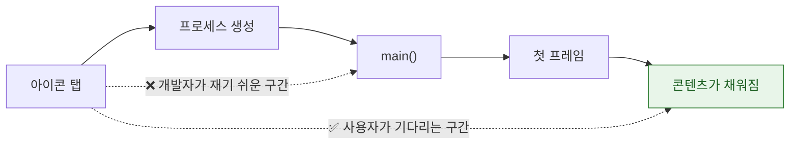

## 성능은 평균이 아니라 사용자가 실제로 기다린 시간의 분포로 측정한다

### 개념 (What)

평균은 **사용자가 겪는 최악의 경험을 지운다.** 100번 중 95번이 0.3초이고 5번이 5초여도 평균은 0.53초로 "괜찮아 보인다." 그러나 사용자는 그 5번을 기억한다.

성능 측정의 기본 원칙 세 가지:

1. **분포로 본다** — 평균이 아니라 중앙값·P90·P95·최댓값
2. **사용자가 기다린 시점을 잰다** — 함수 실행 시간이 아니라 **탭에서 화면이 유용해질 때까지**
3. **실사용자 기기에서 잰다** — 개발자의 최신 기기와 Wi-Fi 는 현실이 아니다

### 왜 필요한가 (Why)

이미 만들어진 지표들이 이 원칙을 반영하고 있다.

| 지표 | 무엇을 재나 | 왜 평균이 아닌가 |
| :--- | :--- | :--- |
| **[히치 시간 비율](../../01_system_internals/graphics-and-media/hitches-measure-user-visible-jank.md)** | 프레임이 늦은 **총 시간** | 평균 FPS 는 한 번의 큰 끊김을 지운다 |
| **행(hang) 시간** | 메인 스레드가 막힌 시간 | 한 번의 3초 행이 결정적이다 |
| **시작 시간 분포** | 콜드 스타트 히스토그램 | 저사양 기기의 꼬리가 중요하다 |

### 무엇을 재는 시점으로 삼을 것인가



**첫 프레임이 떴다고 끝이 아니다.** 스켈레톤만 보이고 데이터가 없으면 사용자는 여전히 기다리는 중이다. 두 시점을 각각 재야 한다.

- **첫 프레임까지** — 시스템이 `MXAppLaunchMetric` 으로 제공
- **콘텐츠가 유용해질 때까지** — 앱이 직접 signpost 로 표시해야 한다

```swift
import OSLog

let signposter = OSSignposter(subsystem: "com.example.app", category: "Launch")

// 앱 시작 시점에 구간을 연다
let state = signposter.beginInterval("TimeToUsableContent")

// 실제 데이터가 채워져 사용자가 쓸 수 있게 된 시점
func contentDidLoad() {
    signposter.endInterval("TimeToUsableContent", state)
}
```

이렇게 남긴 signpost 는 [Instruments](../profiling/instrument-templates-answer-different-questions.md) 와 [XCTest 성능 측정](xctest-metrics-lock-performance-in-ci.md), [MetricKit](metrickit-collects-what-you-cannot-reproduce.md) 세 곳에서 모두 활용된다.

### 측정은 세 층으로 한다

| 층 | 도구 | 답하는 질문 |
| :--- | :--- | :--- |
| **개발 중** | Instruments | 왜 느린가 (원인) |
| **CI** | [XCTest 성능 측정](xctest-metrics-lock-performance-in-ci.md) | 느려졌는가 (회귀) |
| **실사용자** | [MetricKit / Organizer](metrickit-collects-what-you-cannot-reproduce.md) | 실제로 얼마나 느린가 (현실) |

**세 층이 서로를 대체하지 못한다.** Instruments 는 원인을 알려주지만 회귀를 막지 못하고, CI 는 회귀를 막지만 실기기 분포를 모른다.

### 측정 전에 목표를 정한다

숫자 없이 "빠르게" 는 판단할 수 없다.

```
콜드 스타트    : 저사양 지원 기기에서 P90 < X초
스크롤 히치 비율: 120Hz 기기에서 Y ms/s 이하
행            : Z초 이상 행 0건
```

**목표는 최저 사양 지원 기기 기준으로 잡는다.** 최신 기기에서만 통과하는 목표는 목표가 아니다.

### 개선 후 검증 규칙

```
1. 같은 조건에서 최소 5회 이상 측정 (1회는 노이즈)
2. 중앙값과 P90 을 함께 비교
3. 최저 사양 기기에서 재확인
4. CI 에 기준선으로 고정 → 회귀 방지
```

### 관찰 가능한 증거

```bash
# 콜드 스타트를 반복 측정 (기기 연결 후)
for i in {1..5}; do
  xcrun devicectl device process terminate --device $UDID --pid-of com.example.app 2>/dev/null
  # 앱 실행 후 signpost 구간을 Instruments 로 수집
done
```

Xcode scheme 환경 변수로 pre-main 을 분해한다.

```
DYLD_PRINT_STATISTICS = 1
```

**Instruments의 App Launch 템플릿**은 pre-main·post-main·첫 프레임을 한 시간축에서 보여준다.

### 연관 문서

- [성능 지표는 CI 에 고정해야 회귀를 막는다](xctest-metrics-lock-performance-in-ci.md)
- [MetricKit 은 재현할 수 없는 실사용자 데이터를 모은다](metrickit-collects-what-you-cannot-reproduce.md)
- [히치는 평균 FPS 가 아니라 사용자가 실제로 본 지연을 잰다](../../01_system_internals/graphics-and-media/hitches-measure-user-visible-jank.md)
- [pre-main 시간은 대부분 dylib 로딩과 static initializer 가 쓴다](../../01_system_internals/boot-and-runtime/pre-main-launch-time-budget.md)

공식 문서: [Improving your app's performance](https://developer.apple.com/documentation/xcode/improving-your-app-s-performance)
