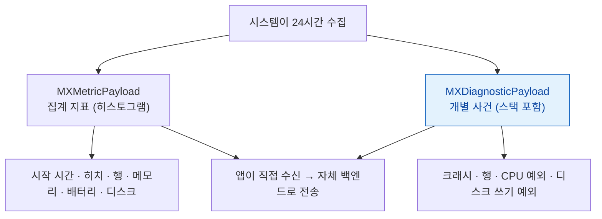

## MetricKit 은 개발 기기에서 재현할 수 없는 실사용자 데이터를 모은다

### 개념 (What)

개발자의 최신 기기와 사무실 Wi-Fi 는 현실이 아니다. 실제 사용자는 **오래된 기기, 약한 신호, 저전력 모드, 꽉 찬 저장 공간**에서 앱을 쓴다.

**MetricKit** 은 시스템이 실사용자 기기에서 수집한 지표를 **앱에게 직접 전달**한다. 하루에 최대 한 번, 24시간치를 묶어서 온다.

```swift
import MetricKit

final class MetricsSubscriber: NSObject, MXMetricManagerSubscriber {
    func didReceive(_ payloads: [MXMetricPayload]) {
        for p in payloads {
            // 시작 시간 히스토그램
            if let launch = p.applicationLaunchMetrics {
                send(launch.histogrammedTimeToFirstDraw)
            }
            // 스크롤 히치 비율
            if let anim = p.animationMetrics {
                send(anim.scrollHitchTimeRatio)
            }
            // 행(hang) 시간
            if let resp = p.applicationResponsivenessMetrics {
                send(resp.histogrammedApplicationHangTime)
            }
            // 종료 사유 분포
            if let exit = p.applicationExitMetrics {
                send(exit.backgroundExitData.cumulativeMemoryResourceLimitExitCount)
            }
        }
    }

    func didReceive(_ payloads: [MXDiagnosticPayload]) {
        for p in payloads {
            p.hangDiagnostics?.forEach { send($0.callStackTree) }
            p.crashDiagnostics?.forEach { send($0.callStackTree) }
        }
    }
}

// 등록은 앱 시작 시
MXMetricManager.shared.add(subscriber)
```

### 왜 필요한가 (Why)

| 문제 | 개발 기기 | 실사용자 |
| :--- | :--- | :--- |
| [Jetsam 종료](../../01_system_internals/ipc-and-process/jetsam-memory-pressure-bands.md) | 재현 어려움 | 저사양 기기에서 빈발 |
| [워치독 종료](../../01_system_internals/ipc-and-process/watchdog-termination-codes.md) | 디버거 붙으면 재현 불가 | 느린 네트워크에서 발생 |
| [스크롤 히치](../../01_system_internals/graphics-and-media/hitches-measure-user-visible-jank.md) | 최신 기기는 여유 | 120Hz 구형 기기에서 발생 |
| 시작 시간 | 항상 웜 스타트 | 콜드 스타트가 대부분 |
| 배터리·디스크 쓰기 | 측정 어려움 | 사용자 불만의 원인 |

**"우리 기기에서는 잘 되는데" 를 데이터로 반박할 수 있는 유일한 수단**이다.

### 두 종류의 페이로드



**`MXDiagnosticPayload` 가 특히 유용하다.** 크래시가 아닌 **행(hang)의 스택**을 받을 수 있어, "가끔 멈춘다"는 문의를 실제 코드 위치로 좁힐 수 있다.

### Xcode Organizer 와의 차이

| | MetricKit | Xcode Organizer |
| :--- | :--- | :--- |
| 수신 주체 | **내 앱 (자체 백엔드)** | Apple → Xcode |
| 세분화 | 원하는 대로 (버전·화면·사용자 세그먼트) | 앱 버전·기기 모델·OS |
| 지연 | 하루 | 며칠 |
| 설정 | 코드 필요 | 없음 |

**둘 다 쓴다.** Organizer 는 설정 없이 큰 그림을 주고, MetricKit 은 자체 분석과 결합할 수 있다.

Organizer 에서 볼 수 있는 것: Launch Time, Hangs, Memory, Disk Writes, Battery, **Scrolling**, Terminations, Crashes. 각각을 **이전 버전과 비교**해 릴리스가 회귀를 만들었는지 즉시 확인한다.

### 커스텀 구간도 수집된다

[signpost 로 표시한 구간](measure-user-perceived-time-not-averages.md)은 `MXSignpostMetric` 으로 실사용자 분포가 온다.

```swift
let signposter = OSSignposter(subsystem: "com.example.app", category: "Checkout")
let state = signposter.beginInterval("PaymentFlow")
// ...
signposter.endInterval("PaymentFlow", state)
```

**결제 흐름이 실제 사용자에게 얼마나 걸리는지**를 이렇게 알 수 있다. [CI 성능 테스트](xctest-metrics-lock-performance-in-ci.md)와 같은 signpost 를 쓰면 두 지표가 이어진다.

### 한계

| 한계 | 대응 |
| :--- | :--- |
| 하루 최대 1회 전달 | 즉시성이 필요하면 자체 로깅 병행 |
| 앱이 실행되어야 전달 | 앱을 안 쓰는 사용자 데이터는 늦게 온다 |
| 시뮬레이터 지원 제한 | 실기기 필요 |
| 히스토그램 형태 | 개별 세션 추적은 불가 |

**디버그 빌드에서 즉시 확인**하려면 Xcode 의 Debug > Simulate MetricKit Payloads 를 쓴다.

### 관찰 가능한 증거

```
Xcode 실행 중 > Debug 메뉴 > Simulate MetricKit Payloads
  → didReceive 가 즉시 호출되어 구현을 검증할 수 있다
```

```swift
// 수신 확인용 로그
func didReceive(_ payloads: [MXMetricPayload]) {
    for p in payloads {
        print("MetricKit 수신:", p.timeStampBegin, "~", p.timeStampEnd)
        print(String(data: p.jsonRepresentation(), encoding: .utf8) ?? "")
    }
}
```

### 연관 문서

- [성능은 평균이 아니라 사용자가 기다린 시간의 분포로 측정한다](measure-user-perceived-time-not-averages.md)
- [성능 지표는 CI 에 고정해야 회귀를 막는다](xctest-metrics-lock-performance-in-ci.md)
- [워치독 종료는 예외 코드로 원인 구간을 구분할 수 있다](../../01_system_internals/ipc-and-process/watchdog-termination-codes.md)
- [Jetsam 은 LRU 가 아니라 우선순위 밴드로 죽일 대상을 고른다](../../01_system_internals/ipc-and-process/jetsam-memory-pressure-bands.md)

공식 문서: [MetricKit](https://developer.apple.com/documentation/metrickit) · [Analyzing responsiveness issues](https://developer.apple.com/documentation/xcode/analyzing-responsiveness-issues-in-your-shipping-app)
