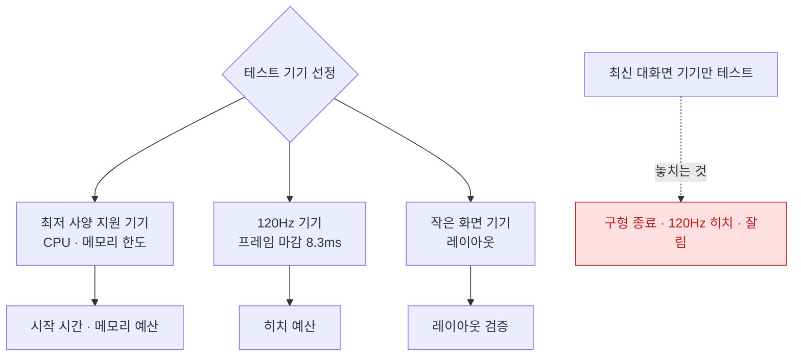

## 성능 예산은 최저 사양 지원 기기를 기준으로 잡아야 의미가 있다

### 개념 (What)

"빠르게 만들자"는 판단 기준이 아니다. **어느 기기에서, 어떤 조건으로, 몇 초 안에** 를 정해야 통과·실패를 판정할 수 있다.

그리고 그 기준은 **최신 기기가 아니라 지원하는 가장 낮은 사양의 기기**여야 한다. 최신 기기에서만 통과하는 목표는 사용자의 상당 부분을 놓친다.

### 왜 필요한가 (Why)

기기에 따라 달라지는 것이 성능만이 아니다.

| 축 | 기기별 차이 | 영향 |
| :--- | :--- | :--- |
| **CPU/GPU** | 세대 간 몇 배 | 시작 시간, 렌더링 |
| **메모리 한도** | 기기별로 다름 | [Jetsam 종료](../../01_system_internals/ipc-and-process/jetsam-memory-pressure-bands.md) |
| **화면 주사율** | 60Hz vs [120Hz](../../01_system_internals/graphics-and-media/promotion-variable-refresh-deadline.md) | **프레임 마감이 절반** |
| 화면 크기 | SE ~ Max | 레이아웃, 표시 개수 |
| 저장 공간 | 여유 vs 부족 | 캐시 정리 빈도 |

**120Hz 는 특히 함정이다.** 최신 기기가 성능은 더 좋지만 **마감 시간은 더 짧다.** 60Hz 구형 기기에서 통과한 코드가 120Hz 신형에서 히치를 낸다.



### 예산 항목

```
콜드 스타트     : 최저 사양 기기에서 P90 목표치
스크롤 히치     : 120Hz 기기에서 히치 시간 비율 목표치
메모리 피크     : 최저 사양 기기의 한도 대비 여유율
행(hang)       : 임계 시간 초과 0건
앱 다운로드 크기 : 셀룰러 다운로드 한도 고려
```

> [!WARNING] 메모리 한도를 상수로 외우지 않는다
> 프로세스별 메모리 한도는 **공개된 계약값이 아니며** 기기·OS·프로세스 종류([앱 확장](../../01_system_internals/ipc-and-process/app-extension-process-model.md)은 훨씬 낮다)에 따라 다르다. 반드시 대상 기기에서 실측한다.

### 조건도 함께 정한다

기기만 정하고 조건을 안 정하면 측정이 재현되지 않는다.

| 조건 | 왜 |
| :--- | :--- |
| **콜드 스타트** | 웜 스타트는 훨씬 빠르다. 측정은 콜드로 |
| **디버거 분리** | 붙어 있으면 워치독·최적화가 다르다 |
| **네트워크 프로파일** | Network Link Conditioner 로 고정 |
| **저전력 모드 여부** | 별도로 측정 |
| **저장 공간** | 꽉 찬 상태에서도 확인 |

### 사용자 기기 분포를 근거로 삼는다

**App Store Connect** 와 **Xcode Organizer** 가 실제 사용자의 기기·OS 분포를 알려준다. 여기서 하위 몇 퍼센트를 지원 대상으로 삼을지 정한다.

Organizer 의 성능 지표는 **기기 모델별로 나뉘어** 표시되므로, "특정 모델에서만 나쁜" 문제를 즉시 식별할 수 있다. 이것이 예산을 잡는 가장 현실적인 근거다.

### 시뮬레이터로 대체할 수 없는 것

| 항목 | 시뮬레이터 |
| :--- | :--- |
| 절대 성능 수치 | ❌ (맥 CPU 를 쓴다) |
| 메모리 한도 | ❌ |
| 배터리 | ❌ |
| GPU 특성·주사율 | ❌ |
| 로직 회귀 | ✅ (CI 에는 적합) |

**CI 의 시뮬레이터 측정은 "상대적 회귀"만 잡는다.** 절대 목표치 검증은 실기기에서 한다.

### 관찰 가능한 증거

```bash
# 사용 가능한 시뮬레이터/기기 목록
xcrun simctl list devices available
xcrun devicectl list devices

# 특정 기기로 테스트
xcodebuild test -scheme MyApp -destination 'platform=iOS,name=My iPhone SE'
```

**저전력 모드와 열 상태**도 조건에 넣는다. `ProcessInfo.processInfo.isLowPowerModeEnabled` 와 `thermalState` 로 앱이 스스로 감지해 부하를 줄일 수 있다.

```swift
switch ProcessInfo.processInfo.thermalState {
case .serious, .critical: reduceWorkload()
default: break
}
```

### 연관 문서

- [성능은 평균이 아니라 사용자가 기다린 시간의 분포로 측정한다](measure-user-perceived-time-not-averages.md)
- [MetricKit 은 재현할 수 없는 실사용자 데이터를 모은다](metrickit-collects-what-you-cannot-reproduce.md)
- [가변 주사율에서는 프레임 마감 시각 자체가 달라진다](../../01_system_internals/graphics-and-media/promotion-variable-refresh-deadline.md)
- [03-jetsam-memory-termination](../../00_foundations/diagnostic-runbooks/03-jetsam-memory-termination.md)

공식 문서: [Improving your app's performance](https://developer.apple.com/documentation/xcode/improving-your-app-s-performance)
