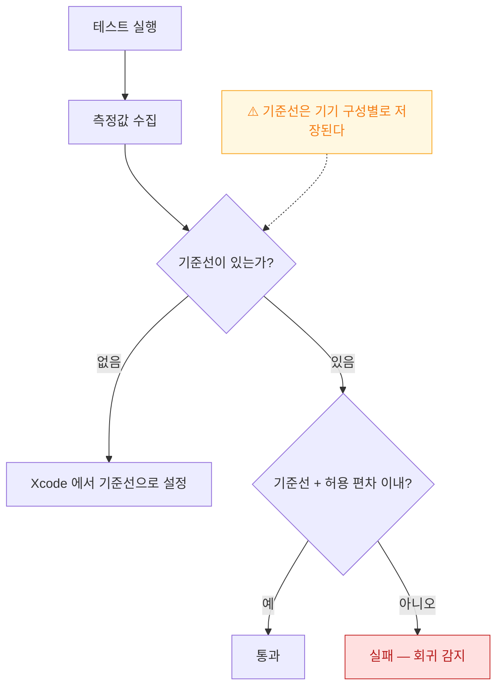

## XCTest 성능 측정과 기준선이 성능 회귀를 CI 에서 막는다

### 개념 (What)

기능 테스트는 "동작하는가"만 본다. **느려진 것은 잡지 못한다.** 리팩터링으로 시작 시간이 0.3초 늘어도 모든 테스트가 통과한다.

`measure(metrics:)` 는 성능을 **측정하고 기준선과 비교해 실패시킬 수 있는** 유일한 자동화 수단이다.

```swift
func testLaunchPerformance() throws {
    measure(metrics: [XCTApplicationLaunchMetric()]) {
        XCUIApplication().launch()
    }
}
```

기준선(baseline)을 설정해 두면 **그보다 느려질 때 테스트가 실패**한다.

### 왜 필요한가 (Why)

성능 회귀는 한 번에 오지 않는다. **매 커밋마다 조금씩 느려져 6개월 뒤에 "언제부터 이렇게 느렸지?"** 가 된다. 그때는 원인 커밋을 찾을 수 없다.

CI 에 고정하면 **느려진 그 PR 에서 즉시 드러난다.**

### 주요 지표

| Metric | 재는 것 |
| :--- | :--- |
| `XCTClockMetric` | 벽시계 시간 (기본) |
| `XCTCPUMetric` | CPU 시간·명령어 수 |
| `XCTMemoryMetric` | 메모리 피크 |
| `XCTStorageMetric` | 디스크 쓰기량 |
| `XCTApplicationLaunchMetric` | 앱 시작 시간 |
| `XCTOSSignpostMetric` | **직접 남긴 signpost 구간** |

```swift
// 여러 지표를 함께
func testScrollPerformance() throws {
    let app = XCUIApplication()
    measure(metrics: [
        XCTOSSignpostMetric.scrollDecelerationMetric,   // 시스템 제공 스크롤 지표
        XCTCPUMetric(application: app),
        XCTMemoryMetric(application: app)
    ]) {
        app.launch()
        app.tables.firstMatch.swipeUp(velocity: .fast)
    }
}

// 직접 남긴 signpost 를 지표로
let usable = XCTOSSignpostMetric(subsystem: "com.example.app",
                                 category: "Launch",
                                 name: "TimeToUsableContent")
measure(metrics: [usable]) { ... }
```

마지막 형태가 강력하다. [사용자가 실제로 기다린 구간](measure-user-perceived-time-not-averages.md)을 signpost 로 표시해 두면 그것을 그대로 회귀 기준으로 삼을 수 있다.

### 측정 옵션

```swift
let options = XCTMeasureOptions()
options.iterationCount = 10            // 반복 횟수 (기본 5)
options.invocationOptions = [.manuallyStart, .manuallyStop]

measure(metrics: [XCTClockMetric()], options: options) {
    setupWithoutMeasuring()            // 준비는 측정에서 제외
    startMeasuring()
    performOperation()
    stopMeasuring()
    cleanup()
}
```

**준비 코드를 측정에서 빼는 것**이 중요하다. 포함하면 노이즈가 커져 기준선이 무의미해진다.

### 기준선 설정과 함정



> [!IMPORTANT] CI 기기를 고정한다
> 기준선은 **기기 구성별로 저장**된다. CI 러너 사양이 바뀌거나 시뮬레이터 모델이 달라지면 기준선이 무의미해진다. **CI 에서 쓰는 시뮬레이터 모델과 OS 버전을 고정**하고, 바꿀 때는 기준선을 다시 잡는다.

또한 CI 머신은 부하에 따라 성능이 흔들린다. 허용 편차를 너무 좁게 잡으면 [플레이키](../testing/flaky-tests-come-from-shared-state-and-timing.md)가 된다.

### 무엇을 고정할 것인가

전부 고정할 수는 없다. **사용자 체감에 직결되는 소수**만 고른다.

| 우선순위 | 대상 |
| :--- | :--- |
| 1 | 앱 콜드 스타트 |
| 2 | 주요 목록 화면 스크롤 |
| 3 | 핵심 화면 전환 |
| 4 | 대량 데이터 처리 (마이그레이션, 파싱) |

### 관찰 가능한 증거

```bash
xcodebuild test -scheme MyApp \
  -destination 'platform=iOS Simulator,name=iPhone 15,OS=18.0' \
  -only-testing:MyAppPerfTests \
  -resultBundlePath Perf.xcresult

# 측정값 추출
xcrun xcresulttool get --path Perf.xcresult --format json \
  | jq '.. | objects | select(.performanceMetrics)'
```

Xcode 의 Report Navigator 에서 각 측정의 **개별 반복값과 표준편차**를 볼 수 있다. 편차가 크면 측정 자체가 불안정한 것이므로 기준선을 잡기 전에 먼저 안정화한다.

### 연관 문서

- [성능은 평균이 아니라 사용자가 기다린 시간의 분포로 측정한다](measure-user-perceived-time-not-averages.md)
- [MetricKit 은 재현할 수 없는 실사용자 데이터를 모은다](metrickit-collects-what-you-cannot-reproduce.md)
- [플레이키 테스트는 공유 상태와 타이밍에서 나온다](../testing/flaky-tests-come-from-shared-state-and-timing.md)
- [히치는 평균 FPS 가 아니라 사용자가 실제로 본 지연을 잰다](../../01_system_internals/graphics-and-media/hitches-measure-user-visible-jank.md)

공식 문서: [Performance tests](https://developer.apple.com/documentation/xctest/performance-tests)
