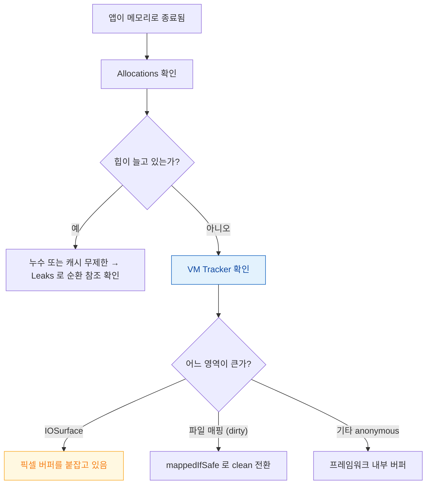

## Allocations 는 힙만 보여주므로 IOSurface 같은 메모리는 VM Tracker 로 봐야 한다

### 개념 (What)

메모리 문제를 Allocations 로만 보다가 **"힙은 안 느는데 앱이 죽는다"** 에 막히는 경우가 흔하다. 원인은 단순하다 — **Allocations 는 힙 할당만 추적한다.**

| 계측기 | 보여주는 것 | 놓치는 것 |
| :--- | :--- | :--- |
| **Allocations** | `malloc` 힙 객체 | IOSurface, 파일 매핑, 스택 |
| **VM Tracker** | **영역별 가상/상주/더티 메모리** | 개별 객체의 할당 스택 |
| **Leaks** | 순환 참조로 도달 불가한 객체 | 도달 가능하지만 안 쓰는 객체 |

**[Jetsam](../../01_system_internals/ipc-and-process/jetsam-memory-pressure-bands.md) 이 보는 것은 힙이 아니라 더티 메모리 총량**이므로, VM Tracker 가 더 진실에 가깝다.

### 왜 필요한가 (Why)



**힙이 안 느는데 footprint 가 느는 대표 원인**이 [IOSurface](../../01_system_internals/graphics-and-media/iosurface-shared-gpu-memory.md)다. 카메라 프레임이나 디코딩된 이미지 버퍼가 여기 잡힌다.

### Allocations 를 제대로 쓰는 법

**Generations(Mark) 가 핵심 기능이다.** 특정 동작 전후의 차이만 볼 수 있다.

```
1. 문제 화면 진입 전 → Mark Generation
2. 화면 진입 → 이탈
3. → Mark Generation
4. Generation 간 "Growth" 를 본다
```

**화면을 열었다 닫았는데 Growth 가 0 이 아니면** 그만큼 남은 것이다. 이것을 5회 반복해 선형으로 증가하면 누수다.

| 컬럼 | 의미 |
| :--- | :--- |
| **Persistent** | 아직 살아 있는 객체 |
| **Transient** | 생성 후 해제된 객체 |
| **Growth** | 세대 간 순증가 |

Transient 가 많은 것은 누수가 아니지만 **할당·해제 비용**이므로 성능 문제일 수 있다.

### 어떤 수치를 믿을 것인가

| 수치 | Jetsam 관련성 |
| :--- | :--- |
| Virtual Size | 거의 무관 |
| Resident Size | 간접적 |
| **Dirty Size** | **직접 관련** |
| **Phys Footprint** | **가장 관련 높음** |

```bash
# macOS / 시뮬레이터
vmmap --summary <pid>
footprint <pid>          # Jetsam 관점에 가장 가까움
heap <pid> | head -40
```

Xcode 의 메모리 게이지도 footprint 계열을 보여준다. **`malloc` 총량만 보면 실제 위험도를 놓친다.**

### Leaks 의 한계

`Leaks` 는 **도달 불가한 객체**만 잡는다. 다음은 못 잡는다.

- 캐시에 계속 쌓이는 객체 (도달 가능하다)
- 옵서버를 제거하지 않아 살아 있는 객체 (도달 가능하다)
- 델리게이트를 `strong` 으로 잡은 경우 (순환이면 잡지만 아니면 못 잡음)

**Debug Memory Graph** 가 이 경우에 더 유용하다. → [View Debugger 와 Memory Graph](../debugging/view-debugger-and-memory-graph-answer-different-questions.md)

### 관찰 가능한 증거

```bash
# 할당 스택을 기록하려면 켜야 한다 (스킴 > Diagnostics)
MallocStackLogging = 1
```

이걸 켜야 Memory Graph 와 Allocations 에서 **"이 객체가 어디서 만들어졌는가"** 를 볼 수 있다. 켜지 않으면 객체는 보이는데 출처를 알 수 없다.

**실기기 검증**: 시뮬레이터는 맥의 메모리를 쓰므로 한도가 다르다. [메모리 한도 문제는 반드시 최저 사양 실기기](../performance/performance-budgets-need-a-target-device.md)에서 확인한다.

### 연관 문서

- [Time Profiler 는 호출 트리를 뒤집고 시스템 라이브러리를 숨겨야 읽힌다](time-profiler-needs-inverted-tree-and-hidden-system-libraries.md)
- [계측기 템플릿은 서로 다른 질문에 답한다](instrument-templates-answer-different-questions.md)
- [Mach VM 은 영역 단위로 매핑하고 물리 페이지 할당을 미룬다](../../01_system_internals/kernel-and-driver/mach-vm-and-memory-regions.md)
- [03-jetsam-memory-termination](../../00_foundations/diagnostic-runbooks/03-jetsam-memory-termination.md)

공식 문서: [Analyzing the memory usage of your app](https://developer.apple.com/documentation/xcode/analyzing-the-memory-usage-of-your-app)
