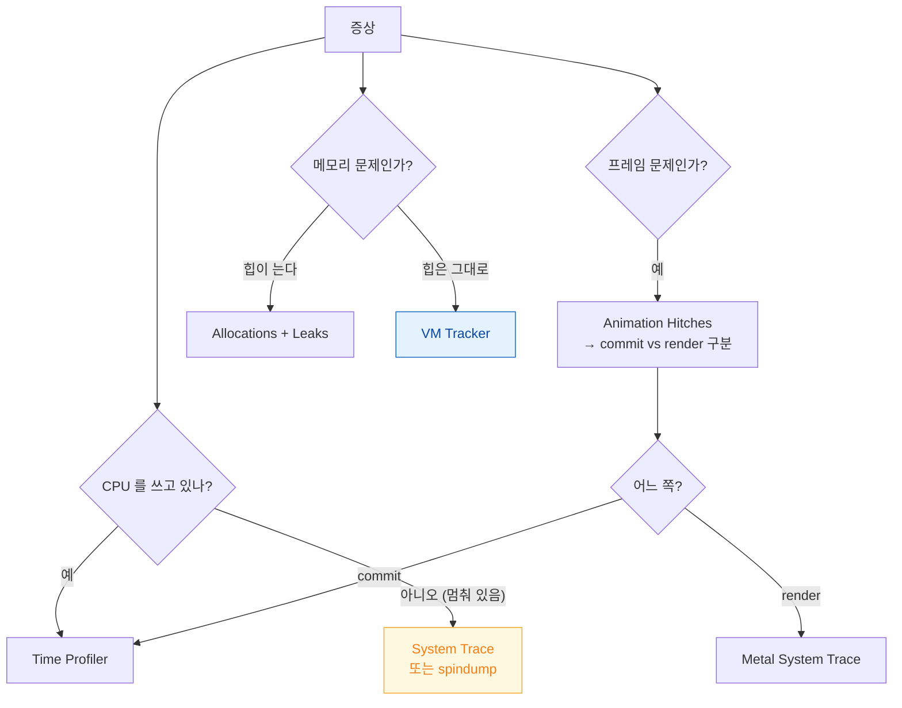

## 계측기 템플릿은 각각 다른 질문에 답하므로 증상에 맞춰 골라야 한다

### 개념 (What)

Instruments 를 열면 템플릿이 여러 개 나온다. **아무거나 켜고 보는 것이 가장 흔한 실수**다. 각 템플릿은 서로 다른 질문에 답하도록 만들어져 있고, 잘못 고르면 원인이 아예 보이지 않는다.

| 증상 | 템플릿 | 답하는 질문 |
| :--- | :--- | :--- |
| 특정 동작이 느리다 | **Time Profiler** | 어느 함수가 CPU 를 쓰나 |
| 메모리로 죽는다 | **Allocations / VM Tracker / Leaks** | 무엇이 쌓이나 |
| 스크롤이 끊긴다 | **Animation Hitches** | 앱이 늦었나 GPU 가 늦었나 |
| 앱 시작이 느리다 | **App Launch** | pre-main 인가 post-main 인가 |
| GPU 가 느리다 | **Metal System Trace** | 렌더 패스·드로우 콜 |
| 배터리를 먹는다 | **Energy Log** | CPU·네트워크·위치·GPU 중 무엇 |
| 멈춘다 (CPU 는 낮음) | **System Trace** | 시스템 콜·스레드 상태·대기 |
| async 코드가 이상하다 | **Swift Concurrency** | Task 생성·actor 대기 |
| 네트워크가 느리다 | **Network** | 연결 수립·전송량·재시도 |
| 디스크를 많이 쓴다 | **File Activity** | 어떤 파일에 얼마나 |

### 왜 필요한가 (Why)

증상과 템플릿이 어긋나면 **원인이 보이지 않는데 시간만 쓴다.**



**"CPU 를 쓰고 있는가"가 첫 분기다.** 멈춰 있는데 CPU 가 낮으면 Time Profiler 로는 아무것도 안 보인다. 대기 중이기 때문이다.

### 여러 계측기를 함께 본다

Instruments 는 템플릿에 계측기를 추가할 수 있다. 시간축이 공유되므로 **인과관계**를 볼 수 있다.

```
Animation Hitches + Time Profiler
  → 히치가 난 순간 메인 스레드가 무엇을 하고 있었는지

Allocations + Time Profiler
  → 메모리가 튄 순간 어떤 코드가 실행 중이었는지

Energy Log + Network
  → 배터리 소모가 네트워크 때문인지
```

### signpost 로 내 구간을 표시한다

계측기 출력에 **앱의 논리적 구간**을 겹쳐 보면 해석이 훨씬 쉬워진다.

```swift
import OSLog

let signposter = OSSignposter(subsystem: "com.example.app", category: "Feed")

func loadFeed() async {
    let state = signposter.beginInterval("LoadFeed")
    defer { signposter.endInterval("LoadFeed", state) }
    await fetchAndRender()
}
```

이 구간은 Instruments 의 `os_signpost` 트랙에 나타나고, 동시에 [XCTest 성능 측정](../performance/xctest-metrics-lock-performance-in-ci.md)과 [MetricKit](../performance/metrickit-collects-what-you-cannot-reproduce.md)에서도 쓰인다. **한 번 심으면 세 곳에서 쓴다.**

### 측정 원칙

| 원칙 | 이유 |
| :--- | :--- |
| **Release 구성으로** | Debug 는 최적화가 없어 병목이 다르다 |
| **실기기에서** | 시뮬레이터는 맥 CPU 를 쓴다 |
| **구간을 좁혀서** | 앱 전체를 기록하면 노이즈가 크다 |
| **고친 뒤 재측정** | 추측으로 고치고 끝내지 않는다 |

### Xcode 내장 도구로 충분한 경우

Instruments 를 열기 전에 확인할 것들이 있다.

| 도구 | 언제 |
| :--- | :--- |
| Debug Navigator 게이지 | CPU·메모리 추이를 대략 볼 때 |
| [View Debugger](../debugging/view-debugger-and-memory-graph-answer-different-questions.md) | 레이아웃 문제 |
| [Memory Graph](../debugging/view-debugger-and-memory-graph-answer-different-questions.md) | 순환 참조 |
| Core Animation 디버그 색상 | [offscreen·오버드로](../../01_system_internals/graphics-and-media/offscreen-rendering-cost.md) |

### 관찰 가능한 증거

```bash
# CLI 로 템플릿 실행 (CI 에서도 가능)
xcrun xctrace record --template 'Time Profiler' \
  --device-name 'My iPhone' --attach MyApp --output trace.trace

xcrun xctrace list templates      # 사용 가능한 템플릿 목록
```

`xctrace` 로 수집한 `.trace` 파일은 Instruments 로 열어 분석한다. **CI 에서 자동 수집**해 두면 회귀 시 원인 분석이 쉬워진다.

### 연관 문서

- [Time Profiler 는 호출 트리를 뒤집고 시스템 라이브러리를 숨겨야 읽힌다](time-profiler-needs-inverted-tree-and-hidden-system-libraries.md)
- [Allocations 는 힙을 보여주고 VM Tracker 가 나머지를 보여준다](allocations-shows-heap-but-vm-tracker-shows-the-rest.md)
- [성능은 평균이 아니라 사용자가 기다린 시간의 분포로 측정한다](../performance/measure-user-perceived-time-not-averages.md)
- [히치는 평균 FPS 가 아니라 사용자가 실제로 본 지연을 잰다](../../01_system_internals/graphics-and-media/hitches-measure-user-visible-jank.md)

공식 문서: [Instruments](https://developer.apple.com/tutorials/instruments) · [os_signpost](https://developer.apple.com/documentation/os/ossignposter)
