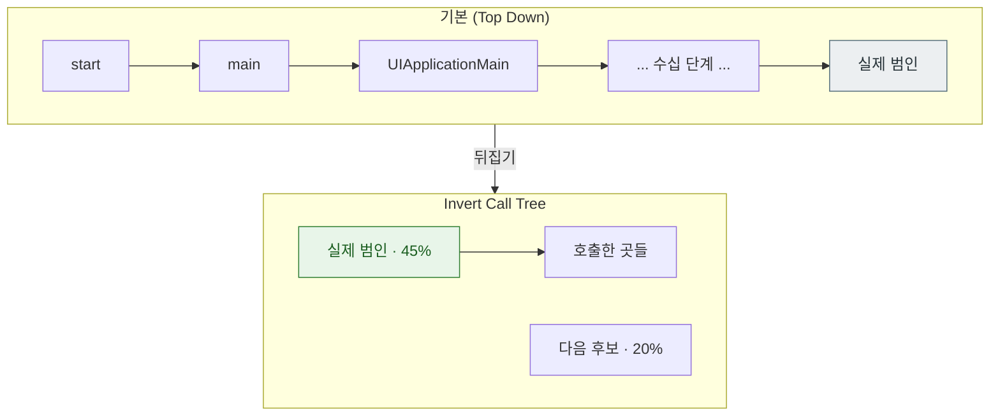

## Time Profiler 는 호출 트리를 뒤집고 시스템 라이브러리를 숨겨야 읽힌다

### 개념 (What)

Time Profiler 는 일정 간격으로 **모든 스레드의 콜 스택을 샘플링**한다. 어떤 함수가 스택에 자주 보이면 그만큼 시간을 쓴 것이다.

문제는 기본 출력이 읽기 어렵다는 것이다. 최상단은 항상 `start` → `main` → `UIApplicationMain` 이고, 그 아래로 수십 단계가 이어진다. **두 가지 설정을 켜야 비로소 정보가 된다.**

| 설정 | 효과 |
| :--- | :--- |
| **Invert Call Tree** | 리프(실제로 실행 중이던 함수)를 위로 올린다 |
| **Hide System Libraries** | 내 코드만 남긴다 |

### 왜 필요한가 (Why)



**뒤집으면 "가장 많은 시간을 쓴 함수"가 맨 위에 온다.** 거기서부터 호출 경로를 거슬러 올라가는 것이 정석이다.

**Hide System Libraries** 를 켜면 `objc_msgSend` 나 `malloc` 같은 항목이 사라지고 **내 코드가 남는다.** 시스템 함수가 느린 것이 아니라 그것을 부른 내 코드가 많이 부른 것이므로, 고칠 수 있는 지점이 드러난다.

### 읽는 순서

1. **스레드를 고른다** — 메인 스레드가 문제인지 다른 스레드인지 먼저 나눈다
2. **Invert + Hide System Libraries** 를 켠다
3. **Heaviest Stack Trace**(우측 패널)를 본다 — 가장 무거운 경로를 자동으로 요약해 준다
4. 후보 함수를 더블클릭해 **소스 라인별 시간**을 본다
5. 고친 뒤 **다시 측정**해 실제로 줄었는지 확인한다

### 샘플링의 한계를 안다

| 한계 | 의미 |
| :--- | :--- |
| **샘플링이다** | 아주 짧게 여러 번 호출되는 함수는 과소평가될 수 있다 |
| **대기 시간은 CPU 시간이 아니다** | `mach_msg_trap` 이나 잠금 대기는 CPU 를 안 쓴다 |
| **디버그 빌드는 다르다** | 최적화가 꺼져 있어 실제와 프로파일이 다르다 |

> [!IMPORTANT] Release 구성으로 프로파일한다
> Debug 빌드는 인라인·최적화가 없어 병목이 다르게 보인다. **Product > Profile 은 기본적으로 Release 구성**을 쓴다. 스킴 설정을 바꿔 Debug 로 프로파일하면 잘못된 결론에 도달한다.

### CPU 를 쓰지 않는 지연은 다른 계측기로

메인 스레드가 **막혀 있지만 CPU 는 안 쓰는** 경우가 있다. Time Profiler 에서는 잘 안 보인다.

| 증상 | 원인 | 도구 |
| :--- | :--- | :--- |
| 스택 최상단이 `mach_msg_trap` | 동기 IPC 대기 | System Trace |
| `semaphore_wait` | 세마포어 데드락 | Thread Sanitizer / System Trace |
| 디스크 I/O 대기 | 파일 접근 | System Trace, File Activity |

→ [mach_msg 스택 읽는 법](../../01_system_internals/ipc-and-process/mach-msg-primitive.md)

### 렌더링 병목과의 구분

`CA::Transaction::commit` 아래가 두꺼우면 [커밋 구간](../../01_system_internals/graphics-and-media/layer-tree-commit-to-render-server.md) 문제다. 그 안에서:

- `CGImageSourceCreateImageAtIndex` 계열 → **이미지 디코딩**
- `layoutSubviews` / 제약 해석 → **레이아웃**
- `-[UIView drawRect:]` → 커스텀 그리기

각각 처방이 다르다. → [07 런북](../../00_foundations/diagnostic-runbooks/07-scroll-hitches.md)

### 관찰 가능한 증거

```bash
# CLI 로 샘플 수집 (macOS 프로세스)
sample <pid> 5 -file /tmp/sample.txt

# 스레드 상태를 포함한 스냅샷
spindump <pid> 5 -file /tmp/spin.txt
```

Instruments 에서 **Product > Profile (⌘I)** → Time Profiler 선택 → 문제 동작 재현 → 정지 후 분석.

**측정 구간을 좁힌다.** 앱 전체를 프로파일하면 노이즈가 크다. 문제 화면에 도달한 뒤 기록을 시작하고, 동작 직후 멈춘다.

### 연관 문서

- [Allocations 는 힙을 보여주고 VM Tracker 가 나머지를 보여준다](allocations-shows-heap-but-vm-tracker-shows-the-rest.md)
- [계측기 템플릿은 서로 다른 질문에 답한다](instrument-templates-answer-different-questions.md)
- [레이어 트리는 IPC 로 Render Server 에 커밋된다](../../01_system_internals/graphics-and-media/layer-tree-commit-to-render-server.md)
- [07-scroll-hitches](../../00_foundations/diagnostic-runbooks/07-scroll-hitches.md)

공식 문서: [Analyzing the performance of your app](https://developer.apple.com/documentation/xcode/analyzing-the-performance-of-your-app)
