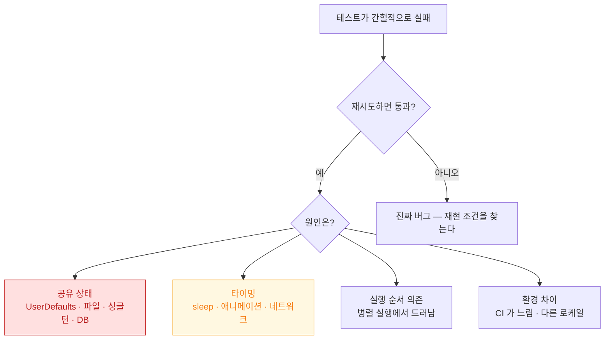

## 플레이키 테스트는 공유 상태와 타이밍 의존 두 가지에서 나온다

### 개념 (What)

같은 코드에 대해 **어떤 때는 통과하고 어떤 때는 실패하는** 테스트다. 원인은 거의 항상 둘 중 하나다.

1. **공유 상태** — 테스트끼리 무언가를 나눠 쓰고 있다
2. **타이밍 의존** — 특정 순서나 시간 안에 끝난다고 가정한다

플레이키 테스트를 방치하면 더 나쁜 일이 생긴다. **팀이 빨간 CI 를 무시하기 시작하고, 그러면 진짜 회귀도 함께 묻힌다.**

### 왜 필요한가 (Why)



### 1. 공유 상태 제거

| 공유되는 것 | 대응 |
| :--- | :--- |
| `UserDefaults.standard` | 테스트마다 별도 suite 를 주입 |
| 파일 시스템 | 테스트마다 임시 디렉터리 |
| 싱글턴 | 프로토콜 경계로 [주입](test-doubles-fake-vs-mock-vs-stub.md) |
| DB | 인메모리 스토어 |
| 시뮬레이터 상태 | `xcrun simctl erase` |

```swift
// UserDefaults 격리
struct SettingsTests {
    let defaults: UserDefaults
    init() throws {
        let suite = "test-\(UUID().uuidString)"
        defaults = try #require(UserDefaults(suiteName: suite))
    }
    deinit { defaults.removePersistentDomain(forName: defaults.description) }
}

// 파일 시스템 격리
let tempDir = FileManager.default.temporaryDirectory
    .appendingPathComponent(UUID().uuidString)
try FileManager.default.createDirectory(at: tempDir, withIntermediateDirectories: true)
defer { try? FileManager.default.removeItem(at: tempDir) }
```

**[Swift Testing 은 기본이 병렬 실행](xctest-and-swift-testing-coexist.md)이므로 공유 상태 문제가 즉시 드러난다.** 이것은 도움이 되는 성질이다 — 숨어 있던 결합이 보인다.

### 2. 타이밍 의존 제거

```swift
// ❌ 고정 대기
sleep(2)

// ✅ 조건 대기
XCTAssertTrue(element.waitForExistence(timeout: 5))
await fulfillment(of: [expectation], timeout: 5)

// ✅ 가상 시계로 시간을 통제
let clock = TestClock()
await clock.advance(by: .seconds(5))
```

**애니메이션도 타이밍 의존의 원인**이다. UI 테스트에서는 꺼 둔다.

```swift
if ProcessInfo.processInfo.arguments.contains("-UITesting") {
    UIView.setAnimationsEnabled(false)
}
```

### 3. 환경 차이

CI 는 로컬보다 느리고, 로케일과 시간대가 다를 수 있다.

```swift
// ❌ 로케일 의존 — CI 가 다른 지역이면 깨진다
#expect(formatted == "1,234.56")

// ✅ 로케일을 고정
var style = FloatingPointFormatStyle<Double>()
style.locale = Locale(identifier: "en_US_POSIX")
#expect(1234.56.formatted(style) == "1,234.56")
```

시간대도 마찬가지다. → [Formatter 는 로케일 규칙을 담는다](../../02_ui_frameworks/i18n/formatters-encode-locale-rules-not-display-strings.md)

### 재시도는 해결이 아니라 은폐다

CI 에 자동 재시도를 넣으면 당장은 초록이 되지만 **원인이 남고 언젠가 진짜 회귀를 놓친다.**

허용 가능한 사용: **재시도 횟수를 기록해 지표로 삼는 것.** 재시도가 필요한 테스트 목록이 곧 수리 대기열이다.

```bash
# 반복 실행으로 플레이키를 노출시킨다
xcodebuild test -scheme MyApp -test-iterations 20 -retry-tests-on-failure \
  -only-testing:MyAppTests/SuspectTests
```

`-test-iterations` 로 여러 번 돌려 **재현율**을 측정하는 것이 첫 단계다.

### 격리해서 원인을 좁히는 순서

1. **단독 실행** — 혼자 돌리면 통과하는가? → 공유 상태
2. **반복 실행** — 20회 중 몇 번 실패하는가? → 재현율 확보
3. **순차 실행** (`.serialized`) — 통과하는가? → 병렬 충돌
4. **시뮬레이터 초기화 후** — 통과하는가? → 잔여 상태
5. 전부 아니면 → **진짜 버그**일 가능성

### 관찰 가능한 증거

```bash
xcrun simctl erase all                      # 시뮬레이터 상태 초기화
xcodebuild test -scheme MyApp -test-iterations 20 -run-tests-until-failure

# 결과 번들에서 실패 이력
xcrun xcresulttool get --path TestResults.xcresult --format json | jq '.issues'
```

**Xcode 의 Test Report 에서 반복 실행 결과**를 보면 어느 테스트가 몇 번 실패했는지 집계된다.

### 연관 문서

- [비동기 테스트는 완료 신호를 명시해야 한다](async-tests-need-explicit-completion-signals.md)
- [XCUITest 는 접근성 식별자로 요소를 찾는다](xcuitest-depends-on-accessibility-identifiers.md)
- [테스트 대역은 무엇을 검증하느냐로 고른다](test-doubles-fake-vs-mock-vs-stub.md)
- [Swift Testing 과 XCTest 는 공존하며 역할이 다르다](xctest-and-swift-testing-coexist.md)

공식 문서: [Diagnosing and resolving test failures](https://developer.apple.com/documentation/xcode/diagnosing-and-resolving-test-failures)
