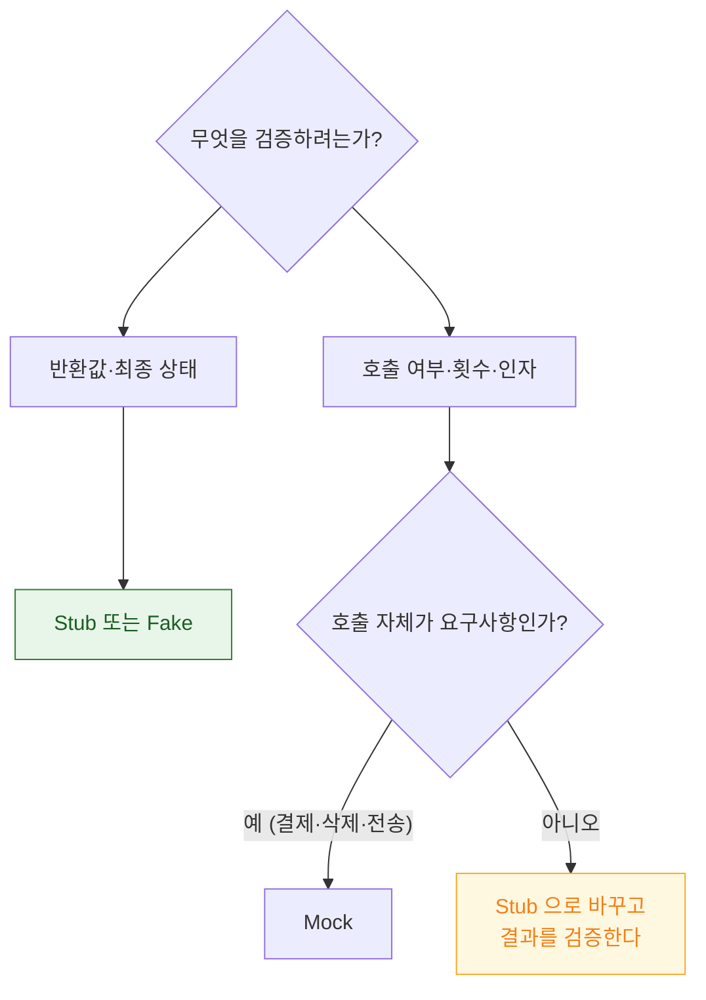

## 테스트 대역은 무엇을 검증하느냐에 따라 stub·fake·mock 으로 나뉜다

### 개념 (What)

세 가지를 "목(mock)"으로 뭉뚱그려 부르는 경우가 많지만, **검증 대상이 다르다.**

| 종류 | 무엇을 하나 | 무엇을 검증하나 |
| :--- | :--- | :--- |
| **Stub** | 미리 정한 값을 반환 | **결과 상태** |
| **Fake** | 단순화된 실제 구현 (인메모리 DB 등) | **결과 상태** |
| **Mock** | 호출을 기록 | **상호작용** (몇 번, 어떤 인자로) |

**대부분의 경우 stub 이나 fake 로 충분하다.** mock 은 "호출 자체가 요구사항일 때"만 쓴다.

### 왜 필요한가 (Why)

mock 을 남용하면 **구현에 결합된 테스트**가 된다.

```swift
// ❌ 구현 세부에 결합 — 리팩터링하면 깨진다
#expect(mockAPI.fetchCallCount == 1)
#expect(mockAPI.lastFetchedID == "42")
// 캐시를 도입해 호출을 줄이면 이 테스트가 실패한다. 동작은 여전히 옳은데도.

// ✅ 결과를 검증 — 구현이 바뀌어도 유효하다
#expect(viewModel.user?.id == "42")
```

**"내부적으로 어떻게 했는가"가 아니라 "밖에서 관찰 가능한 결과가 무엇인가"** 를 검증한다.

### 언제 mock 이 맞는가

호출 자체가 관찰 가능한 요구사항일 때만이다.

| 상황 | 이유 |
| :--- | :--- |
| 분석 이벤트가 전송되었는가 | 전송 자체가 요구사항 |
| 로그아웃 시 토큰이 삭제되었는가 | 삭제 호출이 보안 요구사항 |
| **결제가 한 번만 요청되었는가** | 중복 호출이 곧 버그 |
| 캐시 무효화가 호출되었는가 | 부수 효과가 요구사항 |



### 프로토콜로 경계를 만든다

```swift
protocol UserFetching {
    func fetchUser(id: String) async throws -> User
}

// Stub — 고정 응답
struct StubUserAPI: UserFetching {
    var result: Result<User, Error> = .success(.sample)
    func fetchUser(id: String) async throws -> User { try result.get() }
}

// Fake — 단순화된 진짜 동작
final class FakeUserStore: UserFetching {
    private var users: [String: User] = [:]
    func add(_ user: User) { users[user.id] = user }
    func fetchUser(id: String) async throws -> User {
        guard let u = users[id] else { throw APIError.notFound }
        return u
    }
}

// Mock — 호출 기록 (필요할 때만)
final class MockAnalytics: AnalyticsTracking, @unchecked Sendable {
    private let lock = NSLock()
    private(set) var events: [String] = []
    func track(_ event: String) { lock.withLock { events.append(event) } }
}
```

> [!NOTE] Mock 의 동시성 안전성
> [테스트가 병렬 실행](xctest-and-swift-testing-coexist.md)되므로 기록용 mock 은 스레드 안전해야 한다. `@unchecked Sendable` 을 쓴다면 **실제로 락으로 보호**해야 한다. → [Sendable](../../01_language_concurrency/concurrency/sendable-vs-sending.md)

### Fake 가 과소평가되어 있다

인메모리 fake 는 만들기 번거로워 보이지만, **한 번 만들면 여러 테스트가 공유**하고 stub 보다 현실적인 시나리오를 검증한다.

```swift
// 순서가 있는 시나리오를 자연스럽게 검증할 수 있다
let store = FakeUserStore()
store.add(.init(id: "1", name: "김"))
let vm = ViewModel(api: store)
await vm.load(id: "1")
#expect(vm.user?.name == "김")

await vm.rename(to: "이")
await vm.load(id: "1")
#expect(vm.user?.name == "이")     // fake 는 상태를 유지하므로 이런 검증이 가능
```

stub 으로는 두 번째 검증이 불가능하다.

### 시스템 프레임워크는 감싼다

`URLSession`, `CLLocationManager`, `UNUserNotificationCenter` 같은 시스템 타입은 직접 mock 하기 어렵다. **얇은 프로토콜로 감싸는 것**이 표준 대응이다.

`URLSession` 은 예외적으로 `URLProtocol` 을 이용해 네트워크 계층에서 가로챌 수 있다.

```swift
final class StubURLProtocol: URLProtocol {
    static var handler: ((URLRequest) -> (HTTPURLResponse, Data))?
    override class func canInit(with request: URLRequest) -> Bool { true }
    override func startLoading() {
        let (response, data) = Self.handler!(request)
        client?.urlProtocol(self, didReceive: response, cacheStoragePolicy: .notAllowed)
        client?.urlProtocol(self, didLoad: data)
        client?.urlProtocolDidFinishLoading(self)
    }
    override func stopLoading() {}
}
```

### 관찰 가능한 증거

```bash
# mock 남용 신호 — 호출 횟수 검증이 과도한지 확인
grep -rn "CallCount\|wasCalled\|verify(" --include="*.swift" ./Tests | wc -l
```

리팩터링 시 **동작을 안 바꿨는데 깨지는 테스트**가 많다면 mock 에 과결합된 것이다.

### 연관 문서

- [테스트 레벨은 잡을 수 있는 실패의 종류로 나뉜다](test-levels-differ-in-what-they-can-catch.md)
- [Swift Testing 과 XCTest 는 공존하며 역할이 다르다](xctest-and-swift-testing-coexist.md)
- [플레이키 테스트는 공유 상태와 타이밍에서 나온다](flaky-tests-come-from-shared-state-and-timing.md)

공식 문서: [Testing](https://developer.apple.com/documentation/xcode/testing)
