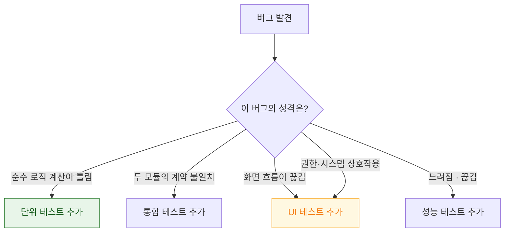

## 테스트 레벨은 속도가 아니라 잡을 수 있는 실패의 종류로 나뉜다

### 개념 (What)

테스트 피라미드를 "단위 70% / 통합 20% / UI 10%" 라는 **비율**로만 이해하면 무엇을 어디에 쓸지 판단할 수 없다. 실제 기준은 **각 레벨이 잡을 수 있는 실패가 다르다**는 것이다.

| 레벨 | 잡는 실패 | 못 잡는 실패 |
| :--- | :--- | :--- |
| **단위** | 로직 오류, 경계 조건, 계산 실수 | 조립 오류, 실제 화면 동작 |
| **통합** | 컴포넌트 간 계약 불일치, 직렬화, 영속화 | 화면 흐름, 시스템 권한 |
| **UI(E2E)** | 화면 흐름, 실제 조립, 권한 프롬프트 | 내부 경계 조건 |
| **성능** | [시작 시간·히치 회귀](../performance/xctest-metrics-lock-performance-in-ci.md) | 기능 오류 |
| **접근성** | 레이블 누락, 대비, 터치 타깃 | 구조의 유용성 |

**같은 버그를 두 레벨에서 잡으려 하면 낭비이고, 어느 레벨도 못 잡는 버그가 있으면 구멍이다.**

### 왜 필요한가 (Why)

레벨 선택이 잘못되면 두 방향으로 손해다.

1. **너무 위에서 테스트한다** — UI 테스트로 계산 로직을 검증하면 느리고 [플레이키](flaky-tests-come-from-shared-state-and-timing.md)해진다.
2. **너무 아래에서 테스트한다** — 단위 테스트만 100% 통과해도 화면이 안 뜰 수 있다.



**버그를 고칠 때마다 "이 버그를 잡을 수 있었던 가장 낮은 레벨"에 테스트를 추가**하는 것이 실용적인 규칙이다.

### 테스트 가능한 설계가 선행 조건이다

레벨을 나누려면 **경계에서 대체 가능해야** 한다.

```swift
// ❌ 싱글턴 직접 참조 — 단위 테스트에서 네트워크를 끊을 수 없다
final class ProfileViewModel {
    func load() async { user = await APIClient.shared.fetchUser() }
}

// ✅ 프로토콜로 경계를 만든다
protocol UserFetching { func fetchUser() async throws -> User }

final class ProfileViewModel {
    private let api: UserFetching
    init(api: UserFetching) { self.api = api }
    func load() async { user = try? await api.fetchUser() }
}
```

경계가 없으면 단위 테스트가 불가능해지고, 결국 모든 것을 UI 테스트로 검증하게 된다. → [테스트 대역](test-doubles-fake-vs-mock-vs-stub.md)

### iOS 에서만 필요한 레벨

일반적인 피라미드에 없지만 iOS 에서는 별도로 필요하다.

| 대상 | 왜 별도인가 |
| :--- | :--- |
| **[성능 회귀](../performance/xctest-metrics-lock-performance-in-ci.md)** | 기능은 맞는데 느려지는 회귀는 기능 테스트가 못 잡는다 |
| **[접근성](../../02_ui_frameworks/apple-accessibility.md)** | `performAccessibilityAudit()` 로 자동화 가능 |
| **기기 다양성** | 최저 사양·[120Hz](../../01_system_internals/graphics-and-media/promotion-variable-refresh-deadline.md)·작은 화면에서만 나는 문제 |
| **생명주기** | [종료 후 상태 복원](../../00_foundations/worked-examples/05-termination-recovery-of-edit-state.md)은 수동 재현이 필요 |

### 어느 레벨도 못 잡는 것

자동화가 어려운 영역을 인지하고 수동 검증 체크리스트로 남긴다.

- 시스템 권한 프롬프트 이후의 흐름 (일부는 `simctl privacy` 로 대체 가능)
- 실제 푸시 수신 (TestFlight 빌드 필요)
- 배터리 소모
- VoiceOver 사용성 (구조가 유용한가)
- [Jetsam 종료 후 복원](../../00_foundations/diagnostic-runbooks/03-jetsam-memory-termination.md)

### 관찰 가능한 증거

```bash
xcodebuild test -scheme MyApp \
  -destination 'platform=iOS Simulator,name=iPhone 15' \
  -enableCodeCoverage YES \
  -resultBundlePath TestResults.xcresult

xcrun xccov view --report TestResults.xcresult
```

**커버리지는 목표가 아니라 신호다.** 100% 여도 잘못된 레벨에서 테스트하면 버그가 남는다. 커버리지가 낮은 **핵심 로직 파일**을 찾는 용도로만 쓴다.

### 연관 문서

- [Swift Testing 과 XCTest 는 공존하며 역할이 다르다](xctest-and-swift-testing-coexist.md)
- [테스트 대역은 무엇을 검증하느냐로 고른다](test-doubles-fake-vs-mock-vs-stub.md)
- [플레이키 테스트는 공유 상태와 타이밍에서 나온다](flaky-tests-come-from-shared-state-and-timing.md)
- [성능 지표는 CI 에 고정해야 회귀를 막는다](../performance/xctest-metrics-lock-performance-in-ci.md)

공식 문서: [Testing](https://developer.apple.com/documentation/xcode/testing)
