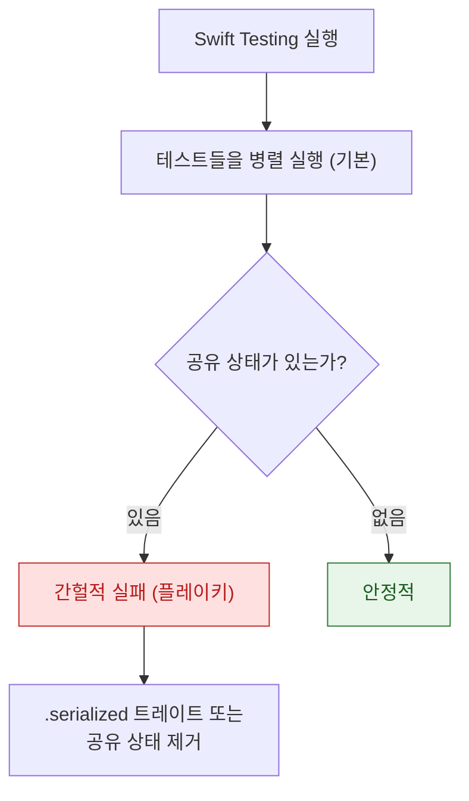

## Swift Testing 과 XCTest 는 공존하며 각각 담당하는 영역이 다르다

### 개념 (What)

**Swift Testing**(Xcode 16+)은 XCTest 를 대체하러 온 것이 아니다. **같은 타깃 안에서 함께 동작**하며, XCTest 만 할 수 있는 일이 여전히 남아 있다.

| | Swift Testing | XCTest |
| :--- | :--- | :--- |
| 단위 테스트 | ✅ 권장 | ✅ 가능 |
| **UI 테스트 (XCUITest)** | ❌ | **✅ 유일** |
| **성능 측정 (`XCTMetric`)** | ❌ | **✅ 유일** |
| 병렬 실행 | 기본 | 설정 필요 |
| 매개변수화 테스트 | 기본 지원 | 수동 반복 |

**결론: 새 단위 테스트는 Swift Testing, UI·성능 테스트는 XCTest.**

### 왜 필요한가 (Why)

Swift Testing 이 해결한 것은 문법 취향이 아니라 **실패 메시지의 정보량**이다.

```swift
// XCTest — 왜 실패했는지 값을 알 수 없다
XCTAssertEqual(user.age, 30)
// ❌ XCTAssertEqual failed: ("25") is not equal to ("30")

// Swift Testing — 표현식을 분해해 보여준다
#expect(user.age == 30)
// ✗ Expectation failed: (user.age → 25) == 30
```

복잡한 조건일수록 차이가 커진다.

```swift
#expect(items.filter { $0.isActive }.count == expected)
// 실패 시 filter 결과와 expected 값이 모두 출력된다
```

### 기본 사용

```swift
import Testing

@Suite("사용자 프로필")
struct ProfileTests {

    @Test("이름이 비어 있으면 검증 실패")
    func emptyNameFails() {
        let result = Validator.validate(name: "")
        #expect(result == .failure(.emptyName))
    }

    // 실패하면 즉시 중단 (이후 코드가 무의미할 때)
    @Test func requiresUser() throws {
        let user = try #require(store.currentUser)   // nil 이면 여기서 중단
        #expect(user.isActive)                        // user 를 안전하게 사용
    }

    // 매개변수화 — 케이스마다 별도 테스트로 실행된다
    @Test(arguments: ["", " ", "\n"])
    func blankNamesFail(_ name: String) {
        #expect(Validator.validate(name: name).isFailure)
    }
}
```

| 매크로 | 동작 |
| :--- | :--- |
| `#expect` | 실패를 기록하고 **계속 진행** |
| `#require` | 실패하면 **즉시 중단** (`XCTUnwrap` 대체) |

`#require` 는 옵셔널 언래핑에 특히 유용하다. 실패 후 강제 언래핑으로 크래시하는 패턴이 사라진다.

### 트레이트로 실행을 제어한다

```swift
@Test(.disabled("서버 준비 후 활성화"))
func pendingFeature() { }

@Test(.timeLimit(.minutes(1)))
func slowOperation() async throws { }

@Test(.tags(.networking))          // 태그로 그룹 실행
func fetchesData() async throws { }

@Test(.bug("https://example.com/issues/42", "레이스 컨디션"))
func knownIssue() { }
```

**`.disabled` 는 주석 처리보다 낫다.** 비활성 사유가 남고, 리포트에 건너뛴 테스트로 집계된다.

### 병렬 실행이 기본이다



```swift
@Suite(.serialized)     // 이 스위트만 순차 실행
struct DatabaseTests { }
```

병렬이 기본이므로 **전역 상태나 싱글턴에 의존하는 테스트가 바로 드러난다.** 이것은 버그를 노출시키는 것이지 만드는 것이 아니다. → [플레이키 테스트](flaky-tests-come-from-shared-state-and-timing.md)

### 설정과 정리

```swift
struct ProfileTests {
    let store: Store            // 각 테스트마다 새 인스턴스가 만들어진다

    init() async throws {        // setUp 대신 init
        store = try await Store.inMemory()
    }

    deinit {                     // tearDown 대신 deinit
        store.close()
    }
}
```

**인스턴스가 테스트마다 새로 만들어지므로** 상태 공유가 구조적으로 어렵다. XCTest 의 `setUp`/`tearDown` 보다 안전하다.

### 마이그레이션

한 번에 바꿀 필요가 없다. **새 테스트부터 Swift Testing 으로 쓰고 기존 XCTest 는 그대로 둔다.** 같은 타깃에서 함께 실행된다.

### 관찰 가능한 증거

```bash
# 특정 테스트만 실행
xcodebuild test -scheme MyApp -only-testing:MyAppTests/ProfileTests

# 결과 번들에서 실패 요약
xcrun xcresulttool get --path TestResults.xcresult --format json | head -40
```

Xcode 의 Test Navigator 에서 Swift Testing 과 XCTest 가 함께 표시된다.

### 연관 문서

- [테스트 레벨은 잡을 수 있는 실패의 종류로 나뉜다](test-levels-differ-in-what-they-can-catch.md)
- [비동기 테스트는 완료 신호를 명시해야 한다](async-tests-need-explicit-completion-signals.md)
- [플레이키 테스트는 공유 상태와 타이밍에서 나온다](flaky-tests-come-from-shared-state-and-timing.md)

공식 문서: [Swift Testing](https://developer.apple.com/documentation/testing) · [XCTest](https://developer.apple.com/documentation/xctest)
