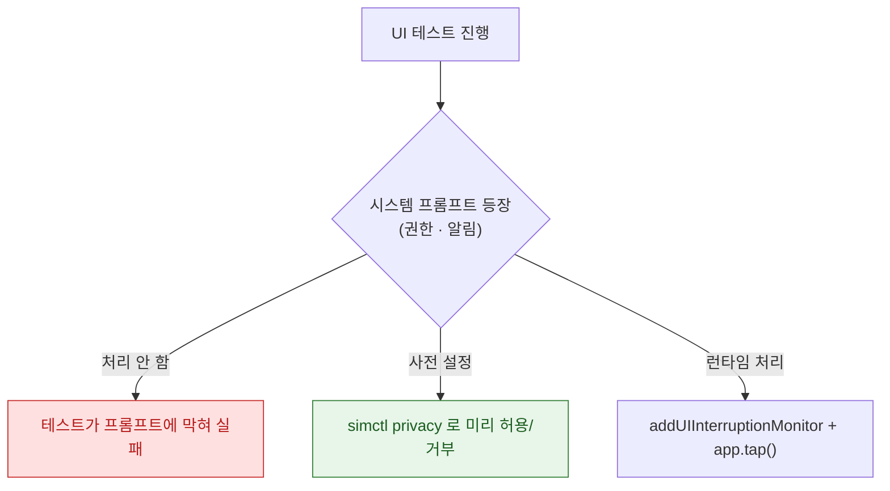

## XCUITest 는 접근성 식별자로 요소를 찾으므로 식별자가 없으면 테스트가 깨진다

### 개념 (What)

UI 테스트는 **별도 프로세스**에서 실행되며, 앱 내부에 직접 접근할 수 없다. 화면 요소를 찾는 유일한 경로가 [접근성 트리](../../02_ui_frameworks/accessibility/accessibility-tree-is-not-the-view-hierarchy.md)다.

식별자가 없으면 **표시 텍스트로 찾을 수밖에 없고**, 그러면 문구를 바꾸거나 지역화하는 순간 테스트가 깨진다.

```swift
// ❌ 표시 텍스트에 의존 — 문구 변경·지역화에 취약
app.buttons["저장"].tap()

// ✅ 식별자에 의존 — 문구가 바뀌어도 안전
app.buttons["saveButton"].tap()
```

```swift
// 앱 코드에서 식별자를 부여한다
saveButton.accessibilityIdentifier = "saveButton"          // UIKit
Button("저장") { }.accessibilityIdentifier("saveButton")    // SwiftUI
```

### 왜 필요한가 (Why)

**`accessibilityIdentifier` 는 `accessibilityLabel` 과 다르다.**

| | 용도 | 사용자에게 |
| :--- | :--- | :--- |
| `accessibilityLabel` | VoiceOver 가 읽음 | **들린다** |
| `accessibilityIdentifier` | 테스트가 찾음 | **보이지 않는다** |

식별자는 지역화하지 않고, 사용자에게 노출되지 않으므로 **자유롭게 안정적인 이름**을 줄 수 있다.

### 대기는 sleep 이 아니라 조건으로

```swift
// ❌ 고정 대기 — 느리거나 부족하다
sleep(2)
XCTAssertTrue(app.staticTexts["결과"].exists)

// ✅ 조건이 충족될 때까지 대기
XCTAssertTrue(app.staticTexts["resultLabel"].waitForExistence(timeout: 5))

// 사라짐을 기다릴 때
let gone = expectation(for: NSPredicate(format: "exists == false"),
                       evaluatedWith: app.activityIndicators["loading"])
await fulfillment(of: [gone], timeout: 10)
```

`waitForExistence` 는 **조건이 맞으면 즉시 반환**하므로 빠르고 안정적이다.

### 테스트 전용 상태를 launch 인자로 주입한다

UI 테스트는 앱 내부를 조작할 수 없으므로, **실행 시점에 설정을 주입**해야 한다.

```swift
// 테스트 쪽
let app = XCUIApplication()
app.launchArguments += ["-UITesting", "-AppleLanguages", "(ko)"]
app.launchEnvironment["STUB_API"] = "1"
app.launchEnvironment["SEED_DATA"] = "three-items"
app.launch()

// 앱 쪽
if ProcessInfo.processInfo.arguments.contains("-UITesting") {
    UIView.setAnimationsEnabled(false)      // ★ 애니메이션 비활성 — 플레이키 감소
}
if ProcessInfo.processInfo.environment["STUB_API"] == "1" {
    container.register(UserFetching.self) { StubUserAPI() }
}
```

**애니메이션 비활성화가 UI 테스트 안정성에 가장 크게 기여한다.** 전환 중에 요소를 찾으려다 실패하는 경우가 사라진다.

### 시스템 프롬프트 처리



```bash
# 권장: 테스트 시작 전에 상태를 확정한다
xcrun simctl privacy booted grant camera com.example.app
xcrun simctl privacy booted reset all com.example.app
```

```swift
// 런타임 처리 (UIKit) — 모니터 등록 후 반드시 app 을 한 번 건드려야 발동한다
addUIInterruptionMonitor(withDescription: "권한") { alert in
    alert.buttons["허용"].tap(); return true
}
app.tap()      // ★ 이게 없으면 모니터가 동작하지 않는다
```

**사전 설정이 런타임 처리보다 안정적이다.** 프롬프트 문구가 OS 버전·언어마다 달라지기 때문이다.

### 무엇을 UI 테스트로 검증할 것인가

UI 테스트는 느리고 불안정하다. **화면 흐름과 실제 조립만** 검증하고, 로직은 [아래 레벨](test-levels-differ-in-what-they-can-catch.md)로 내린다.

| UI 테스트로 | 다른 레벨로 |
| :--- | :--- |
| 로그인 → 목록 → 상세 흐름 | 입력 검증 로직 |
| 딥링크로 목적지 도달 | URL 파싱 |
| 권한 거부 시 대체 흐름 | 권한 상태 분기 로직 |
| 접근성 감사 | — |

```swift
// 접근성 감사를 UI 테스트에서 자동 실행
func testAccessibility() throws {
    let app = XCUIApplication(); app.launch()
    try app.performAccessibilityAudit()
}
```

### 관찰 가능한 증거

```bash
xcodebuild test -scheme MyAppUITests \
  -destination 'platform=iOS Simulator,name=iPhone 15' \
  -resultBundlePath UIResults.xcresult

# 실패 시점의 스크린샷과 요소 트리가 결과 번들에 포함된다
open UIResults.xcresult
```

```swift
// 요소를 못 찾을 때 현재 트리를 출력해 식별자를 확인한다
print(app.debugDescription)
```

`debugDescription` 이 UI 테스트 디버깅의 핵심 도구다. 실제로 어떤 요소가 어떤 식별자로 노출되는지 그대로 보여준다.

### 연관 문서

- [테스트 레벨은 잡을 수 있는 실패의 종류로 나뉜다](test-levels-differ-in-what-they-can-catch.md)
- [플레이키 테스트는 공유 상태와 타이밍에서 나온다](flaky-tests-come-from-shared-state-and-timing.md)
- [접근성 트리는 뷰 계층과 다르며 VoiceOver 는 그 트리를 순회한다](../../02_ui_frameworks/accessibility/accessibility-tree-is-not-the-view-hierarchy.md)
- [apple-accessibility](../../02_ui_frameworks/apple-accessibility.md)

공식 문서: [User interface tests](https://developer.apple.com/documentation/xctest/user-interface-tests)
