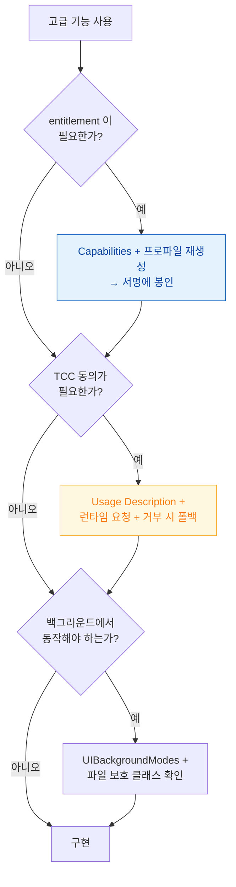

## iOS Advanced Capabilities

iOS 에서 고급 기능을 쓸 때 주의할 점을 쉽게 정리했다. 용어는 [apple-glossary](../../00_foundations/apple-glossary.md).



거의 모든 고급 기능이 이 세 관문을 거친다. → [06 worked example](../../00_foundations/worked-examples/06-permission-gates-in-sequence.md)

### 💡 왜 이것을 알아야 하나요?

고급 기능(위치, 카메라, 센서, 결제 등)을 사용할 때는 **기기 지원 여부, 권한, Entitlement, 배터리 영향**을 반드시 확인해야 합니다. 이를 무시하면 심사 탈락, 배터리 드레인, 사용자 불만족으로 이어집니다.

---

### 네비게이션/지도

#### MapKit(지도 프레임워크) 사용 시 위치 권한과 기능 지원 확인

**왜 필요한가**: 지도 앱의 핵심이지만, 사용자 프라이버시와 기기별 기능 차이를 고려해야 합니다.

- **MapKit**: 지도 표시, 핀(Annotation), 경로 그리기. 정확한 위치(Precise Location)와 대략적 위치(Approximate Location) 권한을 구분해서 요청.
- 차량/자전거/대중교통/도보 경로 제공 여부를 기기와 iOS 버전에 따라 확인.
- 지도 캡처/내보내기는 저작권 및 Apple 정책을 따라야 함.

```swift
import MapKit

// MapKit으로 사용자 현재 위치와 경로 표시
@Observable
class MapViewModel {
    var position: MapCameraPosition = .automatic
    
    func showUserRoute(destination: CLLocationCoordinate2D) async {
        let userLocation = CLLocationCoordinate2D(latitude: 37.5, longitude: 127.0)
        
        // MKDirections로 경로 요청
        let request = MKDirections.Request()
        request.source = MKMapItem(placemark: MKPlacemark(coordinate: userLocation))
        request.destination = MKMapItem(placemark: MKPlacemark(coordinate: destination))
        request.transportType = .automobile
        
        let directions = MKDirections(request: request)
        let response = try? await directions.calculate()
        
        if let route = response?.routes.first {
            // 경로를 지도에 표시
            self.position = .automatic
        }
    }
}
```

---

### 카메라/미디어 확장

#### ProRAW, ProRes, 시네마틱 모드는 기기 지원 확인 필수

**왜 필요한가**: 최신 카메라 기능은 Pro 기기에만 지원되거나 iOS 버전 종속성이 있어서, 런타임에 확인 없이 사용하면 크래시나 무음 실패가 발생합니다.

- **ProRAW/ProRes**: 고급 포맷이지만 Pro iPhone/iPad에만 지원. AVCaptureDevice의 formats 속성으로 런타임에 확인.
- 심도 데이터(Depth Data), 멀티 카메라 동시 캡처 역시 기기별로 다름.
- 시네마틱 모드(Cinematic Mode)/인물 모드(Portrait Mode) 등은 시스템 API 지원 여부를 먼저 확인.
- 라이브 포토(Live Photo), 버스트(Burst), QR 코드, 바코드 스캔은 AVCaptureMetadataOutput 사용.

```swift
import AVFoundation

// 기기가 ProRAW를 지원하는지 확인
func checkProRAWSupport() -> Bool {
    let session = AVCaptureSession()
    guard let videoDevice = AVCaptureDevice.default(.builtInWideAngleCamera, for: .video, position: .back) else {
        return false
    }
    
    // iOS 14.3+ : 지원하는 포맷 확인
    for format in videoDevice.formats {
        if format.supportedColorSpaces.contains(.adobeRGB) {
            return true // ProRAW 지원
        }
    }
    return false
}

// QR 코드 스캔 설정
func setupQRScanning(session: AVCaptureSession) {
    let metadataOutput = AVCaptureMetadataOutput()
    session.addOutput(metadataOutput)
    metadataOutput.metadataObjectTypes = [.qr]
}
```

---

### 센서/하드웨어

#### CoreMotion, UWB, NFC, CoreML은 각각 특정 권한과 배터리 영향 고려

**왜 필요한가**: 센서를 과도하게 사용하면 배터리가 급속도로 소진되고, 일부 기능(UWB, NFC)은 엔타이틀먼트와 기기 하드웨어가 필요합니다.

- **CoreMotion**: 가속도(Accelerometer), 자이로(Gyroscope), 자기장(Magnetometer), 고도(Altitude). 배터리 소비 모니터링 필수.
- **UWB(Ultra-Wideband)**: 근접 감지, 실내 위치 파악. Entitlement 필요, iPhone 11 Pro 이상에만 지원.
- **NFC**: 근접 통신(Near Field Communication). 리더 모드, 태그 읽기 모드 구분. Entitlement 필요.
- **CoreML/Neural Engine**: 온디바이스 머신러닝. 모델 크기, 메모리, 전력 소비 확인.

```swift
import CoreMotion

// CoreMotion: 기기 동작 감지 (가속도, 자이로)
class MotionManager: NSObject, @unchecked Sendable {
    static let shared = MotionManager()
    let motionManager = CMMotionManager()
    
    func startMonitoring() {
        guard motionManager.isDeviceMotionAvailable else { return }
        
        motionManager.deviceMotionUpdateInterval = 0.1
        motionManager.startDeviceMotionUpdates(to: .main) { motion, error in
            if let motion = motion {
                let accelerationX = motion.userAcceleration.x
                let rotationRateZ = motion.rotationRate.z
                // 게임, AR, 스포츠 앱 등에서 활용
            }
        }
    }
}

// UWB (Ultra-Wideband): 기기 간 거리 측정 (iOS 16+, Entitlement 필요)
import NearbyInteraction

func startUWB(session: NISession) {
    let config = NINearbyPeerConfiguration(peerToken: peerToken)
    session.run(config)
    
    // 약 20cm ~ 수십 미터 범위에서 거리와 방향 측정
}

// NFC 읽기
import CoreNFC

class NFCReader: NSObject, NFCNDEFReaderSessionDelegate {
    func beginNFCReading() {
        let session = NFCNDEFReaderSession(delegate: self, queue: .main)
        session?.begin()
    }
    
    func readerSession(_ session: NFCNDEFReaderSession, didDetectNDEFs messages: [NFCNDEFMessage]) {
        for message in messages {
            for record in message.records {
                // NFC 태그 데이터 처리 (URL, 텍스트 등)
            }
        }
    }
}
```

---

### 멀티태스킹/백그라운드

#### Live Activity, 다이내믹 아일랜드, 백그라운드 작업은 정확한 업데이트 빈도 관리 필수

**왜 필요한가**: 무분별한 백그라운드 작업과 잠금 화면 업데이트는 배터리 드레인과 App Sandbox 위반으로 이어질 수 있습니다.

- **Live Activity/다이내믹 아일랜드(Dynamic Island)**: 실시간 데이터 표시(배송 추적, 운동 중 상태). 업데이트 빈도 관리, 배터리 고려.
- **Background Tasks(BGTaskScheduler)**: 앱이 종료된 상태에서도 작업 예약. 앱 심사 기준에 맞게 사용 목적을 명확히 해야 함.
- **Widgets**: 홈 화면/잠금 화면/스마트 스택에 표시. 주기적 업데이트 예산(Budget) 준수.

```swift
import ActivityKit
import WidgetKit

// Live Activity: 잠금 화면에 실시간 정보 표시 (iOS 16.1+)
struct DeliveryActivity: ActivityAttributes {
    public struct ContentState: Codable, Hashable {
        var currentLocation: String
        var estimatedArrival: Date
    }
    
    var deliveryID: String
}

func startLiveActivity() {
    let attributes = DeliveryActivity(deliveryID: "order_123")
    let state = DeliveryActivity.ContentState(
        currentLocation: "서울 강남구",
        estimatedArrival: Date().addingTimeInterval(1800)
    )
    
    do {
        let activity = try Activity.request(attributes: attributes, contentState: state)
        // 이 Activity는 잠금 화면에 표시됨
    } catch {
        print("Live Activity 요청 실패: \(error)")
    }
}

// BGTaskScheduler: 백그라운드 작업 예약
import BackgroundTasks

func scheduleDatabaseSync() {
    let request = BGProcessingTaskRequest(identifier: "com.example.dbsync")
    request.requiresNetworkConnectivity = true
    request.requiresExternalPower = false
    
    do {
        try BGTaskScheduler.shared.submit(request)
    } catch {
        print("백그라운드 작업 예약 실패: \(error)")
    }
}

// Widget 업데이트 (주기적 갱신, 예산 준수)
struct MyWidgetEntryView: View {
    var entry: SimpleEntry
    
    var body: some View {
        Text(entry.date, style: .time)
            .containerBackground(.blue, for: .widget)
    }
}

struct MyWidgetProvider: TimelineProvider {
    func getTimeline(in context: Context, completion: @escaping (Timeline<SimpleEntry>) -> ()) {
        // 최소 30분 간격으로 업데이트 (iOS가 정책에 따라 조정)
        let nextUpdate = Date().addingTimeInterval(1800)
        let timeline = Timeline(entries: [SimpleEntry(date: Date())], policy: .after(nextUpdate))
        completion(timeline)
    }
    
    // ... 나머지 메서드
}
```

---

### 통신/연결

#### CallKit, Nearby, Network Extension은 특정 권한과 Entitlement 필요

**왜 필요한가**: 통화, 근처 기기 감지, 네트워크 설정 등은 보안/프라이버시가 민감해서 심사 기준이 매우 엄격합니다.

- **CallKit**: 통화 UI 제어, 통화 차단/식별. 음성/VoIP 권한, 일부 PushKit 푸시 제한적.
- **Nearby(멀티피어 연결, Bluetooth, UWB)**: 프라이버시, 권한, 배터리 고려.
- **Hotspot/Network Extension**: Entitlement 필수, App Store 심사 매우 엄격.

```swift
import CallKit

// CallKit: VoIP 통화 제어
class CallKitManager {
    let controller = CXCallController()
    
    func initiateVoIPCall(to recipientName: String) {
        let update = CXCallUpdate()
        update.remoteHandle = CXHandle(type: .generic, value: recipientName)
        update.hasVideo = false
        
        CXProvider(configuration: CXProviderConfiguration()).setDelegate(self, queue: .main)
        
        let action = CXStartCallAction(call: UUID(), handle: CXHandle(type: .generic, value: recipientName))
        let transaction = CXTransaction(action: action)
        
        controller.request(transaction) { error in
            if let error = error {
                print("VoIP 통화 시작 실패: \(error)")
            }
        }
    }
}

// Nearby: 근처 기기와 연결 (멀티피어 연결성)
import MultipeerConnectivity

class PeerConnectionManager: NSObject, MCSessionDelegate {
    let session: MCSession
    let advertiser: MCNearbyServiceAdvertiser
    let browser: MCNearbyServiceBrowser
    
    override init() {
        let peerID = MCPeerID(displayName: UIDevice.current.name)
        self.session = MCSession(peer: peerID)
        self.advertiser = MCNearbyServiceAdvertiser(peer: peerID, discoveryInfo: nil, serviceType: "game")
        self.browser = MCNearbyServiceBrowser(peer: peerID, serviceType: "game")
        super.init()
    }
    
    func startAdvertising() {
        advertiser.delegate = self
        advertiser.startAdvertisingPeer()
    }
    
    // MCSessionDelegate 구현
    func session(_ session: MCSession, peer peerID: MCPeerID, didChange state: MCSessionState) {
        // 피어 연결 상태 변화
    }
}
```

---

### 결제/지갑

#### In-App Purchase, Apple Pay는 StoreKit 2, PKPaymentAuthorizationController 사용 필수

**왜 필요한가**: 결제는 재무 거래이므로 Apple의 심사 기준이 매우 엄격하고, 영수증 검증은 보안 필수 요소입니다.

- **In-App Purchase/구독**: StoreKit 2 권장, 영수증(Receipt) 검증 필수.
- **Apple Pay/Wallet Passes**: PKPaymentAuthorizationController, NFC 리더 모드 Entitlement.
- 외부 결제 링크는 정책 및 지역별 예외를 반드시 확인.

```swift
import StoreKit
import PassKit

// StoreKit 2: 인앱 구매
@MainActor
class PurchaseManager: NSObject, ObservableObject {
    @Published var purchasedProductIDs = Set<String>()
    
    func purchaseProduct(id: String) async {
        guard let product = try? await Product.products(for: [id]).first else { return }
        
        do {
            let result = try await product.purchase()
            
            switch result {
            case .success(let verification):
                if case .verified(let transaction) = verification {
                    self.purchasedProductIDs.insert(id)
                    await transaction.finish()
                }
            case .pending:
                print("구매 대기 중 (사용자 승인 필요)")
            case .userCancelled:
                print("사용자가 구매 취소")
            @unknown default:
                break
            }
        } catch {
            print("구매 실패: \(error)")
        }
    }
}

// Apple Pay: 결제 인증
class ApplePayManager: NSObject, PKPaymentAuthorizationViewControllerDelegate {
    func startApplePayment() {
        let request = PKPaymentRequest()
        request.merchantIdentifier = "merchant.com.example.app"
        request.currencyCode = "KRW"
        request.countryCode = "KR"
        request.supportedNetworks = [.visa, .masterCard, .amex]
        request.merchantCapabilities = .capable3DS
        
        let item = PKPaymentSummaryItem(label: "상품명", amount: NSDecimalNumber(string: "99.99"))
        request.paymentSummaryItems = [item]
        
        if let controller = PKPaymentAuthorizationViewController(paymentRequest: request) {
            // UIViewController에서 present
        }
    }
    
    // 결제 완료 핸들
    func paymentAuthorizationViewController(
        _ controller: PKPaymentAuthorizationViewController,
        didAuthorizePayment payment: PKPayment,
        handler completion: @escaping (PKPaymentAuthorizationResult) -> Void
    ) {
        // 서버에 결제 토큰 전송 및 검증
        completion(PKPaymentAuthorizationResult(status: .success, errors: []))
    }
}
```

---

### 건강/피트니스

#### HealthKit, WorkoutKit은 사용자 동의, 데이터 타입 정의, 프라이버시 라벨 필수

**왜 필요한가**: 개인 건강 정보는 HIPAA 등 규제 대상이므로, 권한 관리와 프라이버시가 매우 중요합니다.

- **HealthKit/ResearchKit/WorkoutKit**: 데이터 타입(Heart Rate, Steps 등) 및 권한을 명확히. 백업, 동기화, 프라이버시 라벨 반영.
- Motion/Activity Ring 통합 시 목표, 칼로리, 운동 시간 계산을 정확히.

```swift
import HealthKit
import WorkoutKit

class HealthManager {
    let healthStore = HKHealthStore()
    
    func requestHealthKitAuthorization() {
        let typesToRead: Set = [
            HKObjectType.quantityType(forIdentifier: .stepCount)!,
            HKObjectType.quantityType(forIdentifier: .heartRate)!,
            HKWorkoutType.workoutType()
        ]
        
        healthStore.requestAuthorization(toShare: nil, read: typesToRead) { success, error in
            if success {
                print("HealthKit 권한 승인됨")
            }
        }
    }
    
    func querySteps(for date: Date) async {
        let stepsType = HKQuantityType(.stepCount)
        let predicate = HKQuery.predicateForSamples(withStart: date, end: Date(), options: .strictStartDate)
        
        let query = HKStatisticsQuery(quantityType: stepsType, quantitySamplePredicate: predicate, options: .cumulativeSum) { _, result, error in
            if let sum = result?.sumQuantity() {
                let steps = sum.doubleValue(for: .count())
                print("오늘 걸음: \(steps)")
            }
        }
        
        healthStore.execute(query)
    }
}

// WorkoutKit: 운동 데이터 기록
func logWorkout(type: HKWorkoutActivityType, duration: TimeInterval) {
    let healthStore = HKHealthStore()
    let workout = HKWorkout(
        activityType: type,
        start: Date(),
        end: Date().addingTimeInterval(duration),
        duration: duration,
        totalEnergyBurned: HKQuantity(unit: .kilocalorie(), doubleValue: 150),
        totalDistance: HKQuantity(unit: .meter(), doubleValue: 500),
        device: HKDevice.local(),
        metadata: nil
    )
    
    healthStore.save(workout) { success, error in
        if success {
            print("운동 기록 저장됨")
        }
    }
}
```

---

### 보안/프라이버시

#### Face ID, Touch ID, Passkeys는 LAContext, WebAuthn 사용. 클립보드/스크린 접근은 제한적

**왜 필요한가**: 생체 인증과 민감한 정보 접근은 iOS 13+ 부터 사용자 알림을 반드시 존중해야 하며, 거부하는 사용자도 대체 방법을 제공해야 합니다.

- **Face ID/Touch ID**: LAContext(Local Authentication)로 인증. 생체 정보 자체는 앱에서 접근 불가.
- **Passkeys/FIDO**: WebAuthn/ASAuthorizationPlatformPublicKeyCredential 사용.
- 클립보드, 스크린샷, 스크린 녹화 접근은 제한적이며 사용자 알림 존중.

```swift
import LocalAuthentication

class AuthenticationManager {
    func authenticateWithBiometric() {
        let context = LAContext()
        var error: NSError?
        
        guard context.canEvaluatePolicy(.deviceOwnerAuthenticationWithBiometrics, error: &error) else {
            print("생체 인증 불가: \(error?.localizedDescription ?? "Unknown")")
            return
        }
        
        context.evaluatePolicy(.deviceOwnerAuthenticationWithBiometrics, localizedReason: "앱 접근 인증") { success, error in
            if success {
                print("생체 인증 성공")
            } else {
                print("생체 인증 실패: \(error?.localizedDescription ?? "Unknown")")
            }
        }
    }
}

// Passkeys (WebAuthn): 생체 인증 기반 비밀번호 없는 인증
import AuthenticationServices

class PasskeyManager: NSObject, ASAuthorizationControllerDelegate {
    func signUpWithPasskey() {
        let publicKeyCredentialProvider = ASAuthorizationPlatformPublicKeyCredentialProvider(relyingPartyIdentifier: "example.com")
        
        let challenge = Data() // 서버에서 생성한 challenge
        let userID = Data() // 사용자 ID
        
        let registrationRequest = publicKeyCredentialProvider.createCredentialRegistrationRequest(
            challenge: challenge,
            name: "user@example.com",
            userID: userID
        )
        
        let authController = ASAuthorizationController(authorizationRequests: [registrationRequest])
        authController.delegate = self
        authController.performRequests()
    }
    
    func authorizationController(_ controller: ASAuthorizationController, didCompleteWithAuthorization authorization: ASAuthorization) {
        if let credential = authorization.credential as? ASAuthorizationPlatformPublicKeyCredentialRegistration {
            print("Passkey 등록 성공")
        }
    }
}

// 클립보드 접근: iOS 14+ 사용자 알림 필수
import UIKit

func copyToClipboard(_ text: String) {
    UIPasteboard.general.string = text
    // iOS 14+: 사용자에게 "앱이 클립보드에 접근했습니다" 알림이 자동으로 표시됨
}

// 스크린 녹화 감지
func detectScreenRecording() {
    if #available(iOS 11.0, *) {
        NotificationCenter.default.addObserver(
            forName: UIScreen.capturedDidChangeNotification,
            object: nil,
            queue: .main
        ) { _ in
            if UIScreen.main.isCaptured {
                print("스크린 녹화 감지됨 - 민감한 정보 숨기기")
            }
        }
    }
}
```

---

### 국제화/현지 규제

#### 메시징, 지도, 결제, 미디어는 지역 규제가 상이함. 지역별 처리 필수

**왜 필요한가**: 일부 국가(중국, 러시아 등)는 지도, 통신, 암호화 등에 대한 규제가 매우 엄격해서, 한 버전의 앱으로는 심사 통과가 불가능할 수 있습니다.

- 메시징, 지도(중국: 예를 들어 GCJ-02 좌표계 사용), 결제, 미디어는 지역 규제가 다를 수 있음.
- 언어, 통화, 세금, 법률에 맞는 처리 필요.

```swift
import Foundation

// 지역별 지도 제공자 선택
func selectMapProvider(for region: String) -> String {
    switch region {
    case "CN":
        return "AMap" // 중국: Amap 사용 (GCJ-02)
    case "RU":
        return "Yandex" // 러시아
    default:
        return "Apple Maps" // 기타 지역
    }
}

// 지역별 통화 표시
let formatter = NumberFormatter()
formatter.numberStyle = .currency

let locale = Locale(identifier: "ko_KR")
formatter.locale = locale
let koreanPrice = formatter.string(from: 99.99 as NSNumber) // ₩99.99

let localeUS = Locale(identifier: "en_US")
formatter.locale = localeUS
let usPrice = formatter.string(from: 99.99 as NSNumber) // $99.99

// 지역별 암호화/통신 정책
#if os(iOS)
import Network

func getNetworkSecurityPolicy(for region: String) -> String {
    switch region {
    case "CN":
        return "State-mandated encryption standards required"
    case "RU":
        return "GOST standards may be required"
    default:
        return "TLS 1.2+ recommended"
    }
}
#endif
```

---

### 테스트/운영

#### 기기, 네트워크, 권한, 언어, 배터리 조합에서 충분한 테스트 필수

**왜 필요한가**: 고급 기능은 기기 조합(카메라 종류, 생체 인증 여부, iOS 버전)에 따라 동작이 크게 달라집니다. 테스트 커버리지 부족으로 심사 탈락이나 런타임 버그가 발생할 수 있습니다.

- 실제 기기(다양한 모델), 네트워크(Wi-Fi, 셀룰러, 오프라인), 권한(거부 시나리오), 언어, 배터리, 저장 공간 조합에서 테스트.
- 크래시, 성능, 에너지 소비, 푸시 성공률 모니터링.
- 피처 플래그, 원격 설정으로 점진적 롤아웃(Gradual Rollout).

```swift
// 권한 거부 시나리오 테스트
import XCTest

class PermissionTests: XCTestCase {
    func testLocationPermissionDenied() {
        // 위치 권한 거부 시 대체 UI 표시 확인
        let viewModel = MapViewModel()
        viewModel.requestLocationPermission()
        // 사용자가 "불허" 선택 시뮬레이션
        XCTAssert(viewModel.showLocationDeniedAlert == true)
    }
}

// 배터리 상태에 따른 동작 테스트
import UIKit

class BatteryMonitor {
    func adjustSensorUpdateFrequency() {
        let state = UIDevice.current.batteryState
        let level = UIDevice.current.batteryLevel
        
        switch state {
        case .full:
            sensorUpdateInterval = 0.05 // 20ms (고정밀도)
        case .charging:
            sensorUpdateInterval = 0.1 // 100ms (표준)
        case .unplugged where level < 0.2:
            sensorUpdateInterval = 1.0 // 1초 (배터리 절약)
        default:
            sensorUpdateInterval = 0.1
        }
    }
}

// 원격 설정으로 기능 활성화/비활성화
class RemoteConfigManager {
    func shouldEnableUWB() -> Bool {
        // Firebase Remote Config 또는 커스텀 백엔드에서 가져오기
        return UserDefaults.standard.bool(forKey: "feature.uwb.enabled")
    }
}
```

---

### 관련 링크

[apple-ios-playbook](apple-ios-playbook.md), [apple-performance-and-debug](../../06_testing_performance/apple-performance-and-debug.md), [apple-networking-and-cloud](../../03_data_networking/apple-networking-and-cloud.md), [apple-sandbox-and-security](../../05_security_privacy/apple-sandbox-and-security.md), [apple-distribution-and-policies](../../08_packaging_deployment/apple-distribution-and-policies.md).

공식 문서: [iOS Documentation](https://developer.apple.com/documentation/ios-ipados-release-notes)
