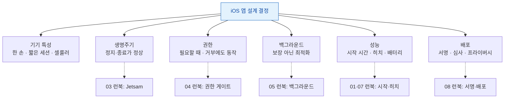

## iOS Playbook

iPhone 을 위한 앱을 만들 때 알아야 할 실전 가이드를 쉽게 모았다. 용어는 [apple-glossary](../../00_foundations/apple-glossary.md).



각 영역에서 실제 문제가 생기면 [진단 런북](../../00_foundations/apple-foundations.md)으로 간다.

### 💡 왜 이것을 알아야 하나요?

iOS 앱은 Android와 달리 **기기 특성이 통일되어 있고, 백그라운드 정책과 권한 체계가 매우 엄격**합니다. 사소한 배경 작업 오버헤드나 권한 요청 타이밍 미스는 App Store 심사 탈락이나 대량 클레임으로 이어질 수 있으므로, 정책을 정확히 이해하고 초기 설계에 반영해야 합니다.

---

### 기기 특성 및 설계 원칙

#### 터치/제스처, 카메라, 센서가 핵심. 한 손 사용, 짧은 세션 고려

**왜 필요한가**: iPhone은 모바일 중심의 기기이므로, UI는 한 손 도달 범위를 우선하고, 세션은 짧게 (평균 5~10분) 설계해야 합니다.

- 터치, 제스처(스와이프, 핀치), 카메라, 마이크, 센서(가속도, 자이로 등)가 핵심 입력.
- 셀룰러 환경: 데이터 제약, 배터리 소비, [ATS](../../00_foundations/apple-glossary.md)(앱 보안) / 백그라운드 정책 엄격.
- 화면 크기는 다양하지만(iPhone SE 4.7" ~ iPhone 16 Pro Max 6.7") 모두 가로 세로비 일관됨.

```swift
import UIKit

// Safe Area & 다양한 화면 크기 대응
class AdaptiveViewController: UIViewController {
    override func viewDidLoad() {
        super.viewDidLoad()
        
        // Safe Area 고려 (Notch, Dynamic Island)
        let safeArea = view.safeAreaLayoutGuide
        let mainContent = UIView()
        mainContent.backgroundColor = .systemBlue
        view.addSubview(mainContent)
        
        NSLayoutConstraint.activate([
            mainContent.topAnchor.constraint(equalTo: safeArea.topAnchor),
            mainContent.leadingAnchor.constraint(equalTo: safeArea.leadingAnchor),
            mainContent.trailingAnchor.constraint(equalTo: safeArea.trailingAnchor),
            mainContent.bottomAnchor.constraint(equalTo: safeArea.bottomAnchor)
        ])
    }
}

// 한 손 사용성: 하단 영역에 주요 컨트롤 배치
class OneHandFriendlyLayout: UIView {
    override init(frame: CGRect) {
        super.init(frame: frame)
        
        let screenHeight = UIScreen.main.bounds.height
        let reachableThreshold = screenHeight * 0.7 // 상단 70%만 한 손 도달 가능
        
        let actionButton = UIButton(type: .system)
        actionButton.setTitle("주요 액션", for: .normal)
        // 버튼을 하단 영역에 배치하되, 
        // 신체 무능력 사용자나 한 손 사용자도 도달 가능하도록 설계
        
        addSubview(actionButton)
    }
    
    required init?(coder: NSCoder) {
        fatalError("init(coder:) has not been implemented")
    }
}
```

---

### 앱 구조 및 라이프사이클

#### SwiftUI 또는 UIKit, Scene 기반 멀티 윈도우, 딥링크/유니버설 링크 지원

**왜 필요한가**: iOS는 Scene을 통해 멀티 윈도우를 지원하고, 외부 앱이나 웹 링크로부터 진입하는 경로가 많아서 딥링크와 유니버설 링크를 필수적으로 구현해야 합니다.

- **SwiftUI** 또는 **UIKit** 선택. 최근 프로젝트는 SwiftUI 권장.
- **Scene** 기반 멀티 윈도우: 대부분 하나의 Scene이지만, iPad/macOS에서는 여러 윈도우 가능.
- **딥링크/유니버설 링크**로 외부(다른 앱, 웹 브라우저)에서 진입.
- **Extension**(위젯, 공유, Live Activity, Siri Intent)로 앱 기능 확장.

```swift
import SwiftUI

// SwiftUI: Scene 기반 앱 구조
@main
struct MyApp: App {
    var body: some Scene {
        WindowGroup {
            ContentView()
                .onOpenURL { url in
                    // 딥링크 처리 (예: myapp://product/123)
                    handleDeepLink(url)
                }
        }
    }
    
    func handleDeepLink(_ url: URL) {
        if let components = URLComponents(url: url, resolvingAgainstBaseURL: true),
           let scheme = components.scheme,
           scheme == "myapp" {
            // URL 파싱 후 라우팅 로직
            let path = components.path
            print("Navigating to: \(path)")
        }
    }
}

// Universal Link 처리 (apple-app-site-association 필요)
import UIKit

class AppDelegate: UIResponder, UIApplicationDelegate {
    func application(
        _ application: UIApplication,
        continue userActivity: NSUserActivity,
        restorationHandler: @escaping ([UIUserActivityRestoring]?) -> Void
    ) -> Bool {
        if userActivity.activityType == NSUserActivityTypeBrowsingWeb,
           let url = userActivity.webpageURL {
            // 웹 링크 (https://example.com/product/123) 처리
            handleUniversalLink(url)
            return true
        }
        return false
    }
    
    func handleUniversalLink(_ url: URL) {
        // URL 경로 파싱 및 앱 네비게이션
    }
}
```

---

### 권한 설계 (TCC: Transparency, Consent, Control)

#### 카메라, 마이크, 사진, 위치, 알림, 블루투스 등 "필요할 때" 요청

**왜 필요한가**: iOS는 모든 민감한 권한(카메라, 위치, 연락처 등)에 대해 사용자 동의를 명시적으로 요청해야 하며, 거부 시 대체 흐름을 제공해야 합니다. iOS 17+에서는 앱이 거부된 권한에 자주 재요청하면 심사 탈락 대상이 됩니다.

- **TCC 권한**: 카메라, 마이크, 사진, 위치, 알림, Bluetooth, 캘린더, 연락처, 헬스키트 등.
- **적시 요청**: 권한이 필요한 시점(예: "사진 찍기" 버튼 탭)에 요청.
- **NS*UsageDescription**: Info.plist에 명확한 설명 문구 작성.
- **거부 시 대체 흐름**: 권한 거부 후 설정으로 이동하는 링크 제공.

```swift
import AVFoundation
import Photos

class PermissionManager {
    // 카메라 권한 요청
    func requestCameraPermission(completion: @escaping (Bool) -> Void) {
        let status = AVCaptureDevice.authorizationStatus(for: .video)
        
        switch status {
        case .authorized:
            completion(true)
        case .denied, .restricted:
            // 권한 거부됨: 설정 이동 링크 제공
            showSettingsAlert()
            completion(false)
        case .notDetermined:
            // 권한 요청
            AVCaptureDevice.requestAccess(for: .video) { granted in
                DispatchQueue.main.async {
                    completion(granted)
                }
            }
        @unknown default:
            completion(false)
        }
    }
    
    // 사진 접근 권한 요청 (iOS 14+ Photo Picker 권장)
    func requestPhotoPermission() {
        let status = PHPhotoLibrary.authorizationStatus(for: .readWrite)
        
        switch status {
        case .authorized, .limited:
            // 권한 있음
            break
        case .denied, .restricted:
            showSettingsAlert()
        case .notDetermined:
            PHPhotoLibrary.requestAuthorization(for: .readWrite) { status in
                // 처리
            }
        @unknown default:
            break
        }
    }
    
    func showSettingsAlert() {
        let alert = UIAlertController(
            title: "권한 필요",
            message: "이 기능을 사용하려면 설정에서 권한을 허용해주세요.",
            preferredStyle: .alert
        )
        alert.addAction(UIAlertAction(title: "설정으로 이동", style: .default) { _ in
            if let settingsURL = URL(string: UIApplication.openSettingsURLString) {
                UIApplication.shared.open(settingsURL)
            }
        })
        alert.addAction(UIAlertAction(title: "취소", style: .cancel))
        // present alert
    }
}

// Info.plist 필수 설정 예시 (수동 또는 Xcode)
/*
<key>NSCameraUsageDescription</key>
<string>사진 촬영 시 카메라 접근이 필요합니다.</string>
<key>NSMicrophoneUsageDescription</key>
<string>영상 통화 시 마이크 접근이 필요합니다.</string>
<key>NSLocationWhenInUseUsageDescription</key>
<string>위치 기반 서비스를 제공하기 위해 현재 위치가 필요합니다.</string>
*/
```

---

### 백그라운드 작업 및 라이프사이클

#### 허용된 백그라운드 모드만 사용. Background App Refresh/Push로 짧게 깨우기. Jetsam 대비

**왜 필요한가**: iOS는 배터리와 성능을 우선하기 때문에, 백그라운드에서 무제한 작업을 할 수 없습니다. 허용된 모드(오디오 재생, 위치, VoIP 등) 이외의 작업은 Jetsam(메모리 압박 상황에서 OS가 강제 종료)의 대상이 됩니다.

- **허용된 백그라운드 모드**: 오디오/음악 재생, GPS 위치, VoIP 푸시, Bluetooth BLE, 파일 다운로드, Picture-in-Picture 등.
- **Background App Refresh**: 시스템이 주기적으로 앱을 깨워 짧은 작업 수행 (30초 제한).
- **Push (APNs)**: 푸시 알림으로 깨우기. VoIP 푸시는 권한/심사 엄격.
- **Jetsam**: 메모리 부족 시 시스템이 앱 강제 종료. 장시간 실행 가정 금지.

```swift
import BackgroundTasks
import UserNotifications

class BackgroundTaskManager {
    // Background App Refresh 작업 등록
    func registerBackgroundTasks() {
        // 데이터 동기화 작업 (최소 15분 간격 권장)
        BGTaskScheduler.shared.register(forTaskWithIdentifier: "com.example.dbsync", using: nil) { task in
            self.handleDatabaseSync(task)
        }
        
        // 백업 작업
        BGTaskScheduler.shared.register(forTaskWithIdentifier: "com.example.backup", using: nil) { task in
            self.handleBackup(task)
        }
    }
    
    func scheduleBackgroundSync() {
        let request = BGAppRefreshTaskRequest(identifier: "com.example.dbsync")
        request.earliestBeginDate = Date(timeIntervalSinceNow: 15 * 60) // 15분 후
        
        do {
            try BGTaskScheduler.shared.submit(request)
            print("백그라운드 작업 예약됨")
        } catch {
            print("백그라운드 작업 예약 실패: \(error)")
        }
    }
    
    func handleDatabaseSync(_ task: BGAppRefreshTask) {
        // 30초 이내에 완료해야 함
        let operation = SyncOperation()
        operation.completionBlock = {
            task.setTaskCompleted(success: true)
        }
        
        // 작업 큐에 추가
        OperationQueue.main.addOperation(operation)
        
        // 타임아웃 처리
        task.expirationHandler = {
            operation.cancel()
        }
    }
    
    func handleBackup(_ task: BGProcessingTask) {
        // Background Processing: 앱이 백그라운드에 있을 때 몇 분간 실행 가능
        let backup = BackupTask()
        backup.completionBlock = {
            task.setTaskCompleted(success: true)
        }
        OperationQueue.main.addOperation(backup)
        
        task.expirationHandler = {
            backup.cancel()
        }
    }
}

// VoIP Push 처리 (CallKit과 함께)
import PushKit
import CallKit

class VoIPPushHandler: NSObject, PKPushRegistryDelegate {
    let pushRegistry = PKPushRegistry(queue: .main)
    
    override init() {
        super.init()
        pushRegistry.delegate = self
        pushRegistry.desiredPushTypes = [.voIP]
    }
    
    func pushRegistry(_ registry: PKPushRegistry, didUpdate credentials: PKPushCredentials, for type: PKPushType) {
        let token = credentials.token.map { String(format: "%02x", $0) }.joined()
        print("VoIP 토큰: \(token)")
        // 서버에 토큰 저장
    }
    
    func pushRegistry(_ registry: PKPushRegistry, didReceiveIncomingPushWith payload: PKPushPayload, for type: PKPushType, completion: @escaping () -> Void) {
        // VoIP 푸시 수신: 30초 이내에 CallKit 통화 UI 표시
        let callUpdate = CXCallUpdate()
        callUpdate.remoteHandle = CXHandle(type: .generic, value: "발신자명")
        
        let callController = CXCallController()
        let action = CXStartCallAction(call: UUID(), handle: CXHandle(type: .generic, value: ""))
        
        let transaction = CXTransaction(action: action)
        callController.request(transaction) { error in
            completion()
        }
    }
}
```

---

### 네트워크 및 데이터 전송

#### Low Data/Low Power 모드 대응. URLSession Background 사용. APNs 토큰 관리

**왜 필요한가**: iOS 사용자는 데이터 요금제 제약, 배터리 절약, 네트워크 불안정성을 자주 경험하므로, 이를 감지하고 대응하는 로직이 필수입니다.

- **Low Data Mode**: iOS 13+ 사용자가 활성화하면 동영상 품질 낮추기, 자동 다운로드 중지 등.
- **Low Power Mode**: 배터리 15% 이하 시 백그라운드 작업 제한.
- **URLSession Background**: 앱 종료 후에도 업/다운로드 계속.
- **APNs 토큰**: 푸시 알림용. 환경(Development/Production) 구분, 토큰 변경 감지.

```swift
import Network
import URLKit

class NetworkManager {
    let urlSession = URLSession(configuration: .default)
    
    // Low Data Mode 감지
    func monitorLowDataMode() {
        if #available(iOS 13.0, *) {
            let path = NWPathMonitor()
            path.pathUpdateHandler = { updatedPath in
                let isExpensive = updatedPath.isExpensive // 셀룰러, 핫스팟 등 요금 대상
                let isConstrained = updatedPath.isConstrained // Low Data Mode
                
                DispatchQueue.main.async {
                    if isConstrained {
                        print("Low Data Mode 활성화됨: 동영상 품질 낮추기")
                        self.videoQuality = .low
                    } else {
                        self.videoQuality = .high
                    }
                }
            }
            path.start(queue: DispatchQueue.global())
        }
    }
    
    // Low Power Mode 감지
    func monitorBatteryLevel() {
        UIDevice.current.isBatteryMonitoringEnabled = true
        
        NotificationCenter.default.addObserver(
            forName: UIDevice.batteryStateDidChangeNotification,
            object: nil,
            queue: .main
        ) { _ in
            let state = UIDevice.current.batteryState
            if state == .unplugged && UIDevice.current.batteryLevel < 0.15 {
                print("Low Power Mode 감지됨: 백그라운드 동기화 중지")
                self.pauseBackgroundSync()
            }
        }
    }
    
    // URLSession Background 다운로드
    func downloadLargeFile(url: URL) {
        let config = URLSessionConfiguration.background(withIdentifier: "com.example.download")
        let session = URLSession(configuration: config, delegate: self, delegateQueue: nil)
        
        var request = URLRequest(url: url)
        request.timeoutInterval = 60
        
        let task = session.downloadTask(with: request)
        task.resume()
    }
    
    var videoQuality: VideoQuality = .high
    func pauseBackgroundSync() {
        // 백그라운드 동기화 중지
    }
}

enum VideoQuality {
    case low, high
}

// URLSessionDelegate: 다운로드 완료 처리
extension NetworkManager: URLSessionDownloadDelegate {
    func urlSession(
        _ session: URLSession,
        downloadTask: URLSessionDownloadTask,
        didFinishDownloadingTo location: URL
    ) {
        // 다운로드 완료 처리
        let documentsPath = FileManager.default.urls(for: .documentDirectory, in: .userDomainMask)[0]
        let destinationURL = documentsPath.appendingPathComponent("downloaded_file")
        
        try? FileManager.default.moveItem(at: location, to: destinationURL)
    }
}

// APNs 토큰 관리
import UserNotifications

class PushNotificationManager {
    func requestPushAuthorization() {
        UNUserNotificationCenter.current().requestAuthorization(options: [.alert, .sound, .badge]) { granted, error in
            DispatchQueue.main.async {
                if granted {
                    UIApplication.shared.registerForRemoteNotifications()
                }
            }
        }
    }
    
    // AppDelegate에서 호출
    func application(_ application: UIApplication, didRegisterForRemoteNotificationsWithDeviceToken deviceToken: Data) {
        let token = deviceToken.map { String(format: "%02x", $0) }.joined()
        print("APNs 토큰: \(token)")
        // 서버에 토큰 전송 및 저장 (Development/Production 환경 구분)
    }
}
```

---

### UI/UX 및 접근성

#### Safe Area, Notch, Dynamic Island, Dynamic Type, 다크 모드, RTL 지원

**왜 필요한가**: iOS는 기기마다 안전 영역(Safe Area)이 다르고(Notch, Dynamic Island, USB-C 등), 사용자는 동적 텍스트 크기 조정, 다크 모드, RTL(오른쪽-왼쪽) 언어를 활성화할 수 있으므로, 이를 모두 대응해야 합니다.

- **Safe Area/Notch/Dynamic Island**: 화면 상단/하단 안전 영역 확보.
- **Dynamic Type**: 사용자가 설정한 텍스트 크기에 맞추기 (최소 xSmall ~ 최대 xxxLarge).
- **다크 모드**: `@Environment(\.colorScheme)` 감지, 커스텀 색상에 다크 모드 지원.
- **RTL(오른쪽-왼쪽)**: 아랍어, 히브리어 등. 마진, 정렬, 이미지 반전 처리.

```swift
import SwiftUI

// Safe Area 및 Dynamic Type 대응
struct AdaptiveView: View {
    @Environment(\.colorScheme) var colorScheme
    @Environment(\.sizeCategory) var sizeCategory
    
    var body: some View {
        VStack(spacing: 16) {
            // 제목: Dynamic Type으로 자동 크기 조정
            Text("메시지")
                .font(.system(.title, design: .default))
                .dynamicTypeSize(...DynamicTypeSize.xxxLarge)
            
            // 본문: 텍스트 크기 조정
            Text("이 문장은 사용자가 설정한 텍스트 크기에 맞춥니다.")
                .font(.body)
                .lineLimit(nil) // 줄바꿈 제한 없음
            
            // 다크 모드 대응
            ZStack {
                // 배경색
                RoundedRectangle(cornerRadius: 12)
                    .fill(colorScheme == .dark ? Color.black : Color.white)
                
                // 텍스트
                Text("다크 모드에서 자동으로 색상 변경")
                    .foregroundColor(colorScheme == .dark ? .white : .black)
            }
            
            Spacer()
        }
        .padding()
        .ignoresSafeArea(.keyboard) // 키보드 나타날 때 Safe Area 무시
    }
}

// RTL 대응
struct RTLView: View {
    var body: some View {
        HStack(spacing: 8) {
            // 기호나 아이콘: RTL에서 반전 방지
            Image(systemName: "checkmark.circle.fill")
                .flipsForRightToLeftLayoutDirection(false)
            
            Text("체크 완료")
        }
        .environment(\.layoutDirection, .rightToLeft) // RTL 강제 (테스트용)
    }
}

// 제스처: 시스템 네비게이션과 충돌 방지
struct GestureView: View {
    @State var text = ""
    
    var body: some View {
        VStack {
            Text("스와이프 백: 시스템 제스처이므로 충돌 주의")
            
            // 좌우 스와이프 제스처 커스텀 (화면 가장자리 근처 피하기)
            VStack {
                Text("카드를 왼쪽으로 스와이프하면 삭제됨")
            }
            .contentShape(Rectangle())
            .gesture(
                DragGesture()
                    .onEnded { value in
                        if value.translation.width < -50 {
                            print("왼쪽으로 스와이프됨")
                        }
                    }
            )
        }
        .padding()
    }
}

// Haptics: 터치감 제공
import UIKit

class HapticsManager {
    static func impact(_ style: UIImpactFeedbackGenerator.FeedbackStyle) {
        let generator = UIImpactFeedbackGenerator(style: style)
        generator.impactOccurred()
    }
    
    static func notification(_ type: UINotificationFeedbackGenerator.FeedbackType) {
        let generator = UINotificationFeedbackGenerator()
        generator.notificationOccurred(type)
    }
}

// 사용 예
struct HapticButton: View {
    var body: some View {
        Button(action: {
            HapticsManager.impact(.medium)
        }) {
            Text("탭하면 진동 피드백")
        }
    }
}
```

---

### 미디어/카메라 및 오디오

#### AVCapture로 사진/영상/QR 스캔. PHPickerViewController로 사진 선택. AVAudioSession 카테고리 설정

**왜 필요한가**: 카메라와 오디오는 하드웨어 자원이므로, 기기별 포맷 지원 확인과 오디오 세션 카테고리(통화/미디어/게임)를 명확히 설정해야 합니다.

- **AVCaptureSession**: 사진, 영상, Live Photo, QR 코드 스캔.
- **PHPickerViewController**: iOS 14+ 사진 앨범 접근 (권한 제한적).
- **AVAudioSession**: 카테고리(Playback, Record, PlayAndRecord 등)와 모드(Default, Measurement, VoiceChat 등) 설정.

```swift
import AVFoundation
import PhotosUI

// AVCapture: 카메라로 사진 촬영
class CameraViewController: UIViewController, AVCapturePhotoCaptureDelegate {
    var captureSession: AVCaptureSession!
    var photoOutput: AVCapturePhotoOutput!
    
    override func viewDidLoad() {
        super.viewDidLoad()
        setupCamera()
    }
    
    func setupCamera() {
        captureSession = AVCaptureSession()
        captureSession.sessionPreset = .photo
        
        guard let backCamera = AVCaptureDevice.default(.builtInWideAngleCamera, for: .video, position: .back) else {
            print("후면 카메라 없음")
            return
        }
        
        do {
            let input = try AVCaptureDeviceInput(device: backCamera)
            photoOutput = AVCapturePhotoOutput()
            
            if captureSession.canAddInput(input) && captureSession.canAddOutput(photoOutput) {
                captureSession.addInput(input)
                captureSession.addOutput(photoOutput)
                
                // 카메라 설정 변경 (포커스, 노출 등)
                try backCamera.lockForConfiguration()
                backCamera.focusMode = .continuousAutoFocus
                backCamera.unlockForConfiguration()
                
                captureSession.startRunning()
            }
        } catch {
            print("카메라 설정 실패: \(error)")
        }
    }
    
    func capturePhoto() {
        let settings = AVCapturePhotoSettings()
        photoOutput.capturePhoto(with: settings, delegate: self)
    }
    
    func photoOutput(_ output: AVCapturePhotoOutput, didFinishProcessingPhoto photo: AVCapturePhoto, error: Error?) {
        guard let imageData = photo.fileDataRepresentation() else { return }
        if let image = UIImage(data: imageData) {
            // 촬영한 이미지 처리
        }
    }
}

// PHPickerViewController: 사진 앨범에서 선택 (iOS 14+, 권한 제한적)
class PhotoPickerViewController: UIViewController, PHPickerViewControllerDelegate {
    func openPhotoPicker() {
        var config = PHPickerConfiguration(photoLibrary: .shared())
        config.selectionLimit = 5 // 최대 5개 선택
        config.preferredAssetRepresentationMode = .current // HEIF 또는 JPEG
        config.filter = .images // 사진만
        
        let picker = PHPickerViewController(configuration: config)
        picker.delegate = self
        present(picker, animated: true)
    }
    
    func picker(_ picker: PHPickerViewController, didFinishPicking results: [PHPickerResult]) {
        dismiss(animated: true)
        
        for result in results {
            result.itemProvider.loadFileRepresentation(forTypeIdentifier: UTType.image.identifier) { url, error in
                if let url = url, let data = try? Data(contentsOf: url) {
                    if let image = UIImage(data: data) {
                        // 선택된 이미지 처리
                    }
                }
            }
        }
    }
}

// AVAudioSession: 오디오 재생/녹음 모드 설정
class AudioSessionManager {
    func setupAudioSession(for mode: AudioSessionMode) {
        let session = AVAudioSession.sharedInstance()
        
        try? session.setActive(false)
        
        switch mode {
        case .playback:
            // 음악 재생: 스피커로 출력, 물리 음소거 버튼 무시
            try? session.setCategory(.playback, options: .duckOthers)
        case .record:
            // 음성 녹음: 마이크 입력
            try? session.setCategory(.record)
        case .voiceChat:
            // VoIP 통화: 양방향 통신, 에코 제거
            try? session.setCategory(.playAndRecord, options: [.duckOthers, .defaultToSpeaker])
        case .game:
            // 게임: 음악 + 음성 효과
            try? session.setCategory(.playback, options: .duckOthers)
        }
        
        try? session.setActive(true)
    }
}

enum AudioSessionMode {
    case playback, record, voiceChat, game
}
```

---

### 위치 및 지도

#### 정밀/대략 위치 권한 구분. 백그라운드 위치 별도 권한. 지역 모니터링은 배터리 고려

**왜 필요한가**: 위치 서비스는 배터리를 많이 소모하고, iOS 12+부터 정밀 위치(GPS)와 대략적 위치(셀 기반) 권한을 구분해서 요청해야 합니다.

- **정밀(Precise) vs 대략(Approximate)**: GPS (정밀, 높은 배터리)와 셀 기반 (대략, 낮은 배터리).
- **항상/사용 시**: "Always" 백그라운드 위치는 별도 권한, 심사 엄격.
- **지역 모니터링/비콘/방문 추적**: 배터리 소모, 기기 지원 확인.

```swift
import CoreLocation
import MapKit

class LocationManager: NSObject, CLLocationManagerDelegate {
    let locationManager = CLLocationManager()
    
    override init() {
        super.init()
        locationManager.delegate = self
    }
    
    // 현재 위치 (사용 시에만)
    func requestWhenInUseLocation() {
        locationManager.requestWhenInUseAuthorization()
    }
    
    // 배경 위치 (항상)
    func requestAlwaysAndWhenInUseLocation() {
        locationManager.requestAlwaysAndWhenInUseAuthorization()
    }
    
    func startLocationUpdates() {
        let status = CLLocationManager.authorizationStatus()
        
        if status == .authorizedWhenInUse || status == .authorizedAlways {
            locationManager.startUpdatingLocation()
        }
    }
    
    func locationManager(_ manager: CLLocationManager, didUpdateLocations locations: [CLLocation]) {
        if let location = locations.last {
            let lat = location.coordinate.latitude
            let lon = location.coordinate.longitude
            let accuracy = location.horizontalAccuracy
            
            print("위치: (\(lat), \(lon)), 정확도: \(accuracy)m")
        }
    }
    
    // 지역 모니터링 (지오펜싱)
    func startMonitoringRegion(center: CLLocationCoordinate2D, radius: CLLocationDistance) {
        let region = CLCircularRegion(center: center, radius: radius, identifier: "zone_1")
        region.notifyOnEntry = true
        region.notifyOnExit = true
        
        locationManager.startMonitoring(for: region)
    }
    
    func locationManager(_ manager: CLLocationManager, didEnterRegion region: CLRegion) {
        if region is CLCircularRegion {
            print("지역 진입: \(region.identifier)")
            // 백그라운드에서 푸시 알림 또는 Local Notification 발송
        }
    }
    
    // 비콘 모니터링 (iBeacon)
    func startMonitoringBeacon(uuid: UUID, identifier: String) {
        let beaconRegion = CLBeaconRegion(uuid: uuid, identifier: identifier)
        locationManager.startMonitoring(for: beaconRegion)
    }
}

// 지도에 현재 위치와 경로 표시
struct MapViewWithLocation: View {
    @State var position: MapCameraPosition = .automatic
    @State var userLocation: CLLocationCoordinate2D?
    
    var body: some View {
        Map(position: $position) {
            if let location = userLocation {
                Annotation("내 위치", coordinate: location) {
                    Image(systemName: "location.circle.fill")
                        .foregroundColor(.blue)
                }
            }
        }
        .onAppear {
            // 현재 위치 요청
            let manager = LocationManager()
            manager.requestWhenInUseLocation()
        }
    }
}
```

---

### 로컬 스토리지 및 데이터 관리

#### 앱 컨테이너 크기 관리. 캐시 vs 사용자 데이터 구분. iCloud 백업 정책. Core Data/SQLite 동기화

**왜 필요한가**: iOS는 디바이스 저장 공간 한계가 있고, iCloud 백업 용량 제한이 있으므로, 캐시와 사용자 데이터를 명확히 구분하고 백업 정책을 설정해야 합니다.

- **앱 컨테이너**: Documents (백업 대상), Caches (캐시, 백업 제외), Library (설정/데이터), tmp (임시).
- **iCloud 백업**: `isExcludedFromBackup`로 용량 관리.
- **Core Data/SQLite**: 동기화 전략 (CKSyncEngine, WCSession 등).

```swift
import Foundation
import CoreData
import CloudKit

class StorageManager {
    static let shared = StorageManager()
    
    let fileManager = FileManager.default
    
    // Documents 디렉토리: 백업 대상
    var documentsDirectory: URL {
        fileManager.urls(for: .documentDirectory, in: .userDomainMask)[0]
    }
    
    // Caches 디렉토리: 백업 제외
    var cachesDirectory: URL {
        fileManager.urls(for: .cachesDirectory, in: .userDomainMask)[0]
    }
    
    // Library 디렉토리: 설정, 데이터베이스 등
    var libraryDirectory: URL {
        fileManager.urls(for: .libraryDirectory, in: .userDomainMask)[0]
    }
    
    // 캐시 파일 저장 (백업 제외)
    func saveCacheFile(_ data: Data, filename: String) {
        let url = cachesDirectory.appendingPathComponent(filename)
        try? data.write(to: url)
    }
    
    // 사용자 데이터 저장 (백업 대상)
    func saveUserData(_ data: Data, filename: String) {
        let url = documentsDirectory.appendingPathComponent(filename)
        try? data.write(to: url)
    }
    
    // iCloud 백업 제외 설정
    func excludeFromBackup(url: URL) {
        var urlWithoutBackup = url
        var resourceValues = URLResourceValues()
        resourceValues.isExcludedFromBackup = true
        
        try? urlWithoutBackup.setResourceValues(resourceValues)
    }
}

// Core Data: 로컬 DB
class CoreDataStack {
    static let shared = CoreDataStack()
    
    lazy var persistentContainer: NSPersistentContainer = {
        let container = NSPersistentContainer(name: "MyAppModel")
        container.loadPersistentStores { _, error in
            if let error = error {
                fatalError("Core Data 로딩 실패: \(error)")
            }
        }
        return container
    }()
    
    var context: NSManagedObjectContext {
        persistentContainer.viewContext
    }
    
    func save() {
        if context.hasChanges {
            try? context.save()
        }
    }
}

// CloudKit 동기화 (iOS 15+)
class CloudKitSync {
    static let shared = CloudKitSync()
    
    let database = CKContainer.default().privateCloudDatabase
    
    func syncData() async {
        do {
            // CloudKit 동기화 로직
            let query = CKQuery(recordType: "Item", predicate: NSPredicate(value: true))
            let records = try await database.records(matching: query)
            
            for record in records.0 {
                print("동기화된 레코드: \(record.recordID)")
            }
        } catch {
            print("CloudKit 동기화 실패: \(error)")
        }
    }
}
```

---

### 성능 최적화 및 모니터링

#### Instruments로 스타트업, 프레임, 메모리, 에너지 점검. Touch Latency/Jank 개선. 크래시/성능 리포트 수집

**왜 필요한가**: iOS는 사용자 경험에 민감하므로, 앱 시작 시간 (2초 이내 권장), 스크롤 프레임 (60fps 이상), 메모리 누수를 지속적으로 모니터링하고 개선해야 합니다.

- **Instruments**: Time Profiler, Allocations, Core Animation, Energy Impact 측정.
- **Touch Latency**: 터치 반응 시간 (100ms 이내 권장).
- **Jank**: 프레임 드롭 (60fps 유지).
- **크래시 리포트**: Xcode Crashes organizer 또는 Firebase Crashlytics.

```swift
import Foundation
import os.log

class PerformanceMonitor {
    static let shared = PerformanceMonitor()
    
    let logger = Logger(subsystem: "com.example.app", category: "performance")
    
    // 앱 시작 시간 측정
    func measureAppStartup() {
        let startTime = DispatchTime.now()
        
        DispatchQueue.main.asyncAfter(deadline: .now() + 0.5) {
            let endTime = DispatchTime.now()
            let elapsed = Double(endTime.uptimeNanoseconds - startTime.uptimeNanoseconds) / 1e9
            self.logger.info("앱 시작 시간: \(elapsed)초")
        }
    }
    
    // 메모리 사용량 모니터링
    func monitorMemory() {
        var info = task_vm_info_data_t()
        var count = mach_msg_type_number_t(MemoryLayout<task_vm_info>.size)/4
        
        let kerr = task_info(mach_task_self_,
                             task_flavor_t(TASK_VM_INFO),
                             &info,
                             &count)
        
        guard kerr == KERN_SUCCESS else { return }
        
        let usedMemory = Double(info.phys_footprint) / 1024 / 1024 // MB
        logger.info("현재 메모리: \(usedMemory)MB")
    }
    
    // 프레임 레이트 모니터링
    func monitorFrameRate() {
        let displayLink = CADisplayLink(
            target: self,
            selector: #selector(updateFrame)
        )
        displayLink.add(to: .main, forMode: .common)
    }
    
    @objc func updateFrame() {
        // 프레임마다 호출됨 (60fps 기기에서 1/60초마다)
    }
}

// Firebase Crashlytics: 크래시 리포트 수집
import FirebaseCrashlytics

func setupCrashlytics() {
    Crashlytics.crashlytics().setCrashlyticsCollectionEnabled(true)
}

func logCustomError(message: String) {
    Crashlytics.crashlytics().record(error: NSError(domain: "Custom", code: -1, userInfo: [
        NSLocalizedDescriptionKey: message
    ]))
}

// SwiftUI Performance: Preview 최적화
#if DEBUG
struct ContentView_Previews: PreviewProvider {
    static var previews: some View {
        Group {
            ContentView()
                .preferredColorScheme(.light)
                .previewDisplayName("Light Mode")
            
            ContentView()
                .preferredColorScheme(.dark)
                .previewDisplayName("Dark Mode")
        }
    }
}
#endif
```

---

### 배포 및 App Store 정책

#### App Store 심사 가이드 준수. Privacy Nutrition Label, ATT(앱 추적 투명성) 준비. TestFlight 베타 테스트

**왜 필요한가**: iOS는 App Store이 배포의 유일한 경로이고, Apple의 심사 기준이 엄격하므로, 정책을 미리 숙지하고 준비해야 합니다.

- **심사 가이드**: 사설 API 금지, 권한 남용 금지, IAP(인앱 구매) 정책 준수.
- **Privacy Nutrition Label**: 수집하는 개인정보 종류 선언 (필수).
- **ATT(App Tracking Transparency)**: iOS 14.5+ 사용자 추적 권한 요청.
- **TestFlight**: 베타 테스트 관리, 최대 10,000명 테스터.

```swift
import AppTrackingTransparency
import AdSupport

class PrivacyManager {
    // ATT: 사용자 추적 권한 요청 (iOS 14.5+)
    func requestTrackingPermission() {
        if #available(iOS 14.5, *) {
            ATTrackingManager.requestTrackingAuthorization { status in
                switch status {
                case .authorized:
                    // 사용자 추적 승인됨
                    let idfa = ASIdentifierManager.shared().advertisingIdentifier.uuidString
                    print("IDFA: \(idfa)")
                case .denied:
                    print("사용자 추적 거부됨")
                case .notDetermined:
                    print("아직 미정")
                case .restricted:
                    print("제한됨")
                @unknown default:
                    break
                }
            }
        }
    }
    
    // Privacy Nutrition Label 정보 앱에 포함
    // (Xcode > App > Privacy Manifest에서 설정)
    /*
     - 수집하는 데이터: 위치, 연락처, 캘린더, 사진, 카메라, 마이크 등
     - 데이터 사용 목적: 광고, 분석, 개인화 등
     - 제3자 공유 여부
     */
}

// In-App Purchase 정책 준수
import StoreKit

class IAPManager {
    func validateReceipt() {
        // App Store Server API로 영수증 검증
        // 구독 갱신 상태 확인
    }
}

// TestFlight 배포 (Xcode)
/*
1. Xcode > Product > Archive
2. Organizer > Distribute App > TestFlight
3. 베타 테스터 초대 (최대 10,000명)
4. 빌드 테스트 및 피드백 수집
5. 심사 준비 완료 후 App Store 제출
*/
```

---

### 체크리스트 (배포 전 확인)

```swift
// 배포 전 확인사항
class DeploymentChecklist {
    static func verify() {
        let checks = [
            ("권한 요청 타이밍이 적절한가?", verifyPermissionTiming()),
            ("백그라운드 작업이 정책 범위 안에 있는가?", verifyBackgroundTasks()),
            ("네트워크/저장/배터리/성능을 측정하고 최적화했는가?", verifyPerformance()),
            ("접근성/다국어/다크 모드 대응이 되었는가?", verifyAccessibility()),
            ("크래시/성능 리포트를 수집하고 있는가?", verifyCrashReporting()),
            ("Privacy Nutrition Label을 설정했는가?", verifyPrivacyLabel()),
            ("ATT 권한 요청이 준비되었는가?", verifyATT()),
            ("심사 가이드를 검토했는가?", verifyAppStoreGuidelines()),
        ]
        
        for (title, passed) in checks {
            let status = passed ? "✅" : "❌"
            print("\(status) \(title)")
        }
    }
    
    static func verifyPermissionTiming() -> Bool { true }
    static func verifyBackgroundTasks() -> Bool { true }
    static func verifyPerformance() -> Bool { true }
    static func verifyAccessibility() -> Bool { true }
    static func verifyCrashReporting() -> Bool { true }
    static func verifyPrivacyLabel() -> Bool { true }
    static func verifyATT() -> Bool { true }
    static func verifyAppStoreGuidelines() -> Bool { true }
}
```

---

### 관련 링크

[apple-foundations](../../00_foundations/apple-foundations.md), [apple-app-lifecycle-and-ui](../../02_ui_frameworks/apple-app-lifecycle-and-ui.md), [apple-sandbox-and-security](../../05_security_privacy/apple-sandbox-and-security.md), [apple-performance-and-debug](../../06_testing_performance/apple-performance-and-debug.md), [apple-distribution-and-policies](../../08_packaging_deployment/apple-distribution-and-policies.md).

공식 문서: [iOS & iPadOS Release Notes](https://developer.apple.com/documentation/ios-ipados-release-notes)
