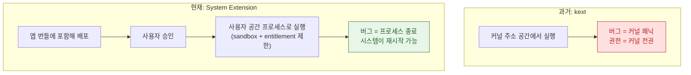

## macOS System Extensions & DriverKit

macOS 에서 시스템 확장/드라이버를 만들 때 알아야 할 내용을 쉽게 정리했다. 용어는 [apple-glossary](../../00_foundations/apple-glossary.md).



### 💡 왜 이것을 알아야 하나요?

시스템 확장과 DriverKit은 **커널 접근이 필요한 저수준 기능**(네트워크 필터, 엔드포인트 보안, USB 드라이버 등)을 구현할 때 필수입니다. 잘못된 구현이나 권한 설정은 시스템 불안정, 보안 위험, 사용자 신뢰 상실로 이어집니다.

---

### 기존 커널 확장(kext) vs 시스템 확장

#### kext는 더 이상 권장되지 않음. DriverKit/System Extensions로 마이그레이션

**왜 필요한가**: 커널 확장은 커널 메모리에 직접 접근하므로 시스템 안정성과 보안 위험이 크다. Apple은 사용자 공간 API로 옮기는 것을 강제하고 있습니다.

- **Kernel Extension (kext)**: 커널 메모리에 직접 로드. 시스템 불안정, 보안 위험. macOS Big Sur(11.0+)부터 기본적으로 비활성화.
- **DriverKit**: 사용자 공간 드라이버. iOS/macOS 통합 API. USB/PCI/HID 등 하드웨어 인터페이스 지원.
- **System Extensions**: Network Extension, Endpoint Security 등 시스템 기능 확장.
- **Hardened Runtime/SIP/노타리제이션**: 서명과 검증이 강화되어 보안 개선.

```swift
// DriverKit: USB 드라이버 예시 (macOS 10.15+)
import DriverKit
import USBDriverKit

class MyUSBDriver: IOUSBHostDevice {
    override func Start() -> kern_return_t {
        let result = super.Start()
        if result != KERN_SUCCESS {
            os_log("드라이버 시작 실패: %d", result)
            return result
        }
        
        os_log("USB 드라이버 시작됨")
        
        // USB 장치 설정
        return self.setupUSBDevice()
    }
    
    func setupUSBDevice() -> kern_return_t {
        // USB 엔드포인트 열기, 설정 등
        os_log("USB 장치 설정 완료")
        return KERN_SUCCESS
    }
    
    override func Stop() -> kern_return_t {
        os_log("USB 드라이버 중지됨")
        return super.Stop()
    }
}

// kext 대신 DriverKit 사용 (더 안전하고 권장됨)
// Info.plist 에서 OSBundleRequired = "Root" 대신
// DriverKit entitlements 설정
```

---

### 시스템 확장 종류 및 용도

#### Network Extension, Endpoint Security, DriverKit, System Extension 각각 용도와 권한 상이

**왜 필요한가**: 각 확장 유형은 서로 다른 기능과 권한 요구사항을 가지므로, 정확한 선택과 구현이 필수입니다.

- **Network Extension** (VPN/프록시/콘텐츠 필터): VPN 프로토콜 구현, 네트워크 필터링. Entitlement 필수, App Store 심사 엄격.
- **Endpoint Security** (파일/프로세스 보안): 파일 접근, 프로세스 실행, exec 이벤트 감시/차단. 기업/보안 제품용, 사용자 동의 필수.
- **DriverKit**: USB, PCI, HID(Human Interface Device) 드라이버. 하드웨어 인터페이스.
- **System Extension**: 위 확장을 담는 컨테이너. 설치/업데이트/제거 시 사용자 승인 필수.

```swift
// Network Extension: VPN 프로토콜 구현
import NetworkExtension

class VPNConfigurationManager {
    func createVPNConfiguration() {
        let settings = NEVPNSettings()
        let protocolConfig = NEVPNProtocolIPSec()
        
        protocolConfig.username = "user@example.com"
        protocolConfig.serverAddress = "vpn.example.com"
        protocolConfig.authenticationMethod = .certificate
        
        let vpnConfig = NEVPNConfiguration()
        vpnConfig.protocolStack = [protocolConfig]
        vpnConfig.isEnabled = true
        
        do {
            try vpnConfig.saveToPreferences()
            try NEVPNConnection.startVPNTunnel()
            print("VPN 연결 시작")
        } catch {
            print("VPN 설정 실패: \(error)")
        }
    }
}

// Endpoint Security: 프로세스 실행 감시
import EndpointSecurity

class ProcessMonitor {
    var client: es_client_t?
    
    func startMonitoring() {
        let result = es_new_client(&client) { client, message in
            switch message.pointee.event_type {
            case ES_EVENT_TYPE_EXEC:
                print("프로세스 실행 감지: \(String(cString: message.pointee.event.exec.args[0]!))")
            default:
                break
            }
            es_release_captured_result(message)
        }
        
        if result != ES_NEW_CLIENT_RESULT_SUCCESS {
            print("Endpoint Security 클라이언트 생성 실패")
            return
        }
        
        print("프로세스 모니터링 시작")
    }
}

// DriverKit: 맞춤형 HID 드라이버
class MyHIDDriver: IOHIDDeviceDevice {
    override func Start() -> kern_return_t {
        let result = super.Start()
        if result != KERN_SUCCESS {
            return result
        }
        
        os_log("HID 드라이버 시작됨")
        return self.handleHIDEvents()
    }
    
    func handleHIDEvents() -> kern_return_t {
        // HID 이벤트 처리 (마우스, 키보드, 게임패드 등)
        os_log("HID 이벤트 준비 완료")
        return KERN_SUCCESS
    }
}
```

---

### 시스템 확장 배포 및 설치 흐름

#### .systemextension 번들, 사용자 승인 프롬프트, 설치/업데이트/제거 관리

**왜 필요한가**: 시스템 확장은 OS 핵심 기능에 접근하므로, 설치 과정에서 사용자 승인이 필수이며, 설치 실패 시 대체 방법을 제공해야 합니다.

- **번들 구조**: 앱 내에 `.systemextension` 포함.
- **사용자 승인**: 시스템 프롬프트로 사용자 동의 요구. 일부는 재부팅 필요.
- **설치 관리**: `systemextensionsctl` 또는 `launchctl`로 로드/언로드.
- **업데이트**: 기존 확장 제거 후 새 버전 설치.

```swift
import SystemExtensions
import os

class SystemExtensionManager: NSObject {
    func installSystemExtension() {
        let extensionIdentifier = "com.example.app.networkextension"
        
        do {
            try OSSystemExtensionsManager.shared.activateSystemExtension(
                withIdentifier: extensionIdentifier,
                queue: .main
            ) { result in
                switch result {
                case .willCompleteAfterReboot:
                    print("설치 완료, 재부팅 필요")
                case .completed:
                    print("시스템 확장 활성화됨")
                case .replacingExistingExtension:
                    print("기존 확장을 새 버전으로 교체 중")
                @unknown default:
                    print("알 수 없는 결과")
                }
            }
        } catch {
            print("시스템 확장 활성화 실패: \(error)")
        }
    }
    
    func deactivateSystemExtension() {
        let extensionIdentifier = "com.example.app.networkextension"
        
        do {
            try OSSystemExtensionsManager.shared.deactivateSystemExtension(
                withIdentifier: extensionIdentifier,
                queue: .main
            ) { result in
                switch result {
                case .willCompleteAfterReboot:
                    print("제거 완료, 재부팅 필요")
                case .completed:
                    print("시스템 확장 제거됨")
                @unknown default:
                    break
                }
            }
        } catch {
            print("시스템 확장 제거 실패: \(error)")
        }
    }
}

// 설치 흐름 (앱이 사용자에게 명확히 안내)
class InstallationFlow {
    func presentInstallationGuide() {
        let alert = NSAlert()
        alert.messageText = "시스템 확장 설치"
        alert.informativeText = """
        이 앱은 다음 기능을 위해 시스템 확장을 설치합니다:
        - VPN/네트워크 필터링
        - 보안 감시
        
        설치 후 시스템 설정에서 허용해야 합니다.
        """
        alert.addButton(withTitle: "계속")
        alert.addButton(withTitle: "취소")
        
        if alert.runModal() == .alertFirstButtonReturn {
            let manager = SystemExtensionManager()
            manager.installSystemExtension()
        }
    }
}
```

---

### 권한 및 보안 요구사항

#### Entitlement, 프로비저닝, 코드 서명, Team ID, 사용자 동의

**왜 필요한가**: 시스템 확장은 보안 정책이 매우 엄격하므로, 정확한 Entitlement와 프로비저닝이 없으면 로드되지 않습니다.

- **Entitlement**: 확장 유형별 고유 권한 필수 (예: `com.apple.developer.system-extension.network-extension`, `com.apple.developer.endpoint-security`).
- **프로비저닝**: Developer Team ID와 서명 인증서.
- **코드 서명**: `codesign` 또는 Xcode로 앱과 확장 모두 서명.
- **Endpoint Security**: 추가로 Team ID 특수 권한 필요. 사용자 동의 필수.

```xml
<!-- Info.plist 예시 -->
<?xml version="1.0" encoding="UTF-8"?>
<!DOCTYPE plist PUBLIC "-//Apple//DTD PLIST 1.0//EN" "http://www.apple.com/DTDs/PropertyList-1.0.dtd">
<plist version="1.0">
<dict>
    <!-- Network Extension Entitlement -->
    <key>com.apple.developer.system-extension.network-extension</key>
    <true/>
    
    <!-- Endpoint Security Entitlement (보안 제품) -->
    <key>com.apple.developer.endpoint-security</key>
    <true/>
    
    <!-- DriverKit Entitlement -->
    <key>com.apple.developer.driverkit.transport.usb</key>
    <true/>
</dict>
</plist>
```

```bash
# 코드 서명 (앱과 확장 모두)
codesign --deep --force --verify --verbose --sign "Developer ID Application: Your Name" MyApp.app

# Entitlement 확인
codesign -d --entitlements - MyApp.app/Contents/MacOS/MyApp
```

```swift
// 설치 전 권한 확인
class PermissionValidator {
    func validatePermissions() -> Bool {
        guard let bundleURL = Bundle.main.bundleURL as CFURL? else {
            return false
        }
        
        var secStatic: SecStaticCode?
        SecStaticCodeCreateWithPath(bundleURL, [], &secStatic)
        
        if let secStatic = secStatic {
            var requirement: SecRequirement?
            SecRequirementCreateWithString("anchor apple generic" as CFString, [], &requirement)
            
            let status = SecStaticCodeCheckValidity(secStatic, [], requirement)
            return status == errSecSuccess
        }
        
        return false
    }
}
```

---

### 개발 및 디버깅

#### systemextensionsctl, Console 로깅, kmutil, 가상 머신 테스트

**왜 필요한가**: 시스템 확장은 커널 수준에서 동작하므로, 설치 상태, 로그, 성능을 정확히 모니터링해야 합니다.

- **systemextensionsctl**: 확장 설치 상태, 로그 확인.
- **Console/Unified Logging**: 확장별 로그 필터링.
- **kmutil**: 구 kext 관리 도구, DriverKit에도 일부 사용.

```bash
# 시스템 확장 상태 확인
systemextensionsctl list

# 로그 보기 (실시간)
log stream --predicate 'subsystem == "com.apple.systemextensions"'

# 특정 확장 로그
log stream --predicate 'eventMessage contains "networkextension"'

# 디바이스드 관련 로그
log stream --predicate 'subsystem == "com.apple.DriverKit"'

# DriverKit 커널 로그
kmutil inspect
```

```swift
import os

// 확장에서 로깅
let logger = Logger(subsystem: "com.example.app.networkextension", category: "main")

func logExtensionEvent() {
    logger.log("네트워크 확장 이벤트 발생")
    logger.error("오류 발생: \(NSError(domain: "", code: -1))")
}

// Console.app 또는 log 명령으로 확인 가능
```

---

### 사용자 경험 및 안내

#### 설치/제거 프롬프트 명확화, 왜 필요한지 설명, 실패/거부 시 대체 경로

**왜 필요한가**: 시스템 확장 설치는 사용자에게 불안감을 줄 수 있으므로, 투명하고 명확한 안내가 필수입니다.

- **설치 프롬프트**: 왜 필요한지, 어떤 기능을 제공하는지 명확히 설명.
- **실패/거부 시**: 대체 기능 또는 축소 모드 제공.
- **제거 안내**: 제거 후 기능 제한 사항 안내.

```swift
class UserGuidance {
    func showInstallationPrompt() {
        let alert = NSAlert()
        alert.messageText = "네트워크 필터 설치"
        alert.informativeText = """
        이 앱의 VPN/프록시 기능을 사용하려면 macOS 시스템 확장을 설치해야 합니다.
        
        설치 후:
        1. 시스템 설정 > 개인정보 보호 및 보안 열기
        2. "시스템 소프트웨어 제공자 허용" 섹션에서 앱 승인
        
        이 동작은 한 번만 필요합니다.
        """
        alert.addButton(withTitle: "계속")
        alert.addButton(withTitle: "나중에")
        
        if alert.runModal() == .alertFirstButtonReturn {
            let manager = SystemExtensionManager()
            manager.installSystemExtension()
        }
    }
    
    func showInstallationFailed() {
        let alert = NSAlert()
        alert.messageText = "설치 실패"
        alert.informativeText = """
        시스템 확장 설치에 실패했습니다.
        
        대안:
        - App Store 버전 설치
        - 수동 설치 가이드 참조
        - 지원팀에 문의
        """
        alert.runModal()
    }
}
```

---

### 업데이트 및 호환성

#### OS 버전별 정책 변경, Intel/Apple Silicon 호환성, Rosetta 2 테스트

**체크리스트**:
```
OS 호환성:
- [ ] macOS Big Sur (11.0+) 이상 지원
- [ ] Monterey (12), Ventura (13), Sonoma (14) 테스트
- [ ] macOS 버전별 보안 정책 변경 추적

아키텍처:
- [ ] Apple Silicon (ARM64) 네이티브 빌드
- [ ] Intel (x86_64) 네이티브 빌드
- [ ] Rosetta 2 (Intel 바이너리를 ARM64에서 실행) 호환성 확인

보안 정책:
- [ ] SIP (System Integrity Protection) 활성화 상태 테스트
- [ ] 코드 서명 및 노타리제이션 확인
- [ ] Entitlement 변경 사항 확인

사용자 시스템:
- [ ] 가상 머신 환경 (VirtualBox, Parallels)
- [ ] 실제 하드웨어
- [ ] 외부 USB 드라이버 (DriverKit 테스트)
```

---

### 관련 링크

[apple-macos-advanced](apple-macos-advanced.md), [apple-sandbox-and-security](../../05_security_privacy/apple-sandbox-and-security.md), [apple-distribution-and-policies](../../08_packaging_deployment/apple-distribution-and-policies.md), [apple-networking-and-cloud](../../03_data_networking/apple-networking-and-cloud.md).

공식 문서: [System Extensions](https://developer.apple.com/documentation/systemextensions) · [DriverKit](https://developer.apple.com/documentation/driverkit)
