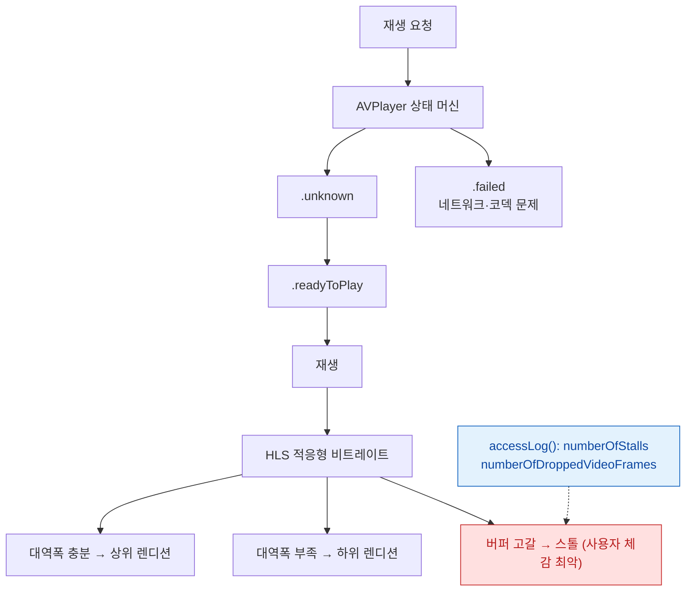

## tvOS Media & Living Room

tvOS 에서 거실용 앱/미디어 경험을 만들 때 필요한 내용을 쉽게 정리했다. 용어는 [apple-glossary](../../00_foundations/apple-glossary.md).



**평균 비트레이트가 아니라 스톨 횟수가 체감 품질이다.** `accessLog()` 로 이 값을 수집한다.

### 💡 왜 이것을 알아야 하나요?

tvOS는 **거실의 큰 TV 화면에서 스트리밍 미디어를 중심**으로 사용됩니다. 비디오 품질(HDR, 4K, 돌비 비전), 네트워크 안정성, 배터리 걱정이 없는 등 iOS와 완전히 다른 요구사항이 있습니다.

---

### 거실 UX 원칙

#### 멀리서 보는 큰 화면, 리모컨 중심 입력, 짧은 입력/긴 시청

**왜 필요한가**: TV 화면은 1~3m 거리에서 보이고, 입력은 리모컨의 제한된 버튼(방향 패드, 선택, 음성)으로만 이루어지므로, 직관적이고 빠른 인터페이스가 필수입니다.

- **큰 화면**: 텍스트 44pt 이상, 터치 타깃 80x80pt 이상.
- **리모컨 입력**: 방향 패드(Up/Down/Left/Right), 클릭(Select), 메뉴(Menu), 홈(Home), 음성(Siri) 버튼만.
- **직관성**: 탐색/검색/시청 흐름을 최소 2~3 스텝으로 단순화.

```swift
import UIKit
import TVMLKit

// tvOS 리모컨 입력 처리
class RemoteControlInputHandler: UIViewController {
    var pressRecognizer: UITapGestureRecognizer?
    
    override func viewDidLoad() {
        super.viewDidLoad()
        setupRemoteGestures()
    }
    
    func setupRemoteGestures() {
        // Siri Remote 제스처 인식
        // 방향 패드 동작
        let swipeRight = UISwipeGestureRecognizer(target: self, action: #selector(handleSwipeRight))
        swipeRight.direction = .right
        view.addGestureRecognizer(swipeRight)
        
        let swipeLeft = UISwipeGestureRecognizer(target: self, action: #selector(handleSwipeLeft))
        swipeLeft.direction = .left
        view.addGestureRecognizer(swipeLeft)
        
        // 클릭 동작
        pressRecognizer = UITapGestureRecognizer(target: self, action: #selector(handleSelect))
        if let recognizer = pressRecognizer {
            view.addGestureRecognizer(recognizer)
        }
    }
    
    @objc func handleSwipeRight() {
        print("오른쪽 스와이프")
    }
    
    @objc func handleSwipeLeft() {
        print("왼쪽 스와이프")
    }
    
    @objc func handleSelect() {
        print("선택 (클릭)")
    }
}

// 빠른 네비게이션: 3스텝 이내로 콘텐츠 재생
class QuickAccessViewController: UIViewController {
    override func viewDidLoad() {
        super.viewDidLoad()
        
        // 1단계: 카테고리 (영화, 드라마, 추천)
        // 2단계: 콘텐츠 (영화 목록)
        // 3단계: 재생 (플레이어 열기)
    }
}
```

---

### tvOS 포커스 엔진 및 커스터마이징

#### UIKit/SwiftUI 포커스 자동 처리, 커스텀 포커스 체인/우선순위 설정

**왜 필요한가**: 포커스가 명확하지 않으면 사용자는 리모컨으로 어디를 눌러야 할지 모릅니다.

- **기본 포커스 엔진**: 자동으로 가장 가까운 요소로 포커스 이동.
- **포커스 가이드**: 특정 요소로 포커스 강제 이동.
- **포커스 우선순위**: 초기 포커스, 포커스 순서 명시적 설정.

```swift
import UIKit

// 포커스 체인 커스터마이징
class FocusManagementViewController: UIViewController {
    @IBOutlet weak var playButton: UIButton!
    @IBOutlet weak var skipButton: UIButton!
    @IBOutlet weak var settingsButton: UIButton!
    
    override func viewDidLoad() {
        super.viewDidLoad()
        
        // 초기 포커스 설정
        setNeedsFocusUpdate()
        updateFocusIfNeeded()
    }
    
    override var preferredFocusEnvironments: [UIFocusEnvironment] {
        // 초기 포커스: 재생 버튼
        return [playButton]
    }
}

// 포커스 이동 감지 및 애니메이션
class FocusAnimationView: UIView {
    override func didUpdateFocus(in context: UIFocusUpdateContext, with coordinator: UIFocusAnimationCoordinator) {
        coordinator.addCoordinatedAnimations({
            if self.isFocused {
                // 포커스 시: 크기 증대 + 그림자
                self.transform = CGAffineTransform(scaleX: 1.15, y: 1.15)
                self.layer.shadowOpacity = 0.9
                self.layer.shadowRadius = 12
            } else {
                // 포커스 해제: 원래대로
                self.transform = CGAffineTransform.identity
                self.layer.shadowOpacity = 0.3
            }
        })
    }
}

// 포커스 가이드: 특정 요소로 강제 이동
class FocusGuideViewController: UIViewController {
    @IBOutlet weak var sourceButton: UIButton!
    @IBOutlet weak var targetButton: UIButton!
    
    override func viewDidLoad() {
        super.viewDidLoad()
        
        let focusGuide = UIFocusGuide()
        view.addLayoutGuide(focusGuide)
        
        // sourceButton에서 오른쪽으로 이동하면 targetButton으로 포커스 강제 이동
        focusGuide.preferredFocus = targetButton
        
        // 포커스 가이드 위치 설정
        focusGuide.topAnchor.constraint(equalTo: sourceButton.topAnchor).isActive = true
        focusGuide.leftAnchor.constraint(equalTo: sourceButton.rightAnchor).isActive = true
        focusGuide.widthAnchor.constraint(equalToConstant: 0).isActive = true
        focusGuide.heightAnchor.constraint(equalTo: sourceButton.heightAnchor).isActive = true
    }
}
```

---

### 미디어 재생 (AVPlayer & HLS)

#### AVPlayer로 HLS 스트림 재생, 자막/오디오 트랙, HDR/돌비 지원 협상

**왜 필요한가**: tvOS는 **다양한 비디오 포맷과 코덱**(HDR, 4K, H.265, 돌비 비전/애트모스)을 지원하지만, 기기와 TV 성능에 따라 제공할 포맷을 달리해야 합니다.

- **HLS 스트림**: `.m3u8` 매니페스트. 적응형 비트레이트 지원.
- **자막**: WebVTT, SRT, CEA-608 등. 사용자 설정에 따라 렌더링.
- **오디오 트랙**: 다국어, 오디오 설명(AD, Audio Description).
- **HDR/돌비**: HDR10, 돌비 비전, 돌비 애트모스 지원 여부 협상.

```swift
import AVFoundation
import MediaPlayer

// HLS 스트림 재생
class HLSMediaPlayer: UIViewController {
    var player: AVPlayer?
    var playerViewController: AVPlayerViewController?
    
    func playHLSStream(url: URL) {
        let asset = AVAsset(url: url)
        let playerItem = AVPlayerItem(asset: asset)
        
        // 적응형 비트레이트 제한
        playerItem.preferredPeakBitrate = 8_000_000 // 8Mbps
        
        player = AVPlayer(playerItem: playerItem)
        
        playerViewController = AVPlayerViewController()
        playerViewController?.player = player
        
        if let playerVC = playerViewController {
            addChild(playerVC)
            view.addSubview(playerVC.view)
            playerVC.view.frame = view.bounds
            playerVC.didMove(toParent: self)
        }
        
        player?.play()
    }
    
    // 자막 트랙 관리
    func displaySubtitles() {
        guard let asset = player?.currentItem?.asset else { return }
        
        // 자막 그룹 찾기
        for group in asset.mediaSelectionGroups {
            if group.mediaCharacteristics.contains(.legible) {
                // 자막 트랙 선택 (기본값: 영어)
                let options = AVMediaSelectionGroup.mediaSelectionOptions(from: group.options, with: Locale(identifier: "en"))
                if let option = options.first {
                    player?.currentItem?.select(option, in: group)
                }
            }
        }
    }
    
    // 오디오 트랙 관리
    func selectAudioTrack(language: String) {
        guard let asset = player?.currentItem?.asset else { return }
        
        for group in asset.mediaSelectionGroups {
            if group.mediaCharacteristics.contains(.audible) {
                let locale = Locale(identifier: language) // "ko", "en", "ja"
                let options = AVMediaSelectionGroup.mediaSelectionOptions(from: group.options, with: locale)
                
                if let option = options.first {
                    player?.currentItem?.select(option, in: group)
                }
            }
        }
    }
}

// HDR 및 돌비 지원 확인
class MediaCapabilityChecker {
    func checkVideoCapabilities() {
        // 기기가 지원하는 비디오 포맷 확인
        let supportedFormats = AVPlayer().availableMediaSelectionOptions(in: nil)
        
        // tvOS에서는 일반적으로 다음 지원:
        // - HEVC (H.265)
        // - HDR10
        // - 돌비 비전 (Apple TV 4K)
        // - 돌비 애트모스 (A10X Fusion 칩 이상)
    }
}

// 음성 청취 불가 옵션 (무음 스위치 없으므로)
class AudioSessionSetup {
    func setupAudioSession() {
        let audioSession = AVAudioSession.sharedInstance()
        
        // tvOS는 무음 스위치가 없으므로, 사용자에게 음량 제어 옵션 제공
        do {
            try audioSession.setCategory(.playback, options: [.duckOthers])
            try audioSession.setActive(true)
        } catch {
            print("오디오 세션 설정 실패: \(error)")
        }
    }
}
```

---

### 성능 최적화 및 캐싱

#### 이미지/비디오 캐싱, 온디맨드 리소스(ODR), 서버 측 변환

**왜 필요한가**: TV 앱은 모바일 앱보다 큰 이미지/비디오를 자주 사용하고, 네트워크 속도가 안정적이므로, 사전 다운로드와 캐싱이 중요합니다.

- **이미지 캐싱**: 포스터, 썸네일 로컬 저장.
- **비디오 캐싱**: 재생 목록 프리페치.
- **On-Demand Resources**: 초기 앱 다운로드 시간 최소화. 백그라운드에서 리소스 다운로드.

```swift
import UIKit

// 이미지 캐싱 (NSCache)
class ImageCacheManager {
    static let shared = ImageCacheManager()
    private let cache = NSCache<NSString, UIImage>()
    
    func setImage(_ image: UIImage, forKey key: String) {
        cache.setObject(image, forKey: key as NSString)
    }
    
    func getImage(forKey key: String) -> UIImage? {
        return cache.object(forKey: key as NSString)
    }
    
    func configureCache() {
        cache.totalCostLimit = 500 * 1024 * 1024 // 500MB 제한 (tvOS는 충분함)
    }
}

// On-Demand Resources: 콘텐츠 번들 다운로드
class OnDemandResourceManager {
    func downloadContentBundle(for contentID: String, priority: NSBundleResourceRequest.LoadingPriority = .default) {
        let tags = Set(["content_\(contentID)"])
        let request = NSBundleResourceRequest(tags: tags)
        request.loadingPriority = priority
        
        request.beginAccessingResources { error in
            if let error = error {
                print("ODR 다운로드 실패: \(error)")
            } else {
                print("콘텐츠 번들 다운로드 완료: \(contentID)")
            }
        }
    }
    
    func cancelDownload(for contentID: String) {
        let tags = Set(["content_\(contentID)"])
        let request = NSBundleResourceRequest(tags: tags)
        request.endAccessingResources()
    }
}

// 비디오 프리페치 (재생 목록)
class VideoPreloader {
    func prefetchPlaylist(_ urls: [URL]) {
        for (index, url) in urls.enumerated() {
            let priority: NSBundleResourceRequest.LoadingPriority = index == 0 ? .high : .low
            // 우선순위 기반 프리페치
        }
    }
}
```

---

### 네트워크 최적화

#### 와이파이/이더넷, 적응형 비트레이트, 프리페치, 지역 캐시

**왜 필요한가**: tvOS는 **셋톱박스**이므로 이더넷 연결이 흔하고, 네트워크 대역폭이 크지만 WiFi 간섭이나 라우터 성능 문제는 흔합니다. 버퍼링은 사용자에게 즉시 보이므로 프리페치가 필수입니다.

```swift
import Network

// 네트워크 연결 상태 모니터링
class NetworkMonitor {
    let monitor = NWPathMonitor()
    
    func startMonitoring() {
        monitor.pathUpdateHandler = { path in
            if path.status == .satisfied {
                let isEthernet = path.usesInterfaceType(.wiredEthernet)
                let isWiFi = path.usesInterfaceType(.wifi)
                
                if isEthernet {
                    print("이더넷 연결 (안정적)")
                } else if isWiFi {
                    print("WiFi 연결 (불안정할 수 있음)")
                }
            } else {
                print("네트워크 연결 끊김")
            }
        }
        
        monitor.start(queue: DispatchQueue.global())
    }
}

// 적응형 비트레이트 (HLS 자동 선택)
class AdaptiveStreamingOptimizer {
    func selectStreamVariant(for bandwidth: Int) -> String {
        switch bandwidth {
        case 0..<3_000_000:
            return "720p_H264" // 3Mbps 이하
        case 3_000_000..<10_000_000:
            return "1080p_H265" // 3~10Mbps
        case 10_000_000...:
            return "4K_HDR" // 10Mbps 이상
        default:
            return "1080p_H265"
        }
    }
}
```

---

### 입력 및 보조 기능

#### Siri 음성 검색, 자막/오디오 설명, 게임 컨트롤러 지원

```swift
import GameController

// 게임 컨트롤러 지원 (Siri Remote, Xbox 컨트롤러 등)
class GameControllerManager {
    func setupGameController() {
        NotificationCenter.default.addObserver(
            forName: NSNotification.Name.GCControllerDidConnect,
            object: nil,
            queue: .main
        ) { _ in
            if let controller = GCController.controllers().first {
                self.handleGamepad(controller)
            }
        }
    }
    
    func handleGamepad(_ controller: GCController) {
        if let gamepad = controller.gamepad {
            gamepad.dpad.valueChangedHandler = { _, xValue, yValue in
                print("게임패드 입력: X=\(xValue), Y=\(yValue)")
            }
            
            gamepad.buttonA.valueChangedHandler = { _, value, pressed in
                if pressed {
                    print("A 버튼 눌림")
                }
            }
        }
    }
}
```

---

### 앱 크기 및 배포

#### 초기 앱 크기 제한, On-Demand Resources, tvOS App Store 정책

**체크리스트**:
```
배포:
- [ ] 초기 앱 크기 500MB 이하 (tvOS App Store 권장)
- [ ] 필수 리소스만 포함
- [ ] 선택 리소스는 ODR로 분리
- [ ] 콘텐츠 등급 설정 (17+, 12+, 4+)
- [ ] IAP(인앱 구매) 정책 준수

테스트:
- [ ] 다양한 Apple TV 기기 (4K, HD)
- [ ] 다양한 TV 해상도/HDR 설정
- [ ] 느린 네트워크 환경 (에뮬레이션)
- [ ] WiFi 간섭 상황
- [ ] 포커스 이동/리모컨 입력
- [ ] 다국어/자막
```

---

### 관련 링크

[apple-rendering-and-media](../../02_ui_frameworks/apple-rendering-and-media.md), [apple-networking-and-cloud](../../03_data_networking/apple-networking-and-cloud.md), [apple-performance-and-debug](../../06_testing_performance/apple-performance-and-debug.md), [apple-accessibility](../../02_ui_frameworks/apple-accessibility.md).

### 관찰 가능한 증거

```bash
# tvOS 시뮬레이터
xcrun simctl list devices | grep -i tv

# HLS 스트림 검증 (Apple 제공 도구)
mediastreamvalidator "https://example.com/master.m3u8"
```

```swift
// 재생 품질 로그 — 스톨과 비트레이트 전환을 기록한다
if let log = player.currentItem?.accessLog() {
    for e in log.events {
        print(e.indicatedBitrate, e.observedBitrate,
              e.numberOfStalls, e.numberOfDroppedVideoFrames)
    }
}
if let err = player.currentItem?.errorLog() {
    for e in err.events { print(e.errorStatusCode, e.errorComment as Any) }
}
```

`numberOfStalls` 와 `numberOfDroppedVideoFrames` 가 실제 사용자 체감 품질 지표다. **평균 비트레이트만 보면 끊김을 놓친다.**

- **포커스 엔진 디버깅**: `UIFocusDebugger.status()` 를 디버거 콘솔에서 호출하면 현재 포커스 상태와 왜 이동이 막혔는지 출력한다.

공식 문서: [tvOS](https://developer.apple.com/documentation/tvos-release-notes) · [HTTP Live Streaming](https://developer.apple.com/streaming/)
