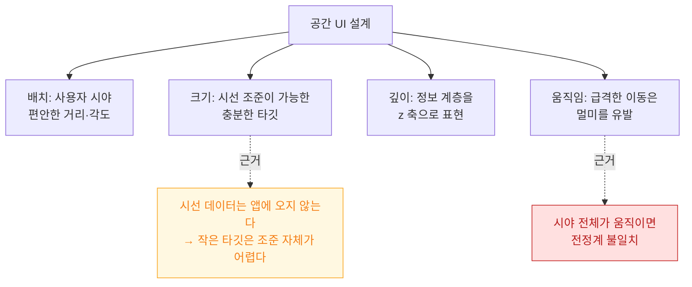

## visionOS Design Patterns

비전 OS 에서 자주 쓰는 설계 패턴을 쉽게 정리했다. 용어는 [apple-glossary](../../00_foundations/apple-glossary.md).



### 💡 왜 이것을 알아야 하나요?

visionOS는 **3D 공간, 시선 입력(gaze), 손 제스처**가 중심이므로, 2D 터치 UI와는 완전히 다른 설계 원칙이 필요합니다. 잘못된 패턴은 사용자 불편, 눈 피로, 멀미로 이어집니다.

---

### 공간 배치 패턴

#### Window (2D 창) vs Volume (3D 공간), 정보 패널 vs 워크스테이션 vs 몰입 허브

**왜 필요한가**: visionOS는 **사용자 주변 360도 공간을 활용**하므로, 정보의 중요도와 사용 빈도에 따라 배치 위치를 전략적으로 선택해야 합니다.

- **Window** (2D 패널): 텍스트/버튼/리스트. 기존 iOS 앱과 유사. 사용자 앞에 배치.
- **Volume** (3D 공간): 입체 모델, 게임, 데이터 시각화. 3D 깊이감 표현.
- **정보 패널**: 주요 콘텐츠는 정면, 부수 정보는 좌측/우측에 배치. 사용자 편안함 유지.
- **워크스테이션**: 여러 창/볼륨을 弧 형태로 배치. 멀티태스킹 지원.
- **몰입 허브**: 풀 스페이스 활용. HUD/데이터가 사용자 주위를 감싸나, 중앙 시야는 명확히 유지.

```swift
import SwiftUI
import RealityKit

// Window 기반 패턴 (2D)
struct InfoPanelView: View {
    var body: some View {
        VStack(spacing: 20) {
            Text("정보 패널")
                .font(.title)
            
            List {
                ForEach(1...5, id: \.self) { i in
                    Text("항목 \(i)")
                }
            }
            
            Button("선택") {
                print("선택됨")
            }
        }
        .frame(width: 400, height: 500)
    }
}

// Volume 기반 패턴 (3D)
#Preview(windowStyle: .volumetric) {
    Model3D(named: "model", bundle: Bundle.main)
        .padding()
}

// 공간 배치: 사용자 주변
struct SpatialLayoutView: View {
    var body: some View {
        ZStack {
            // 중앙: 주요 콘텐츠
            VStack {
                Text("주요 콘텐츠")
                    .font(.title)
            }
            .frame(width: 400, height: 300)
            .position(x: 0, y: 0, z: -0.5) // 사용자 정면
            
            // 좌측: 네비게이션
            VStack {
                Text("메뉴")
                    .font(.headline)
            }
            .frame(width: 200, height: 300)
            .position(x: -0.4, y: 0, z: -0.5)
            
            // 우측: 설정
            VStack {
                Text("설정")
                    .font(.headline)
            }
            .frame(width: 200, height: 300)
            .position(x: 0.4, y: 0, z: -0.5)
        }
    }
}

// 워크스테이션 배치 (여러 창 호 형태)
struct WorkstationLayout: View {
    var body: some View {
        ZStack {
            // 창1: 정면 좌
            RoundedRectangle(cornerRadius: 12)
                .fill(Color.blue.opacity(0.3))
                .frame(width: 400, height: 300)
                .position(x: -0.3, y: 0, z: -0.5)
            
            // 창2: 정면 중앙
            RoundedRectangle(cornerRadius: 12)
                .fill(Color.green.opacity(0.3))
                .frame(width: 400, height: 300)
                .position(x: 0, y: 0, z: -0.5)
            
            // 창3: 정면 우
            RoundedRectangle(cornerRadius: 12)
                .fill(Color.red.opacity(0.3))
                .frame(width: 400, height: 300)
                .position(x: 0.3, y: 0, z: -0.5)
        }
    }
}
```

---

### 상호작용 패턴

#### 시선 + 핀치 (기본), 공중 슬라이더, 공간 드래그, 물리 기반 애니메이션

**왜 필요한가**: visionOS 사용자는 손을 들고 있고, 시선이 입력 방식이므로, **최소한의 손 움직임과 정확한 타겟**이 필수입니다.

- **시선 + 핀치**: 사용자가 손가락을 보면, 아이콘을 보고 손가락 끝 두 개를 모으면 선택. 조준선 없음. 간결함.
- **공중 슬라이더/노브**: 손을 위아래/좌우로 움직여 값 조정. 실물 제어판 같은 느낌.
- **공간 드래그**: 3D 오브젝트를 집어 움직이기. 중력/마찰/튕김 등 물리 규칙.

```swift
import SwiftUI
import RealityKit

// 시선 + 핀치 상호작용
struct GazeAndPinchButton: View {
    @State var isHovered = false
    
    var body: some View {
        Button(action: { print("선택됨") }) {
            Text("버튼")
                .font(.title2)
                .frame(width: 120, height: 50)
                .background(isHovered ? Color.blue : Color.gray)
                .cornerRadius(8)
                .onHover { hovering in
                    isHovered = hovering
                }
        }
        // visionOS에서는 자동으로 시선 감지 + 핀치 지원
    }
}

// 공중 슬라이더 (드래그로 값 조정)
struct AirSliderControl: View {
    @State var value: Float = 50
    
    var body: some View {
        VStack {
            Text("음량: \(Int(value))")
                .font(.headline)
            
            Slider(value: $value, in: 0...100)
                .frame(width: 300)
                .padding()
            
            // 3D 노브
            ZStack {
                Circle()
                    .fill(Color.blue)
                    .frame(width: 60, height: 60)
                    .rotationEffect(.degrees(Double(value) * 3.6))
                
                Text("⟲")
                    .font(.title)
                    .foregroundColor(.white)
            }
            .frame(height: 100)
        }
    }
}

// 공간 드래그 (3D 오브젝트 조작)
struct DraggableVolume: View {
    @State var position: SIMD3<Float> = [0, 0, -0.5]
    
    var body: some View {
        // 3D 모델을 드래그로 이동 가능
        VStack {
            Text("드래그하여 이동")
                .font(.headline)
        }
        .frame(width: 200, height: 200)
        .background(Color.blue.opacity(0.3))
        .gesture(
            DragGesture()
                .onChanged { value in
                    // 드래그로 위치 업데이트
                    position.x = Float(value.translation.width / 1000)
                    position.y = Float(value.translation.height / 1000)
                }
        )
        // 물리 기반 애니메이션: 튕김 효과
        .animation(.spring(response: 0.4, dampingFraction: 0.6), value: position)
    }
}

// 손 제스처 인식
struct HandGestureRecognizer: View {
    @State var recognizedGesture: String = "대기 중"
    
    var body: some View {
        VStack {
            Text("손 제스처: \(recognizedGesture)")
                .font(.headline)
            
            Text("손을 보여주세요")
                .font(.body)
        }
        // ARKit HandTracking으로 손 감지
        .onReceive(Timer.publish(every: 0.1).autoconnect()) { _ in
            // 손 제스처 인식 로직
            recognizedGesture = "핀치" // 예시
        }
    }
}
```

---

### 정보 레이어 및 깊이 표현

#### 근거리/중거리/원거리 레이어, 반투명 카드, 그림자/깊이 힌트, 시야 보호

**왜 필요한가**: visionOS 사용자는 3D 깊이를 감지할 수 있지만, **텍스트와 중요 정보는 가까운 거리에 배치**해야 명확히 읽을 수 있습니다. 또한 **중앙 시야는 항상 명확**해야 사용자가 길을 잃지 않습니다.

- **근거리** (사용자 0.3m 앞): 텍스트, 버튼, 상세 정보.
- **중거리** (0.3~1m): 주요 콘텐츠, 3D 모델.
- **원거리** (1m 이상): 배경, 환경 정보, 보조 요소.
- **반투명 카드**: 배경과 콘텐츠를 분리. 배경이 보이나 초점은 콘텐츠.

```swift
import SwiftUI

// 깊이 레이어 배치
struct DepthLayerView: View {
    var body: some View {
        ZStack {
            // 원거리: 배경 (흐릿함)
            RoundedRectangle(cornerRadius: 20)
                .fill(Color.gray.opacity(0.2))
                .blur(radius: 8)
                .frame(width: 600, height: 400)
                .zIndex(0)
            
            // 중거리: 주요 콘텐츠
            VStack(spacing: 20) {
                Text("중요 정보")
                    .font(.title)
                
                Text("설명 텍스트")
                    .font(.body)
            }
            .frame(width: 400, height: 300)
            .background(.ultraThinMaterial) // 반투명 배경
            .cornerRadius(12)
            .shadow(radius: 10)
            .zIndex(1)
            
            // 근거리: 세부 정보 (선택 가능)
            VStack {
                Text("상세")
                    .font(.caption)
            }
            .frame(width: 150, height: 80)
            .background(Color.blue.opacity(0.3))
            .cornerRadius(8)
            .zIndex(2)
        }
    }
}

// 반투명 카드 (Material)
struct TranslucentCard: View {
    var body: some View {
        VStack(spacing: 16) {
            Text("카드 제목")
                .font(.headline)
            
            Text("배경이 보이나 텍스트는 명확합니다.")
                .font(.body)
                .lineLimit(3)
            
            Button("확인") {
                print("확인")
            }
        }
        .padding(20)
        .frame(width: 350, height: 200)
        .background(.ultraThinMaterial) // visionOS 전용: 배경 흐리게
        .cornerRadius(12)
        .shadow(radius: 8)
    }
}

// 알림/토스트 (시야 방해 최소)
struct MinimalNotification: View {
    var body: some View {
        VStack {
            Text("작업 완료")
                .font(.caption)
        }
        .padding(12)
        .background(Color.black.opacity(0.7))
        .cornerRadius(8)
        .foregroundColor(.white)
        .position(x: 0, y: -0.3, z: -0.4) // 상단 우측 (중앙 시야 밖)
    }
}
```

---

### 이동 및 화면 전환

#### 강제 카메라 이동 피하기, 순간이동/페이드/확대 축소 전환, 안내 텍스트

**왜 필요한가**: visionOS에서 강제 카메라 이동은 **사용자 멀미와 불편**을 초래합니다. 대신 자연스러운 애니메이션과 명확한 안내가 필수입니다.

```swift
import SwiftUI

// 페이드 전환 (안전함)
struct FadeTransition: View {
    @State var showDetail = false
    
    var body: some View {
        if showDetail {
            DetailView()
                .transition(.opacity) // 페이드
        } else {
            ListingView()
                .onTapGesture {
                    withAnimation(.easeInOut(duration: 0.3)) {
                        showDetail = true
                    }
                }
        }
    }
}

// 확대/축소 전환 (2D → 3D)
struct ScaleTransition: View {
    @State var isExpanded = false
    
    var body: some View {
        ZStack {
            if isExpanded {
                DetailView3D()
                    .transition(.scale.combined(with: .opacity))
            } else {
                CompactCard()
                    .onTapGesture {
                        withAnimation(.spring()) {
                            isExpanded = true
                        }
                    }
            }
        }
    }
}

// 2D → 3D 전환 시 안내 텍스트
struct TransitionGuide: View {
    @State var transitionProgress: Double = 0
    
    var body: some View {
        VStack {
            if transitionProgress < 1.0 {
                Text("3D 모드로 전환 중...")
                    .font(.caption)
                    .opacity(1 - transitionProgress) // 점차 사라짐
            }
            
            // 3D 오브젝트 표시
            Model3D(named: "model", bundle: Bundle.main)
                .scaleEffect(transitionProgress)
                .onAppear {
                    withAnimation(.easeInOut(duration: 0.5)) {
                        transitionProgress = 1.0
                    }
                }
        }
    }
}
```

---

### 협업 및 공유 (Shared Space)

#### 여러 사용자, 아바타/포인터/하이라이트, 콘텐츠 동기화

**왜 필요한가**: Apple Vision Pro는 **여러 사용자가 같은 공간에서 협업**할 수 있습니다. 각 사용자의 위치와 의도를 명확히 표시해야 합니다.

```swift
import SwiftUI
import GroupActivities

// Shared Space: 다중 사용자 세션
struct SharedWorkspace: View {
    @State var participants: [Participant] = []
    
    var body: some View {
        ZStack {
            // 공유 콘텐츠
            VStack {
                Text("협업 문서")
                    .font(.title)
            }
            .frame(width: 400, height: 300)
            .background(Color.blue.opacity(0.2))
            
            // 각 참여자의 아바타/포인터
            ForEach(participants, id: \.id) { participant in
                AvatarPointer(participant: participant)
                    .position(x: CGFloat(participant.position.x), y: CGFloat(participant.position.y))
            }
        }
        .onReceive(Timer.publish(every: 0.1).autoconnect()) { _ in
            // 다른 사용자의 위치/상태 실시간 업데이트
            updateParticipantPositions()
        }
    }
    
    func updateParticipantPositions() {
        // 네트워크에서 다른 사용자 상태 수신
    }
}

// 아바타 및 포인터 표시
struct AvatarPointer: View {
    let participant: Participant
    
    var body: some View {
        VStack(spacing: 8) {
            // 사용자 아바타
            Circle()
                .fill(Color.blue)
                .frame(width: 30, height: 30)
                .overlay(
                    Text(participant.name.prefix(1))
                        .font(.caption2)
                        .foregroundColor(.white)
                )
            
            // 포인터 (손가락 위치)
            if let pointerPos = participant.pointerPosition {
                Circle()
                    .stroke(Color.yellow, lineWidth: 2)
                    .frame(width: 15, height: 15)
            }
            
            // 이름 라벨
            Text(participant.name)
                .font(.caption)
        }
    }
}

struct Participant {
    let id: String
    let name: String
    var position: SIMD3<Float>
    var pointerPosition: SIMD3<Float>?
}

// 콘텐츠 동기화 (충돌 해결)
class CollaborationManager: NSObject, ObservableObject {
    func resolveConflict(local: Document, remote: Document) -> Document {
        // Last-Write-Wins (타임스탬프 기반)
        return local.lastModified > remote.lastModified ? local : remote
    }
}
```

---

### 접근성 및 사용자 편안함

#### 시선/손 민감도 조정, 장시간 사용 가이드, 색 대비, 자막, 눈 피로 방지

**체크리스트**:
```
입력 접근성:
- [ ] 시선 감도 조정 옵션
- [ ] 손 제스처 감도 조정
- [ ] 대체 입력 (게임패드, 마우스)

시각 접근성:
- [ ] WCAG AA 이상 색 대비
- [ ] 자막 지원
- [ ] 오디오 설명

사용자 편안함:
- [ ] 2초 이상 연속 고개 움직임 피하기
- [ ] 10분마다 휴식 안내
- [ ] 시야 중앙 보호 (정보 회전 최소화)
- [ ] 패스스루 밝기 과도한 변경 금지

성능:
- [ ] 60fps 유지 (멀미 방지)
- [ ] GPU/CPU 과부하 모니터링
```

---

### 성능 최적화

#### 오브젝트 수/폴리곤 제한, LOD (Level of Detail), Foveated 렌더링, GPU 예산 관리

```swift
import RealityKit

// 성능 최적화: LOD (Level of Detail)
class PerformanceOptimizer {
    func configureModelLOD(model: ModelEntity, distance: Float) {
        switch distance {
        case 0..<0.5:
            // 근거리: 고정밀 모델 (모든 폴리곤)
            model.model?.mesh = highDetailMesh
        case 0.5..<2:
            // 중거리: 중간 정밀도
            model.model?.mesh = mediumDetailMesh
        case 2...:
            // 원거리: 저정밀 모델
            model.model?.mesh = lowDetailMesh
        default:
            break
        }
    }
    
    // 필요 없는 오브젝트 컬링 (뷰포트 밖)
    func cullingInvisibleObjects(camera: Transform, objects: [ModelEntity]) -> [ModelEntity] {
        return objects.filter { obj in
            let distance = distance(camera.translation, obj.position)
            let isVisible = distance < 10 // 10m 이내만 표시
            return isVisible
        }
    }
}

// Foveated 렌더링 (시선 중심만 고정밀)
// visionOS는 자동 지원 (개발자 명시 필수 아님)

private func distance(_ a: SIMD3<Float>, _ b: SIMD3<Float>) -> Float {
    let diff = a - b
    return sqrt(diff.x * diff.x + diff.y * diff.y + diff.z * diff.z)
}

var highDetailMesh: MeshResource { MeshResource() }
var mediumDetailMesh: MeshResource { MeshResource() }
var lowDetailMesh: MeshResource { MeshResource() }
```

---

### 관련 링크

[apple-visionos-system](../apple-visionos-system.md), [apple-visionos-immersion-guide](apple-visionos-immersion-guide.md), [apple-visionos-spatial](../apple-visionos-system.md), [apple-performance-and-debug](../../06_testing_performance/apple-performance-and-debug.md), [apple-accessibility](../../02_ui_frameworks/apple-accessibility.md).

공식 문서: [visionOS Human Interface Guidelines](https://developer.apple.com/design/human-interface-guidelines/designing-for-visionos)
