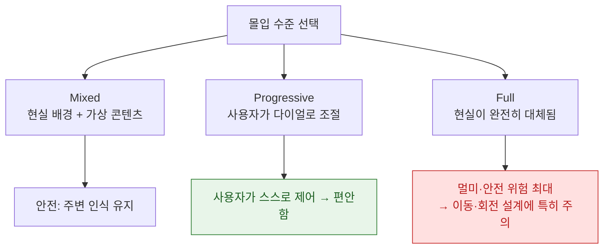

## visionOS Immersion Guide

비전 OS 에서 몰입감 있는 앱을 만들기 위한 깊은 가이드. Apple Vision Pro 의 **공간 컴퓨팅(Spatial Computing)** 플랫폼에서 사용자를 완전히 환경에 집중시키는 기법을 다룹니다. 용어는 [apple-glossary](../../00_foundations/apple-glossary.md).



### 💡 왜 몰입감 설계가 중요한가?

- **존재감 강화**: 3D 공간을 올바르게 활용하면 사용자가 "여기 있다"는 감각을 느낍니다.
- **인지 부하 감소**: 사용자 시야에 맞춘 배치로 목표 찾기가 쉬워집니다.
- **피로도 감소**: 안전한 깊이와 자연스러운 움직임은 눈 피로와 멀미를 줄입니다.

---

### 공간 경험 설계

visionOS 의 **콘텐츠 컨테이너(Content Container)** 는 세 가지 유형입니다.

#### Window (2D 평면 인터페이스)

평면 UI 요소—텍스트, 버튼, 리스트, 폼—을 표시합니다. iOS/macOS 앱과 유사하지만, **사용자 정면 공간**에 배치됩니다.

**왜 필요한가**: 텍스트 읽기와 정밀 상호작용에 최적화되어 있습니다.

```swift
import SwiftUI

struct WindowBasedApp: View {
    @State var showDetail = false
    
    var body: some View {
        VStack(spacing: 16) {
            Text("정보 패널")
                .font(.title)
            
            List {
                ForEach(1...10, id: \.self) { i in
                    Text("항목 \(i)")
                }
            }
            
            Button("선택") {
                showDetail = true
            }
        }
        .frame(width: 400, height: 600)
        // Window로 배치 (2D 평면)
    }
}
```

#### Volume (3D 공간 콘텐츠)

3D 오브젝트, 대화형 모델, 데이터 시각화를 나타냅니다. **깊이(Depth)** 를 활용하여 몰입감을 높입니다.

**왜 필요한가**: 사용자가 360도에서 3D 객체를 관찰하고 조작할 수 있습니다.

```swift
import SwiftUI
import RealityKit

struct VolumeExperience: View {
    var body: some View {
        ZStack {
            // 3D 모델 표시
            RealityView { content in
                // ModelEntity 또는 Model3D 추가
                if let model = try? await ModelEntity(
                    named: "scene",
                    in: Bundle.main
                ) {
                    content.add(model)
                }
            }
            
            // 오버레이 UI
            VStack {
                Text("3D 오브젝트")
                    .font(.title2)
            }
            .frame(width: 200, height: 100)
            .background(.ultraThinMaterial)
            .cornerRadius(12)
        }
    }
}
```

#### Full Space (완전 몰입 환경)

사용자의 **전체 시야각(360도)** 을 차지합니다. VR 경험, 게임, 데이터 시각화 스튜디오에 이상적입니다.

**주의**: 안전성과 편안함이 매우 중요합니다. 중앙 시야는 항상 명확해야 하고, 갑작스러운 변화를 피해야 합니다.

```swift
import SwiftUI

struct FullSpaceImmersion: View {
    var body: some View {
        ZStack {
            // 배경 환경
            RealityView { content in
                // 360도 환경 설정
                // - 가상 환경 또는 패스스루 기반
            }
            
            // 중앙 시야: 핵심 콘텐츠 (사용자 정면)
            VStack {
                Text("집중 영역")
                    .font(.title)
                Text("주요 정보는 여기")
                    .font(.body)
            }
            .frame(width: 300, height: 200)
            .background(.thickMaterial)
            .cornerRadius(16)
            
            // 주변: 보조 정보
            HStack(spacing: 40) {
                VStack { Text("좌측 정보") }
                    .frame(width: 150, height: 150)
                    .background(.ultraThinMaterial)
                    .cornerRadius(12)
                
                Spacer()
                
                VStack { Text("우측 정보") }
                    .frame(width: 150, height: 150)
                    .background(.ultraThinMaterial)
                    .cornerRadius(12)
            }
            .padding(60)
        }
    }
}
```

---

### 입력과 상호작용

visionOS는 **세 가지 입력 방식**을 조화롭게 지원합니다.

#### 시선 (Gaze)

사용자의 시선 방향을 **포인터 위치**로 해석합니다. 보조 입력 방식이 없으면 자동으로 활성화됩니다.

**왜 필요한가**: 손을 들 필요 없이 자연스러운 상호작용을 가능하게 합니다.

```swift
import SwiftUI

struct GazeInteractionView: View {
    @State var hoveredButton: String?
    
    var body: some View {
        VStack(spacing: 20) {
            ForEach(["선택", "취소", "도움말"], id: \.self) { label in
                Button(label) {
                    print("\(label) 클릭됨")
                }
                .frame(height: 50)
                .frame(maxWidth: .infinity)
                .background(hoveredButton == label ? Color.blue : Color.gray)
                .cornerRadius(8)
                .onHover { isHovered in
                    hoveredButton = isHovered ? label : nil
                }
            }
        }
        .padding(20)
        .frame(width: 300)
        // 시선이 버튼에 닿으면 자동으로 하이라이트
    }
}
```

#### 손 제스처 (Hand Gestures)

**핀치(Pinch)**, 드래그, 회전, 스크롤. 실제 손 추적(Hand Tracking)을 사용합니다.

**기본 제스처**:
- **핀치**: 검지와 엄지를 모아 선택 또는 확인
- **드래그**: 손가락 2개 또는 손바닥으로 오브젝트 이동
- **회전**: 손 방향을 바꿔 오브젝트 회전
- **스크롤**: 손을 위아래로 움직여 리스트 스크롤

```swift
import SwiftUI

struct HandGestureView: View {
    @State var position: CGPoint = .zero
    @State var scale: CGFloat = 1.0
    
    var body: some View {
        ZStack {
            // 드래그 가능한 오브젝트
            RoundedRectangle(cornerRadius: 12)
                .fill(Color.blue.opacity(0.6))
                .frame(width: 150, height: 150)
                .position(position)
                .scaleEffect(scale)
                .gesture(
                    DragGesture()
                        .onChanged { value in
                            position = value.location
                        }
                )
            
            // 제스처 설명
            VStack {
                Text("드래그로 이동")
                    .font(.caption)
                Text("핀치로 확대")
                    .font(.caption2)
            }
            .position(x: 60, y: 60)
        }
    }
}
```

#### 음성 입력 (Voice)

**Siri** 또는 **Dictation** 을 통한 텍스트 입력과 명령 실행. 키보드는 보조 수단입니다.

```swift
import SwiftUI

struct VoiceCommandView: View {
    @State var command = ""
    
    var body: some View {
        VStack(spacing: 16) {
            Text("음성 명령 입력")
                .font(.headline)
            
            TextField("또는 입력", text: $command)
                .textFieldStyle(.roundedBorder)
            
            Button("음성 입력") {
                // Siri/Dictation 활성화
                print("음성 입력 시작")
            }
            .frame(maxWidth: .infinity)
            .controlSize(.large)
        }
        .frame(width: 350)
    }
}
```

---

### 렌더링과 성능 최적화

visionOS의 강력한 성능이 필요한 이유: **90Hz 화면 주사율**, 3D 렌더링, 손 추적, 아이 트래킹이 동시에 실행됩니다.

#### RealityKit과 3D 콘텐츠

**RealityKit** 은 visionOS의 공식 3D 렌더링 엔진입니다. Metal 보다 고수준의 API를 제공합니다.

**개념**:
- **Entity**: 3D 씬 내 모든 오브젝트 (모델, 라이트, 카메라)
- **Component**: Entity 의 속성 (Transform, ModelComponent, PhysicsComponent)
- **Anchor**: 공간 내 고정점 (월드 좌표 또는 이미지/평면 추적)

```swift
import RealityKit
import SwiftUI

struct RealityKitScene: View {
    var body: some View {
        RealityView { content in
            // 3D 씬 설정
            setupScene(content)
        } update: { content in
            // 프레임마다 업데이트
        }
    }
    
    func setupScene(_ content: RealityViewContent) {
        // 모델 로드
        if let model = try? ModelEntity(
            named: "robot",
            in: Bundle.main
        ) {
            // Transform 설정 (위치, 회전, 스케일)
            var transform = model.move(toParent: content.anchor, keepingWorldTransform: false)
            transform.translation.z = -1.0 // 사용자 1미터 앞
            model.move(toParent: content.anchor, keepingWorldTransform: false)
            
            content.add(model)
        }
    }
}
```

#### Foveated 렌더링과 성능 예산

**Foveated Rendering**: 사용자가 보고 있는 **중심 영역**만 고정밀로 렌더링하고, 주변부는 낮은 해상도로 처리합니다.

**성능 예산**:
- **Draw Call**: 프레임당 5000 이하 (GPU 명령)
- **Polygon 수**: 1~2백만 (거리에 따라 LOD 적용)
- **Texture 메모리**: 1-2GB 이상 금지

```swift
class PerformanceManager {
    func optimizeModel(_ model: ModelEntity, distance: Float) {
        switch distance {
        case 0..<0.5:
            // 근거리: 고정밀 모델
            loadHighDetailMesh(for: model)
        case 0.5..<2:
            // 중거리: 중간 정밀도
            loadMediumDetailMesh(for: model)
        case 2...:
            // 원거리: 저정밀 모델
            loadLowDetailMesh(for: model)
        default:
            break
        }
    }
    
    func cullingInvisibleObjects(
        cameraPosition: SIMD3<Float>,
        objects: [ModelEntity]
    ) -> [ModelEntity] {
        objects.filter { obj in
            let dist = distance(cameraPosition, obj.position)
            return dist < 10 // 10m 이내만 표시
        }
    }
    
    private func distance(
        _ a: SIMD3<Float>,
        _ b: SIMD3<Float>
    ) -> Float {
        let diff = a - b
        return sqrt(diff.x * diff.x + diff.y * diff.y + diff.z * diff.z)
    }
    
    func loadHighDetailMesh(for model: ModelEntity) { /* */ }
    func loadMediumDetailMesh(for model: ModelEntity) { /* */ }
    func loadLowDetailMesh(for model: ModelEntity) { /* */ }
}
```

#### Pass-Through (패스스루)

카메라 비디오를 실시간으로 사용자에게 보여줍니다. 프라이버시와 안전이 중요합니다.

**정책**:
- 앱은 **원본 카메라 프레임을 직접 접근 불가**. Apple이 처리한 합성 결과만 사용 가능.
- 높은 거리, 얼굴, 개인정보 인식 불가.

---

### 공간 오디오 설계

**공간 오디오** 는 3D 환경에서 방향감을 제공합니다. 사용자의 머리 위치와 방향에 따라 음향이 동적으로 변합니다.

**핵심 개념**:
- **HRTF (Head-Related Transfer Function)**: 음향을 3D 위치로 렌더링
- **거리 감쇠**: 멀수록 음량이 줄어듦
- **방향 큐(Directional Cue)**: 음원의 방향을 감지 가능

```swift
import AVFoundation
import SwiftUI

struct SpatialAudioView: View {
    var body: some View {
        VStack(spacing: 20) {
            // 사용자 앞에서 소리 나는 오브젝트
            VStack {
                Text("음원 위치: 정면")
                    .font(.headline)
                Button("재생") {
                    playSpatialAudio(position: (0, 0, -1))
                }
            }
            .frame(width: 200, height: 150)
            .background(Color.blue.opacity(0.3))
            
            // 왼쪽에서 소리 나는 오브젝트
            HStack(spacing: 40) {
                VStack {
                    Text("좌측")
                    Button("재생") {
                        playSpatialAudio(position: (-0.5, 0, -1))
                    }
                }
                .frame(width: 150, height: 150)
                .background(Color.red.opacity(0.3))
                
                VStack {
                    Text("우측")
                    Button("재생") {
                        playSpatialAudio(position: (0.5, 0, -1))
                    }
                }
                .frame(width: 150, height: 150)
                .background(Color.green.opacity(0.3))
            }
        }
    }
    
    func playSpatialAudio(position: (Float, Float, Float)) {
        // AVAudioEngine + AVAudioEnvironmentNode 로 3D 오디오 렌더링
        print("3D 음향 재생: \(position)")
    }
}
```

---

### UI 빌드 패턴과 깊이 설계

**깊이 계층화(Depth Layering)** 는 정보 가시성을 높입니다.

#### 깊이 레이어 구조

- **근거리 (0~0.5m)**: 텍스트, 버튼, 세부 정보. 명확해야 함.
- **중거리 (0.5~2m)**: 주요 콘텐츠, 3D 모델.
- **원거리 (2m+)**: 배경, 환경, 보조 정보.

```swift
import SwiftUI

struct DepthLayerView: View {
    var body: some View {
        ZStack {
            // 원거리: 배경 (흐릿함)
            RoundedRectangle(cornerRadius: 20)
                .fill(Color.gray.opacity(0.2))
                .blur(radius: 10)
                .frame(width: 800, height: 600)
                .zIndex(0)
            
            // 중거리: 주요 콘텐츠
            VStack(spacing: 20) {
                Text("제목")
                    .font(.title)
                Text("주요 설명 텍스트입니다")
                    .font(.body)
            }
            .frame(width: 500, height: 350)
            .background(.thickMaterial) // 반투명 + 블러
            .cornerRadius(16)
            .shadow(radius: 15)
            .zIndex(1)
            
            // 근거리: 상세 정보
            VStack(spacing: 8) {
                Text("세부 사항")
                    .font(.caption)
                Button("확인") { }
            }
            .frame(width: 200, height: 100)
            .background(Color.blue.opacity(0.4))
            .cornerRadius(8)
            .zIndex(2)
        }
    }
}
```

---

### 안전과 편안함 (Comfort & Safety)

**멀미(Motion Sickness)** 와 **눈 피로** 를 예방하는 것이 중요합니다.

#### 피해야 할 패턴

| 항목 | 문제 | 해결책 |
| :--- | :--- | :--- |
| **강제 카메라 이동** | 멀미, 불편 | 자동 카메라 이동 피하기. 사용자가 머리로 조종 |
| **빠른 플래시/깜빡임** | 눈 피로, 발작 위험 | 애니메이션을 0.2~0.5초 이상 유지 |
| **높은 명도 대비** | 눈 피로, 시각 스트레스 | WCAG AA 대비 이상 유지 (4.5:1 이상) |
| **중앙 시야 방해** | 방향 감각 상실 | 중앙 시야는 항상 명확하고 안정적 |
| **갑작스러운 요소 등장** | 놀람, 불안 | 애니메이션 + 음향 큐로 예고 |

```swift
import SwiftUI

struct ComfortDesign: View {
    @State var showContent = false
    
    var body: some View {
        ZStack {
            // 배경: 안정적, 밝기 조절
            Color.gray.opacity(0.3)
            
            if showContent {
                // 콘텐츠 등장: 부드러운 전환
                VStack {
                    Text("새로운 정보")
                        .font(.title)
                }
                .frame(width: 400, height: 300)
                .background(.ultraThinMaterial)
                .cornerRadius(12)
                .transition(.opacity.combined(with: .scale(scale: 0.95))) // 스케일 + 페이드
            }
        }
        .onAppear {
            // 0.5초 이상 애니메이션
            withAnimation(.easeInOut(duration: 0.5)) {
                showContent = true
            }
        }
    }
}
```

---

### 데이터와 프라이버시

visionOS는 **공간 맵, 사용자 시선, 손 위치** 등 민감한 정보를 수집합니다.

**정책**:
- **최소 권한 원칙**: 필요한 데이터만 요청.
- **명시적 동의**: 권한 프롬프트로 사용자 동의 확보.
- **암호화**: 저장 및 전송 시 암호화 필수.
- **프라이버시 라벨**: App Store에 데이터 수집 사항 명시.

---

### 테스트 체크리스트

```
설계 검증:
- [ ] Window/Volume/Full Space 중 최적의 유형 선택했는가?
- [ ] 시선/손/음성 입력이 모두 자연스러운가?
- [ ] 중앙 시야는 항상 명확한가?

성능 검증:
- [ ] 90fps 유지하는가? (Profiler로 측정)
- [ ] GPU 메모리 1GB 이하인가?
- [ ] 손 추적/아이 트래킹 지연이 < 20ms인가?

편안함 검증:
- [ ] 강제 카메라 이동이 없는가?
- [ ] 2초 이상 연속 고개 움직임이 없는가?
- [ ] 색 대비 WCAG AA 이상인가?
- [ ] 깜빡임/고주파 애니메이션이 없는가?

접근성 검증:
- [ ] VoiceOver 지원하는가?
- [ ] 자막/오디오 설명이 있는가?
- [ ] 시선/손 감도 조절 옵션이 있는가?
```

---

### 관련 링크

[apple-visionos-system](../apple-visionos-system.md), [apple-visionos-design-patterns](apple-visionos-design-patterns.md), [apple-visionos-spatial](../apple-visionos-system.md), [apple-rendering-and-media](../../02_ui_frameworks/apple-rendering-and-media.md), [apple-performance-and-debug](../../06_testing_performance/apple-performance-and-debug.md), [apple-accessibility](../../02_ui_frameworks/apple-accessibility.md).

공식 문서: [Creating fully immersive experiences](https://developer.apple.com/documentation/visionos/creating-fully-immersive-experiences)
