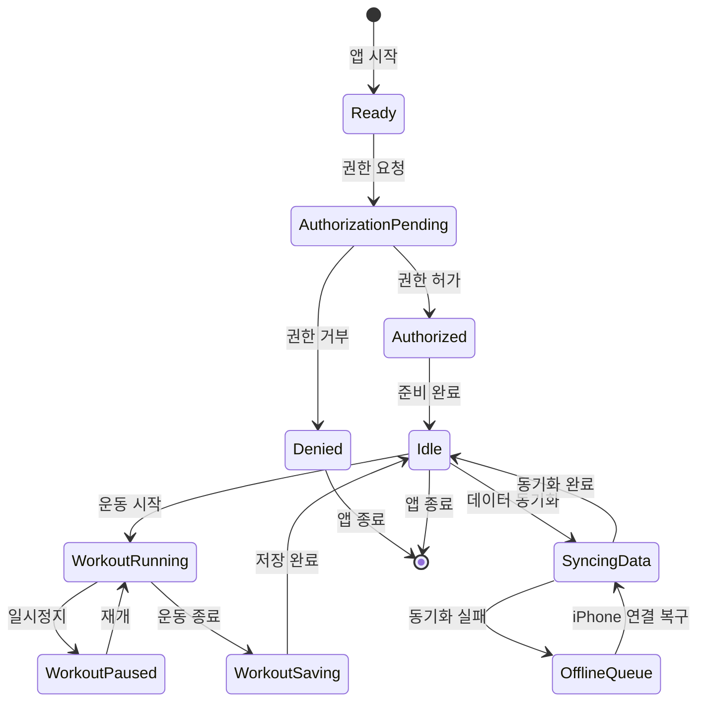

## watchOS Fitness & Health Guide

Apple Watch 에서 **피트니스**, **운동**, **건강 데이터** 앱을 만들기 위한 가이드. watchOS 의 강력한 센서와 헬스 프레임워크를 활용하되, **배터리**, **프라이버시**, **사용자 편의성**을 항상 고려해야 합니다. 용어는 [apple-glossary](../../00_foundations/apple-glossary.md).

### 💡 왜 watchOS 피트니스 앱이 중요한가?

- **24/7 착용 센서**: 스마트폰과 달리, Apple Watch 는 **항상 사용자 손목에** 있어 연속 모니터링 가능.
- **신뢰성**: 피트니스 데이터는 건강 결정에 영향을 미치므로 정확성과 신뢰성이 필수.
- **사용자 기대**: 운동 추적 앱을 설치하면 사용자는 **배터리 드레인**을 용인하지만, 그 대신 **정확한 데이터**를 기대합니다.

---

### 핵심 UI/UX 패턴

#### 손목 올림 시 빠른 피드백

Watch 사용자는 **손목을 들어 올리는 순간에 정보를 보고 싶어합니다.** 2~3초 지연은 사용 경험을 파괴합니다.

```swift
import SwiftUI
import HealthKit

struct QuickWorkoutView: View {
    @State var currentStats: WorkoutStats?
    @State var isLoading = false
    
    var body: some View {
        VStack {
            if isLoading {
                ProgressView()
                    .frame(height: 50)
            } else if let stats = currentStats {
                // 캐시된 데이터를 즉시 표시
                HStack(spacing: 16) {
                    VStack(alignment: .leading) {
                        Text("칼로리")
                            .font(.caption2)
                        Text("\(stats.calories)")
                            .font(.headline)
                    }
                    
                    VStack(alignment: .leading) {
                        Text("심박")
                            .font(.caption2)
                        Text("\(stats.heartRate)")
                            .font(.headline)
                    }
                    
                    VStack(alignment: .leading) {
                        Text("거리")
                            .font(.caption2)
                        Text("\(stats.distance, specifier: "%.1f")km")
                            .font(.headline)
                    }
                }
            }
            
            Button("시작") {
                startWorkout()
            }
            .frame(maxWidth: .infinity)
        }
        .padding()
        .onAppear {
            // 손목 올림 순간: 캐시 로드
            loadCachedStats()
        }
    }
    
    func loadCachedStats() {
        // 마지막 운동 데이터를 UserDefaults 에서 즉시 로드
        if let cached = UserDefaults.standard.data(forKey: "lastWorkoutStats"),
           let stats = try? JSONDecoder().decode(WorkoutStats.self, from: cached) {
            currentStats = stats
        }
    }
    
    func startWorkout() {
        // Workout 세션 시작
    }
}

struct WorkoutStats: Codable {
    var calories: Int
    var heartRate: Int
    var distance: Double
}
```

#### Digital Crown 과 Swipe 네비게이션

Watch 의 **Digital Crown**(물리 다이얼)과 **좌우 스와이프**는 기본 입력 방식입니다.

```swift
import SwiftUI

struct DigitalCrownNavigation: View {
    @State var selectedTab: Int = 0
    
    var body: some View {
        ZStack {
            if selectedTab == 0 {
                WorkoutListView()
            } else if selectedTab == 1 {
                ActivityRingsView()
            } else {
                SettingsView()
            }
        }
        .focusable()
        .digitalCrownRotation($selectedTab, from: 0, through: 2, by: 1)
        .navigationBarTitleDisplayMode(.inline)
    }
}

// 좌우 스와이프 네비게이션
struct SwipeableWorkoutDetail: View {
    @State var workoutIndex = 0
    let workouts = ["달리기", "자전거", "수영"]
    
    var body: some View {
        VStack {
            Text(workouts[workoutIndex])
                .font(.headline)
            
            HStack(spacing: 20) {
                if workoutIndex > 0 {
                    Button("←") {
                        workoutIndex -= 1
                    }
                }
                
                Spacer()
                
                if workoutIndex < workouts.count - 1 {
                    Button("→") {
                        workoutIndex += 1
                    }
                }
            }
        }
        .gesture(
            DragGesture()
                .onEnded { value in
                    if value.translation.width < -50 && workoutIndex < workouts.count - 1 {
                        workoutIndex += 1
                    } else if value.translation.width > 50 && workoutIndex > 0 {
                        workoutIndex -= 1
                    }
                }
        )
    }
}
```

---

### HealthKit 프레임워크

**HealthKit** 은 Watch 의 모든 건강 데이터에 접근하는 공식 인터페이스입니다.

#### HealthKit 권한 요청 (최소 권한 원칙)

**중요**: 필요한 데이터만 요청하세요. 과도한 권한 요청은 사용자 신뢰를 잃고, Apple 심사를 탈락시킬 수 있습니다.

```swift
import HealthKit

class HealthKitManager {
    let store = HKHealthStore()
    
    func requestHealthKitPermissions() {
        // 1단계: 이 기기가 HealthKit을 지원하는지 확인
        guard HKHealthStore.isHealthDataAvailable() else {
            print("HealthKit을 지원하지 않는 기기")
            return
        }
        
        // 2단계: 필요한 데이터 타입만 명시
        let readTypes: Set<HKObjectType> = [
            HKObjectType.quantityType(forIdentifier: .stepCount)!,
            HKObjectType.quantityType(forIdentifier: .activeEnergyBurned)!,
            HKObjectType.quantityType(forIdentifier: .heartRate)!,
            // ❌ 나쁜 예: 필요 없는 권한도 함께 요청
            // HKObjectType.quantityType(forIdentifier: .bloodPressure)!,
            // HKObjectType.characteristicType(forIdentifier: .biologicalSex)!,
        ]
        
        let writeTypes: Set<HKSampleType> = [
            HKObjectType.workoutType(),
        ]
        
        // 3단계: 권한 요청 (사용자 동의)
        store.requestAuthorization(toShare: writeTypes, read: readTypes) { success, error in
            if success {
                print("HealthKit 권한 획득 완료")
            } else {
                print("권한 거부 또는 오류: \(error?.localizedDescription ?? "")")
            }
        }
    }
}
```

#### HealthKit 데이터 읽기

```swift
import HealthKit

class HealthDataReader {
    let store = HKHealthStore()
    
    // 현재 시간부터의 스텝 수
    func fetchTodayStepCount(completion: @escaping (Double) -> Void) {
        guard let stepCountType = HKObjectType.quantityType(
            forIdentifier: .stepCount
        ) else { return }
        
        // 오늘 자정부터 지금까지
        let startDate = Calendar.current.startOfDay(for: Date())
        let endDate = Date()
        
        let predicate = HKQuery.predicateForSamples(
            withStart: startDate,
            end: endDate,
            options: .strictStartDate
        )
        
        let query = HKStatisticsQuery(
            quantityType: stepCountType,
            quantitySamplePredicate: predicate,
            options: .cumulativeSum
        ) { query, result, error in
            guard let result = result, let sum = result.sumQuantity() else {
                print("스텝 데이터 없음")
                completion(0)
                return
            }
            
            let steps = sum.doubleValue(for: HKUnit.count())
            completion(steps)
        }
        
        store.execute(query)
    }
    
    // 최근 1시간 평균 심박수
    func fetchRecentHeartRate(completion: @escaping (Double?) -> Void) {
        guard let heartRateType = HKObjectType.quantityType(
            forIdentifier: .heartRate
        ) else { return }
        
        let startDate = Date(timeIntervalSinceNow: -3600) // 1시간 전
        let endDate = Date()
        
        let predicate = HKQuery.predicateForSamples(
            withStart: startDate,
            end: endDate,
            options: .strictStartDate
        )
        
        let query = HKStatisticsQuery(
            quantityType: heartRateType,
            quantitySamplePredicate: predicate,
            options: .discreteAverage // 평균값
        ) { query, result, error in
            guard let result = result else {
                completion(nil)
                return
            }
            
            let heartRate = result.averageQuantity()?
                .doubleValue(for: HKUnit(from: "count/min"))
            completion(heartRate)
        }
        
        store.execute(query)
    }
}
```

---

### WorkoutKit 과 Workout 세션

**WorkoutKit** 은 운동 세션을 **생성, 관리, 추적**하는 공식 프레임워크입니다. `HKWorkout` 을 생성하여 Apple Health 앱에 기록됩니다.

#### Workout 세션 생성 및 실행

```swift
import HealthKit
import SwiftUI

class WorkoutSessionManager: NSObject, HKWorkoutSessionDelegate, HKLiveWorkoutBuilderDelegate {
    var workoutSession: HKWorkoutSession?
    var builder: HKLiveWorkoutBuilder?
    let store = HKHealthStore()
    
    // Workout 세션 시작
    func startWorkout(activityType: HKWorkoutActivityType) {
        do {
            let config = HKWorkoutConfiguration()
            config.activityType = activityType
            config.locationType = .outdoor // 또는 .indoor
            
            workoutSession = try HKWorkoutSession(configuration: config)
            builder = workoutSession?.associatedWorkoutBuilder()
            
            // 수집할 데이터 지정
            builder?.dataSource = HKLiveWorkoutDataSource(
                healthStore: store,
                workoutConfiguration: config
            )
            
            // 델리게이트 설정
            workoutSession?.delegate = self
            builder?.delegate = self
            
            // 세션 시작
            workoutSession?.startActivity(with: Date())
            builder?.beginCollection(withStart: Date()) { success, error in
                if success {
                    print("Workout 세션 시작: 데이터 수집 중...")
                }
            }
        } catch {
            print("Workout 세션 생성 실패: \(error.localizedDescription)")
        }
    }
    
    // Workout 세션 일시정지
    func pauseWorkout() {
        workoutSession?.pause()
    }
    
    // Workout 세션 종료
    func endWorkout() {
        workoutSession?.end()
    }
    
    // 델리게이트: 세션 상태 변화
    func workoutSession(
        _ workoutSession: HKWorkoutSession,
        didChangeTo toState: HKWorkoutSessionState,
        from fromState: HKWorkoutSessionState,
        date: Date
    ) {
        DispatchQueue.main.async {
            print("Workout 상태: \(toState.rawValue)")
        }
    }
    
    // 델리게이트: 세션 오류
    func workoutSession(
        _ workoutSession: HKWorkoutSession,
        didFailWithError error: Error
    ) {
        print("Workout 오류: \(error.localizedDescription)")
    }
    
    // 델리게이트: 데이터 업데이트 (주기적)
    func workoutBuilder(
        _ workoutBuilder: HKLiveWorkoutBuilder,
        didCollectDataOf collectedTypes: Set<HKSampleType>
    ) {
        for type in collectedTypes {
            if type == HKObjectType.quantityType(forIdentifier: .heartRate) {
                // 현재 심박수 업데이트
                if let heartRateSample = workoutBuilder.statistics(for: type),
                   let quantity = heartRateSample.averageQuantity() {
                    let heartRate = quantity.doubleValue(for: HKUnit(from: "count/min"))
                    print("현재 심박: \(Int(heartRate)) bpm")
                }
            }
        }
    }
}

// SwiftUI View 에서 사용
struct WorkoutControlView: View {
    @StateObject var manager = WorkoutSessionManager()
    @State var isRunning = false
    
    var body: some View {
        VStack {
            Button(isRunning ? "일시정지" : "시작") {
                if isRunning {
                    manager.pauseWorkout()
                } else {
                    manager.startWorkout(activityType: .running)
                }
                isRunning.toggle()
            }
            .frame(maxWidth: .infinity)
            .controlSize(.large)
            
            Button("종료") {
                manager.endWorkout()
                isRunning = false
            }
            .frame(maxWidth: .infinity)
        }
        .padding()
    }
}
```

#### Workout 복구 (Network Failure Recovery)

운동 중 **네트워크가 끊기거나 앱이 종료**되어도 데이터를 복구해야 합니다.

```swift
import HealthKit

class WorkoutRecoveryManager {
    func recoverInProgressWorkouts() {
        HKHealthStore().preferredUnit(forQuantityType: .init(
            forIdentifier: .heartRate
        )!)
        
        // 현재 진행 중인 세션 조회
        HKHealthStore().workoutSessions() { sessions, error in
            for session in sessions {
                if session.state == .running {
                    print("진행 중인 세션 발견: \(session.workoutConfiguration.activityType)")
                    // 복구 로직: 기존 세션에 재연결
                    // 또는 새로운 세션 시작
                }
            }
        }
    }
}
```

---

### 시계 페이스 컴플리케이션 (Complication)

**컴플리케이션** 은 시계 페이스에 표시되는 작은 위젯입니다. 사용자가 시계를 볼 때마다 가장 먼저 보는 정보입니다.

#### 컴플리케이션 데이터 제공

```swift
import ClockKit
import HealthKit

class ComplicationDataSource: NSObject, CLKComplicationDataSource {
    let store = HKHealthStore()
    
    // 현재 시간에 표시할 데이터
    func getCurrentTimelineEntry(
        for complication: CLKComplication,
        withHandler handler: @escaping (CLKComplicationTimelineEntry?) -> Void
    ) {
        // 현재 스텝 수 조회
        fetchTodaySteps { steps in
            let template: CLKComplicationTemplate
            
            switch complication.family {
            case .modularSmall:
                // 작은 모듈 형태
                let text = CLKSimpleTextProvider(text: "\(Int(steps))")
                let circle = CLKCircularProgressGaugeProvider(
                    gaugeProvider: CLKSimpleGaugeProvider(
                        gaugeColor: .green,
                        gaugeValue: Float(min(steps / 10000, 1.0)) // 목표: 1만 스텝
                    )
                )
                template = CLKComplicationTemplateModularSmallCircularImage(
                    imageProvider: CLKImageProvider(onePieceImage: UIImage(systemName: "figure.walk")!),
                    textProvider: text
                )
                
            case .modularLarge:
                // 큰 모듈 형태
                let title = CLKSimpleTextProvider(text: "오늘 스텝")
                let text = CLKSimpleTextProvider(text: "\(Int(steps))")
                template = CLKComplicationTemplateModularLargeTallBody(
                    headerTextProvider: title,
                    bodyTextProvider: text
                )
                
            default:
                handler(nil)
                return
            }
            
            let entry = CLKComplicationTimelineEntry(
                date: Date(),
                complicationTemplate: template
            )
            handler(entry)
        }
    }
    
    // 미래 타임라인 (오프라인 지원)
    func getTimelineEntries(
        for complication: CLKComplication,
        before date: Date,
        limit: Int,
        withHandler handler: @escaping ([CLKComplicationTimelineEntry]?) -> Void
    ) {
        // 다음 7일의 예측 데이터 제공
        var entries: [CLKComplicationTimelineEntry] = []
        
        for dayOffset in 0..<7 {
            if let futureDate = Calendar.current.date(byAdding: .day, value: dayOffset, to: Date()) {
                // 미래 데이터 (예측값 또는 캐시)
                let template = CLKComplicationTemplateModularSmallCircularImage(
                    imageProvider: CLKImageProvider(onePieceImage: UIImage(systemName: "figure.walk")!),
                    textProvider: CLKSimpleTextProvider(text: "????") // 미래는 알 수 없음
                )
                
                let entry = CLKComplicationTimelineEntry(
                    date: futureDate,
                    complicationTemplate: template
                )
                entries.append(entry)
            }
        }
        
        handler(entries)
    }
    
    private func fetchTodaySteps(completion: @escaping (Double) -> Void) {
        // HealthKit 쿼리 실행
        guard let stepCountType = HKObjectType.quantityType(
            forIdentifier: .stepCount
        ) else {
            completion(0)
            return
        }
        
        let startDate = Calendar.current.startOfDay(for: Date())
        let predicate = HKQuery.predicateForSamples(
            withStart: startDate,
            end: Date(),
            options: .strictStartDate
        )
        
        let query = HKStatisticsQuery(
            quantityType: stepCountType,
            quantitySamplePredicate: predicate,
            options: .cumulativeSum
        ) { _, result, _ in
            let steps = result?.sumQuantity()?.doubleValue(for: .count()) ?? 0
            completion(steps)
        }
        
        store.execute(query)
    }
}
```

---

### iPhone 과 WCSession 동기화

운동 데이터는 종종 **iPhone 에서 상세 분석**을 위해 전송됩니다.

#### WCSession을 통한 데이터 교환

```swift
import WatchConnectivity
import Foundation

class WatchConnectivityManager: NSObject, WCSessionDelegate {
    static let shared = WatchConnectivityManager()
    
    override init() {
        super.init()
        if WCSession.isSupported() {
            WCSession.default.delegate = self
            WCSession.default.activate()
        }
    }
    
    // Watch → iPhone: 운동 데이터 전송
    func sendWorkoutDataToiPhone(workout: WorkoutData) {
        guard WCSession.default.isReachable else {
            print("iPhone에 연결할 수 없음 - 오프라인 큐 저장")
            saveToOfflineQueue(workout)
            return
        }
        
        do {
            let encoded = try JSONEncoder().encode(workout)
            WCSession.default.sendMessage(
                ["workoutData": encoded],
                replyHandler: { response in
                    print("iPhone 응답: \(response)")
                },
                errorHandler: { error in
                    print("전송 실패: \(error.localizedDescription)")
                    self.saveToOfflineQueue(workout)
                }
            )
        } catch {
            print("인코딩 실패: \(error.localizedDescription)")
        }
    }
    
    // iPhone → Watch: 데이터 수신
    func session(
        _ session: WCSession,
        didReceiveMessage message: [String: Any],
        replyHandler: @escaping ([String: Any]) -> Void
    ) {
        if let configData = message["config"] as? Data {
            do {
                let config = try JSONDecoder().decode(WorkoutConfig.self, from: configData)
                print("iPhone에서 설정 수신: \(config)")
                replyHandler(["status": "received"])
            } catch {
                replyHandler(["status": "error"])
            }
        }
    }
    
    // 오프라인 큐: iPhone 연결 불가 시
    private func saveToOfflineQueue(_ workout: WorkoutData) {
        var queue = UserDefaults.standard.array(forKey: "workoutQueue") as? [Data] ?? []
        if let encoded = try? JSONEncoder().encode(workout) {
            queue.append(encoded)
            UserDefaults.standard.set(queue, forKey: "workoutQueue")
        }
    }
    
    func session(_ session: WCSession, activationDidCompleteWith activationState: WCSessionActivationState, error: Error?) { }
    func sessionDidBecomeInactive(_ session: WCSession) { }
    func sessionDidDeactivate(_ session: WCSession) { }
}

struct WorkoutData: Codable {
    var activityType: String
    var duration: TimeInterval
    var calories: Double
    var distance: Double
    var timestamp: Date
}

struct WorkoutConfig: Codable {
    var dailyGoal: Int
    var reminderTime: Date?
}
```

---

### 프라이버시와 보안

#### 권한 확인과 명시적 동의

```swift
import HealthKit

class PrivacyManager {
    func checkAuthorization(for quantityType: HKQuantityType) -> HKAuthorizationStatus {
        return HKHealthStore().authorizationStatus(for: quantityType)
    }
    
    func displayAuthorizationStatus(for type: HKQuantityType) {
        let status = HKHealthStore().authorizationStatus(for: type)
        
        switch status {
        case .sharingAuthorized:
            print("사용자가 권한을 허가했습니다")
        case .sharingDenied:
            print("사용자가 권한을 거부했습니다")
        case .notDetermined:
            print("아직 권한을 요청하지 않음")
        @unknown default:
            print("알 수 없는 상태")
        }
    }
}
```

#### 데이터 최소화 원칙

```swift
// ❌ 나쁜 예: 모든 데이터를 서버로 전송
func sendAllHealthDataToServer(_ data: [HealthSample]) {
    // 프라이버시 침해, GDPR 위반 위험
}

// ✅ 좋은 예: 필요한 통계만 전송
func sendAggregatedStatsToServer(_ stats: AggregatedStats) {
    // 개인식별 정보 제거
    // 통계 데이터만 전송
    print("통계: 평균 심박 \(stats.averageHeartRate)")
}

struct AggregatedStats: Codable {
    var date: Date
    var averageHeartRate: Double
    var totalSteps: Int
    var totalCalories: Double
    // 개인 식별 데이터 없음
}
```

---

### 테스트 체크리스트

```
설계:
- [ ] 손목 올림 순간에 캐시된 데이터를 2초 내에 표시하는가?
- [ ] Digital Crown과 스와이프로 모든 네비게이션이 가능한가?
- [ ] 큰 텍스트, 큰 터치 영역인가?

HealthKit:
- [ ] 필요한 권한만 요청했는가? (최소 권한)
- [ ] 권한 거부 시 우아한 대체 로직이 있는가?
- [ ] 데이터 읽기/쓰기 오류 처리가 있는가?

Workout:
- [ ] Workout 세션 중 데이터가 정확하게 수집되는가?
- [ ] 앱 종료/네트워크 끊김 시 복구 가능한가?
- [ ] Heart Rate, Calories, Distance가 정확한가?

Complication:
- [ ] 시계 페이스에 컴플리케이션이 표시되는가?
- [ ] 미래 타임라인을 준비했는가? (오프라인 지원)
- [ ] 데이터 업데이트 빈도가 과도하지 않은가?

동기화:
- [ ] iPhone 연결 여부를 확인하는가?
- [ ] iPhone 연결 불가 시 오프라인 큐를 사용하는가?
- [ ] 배터리 상태에 따라 동기화 빈도를 조절하는가?

보안/프라이버시:
- [ ] 민감한 건강 데이터를 암호화했는가?
- [ ] 서버 전송 시 HTTPS만 사용하는가?
- [ ] 프라이버시 라벨에 실제 데이터 수집 사항을 정확히 기술했는가?

성능:
- [ ] 배터리 소모가 과도하지 않은가?
- [ ] Jetsam 로그가 없는가?
- [ ] GPS/심박 센서 샘플링 빈도가 적절한가?
```

---

### 상태 전이 다이어그램



---

### 관련 링크

[apple-watchos-system](../apple-watchos-system.md), [apple-watchos-battery-and-performance](apple-watchos-battery-and-performance.md), [apple-networking-and-cloud](../../03_data_networking/apple-networking-and-cloud.md), [apple-performance-and-debug](../../06_testing_performance/apple-performance-and-debug.md), [apple-sandbox-and-security](../../05_security_privacy/apple-sandbox-and-security.md).
