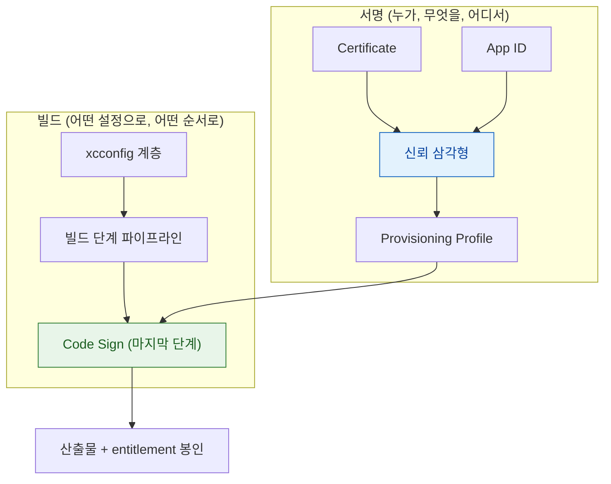

## 서명은 인증서·App ID·프로파일 삼각형이고 빌드는 xcconfig 계층과 순서 있는 단계로 이루어진다

"인증서 만료됨", "Profile doesn't match the entitlements" — iOS 개발자를 가장 괴롭히는 에러들이다. 이 복잡함의 근본 원인은 단순하다. **서명은 세 요소가 삼각형으로 일치해야 하고, 빌드는 여러 층의 설정과 순서 있는 단계를 거친다.** 어느 지점이 어긋났는지 나누는 것이 진단의 전부다.



### 정본 노트

**서명**

- [인증서·App ID·프로비저닝 프로파일 세 개가 정확히 일치해야 서명이 성립한다](signing/three-party-trust-chain-must-agree.md) — **삼각형이 어긋나는 흔한 시나리오**, 개발용/배포용 인증서의 구조적 차이.
- [배포 채널이 서명 방식·공증 필요 여부·심사 절차를 결정한다](signing/distribution-channel-determines-signing-and-review.md) — Hardened Runtime, **macOS 공증(Notarization)** 이 iOS 에 없는 이유.
- [dSYM 은 빌드마다 다르고 UUID 가 정확히 일치해야 크래시 스택이 복원된다](signing/dsym-must-match-the-exact-binary-slice.md) — CI 에서 dSYM 을 보관해야 하는 이유, 심볼화 절차.

**빌드**

- [빌드 설정은 프로젝트·타깃·xcconfig·스킴 네 층을 거치며 가장 구체적인 것이 이긴다](build/build-settings-resolve-through-a-layered-hierarchy.md) — **Target 설정이 xcconfig 를 덮는 함정**.
- [빌드 단계는 정해진 순서로 실행되며 스크립트 단계가 실패를 숨길 수 있다](build/build-phases-run-in-order-and-can-hide-failures.md) — `set -e` 의 필요성, CI 에서만 실패하는 이유.
- [App Thinning 은 기기별로 필요한 조각만 골라 전달한다](build/app-thinning-delivers-only-what-the-device-needs.md) — Asset Catalog 를 안 쓰면 자동화가 깨지는 이유.

### 증상에서 시작하기

| 증상 | 어느 노트로 |
| :--- | :--- |
| `doesn't match the entitlements` | [신뢰 삼각형](signing/three-party-trust-chain-must-agree.md) |
| Capabilities 를 켰는데 실행 안 됨 | [신뢰 삼각형](signing/three-party-trust-chain-must-agree.md) (프로파일 미재생성) |
| 개발에서는 되는데 TestFlight 에서 안 됨 | [신뢰 삼각형](signing/three-party-trust-chain-must-agree.md) (인증서 종류 차이) |
| macOS 배포 시 "확인되지 않은 개발자" | [배포 채널](signing/distribution-channel-determines-signing-and-review.md) (공증 누락) |
| 크래시 스택이 심볼화 안 됨 | [dSYM](signing/dsym-must-match-the-exact-binary-slice.md) |
| xcconfig 값이 안 먹힘 | [빌드 설정 계층](build/build-settings-resolve-through-a-layered-hierarchy.md) |
| CI 에서만 빌드 실패 | [빌드 단계](build/build-phases-run-in-order-and-can-hide-failures.md) |
| 앱 크기가 너무 크다 | [App Thinning](build/app-thinning-delivers-only-what-the-device-needs.md) |

### 진단 원칙

**항상 설정이 아니라 산출물을 본다.**

```bash
# Xcode UI 설정이 아니라 실제로 서명된 내용
codesign -d --entitlements :- MyApp.app
codesign -dvvv MyApp.app
security cms -D -i MyApp.app/embedded.mobileprovision

# 서명 무결성 전체 검증
codesign --verify --deep --strict --verbose=2 MyApp.app
```

**개발 빌드와 배포 빌드의 출력을 diff** 하면 "TestFlight 에서만 실패한다"류 문제의 원인이 대부분 드러난다.

### 빌드 파이프라인 개괄

```
Pre-processing (Info.plist 가공, Asset Catalog 컴파일)
  → Compiling (swiftc/clang → Mach-O)
  → Linking (ld)
  → Code Sign (entitlement 봉인)
  → Packaging (.app → .ipa)
```

Bitcode 는 Xcode 14(2022)에서 완전히 제거되어 이제 완성된 바이너리를 그대로 올린다.

### 연관 문서

- [apple-swift-package-manager](apple-swift-package-manager.md) - 의존성 해석과 모듈화
- [apple-distribution-and-policies](apple-distribution-and-policies.md) - TestFlight·심사·정책
- [apple-packaging-deployment-map](apple-packaging-deployment-map.md) - 이 섹션 전체 지도
- [AMFI 는 exec 시점에 코드 서명과 entitlement 를 커널에서 강제한다](../01_system_internals/kernel-and-driver/amfi-code-signature-enforcement.md)
- [08-signing-and-distribution-failure](../00_foundations/diagnostic-runbooks/08-signing-and-distribution-failure.md)

공식 문서: [Distributing your app for beta testing and releases](https://developer.apple.com/documentation/xcode/distributing-your-app-for-beta-testing-and-releases)
