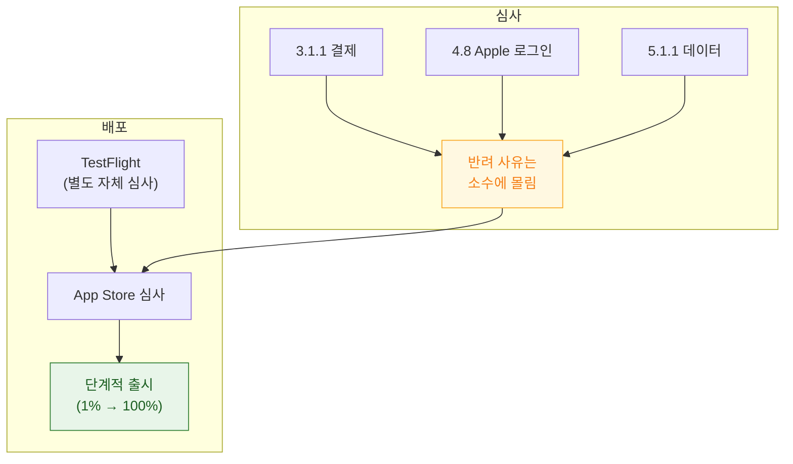

## 심사 반려는 소수의 가이드라인에 몰리고 배포는 TestFlight·단계적 출시로 위험을 줄인다

"Guideline 3.1.1 - In-App Purchase" 메일을 받는 순간 심장이 철렁하지만, 반려는 임의적이지 않다. **소수의 가이드라인 주변에 몰려 있고**, 배포 단계 자체도 **TestFlight 와 단계적 출시라는 두 개의 안전망**을 갖도록 설계되어 있다.



### 정본 노트

**심사**

- [심사 반려는 임의적이지 않고 소수의 가이드라인 주변에 몰린다](review/rejections-cluster-around-a-few-guidelines.md) — **3.1.1 결제 규칙의 정확한 경계**, 2.1 완성도 반려를 피하는 Review 노트 작성법.
- [수출 규정 신고는 암호학 API 사용이 아니라 실제 암호화 사용 여부로 판정한다](review/export-compliance-applies-to-encryption-not-just-cryptography-apis.md) — **HTTPS 만 써도 신고 대상**, `ITSAppUsesNonExemptEncryption`.
- [규제는 지역마다 다르고 무엇을 신고해야 하는지가 다르다](review/regulations-differ-by-region-and-what-must-be-declared.md) — GDPR 삭제권의 실제 구현, DMA 의 EU 특별 조항, 아동 카테고리.

**배포**

- [TestFlight 는 자체 심사를 거치며 App Store 심사와 별개다](distribution/testflight-review-is-separate-from-app-store-review.md) — 내부/외부 테스터 차이, 90일 만료.
- [단계적 출시는 문제를 전체 배포 전에 좁은 범위에서 잡는다](distribution/phased-release-limits-blast-radius.md) — **일시 중지는 롤백이 아니다**, 강제 업데이트는 직접 설계해야 한다.
- [App Clip 은 별도 서명과 엄격한 크기 상한을 가진 독립 번들이다](distribution/app-clip-has-its-own-signing-and-size-limit.md)

**인앱 구매**

- [StoreKit 2 는 서버 왕복 없이 서명된 JWS 로 구매를 로컬 검증한다](distribution/storekit2-verifies-transactions-with-signed-jws.md) — `transaction.finish()` 누락이 만드는 버그, 유예 기간 처리.
- [서버 검증은 로컬 검증으로 부족한 환불·해지·크로스플랫폼 동기화에 필요하다](distribution/server-side-verification-is-needed-for-refunds-and-cross-platform.md) — App Store Server Notifications 웹훅.

### 증상에서 시작하기

| 증상 | 어느 노트로 |
| :--- | :--- |
| 3.1.1 결제 반려 | [반려 가이드라인](review/rejections-cluster-around-a-few-guidelines.md) |
| 4.8 Apple 로그인 반려 | [반려 가이드라인](review/rejections-cluster-around-a-few-guidelines.md) |
| 심사관이 앱을 못 씀 | [반려 가이드라인](review/rejections-cluster-around-a-few-guidelines.md) (Review 노트 작성) |
| 업로드가 `Missing Compliance` 로 막힘 | [수출 규정](review/export-compliance-applies-to-encryption-not-just-cryptography-apis.md) |
| 계정 삭제가 법적으로 부족하다 | [규제](review/regulations-differ-by-region-and-what-must-be-declared.md) (GDPR) |
| TestFlight 외부 테스터가 못 받는다 | [TestFlight](distribution/testflight-review-is-separate-from-app-store-review.md) (베타 심사 대기) |
| 배포 후 크래시율이 급증했다 | [단계적 출시](distribution/phased-release-limits-blast-radius.md) |
| 환불받은 사용자가 계속 프리미엄이다 | [서버 검증](distribution/server-side-verification-is-needed-for-refunds-and-cross-platform.md) |
| 구매했는데 콘텐츠가 안 풀린다 | [StoreKit 2](distribution/storekit2-verifies-transactions-with-signed-jws.md) (`finish()` 누락) |

### Enterprise & Custom Apps — App Store 가 유일한 길은 아니다

| 채널 | 심사 | 배포 대상 |
| :--- | :--- | :--- |
| **Custom App (ABM)** | 받음 (비공개) | 특정 조직의 VPP 계정만 |
| **Enterprise Program** ($299/년) | **없음** | 사내 전용, MDM 배포 |

Enterprise 배포는 심사가 없는 대신 **인증서 관리가 리스크의 핵심**이다. 인증서가 만료되면 전 직원의 앱이 즉시 실행 불가 상태가 되며, Apple 이 남용(사내 배포 목적 외 사용)을 감지하면 계정을 정지시킬 수 있다.

### 심사 전 자체 점검

```bash
xcrun altool --validate-app -f build/export/MyApp.ipa -t ios \
  --apiKey "$KEY_ID" --apiIssuer "$ISSUER_ID"

find MyApp.app -name "PrivacyInfo.xcprivacy"
plutil -p MyApp.app/Info.plist | grep -A10 NSAppTransportSecurity
```

| 항목 | 흔한 반려 사유 |
| :--- | :--- |
| 권한 문구 | 구체적이지 않음 |
| 권한 요청 시점 | 앱 진입 즉시 요청 |
| 결제 | 디지털 재화를 외부 결제로 유도 |
| Privacy Manifest | Required Reason API 사유 미기재 |

### 연관 문서

- [apple-build-and-distribution](apple-build-and-distribution.md) - 서명·빌드 기술적 과정
- [apple-app-tracking-privacy](../05_security_privacy/apple-app-tracking-privacy.md)
- [apple-privacy-and-tcc-details](../05_security_privacy/apple-privacy-and-tcc-details.md)
- [apple-packaging-deployment-map](apple-packaging-deployment-map.md)

공식 문서: [App Review Guidelines](https://developer.apple.com/app-store/review/guidelines/)
