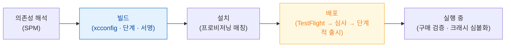

## 서명·프로비저닝·심사는 서로 다른 시점의 독립 게이트다

소스에서 사용자 기기까지 가는 길에는 통과 시점이 다른 관문이 여러 개 있다. **의존성 해석(SPM)** 은 빌드 이전, **코드 서명과 entitlement 봉인**은 빌드 시점, **프로비저닝 프로파일 매칭**은 설치 시점, **App Store 심사**는 배포 시점이다. "Profile doesn't match the entitlements" 같은 오류가 어느 관문에서 났는지 먼저 나눠야 고칠 대상이 정해진다.

### 하위 영역

| 영역 | hub 노트 | 다루는 범위 |
|---|---|---|
| **서명·빌드** | [apple-build-and-distribution](apple-build-and-distribution.md) | 인증서·App ID·프로파일 삼각형, xcconfig 계층, 빌드 단계, App Thinning, dSYM |
| **의존성 관리** | [apple-swift-package-manager](apple-swift-package-manager.md) | Package.swift, 로컬 패키지 모듈화, 버전 해석 |
| **배포·심사·구매** | [apple-distribution-and-policies](apple-distribution-and-policies.md) | TestFlight, App Store 심사 반려 패턴, 단계적 출시, StoreKit 2, 지역 규제 |

### 정본 노트 전체

**서명** (3) — [3자 신뢰 삼각형](signing/three-party-trust-chain-must-agree.md) · [배포 채널별 공증](signing/distribution-channel-determines-signing-and-review.md) · [dSYM 심볼화](signing/dsym-must-match-the-exact-binary-slice.md)

**빌드** (3) — [설정 계층](build/build-settings-resolve-through-a-layered-hierarchy.md) · [빌드 단계 순서](build/build-phases-run-in-order-and-can-hide-failures.md) · [App Thinning](build/app-thinning-delivers-only-what-the-device-needs.md)

**배포** (5) — [TestFlight 별도 심사](distribution/testflight-review-is-separate-from-app-store-review.md) · [단계적 출시](distribution/phased-release-limits-blast-radius.md) · [App Clip](distribution/app-clip-has-its-own-signing-and-size-limit.md) · [StoreKit 2 로컬 검증](distribution/storekit2-verifies-transactions-with-signed-jws.md) · [서버 측 검증](distribution/server-side-verification-is-needed-for-refunds-and-cross-platform.md)

**심사** (3) — [반려 패턴](review/rejections-cluster-around-a-few-guidelines.md) · [수출 규정](review/export-compliance-applies-to-encryption-not-just-cryptography-apis.md) · [지역 규제](review/regulations-differ-by-region-and-what-must-be-declared.md)

### 진단 순서

1. **증상이 빌드/서명 단계인가** → [apple-build-and-distribution](apple-build-and-distribution.md) 의 증상표로
2. **증상이 심사/배포 단계인가** → [apple-distribution-and-policies](apple-distribution-and-policies.md) 의 증상표로
3. **증상이 의존성 해석 단계인가** → [apple-swift-package-manager](apple-swift-package-manager.md) 로
4. 그래도 못 찾으면 → [08-signing-and-distribution-failure](../00_foundations/diagnostic-runbooks/08-signing-and-distribution-failure.md) 런북의 관문 표부터 다시 확인

### 경계

이 폴더에는 **아티팩트를 만들고 내보내는 과정**만 둔다. entitlement 가 런타임에 무엇을 여는지, 샌드박스가 무엇을 막는지는 [05_security_privacy](../05_security_privacy/mobile-apple-foundation-security.md) 에 둔다. entitlement 를 커널이 어떻게 강제하는지는 [01_system_internals/kernel-and-driver](../01_system_internals/kernel-and-driver/amfi-code-signature-enforcement.md) 에 둔다.

### 연관 문서

- [apple-security-entitlements](../05_security_privacy/apple-security-entitlements.md) - 서명에 봉인되는 권한 명세
- [apple-privacy-and-tcc-details](../05_security_privacy/apple-privacy-and-tcc-details.md) - Privacy Manifest 심사 요구사항
- [apple-testing-and-quality](../06_testing_performance/apple-testing-and-quality.md) - CI/CD 와 TestFlight 배포 자동화
- [08-signing-and-distribution-failure](../00_foundations/diagnostic-runbooks/08-signing-and-distribution-failure.md)
- [08-archive-to-testflight-to-update](../00_foundations/worked-examples/08-archive-to-testflight-to-update.md)
- [android-packaging-deployment](../../android/03_packaging_deployment/android-packaging-deployment.md) - 안드로이드 대응 영역
