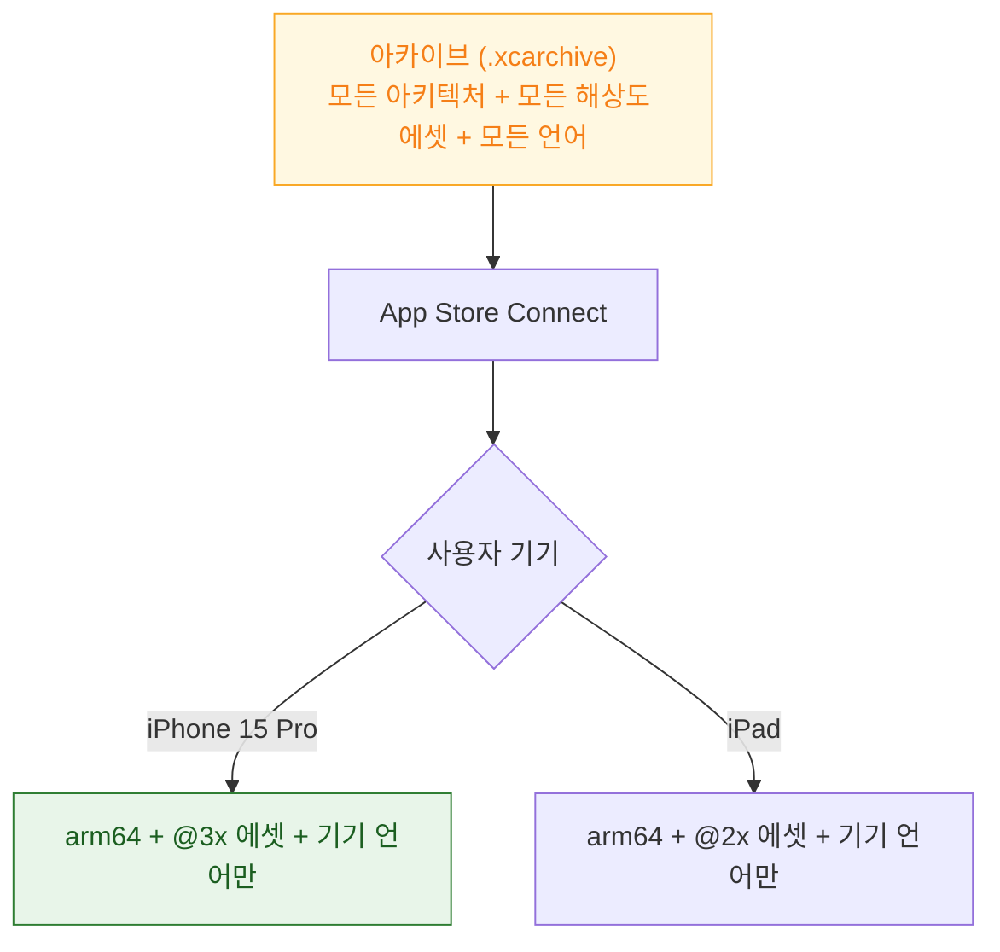

## App Thinning 은 기기별로 필요한 아키텍처와 리소스만 골라 전달한다

### 개념 (What)

개발자가 만드는 아카이브는 **모든 기기를 지원하는 슈퍼셋**이다(여러 아키텍처, 모든 화면 해상도의 에셋, 모든 언어). 사용자가 실제로 받는 것은 그 슈퍼셋이 아니라 **자기 기기에 맞게 골라낸 조각**이다. 이 과정이 **App Thinning**이다.



**개발자는 관여하지 않는다.** App Store Connect 가 자동으로 조각을 만들고, 사용자는 자기 몫만 내려받는다.

### 왜 필요한가 (Why)

셀룰러 다운로드 한도, 저장 공간, 심사 심리 모두 앱 크기에 민감하다. App Thinning 이 자동으로 해 주는 부분과 **개발자가 직접 설계해야 하는 부분**을 구분하는 것이 핵심이다.

| 구분 | 자동인가 |
| :--- | :--- |
| 아키텍처 슬라이스 | **자동** (App Store Connect) |
| 화면 해상도별 에셋(@1x/@2x/@3x) | **자동** (Asset Catalog 사용 시) |
| 언어별 지역화 리소스 | **자동** |
| **필요할 때만 받는 대용량 콘텐츠** | **수동 설계 필요** (On-Demand Resources) |

### Asset Catalog 를 안 쓰면 자동화가 깨진다

```
❌ Bundle 에 이미지를 낱개 파일로 추가
   → 모든 해상도가 항상 앱에 포함됨. Thinning 대상 아님

✅ Asset Catalog(.xcassets) 에 등록
   → @1x/@2x/@3x 중 필요한 것만 전달됨
```

**이미지·컬러·데이터 에셋을 Asset Catalog 밖에 두는 순간 자동 씨닝 대상에서 빠진다.** 앱 크기를 줄이려면 먼저 이 규칙을 지키고 있는지 확인한다.

### On-Demand Resources — 수동으로 설계해야 하는 부분

수십~수백 MB 짜리 콘텐츠(게임 레벨, 튜토리얼 영상)를 **처음부터 다 받게 하지 않고, 필요한 시점에만** 받게 하는 메커니즘이다.

```swift
// 태그를 지정해 리소스를 그룹화 (Xcode 에서 에셋에 태그 부여)
let request = NSBundleResourceRequest(tags: ["level-3"])

request.beginAccessingResources { error in
    guard error == nil else { return }
    // 이 시점에는 "level-3" 태그의 리소스가 로컬에 존재한다
    let url = Bundle.main.url(forResource: "level3-map", withExtension: "dat")
    loadLevel(url)
}

// 다 쓴 리소스는 명시적으로 해제해야 공간이 회수된다
request.endAccessingResources()
```

| 상황 | 적합 여부 |
| :--- | :--- |
| 게임의 레벨별 대용량 에셋 | 적합 |
| 초기 진입에 필요 없는 튜토리얼 영상 | 적합 |
| 앱 시작에 항상 필요한 리소스 | **부적합** — 그냥 번들에 포함 |

**태그를 초기 설치 시점에 미리 받게(Initial Install Tags) 지정할 수도 있다.** 무엇을 지연시키고 무엇을 즉시 받을지는 설계 결정이며, 자동으로 최적화되지 않는다.

### 크기를 직접 진단하는 법

```bash
# 아카이브에서 App Store 배포 시 실제 다운로드/설치 크기 추정
xcrun bitcode_strip -r MyApp.app/MyApp -o /tmp/stripped 2>/dev/null || true

# App Store Connect 에서 제공하는 "App Size" 리포트가
# 가장 정확하다 (기기·OS별 실제 다운로드 크기)
```

**App Store Connect 의 App Sizes 리포트**가 가장 신뢰할 수 있는 값이다. 로컬에서 `.ipa` 크기를 재는 것은 씨닝 이전 값이라 실제보다 크게 나온다.

### 크기를 줄이는 우선순위

```
1. Asset Catalog 사용 확인 (자동 씨닝 활성화)
2. 미사용 코드/리소스 제거
3. 큰 미디어는 On-Demand Resources 로 분리
4. 불필요한 동적 프레임워크 제거 (→ pre-main 시간에도 도움)
5. 벡터(PDF/SVG) 에셋으로 다중 해상도 중복 제거
```

네 번째는 [앱 시작 시간](../../01_system_internals/boot-and-runtime/pre-main-launch-time-budget.md)과도 겹치는 이득이다.

### 관찰 가능한 증거

```bash
# 최종 산출물의 실제 바이너리 크기
du -sh MyApp.app/MyApp

# 링크된 동적 프레임워크 개수 (씨닝과 무관하지만 크기·시작시간에 영향)
otool -L MyApp.app/MyApp | wc -l

# Asset Catalog 컴파일 결과 확인
find MyApp.app -name "Assets.car"
```

**App Store Connect > 앱 크기 리포트**에서 실제 사용자가 받는 다운로드 크기를 기기·OS 조합별로 확인한다.

### 연관 문서

- [빌드 설정은 프로젝트·타깃·xcconfig·스킴 네 층을 거친다](build-settings-resolve-through-a-layered-hierarchy.md)
- [App Clip 은 별도 서명과 엄격한 크기 상한을 가진 독립 번들이다](../distribution/app-clip-has-its-own-signing-and-size-limit.md)
- [pre-main 시간은 대부분 dylib 로딩과 static initializer 가 쓴다](../../01_system_internals/boot-and-runtime/pre-main-launch-time-budget.md)

공식 문서: [Reducing your app's size](https://developer.apple.com/documentation/xcode/reducing-your-app-s-size) · [On-Demand Resources](https://developer.apple.com/documentation/foundation/nsbundleresourcerequest)
