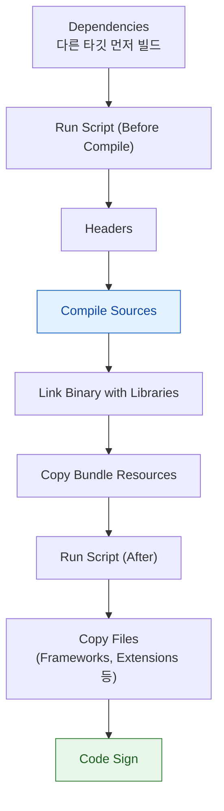

## 빌드 단계는 정해진 순서로 실행되며 스크립트 단계는 실패를 조용히 숨길 수 있다

### 개념 (What)

하나의 타깃 빌드는 **순서가 정해진 단계(phase)의 파이프라인**이다. 순서를 착각하면 "빌드는 되는데 산출물이 이상하다"가 생긴다.



**Code Sign 이 마지막이라는 점이 중요하다.** 리소스나 프레임워크를 늦게 복사하는 스크립트를 넣으면, 서명 이후에 파일이 추가되어 **서명이 깨진 상태로 남을 수 있다.**

### 왜 필요한가 (Why)

**Run Script 단계는 종료 코드로만 성공/실패를 판단한다.** 스크립트 안의 명령이 실패해도 스크립트 자체가 0 을 반환하면 빌드는 계속 진행되고, 문제는 나중에 실행 시점에야 드러난다.

```bash
# ❌ 중간 명령이 실패해도 스크립트는 계속 진행 → exit 0 반환
cp missing-file.json "${BUILT_PRODUCTS_DIR}/${PRODUCT_NAME}.app/"
echo "완료"
# missing-file.json 이 없어서 cp 는 실패했지만, 이 스크립트는 성공으로 보고된다

# ✅ 실패 시 즉시 중단
set -e
cp missing-file.json "${BUILT_PRODUCTS_DIR}/${PRODUCT_NAME}.app/"
```

**`set -e` 를 모든 Run Script 맨 앞에 넣는 것**이 CI 안정성의 기본이다. 없으면 실패가 조용히 다음 단계로 넘어가 진짜 원인과 먼 곳에서 문제가 드러난다.

### 입력/출력 파일을 명시해야 하는 이유

```
Input Files:   $(SRCROOT)/Resources/config.json
Output Files:  $(DERIVED_FILE_DIR)/config-generated.swift
```

명시하지 않으면 Xcode 는 **매 빌드마다 스크립트를 무조건 실행**한다. 명시하면 입력이 안 바뀌었을 때 **건너뛴다.**

| 상태 | 빌드 속도 | 위험 |
| :--- | :--- | :--- |
| 입출력 미지정 | 느림 (매번 실행) | 없음 |
| 입출력 지정 + 정확 | 빠름 (증분 빌드) | — |
| **입출력 지정 + 부정확** | 빠름 | **캐시된 결과를 잘못 재사용** |

세 번째가 함정이다. 실제로는 바뀌었는데 명시한 입력 목록에 없으면 스크립트가 건너뛰어져 **오래된 산출물이 그대로 남는다.**

### 코드 생성 스크립트의 순서 문제

```
# ❌ Compile Sources 뒤에 코드 생성 스크립트를 두면
#    생성된 파일이 이번 빌드의 컴파일에 포함되지 않는다 (한 빌드 늦게 반영)

# ✅ Compile Sources 앞에 두거나, Build Phase 대신
#    Build Tool Plugin(SPM) 사용을 고려한다
```

SPM 의 [Build Tool Plugin](../apple-swift-package-manager.md) 은 이 순서 문제를 구조적으로 해결한다. Xcode 가 의존 관계를 추적해 생성 파일을 컴파일 이전에 확실히 포함시킨다.

### CI 에서 자주 나는 문제

| 증상 | 원인 |
| :--- | :--- |
| 로컬은 되는데 CI 만 실패 | 스크립트가 로컬에만 있는 도구(`brew` 로 설치한 것 등)에 의존 |
| 병렬 빌드에서 간헐적 실패 | 여러 타깃이 같은 파일에 동시에 쓰기 (Output Files 미지정) |
| Xcode Cloud 에서만 실패 | 샌드박스 환경이라 네트워크·파일시스템 접근이 제한됨 |

```bash
# 스크립트가 의존하는 도구가 CI 이미지에 있는지 확인
which swiftlint || echo "CI 이미지에 swiftlint 없음"
```

**CI 러너의 PATH 는 로컬 셸과 다르다.** Homebrew 로 설치한 도구가 스크립트에서 "command not found"로 실패하는 것이 전형적이다.

### 관찰 가능한 증거

```bash
# 각 단계의 소요 시간을 포함해 상세 로그로 빌드
xcodebuild -scheme MyApp -configuration Release build \
  | xcbeautify   # 또는 원본 로그를 그대로 저장해 분석

# 특정 스크립트 단계만 격리해 디버깅 (Xcode UI)
# Report Navigator > 최근 빌드 > 각 Run Script 단계를 펼쳐 실제 출력 확인
```

Xcode 의 **Report Navigator** 에서 각 스크립트 단계를 펼치면 실제 stdout/stderr 가 그대로 보인다. `set -e` 없이 조용히 실패한 명령을 찾는 첫 단계다.

### 연관 문서

- [빌드 설정은 프로젝트·타깃·xcconfig·스킴 네 층을 거친다](build-settings-resolve-through-a-layered-hierarchy.md)
- [apple-swift-package-manager](../apple-swift-package-manager.md) - Build Tool Plugin
- [08-signing-and-distribution-failure](../../00_foundations/diagnostic-runbooks/08-signing-and-distribution-failure.md)

공식 문서: [Customizing the build phases of a target](https://developer.apple.com/documentation/xcode/customizing-the-build-phases-of-a-target)
