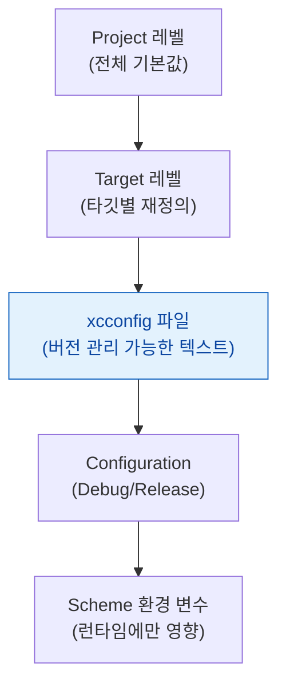

## 빌드 설정은 프로젝트·타깃·xcconfig·스킴 네 층을 거치며 가장 구체적인 것이 이긴다

### 개념 (What)

Xcode 빌드 설정(build setting) 값은 한곳에서 정의되지 않는다. **여러 층에서 같은 키에 값을 줄 수 있고, 가장 구체적인 층이 이긴다.**



| 층 | 특징 | 버전 관리 |
| :--- | :--- | :--- |
| Project | 모든 타깃의 기본값 | `.pbxproj` (바이너리에 가까운 XML, diff 어려움) |
| Target | 프로젝트 값을 재정의 | 동일 |
| **xcconfig** | 텍스트 파일로 값을 정의, 프로젝트/타깃에 적용 | **텍스트, diff 쉬움** |
| Configuration | Debug/Release 별 분기 | — |
| Scheme 환경 변수 | 실행 시점에만 (컴파일에는 영향 없음) | 스킴 파일 (공유 여부 선택) |

### 왜 필요한가 (Why)

**`.pbxproj` 는 여러 사람이 동시에 건드리면 병합 충돌이 잦고 diff 가 읽기 어렵다.** xcconfig 는 평범한 텍스트라 리뷰와 병합이 쉽다. 팀 프로젝트에서 설정을 xcconfig 로 옮기는 것이 표준 관행이다.

```
// Debug.xcconfig
SWIFT_ACTIVE_COMPILATION_CONDITIONS = DEBUG
API_BASE_URL = https://api-dev.example.com
ENABLE_BITCODE = NO

// Release.xcconfig
SWIFT_ACTIVE_COMPILATION_CONDITIONS =
API_BASE_URL = https://api.example.com

// 다른 xcconfig 를 포함할 수 있다
#include "Secrets.xcconfig"   // 이 파일만 .gitignore
```

**API 키처럼 커밋하면 안 되는 값**은 별도 xcconfig 로 분리해 `.gitignore` 하고, `#include` 로 끌어오는 것이 표준 패턴이다.

### 설정값을 코드에서 읽기

xcconfig 값은 `Info.plist` 를 거쳐야 런타임에 읽을 수 있다. 직접 코드 상수로 넣으면 안 된다.

```
// xcconfig
API_BASE_URL = https://api.example.com
```

```xml
<!-- Info.plist -->
<key>APIBaseURL</key>
<string>$(API_BASE_URL)</string>
```

```swift
// 런타임에 읽기
let url = Bundle.main.object(forInfoDictionaryKey: "APIBaseURL") as? String
```

### 컴파일 조건 분기

```swift
#if DEBUG
    let baseURL = "https://api-dev.example.com"
#else
    let baseURL = "https://api.example.com"
#endif

// 커스텀 플래그 (xcconfig 의 SWIFT_ACTIVE_COMPILATION_CONDITIONS 에 추가)
#if STAGING
    // ...
#endif
```

이 분기는 **컴파일 시점에 코드 자체가 사라진다.** 런타임 `if` 와 달리 바이너리 크기와 최적화에 영향을 준다.

### 흔한 실수 — 값이 안 바뀌는 이유

| 증상 | 원인 |
| :--- | :--- |
| xcconfig 를 고쳤는데 반영 안 됨 | 빌드 캐시. Clean Build Folder 필요 |
| Debug 는 되는데 Release 는 다름 | Configuration 별로 다른 xcconfig 를 참조 중 |
| CI 에서만 다른 값 | CI 가 다른 스킴/설정으로 빌드 중 |
| 타깃마다 값이 다름 | Target 레벨 재정의가 xcconfig 위에 있음 (**Target > xcconfig**) |

> [!WARNING] Target 의 직접 설정이 xcconfig 보다 우선한다
> xcconfig 를 프로젝트에 연결해도, **Target 의 Build Settings 탭에서 같은 키를 직접 건드린 적이 있으면 그 값이 남아 xcconfig 를 덮는다.** "이상하게 xcconfig 가 안 먹힌다"의 대부분이 이것이다. Target 설정에서 해당 항목이 검은 글씨(재정의됨)인지 확인한다.

### 관찰 가능한 증거

```bash
# 특정 타깃/설정의 최종 결정값을 전부 출력 (계층을 다 푼 결과)
xcodebuild -showBuildSettings -scheme MyApp -configuration Release | grep API_BASE_URL

# 어떤 xcconfig 가 실제로 적용되는지
xcodebuild -showBuildSettings -scheme MyApp | grep -i xcconfig
```

**Xcode UI 에서**: Build Settings 탭에서 각 항목 옆의 값 출처가 회색(상속)인지 검은색(재정의)인지로 어느 층이 이겼는지 알 수 있다.

### 연관 문서

- [빌드 단계는 순서대로 실행되며 스크립트 단계가 실패를 숨길 수 있다](build-phases-run-in-order-and-can-hide-failures.md)
- [App Thinning 은 기기별로 필요한 조각만 골라 전달한다](app-thinning-delivers-only-what-the-device-needs.md)
- [apple-swift-package-manager](../apple-swift-package-manager.md)

공식 문서: [Configuring the build settings of a target](https://developer.apple.com/documentation/xcode/configuring-the-build-settings-of-a-target) · [Adding a build configuration file to your project](https://developer.apple.com/documentation/xcode/adding-a-build-configuration-file-to-your-project)
