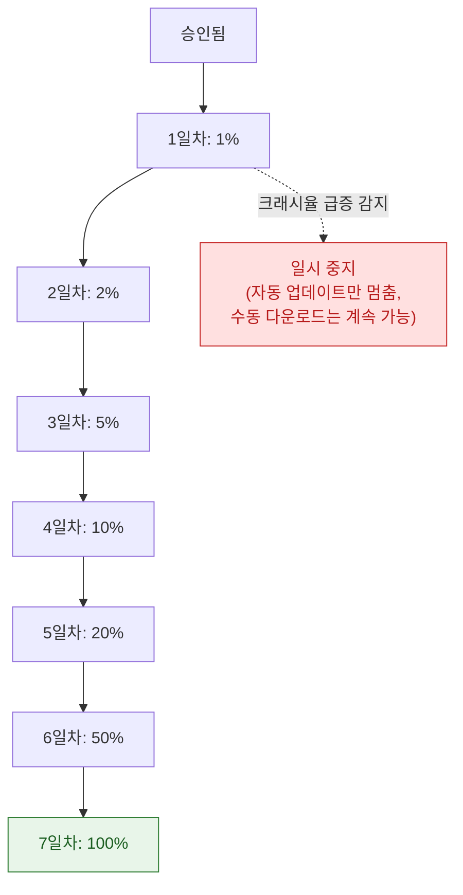
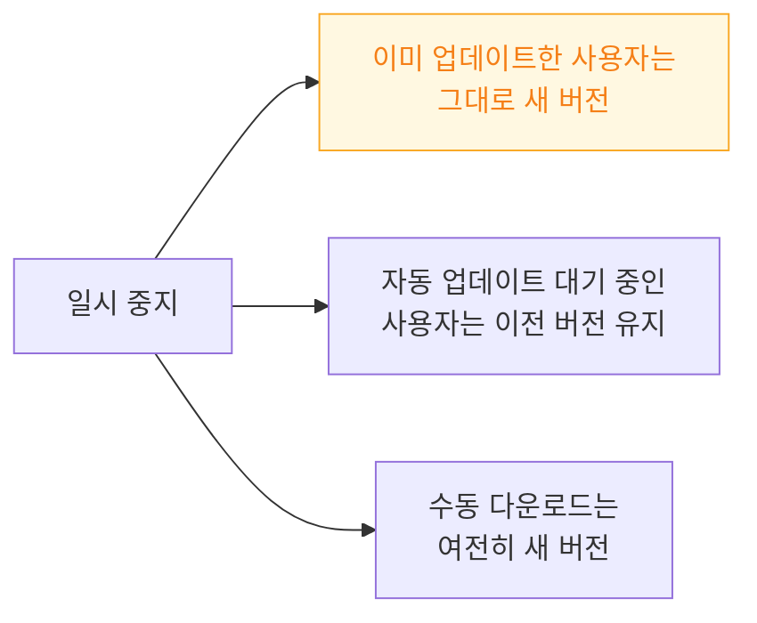

## 단계적 출시는 문제를 전체 사용자에게 퍼뜨리기 전에 좁은 범위에서 잡는다

### 개념 (What)

새 버전을 승인 즉시 **전체 사용자에게 한 번에** 밀어붙이는 대신, **7일에 걸쳐 점진적으로 비율을 늘리며** 자동 업데이트 대상을 넓히는 배포 방식이다.



**수동으로 App Store 에서 검색해 받는 사용자는 이 비율과 무관하게 항상 최신 버전을 받는다.** 단계적 출시가 제어하는 것은 오직 **자동 업데이트 대상 비율**이다.

### 왜 필요한가 (Why)

App Store 심사가 기능적 버그나 성능 회귀를 걸러내지 못한다. **심사는 정책 위반을 보지, 코드 품질을 보지 않는다.** 그래서 배포 자체를 안전망으로 설계해야 한다.

| 배포 방식 | 문제 발견 시 영향 범위 |
| :--- | :--- |
| 즉시 100% | **전체 사용자** |
| 단계적 출시 | 초기엔 1~2% |

### 일시 중지는 롤백이 아니다



**"일시 중지 = 이전 버전으로 되돌림"이 아니다.** 이미 받은 사용자는 그대로 새 버전을 쓴다. 진짜 위기 대응은 **새 빌드를 만들어 다시 심사받는 것**뿐이다. App Store 에는 "이전 버전으로 강제 롤백"하는 기능이 없다.

이것이 [서버 쪽 기능 플래그](../../04_system_services/apple-background-tasks.md)나 [원격 설정으로 위험한 코드 경로를 끌 수 있게 설계](../review/rejections-cluster-around-a-few-guidelines.md)해 두는 것이 중요한 이유다. 클라이언트 배포는 되돌릴 수 없지만, 서버 스위치는 즉시 되돌릴 수 있다.

### 지표를 무엇으로 판단할 것인가

일시 중지는 자동이 아니라 **개발자가 App Store Connect 에서 수동으로 결정**한다. 판단 근거:

| 신호 | 확인 위치 |
| :--- | :--- |
| 크래시율 급증 | Xcode Organizer, 자체 크래시 리포터 |
| [워치독/Jetsam 종료 급증](../../01_system_internals/ipc-and-process/watchdog-termination-codes.md) | MetricKit, Organizer |
| 앱스토어 평점 급락 | App Store Connect 리뷰 |
| 서버 오류율 급증 | 자체 백엔드 모니터링 (새 버전이 API 계약을 깼을 가능성) |

**1~2% 구간에서 이 신호들을 특히 주의 깊게 본다.** 이 시점에 잡으면 영향받은 사용자가 최소다.

### 강제 업데이트가 필요할 때

보안 취약점이나 서버 API 호환성 파괴처럼 **구버전이 아예 동작하면 안 되는 경우**, 단계적 출시로는 대응 속도가 부족하다.

```swift
// 서버가 최소 지원 버전을 내려주고, 앱이 스스로 강제 업데이트 화면을 띄운다
if currentVersion < minimumSupportedVersion {
    showForceUpdateScreen()   // App Store 딥링크로 유도
}
```

App Store 배포 방식 자체에는 강제 업데이트 기능이 없으므로, **이런 안전장치는 앱 코드에 미리 심어 둬야 한다.** 위기 상황에 처음 만들면 이미 늦다.

### 관찰 가능한 증거

**App Store Connect > 버전 정보 > 단계적 출시** 에서 현재 비율과 진행 상태를 확인한다.

```
# Xcode Organizer 에서 새 버전을 이전 버전과 비교
Window > Organizer > Crashes / Hangs / Launch Time
  → 버전을 필터로 골라 회귀 여부 확인
```

**출시 첫날은 이 화면을 주기적으로 확인하는 것이 관행이다.** 1% 구간에서 이상 신호가 보이면 그 즉시 일시 중지를 검토한다.

### 연관 문서

- [TestFlight 는 자체 심사를 거치며 App Store 심사와 별개다](testflight-review-is-separate-from-app-store-review.md)
- [MetricKit 은 개발 기기에서 재현할 수 없는 실사용자 데이터를 모은다](../../06_testing_performance/performance/metrickit-collects-what-you-cannot-reproduce.md)
- [워치독 종료는 예외 코드로 원인 구간을 구분할 수 있다](../../01_system_internals/ipc-and-process/watchdog-termination-codes.md)
- [08-archive-to-testflight-to-update](../../00_foundations/worked-examples/08-archive-to-testflight-to-update.md)

공식 문서: [Release a version update in phases](https://developer.apple.com/help/app-store-connect/managing-your-apps-availability/release-a-version-update-in-phases)
