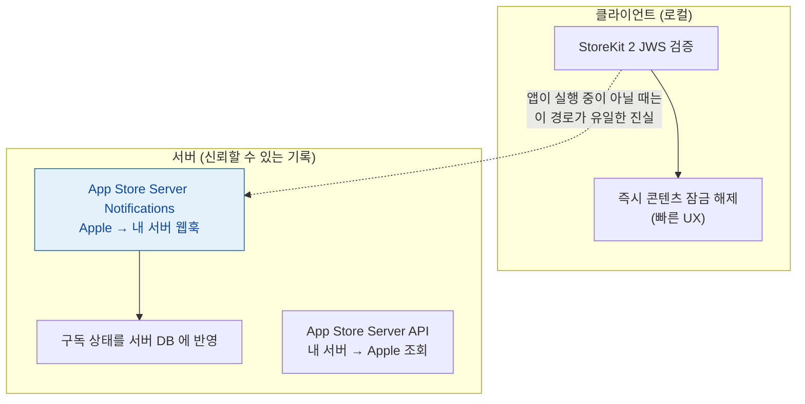
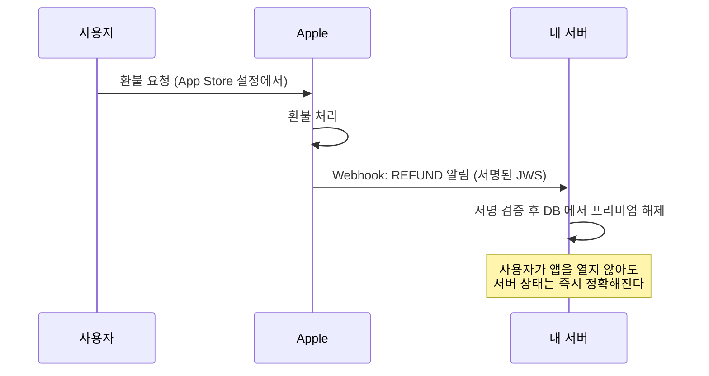

## 서버 검증은 로컬 검증으로 부족한 환불·해지·크로스플랫폼 동기화에 필요하다

### 개념 (What)

[StoreKit 2 의 로컬 JWS 검증](storekit2-verifies-transactions-with-signed-jws.md)은 "이 구매가 진짜인가"를 확인하는 데 충분하다. 그러나 **앱이 실행되고 있지 않은 동안 일어난 일**은 로컬 검증만으로 알 수 없다.

- 사용자가 환불을 받았다 (앱을 열지 않은 채로)
- 구독이 해지되었다
- 다른 플랫폼(웹, Android)과 구매 상태를 동기화해야 한다

이런 경우를 위해 **App Store Server API** 와 **App Store Server Notifications** 가 있다.



### 왜 필요한가 (Why)

**"클라이언트만 믿으면 안 되는" 두 가지 이유가 있다.**

1. **환불/해지는 앱 실행과 무관하게 일어난다.** 환불받은 사용자가 앱을 다시 열지 않으면, 로컬 검증만으로는 영원히 프리미엄 상태로 남는다.
2. **디바이스 시간은 조작될 수 있다.** 로컬 검증은 서명 위조는 막지만, "이 사용자가 지금 유효한 구독자인가"라는 실시간 질문에는 서버의 신뢰할 수 있는 기록이 필요하다.

### App Store Server Notifications — Apple 이 먼저 알려준다



주요 알림 타입:

| 타입 | 의미 |
| :--- | :--- |
| `SUBSCRIBED` | 신규 구독 시작 |
| `DID_RENEW` | 갱신 성공 |
| `EXPIRED` | 만료 |
| `REFUND` | **환불** — 즉시 접근 취소 필요 |
| `GRACE_PERIOD_EXPIRED` | 유예 기간 종료 |
| `REVOKE` | 가족 공유에서 제외됨 |

**서버가 이 웹훅을 받아 DB 를 갱신**하고, 클라이언트는 로그인 시 서버에 상태를 물어 최종 진실로 삼는다.

### App Store Server API — 필요할 때 조회한다

웹훅을 놓쳤거나 과거 이력을 확인해야 할 때, 서버가 능동적으로 Apple 에 질의한다.

```
GET /inApps/v1/subscriptions/{originalTransactionId}
→ 현재 구독 상태, 갱신 이력, 유예 기간 여부를 JSON 으로 반환
```

인증은 **App Store Connect API 키**로 서명한 JWT 를 쓴다. 클라이언트 자격 증명이 아니라 **서버가 독립적으로 보유**하는 키다.

### 클라이언트-서버 역할 분담

| | 클라이언트 (StoreKit 2) | 서버 (App Store Server API/Notifications) |
| :--- | :--- | :--- |
| 목적 | **빠른 UX** — 구매 즉시 반응 | **신뢰할 수 있는 최종 상태** |
| 검증 방식 | 로컬 JWS 서명 검증 | Apple 서버 통신 |
| 앱 미실행 시 | 알 수 없음 | 웹훅으로 계속 갱신됨 |
| 크로스플랫폼 동기화 | 불가 | **가능** (서버가 중앙 기록 보유) |

**콘텐츠 잠금 해제는 클라이언트가 즉시 하고, 최종 권한 판정은 서버가 한다**는 이중 구조가 표준이다. 서버만 쓰면 UX 가 느리고, 클라이언트만 쓰면 환불·해지에 취약하다.

### 자체 백엔드가 없는 앱이라면

서버를 두기 어렵다면 **[`Transaction.currentEntitlements`](storekit2-verifies-transactions-with-signed-jws.md)를 앱 시작마다 다시 확인**하는 것이 최소한의 방어선이다. 환불이 즉시 반영되지는 않지만(다음 실행 시 반영), 서버 없이 얻을 수 있는 가장 현실적인 정확도다.

### 관찰 가능한 증거

```bash
# 서버가 받은 웹훅 페이로드 서명 검증 (JWS)
# Apple 이 제공하는 라이브러리 또는 JWT 검증 로직으로 서명자 인증서 체인 확인

# App Store Server API 호출 예 (JWT 는 별도 생성)
curl -H "Authorization: Bearer $JWT" \
  "https://api.storekit.itunes.apple.com/inApps/v1/subscriptions/$ORIGINAL_TRANSACTION_ID"
```

**App Store Connect > 앱 내 구입 > 서버 알림 URL** 에서 웹훅 엔드포인트를 등록하고, **Sandbox 환경으로 먼저 검증**한다. Sandbox 알림과 Production 알림은 별도 URL 을 가질 수 있다.

### 연관 문서

- [StoreKit 2 는 서버 왕복 없이 서명된 JWS 로 구매를 로컬 검증한다](storekit2-verifies-transactions-with-signed-jws.md)
- [APNs 토큰은 기기·번들·환경 세 가지에 묶인다](../../04_system_services/notifications/apns-token-is-bound-to-environment-and-bundle.md) - 같은 웹훅/서버 검증 패턴
- [apple-networking-and-cloud](../../03_data_networking/apple-networking-and-cloud.md)

공식 문서: [App Store Server API](https://developer.apple.com/documentation/appstoreserverapi) · [App Store Server Notifications](https://developer.apple.com/documentation/appstoreservernotifications)
