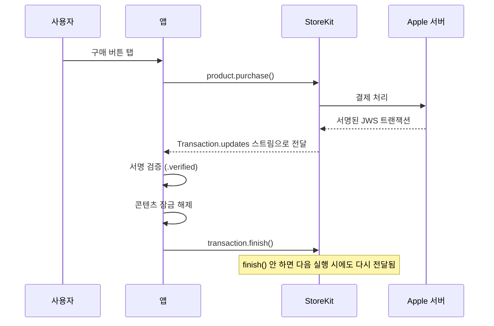

## StoreKit 2 는 서버 왕복 없이 서명된 JWS 로 구매를 로컬 검증한다

### 개념 (What)

StoreKit 1 시절에는 영수증(receipt) 을 **Apple 서버에 보내 검증**해야 했다. StoreKit 2 는 다르다. 각 트랜잭션이 **Apple 이 서명한 JWS(JSON Web Signature)** 형태로 기기에 직접 오고, 앱은 그 서명을 **로컬에서** 검증한다.

```swift
for await result in Transaction.updates {
    switch result {
    case .verified(let transaction):
        // Apple 의 서명을 통과한 것이 확인됨 — 위조 불가능
        await unlockContent(for: transaction.productID)
        await transaction.finish()          // ★ 반드시 호출
    case .unverified(let transaction, let error):
        // 서명 검증 실패 — 신뢰하면 안 됨
        log("검증 실패: \(error)")
    }
}
```

### 왜 필요한가 (Why)

1. **서버 없이도 신뢰할 수 있다**: 자체 백엔드가 없는 앱도 안전하게 구매를 검증할 수 있다.
2. **`transaction.finish()` 를 안 부르면 계속 돈다**: 완료 처리하지 않은 트랜잭션은 `Transaction.updates` 스트림에 **계속 다시 나타난다.** 사용자가 매번 같은 구매를 또 받는 것처럼 보이는 버그의 원인이다.
3. **복원과 신규 구매가 같은 스트림이다**: `Transaction.updates` 는 새 구매뿐 아니라 다른 기기에서의 구매, 갱신, 환불도 전달한다. **앱 시작 시 이 스트림을 구독하지 않으면 다른 기기 구매를 놓친다.**

### 트랜잭션의 생애



### 앱 시작 시 반드시 구독한다

```swift
// AppDelegate 또는 App 초기화 시점
var updateListenerTask: Task<Void, Never>?

func startTransactionListener() {
    updateListenerTask = Task.detached {
        for await result in Transaction.updates {
            await handle(result)
        }
    }
}
```

**이 리스너가 없으면**: 사용자가 웹에서 구매하거나 다른 기기에서 구매한 뒤 앱을 열어도 콘텐츠가 잠금 해제되지 않는다. `Transaction.updates` 는 [비구조적 `Task`](../../01_language_concurrency/concurrency/structured-concurrency-task-tree.md)로 앱 수명 내내 살려 둬야 한다.

### 현재 보유 항목 조회 — currentEntitlements

과거 구매 이력을 서버에 저장하지 않아도, StoreKit 이 **현재 유효한 항목**을 알려준다.

```swift
for await result in Transaction.currentEntitlements {
    if case .verified(let transaction) = result {
        unlockedProductIDs.insert(transaction.productID)
    }
}
```

구독형 상품은 만료되면 이 목록에서 자동으로 빠진다. **직접 만료일을 계산할 필요가 없다.**

### 구독 갱신과 유예 기간

```swift
let statuses = try await product.subscription?.status ?? []
for status in statuses {
    switch status.state {
    case .subscribed: enablePremium()
    case .inGracePeriod:
        // 결제는 실패했지만 유예 기간 — 기능은 계속 제공하며 결제 갱신 유도
        showBillingIssueNotice()
    case .inBillingRetryPeriod: showBillingIssueNotice()
    case .expired, .revoked: disablePremium()
    default: break
    }
}
```

**`inGracePeriod` 를 놓치면** 결제 실패 즉시 기능을 끊게 되어, 정상적으로 곧 해결될 결제 문제로 사용자를 잃는다.

### 프로모션 코드와 Ask-to-Buy

가족 공유의 **Ask to Buy**(자녀 구매 승인 대기)는 구매가 즉시 완료되지 않고 **보류 상태**로 남는다.

```swift
// 구매 결과가 pending 일 수 있다 — 실패가 아니다
switch try await product.purchase() {
case .success(let verification): await handle(verification)
case .userCancelled: break
case .pending: showAwaitingApprovalNotice()   // 승인 대기 중
@unknown default: break
}
```

### 관찰 가능한 증거

```swift
// StoreKit 테스트 구성 파일로 서버 없이 로컬 시뮬레이션
// Xcode: File > New > File > StoreKit Configuration File
// Scheme > Run > Options > StoreKit Configuration 에서 선택
```

**StoreKit Configuration 파일**을 쓰면 실제 App Store Connect 상품 없이도 구매·갱신·환불·유예 기간을 시뮬레이션할 수 있다. Xcode 의 **Debug > StoreKit** 메뉴로 트랜잭션을 강제로 만료시키거나 환불시켜 각 분기를 테스트한다.

```bash
log stream --device --predicate 'subsystem == "com.apple.storekit"' --info
```

### 연관 문서

- [영수증 검증은 로컬 우선이지만 서버 검증이 필요한 순간이 있다](server-side-verification-is-needed-for-refunds-and-cross-platform.md)
- [구조적 동시성은 작업 수명을 스코프에 묶고 취소를 트리로 전파한다](../../01_language_concurrency/concurrency/structured-concurrency-task-tree.md)
- [apple-app-intents](../../04_system_services/apple-app-intents.md)

공식 문서: [StoreKit](https://developer.apple.com/documentation/storekit) · [In-App Purchase](https://developer.apple.com/documentation/storekit/in-app-purchase)
