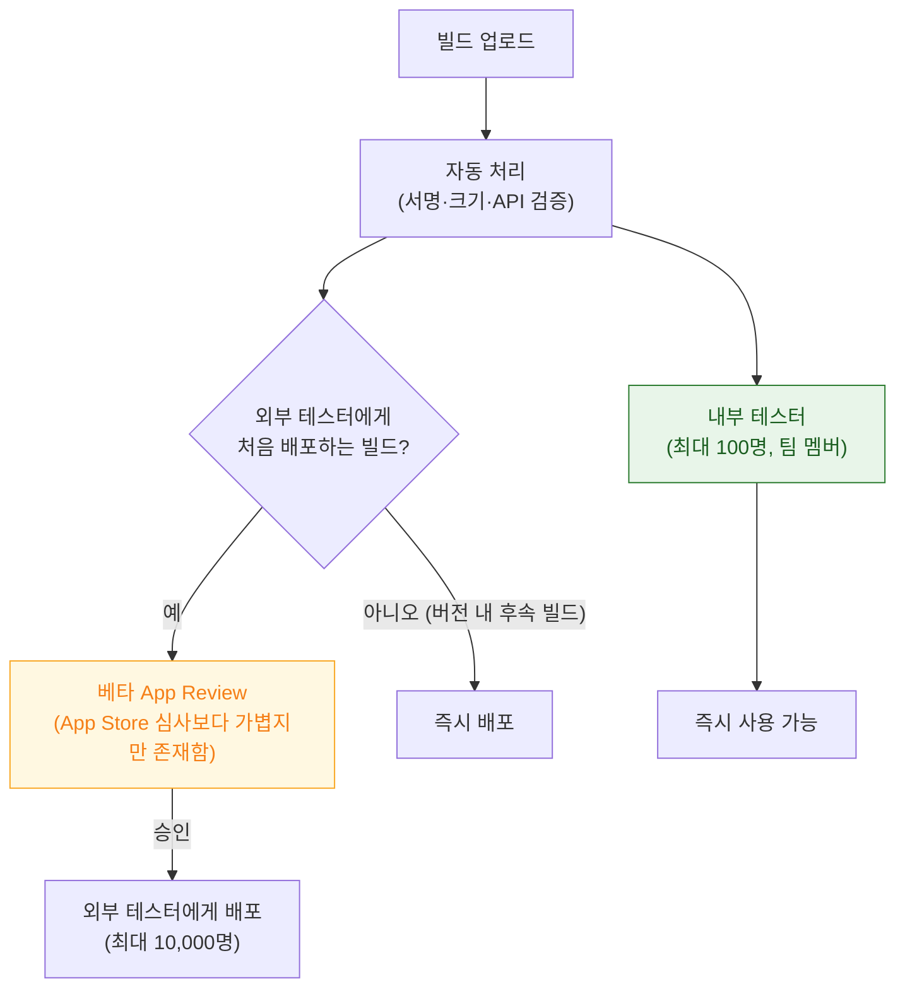
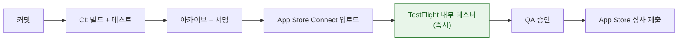

## TestFlight 는 자체 심사를 거치며 App Store 심사와 별개다

### 개념 (What)

"TestFlight 는 심사 없이 바로 배포된다"는 흔한 오해다. **내부 테스터(팀원, 100명까지)만 심사 없이 즉시 받고, 외부 테스터에게 처음 배포하는 빌드는 별도의 베타 심사를 거친다.**



### 왜 필요한가 (Why)

**개발 빌드에서 검증되지 않는 것들이 TestFlight 에서만 드러난다.**

| 검증되는 것 | 개발 빌드 | TestFlight |
| :--- | :--- | :--- |
| [프로덕션 APNs 토큰](../../04_system_services/notifications/apns-token-is-bound-to-environment-and-bundle.md) | ❌ | ✅ |
| [배포 프로파일 entitlement](../signing/three-party-trust-chain-must-agree.md) | ❌ | ✅ |
| Release 최적화에서만 나는 버그 | ❌ | ✅ |
| 실제 다운로드 크기 | ❌ | ✅ (App Store Connect 표시) |
| 외부 테스터의 실기기 다양성 | ❌ | ✅ |

**"개발 빌드 테스트만으로는 부족하다"** — TestFlight 를 거치지 않고 App Store 심사에 바로 제출하면 이 검증들이 프로덕션에서 처음 드러난다.

### 빌드 만료

TestFlight 빌드는 **업로드 후 90일이 지나면 만료**되어 테스터가 더 이상 실행할 수 없다. 장기 베타 프로그램을 운영한다면 주기적으로 새 빌드를 올려야 한다.

### 테스터 그룹과 피드백

```
내부 테스터 그룹: 팀원. App Store Connect 계정 필요, 심사 없음
외부 테스터 그룹: 이메일 초대 또는 공개 링크. 최대 10,000명

각 그룹에 서로 다른 빌드를 배정할 수 있다
→ 단계적 검증 (내부 → 소규모 외부 → 대규모 외부)
```

테스터가 앱 안에서 흔드는 제스처(shake)로 스크린샷과 함께 피드백을 남기면 **App Store Connect 에 자동 첨부**된다. 크래시 로그도 자동 수집된다.

### 베타 심사에서 반려되는 이유

App Store 본심사보다 기준이 느슨하지만 완전히 없는 것은 아니다.

| 반려 사유 | 대응 |
| :--- | :--- |
| 명백히 미완성 (플레이스홀더만 있음) | 최소 동작하는 상태로 제출 |
| 테스트 계정 정보 누락 | App Review 정보에 로그인 정보 기재 |
| 크래시 즉시 발생 | 기본 흐름 최소 검증 후 제출 |
| 결제 관련 정책 위반 | [In-App Purchase 규칙](../../04_system_services/apple-app-intents.md) 사전 확인 |

**Review 노트에 테스트 계정과 재현 절차를 구체적으로 남기면** 반려 왕복이 크게 줄어든다. 이것은 본심사에도 그대로 적용된다.

### CI/CD 파이프라인에서의 위치



`xcrun altool` 또는 `xcrun notarytool`(macOS 는 별개) 대신 iOS 업로드는 **`xcodebuild -exportArchive` + App Store Connect API** 또는 `fastlane` 류 도구로 자동화하는 것이 일반적이다.

```bash
xcodebuild -exportArchive \
  -archivePath build/MyApp.xcarchive \
  -exportOptionsPlist ExportOptions.plist \
  -exportPath build/export

xcrun altool --upload-app -f build/export/MyApp.ipa \
  -t ios --apiKey "$KEY_ID" --apiIssuer "$ISSUER_ID"
```

### 관찰 가능한 증거

```bash
# 업로드 상태와 처리 결과 확인
xcrun altool --validate-app -f build/export/MyApp.ipa \
  -t ios --apiKey "$KEY_ID" --apiIssuer "$ISSUER_ID"
```

**App Store Connect > TestFlight** 탭에서 각 빌드의 처리 상태(Processing/Ready/Missing Compliance/Invalid Binary)를 확인한다. `Missing Compliance` 는 암호화 사용 신고가 필요하다는 뜻이다 → [수출 규정](../review/export-compliance-applies-to-encryption-not-just-cryptography-apis.md)

### 연관 문서

- [배포 채널이 서명 방식과 검증 절차를 결정한다](../signing/distribution-channel-determines-signing-and-review.md)
- [단계적 출시는 문제를 전체 배포 전에 좁은 범위에서 잡는다](phased-release-limits-blast-radius.md)
- [08-signing-and-distribution-failure](../../00_foundations/diagnostic-runbooks/08-signing-and-distribution-failure.md)
- [08-archive-to-testflight-to-update](../../00_foundations/worked-examples/08-archive-to-testflight-to-update.md)

공식 문서: [Distributing your app for beta testing and releases](https://developer.apple.com/documentation/xcode/distributing-your-app-for-beta-testing-and-releases)
