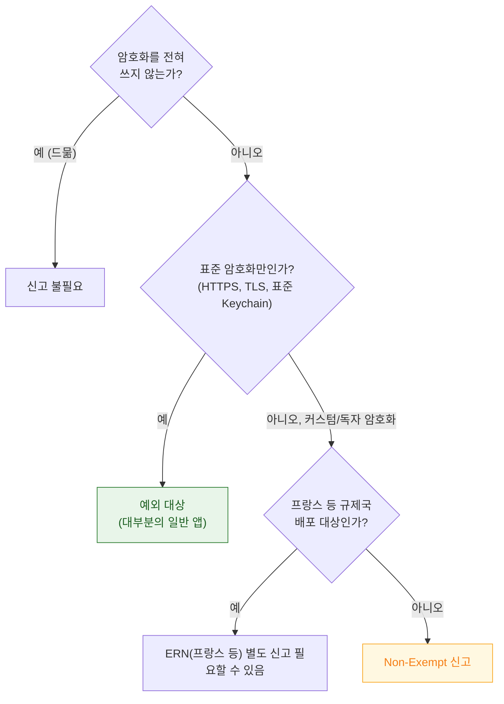

## 수출 규정 신고는 암호학 API 사용이 아니라 실제 암호화 사용 여부로 판정한다

### 개념 (What)

미국 수출관리규정(EAR) 때문에, 암호화를 쓰는 소프트웨어는 **분류 신고**가 필요하다. Apple 은 이것을 앱 업로드마다 묻는 질문으로 자동화했다.

핵심 오해: **"HTTPS 만 쓴다"도 암호화 사용이다.** `NSURLSession`, `TLS`, Keychain 조차 이 판정에 포함된다. "암호학을 직접 구현했는가"가 아니라 **"암호화가 관여하는가"** 로 판정한다.



### 왜 필요한가 (Why)

**신고를 안 하면 업로드 자체가 막힌다.** App Store Connect 는 매 빌드 업로드마다 이 질문에 답하도록 강제한다.

| Info.plist 설정 | 효과 |
| :--- | :--- |
| 키 없음 | **매 업로드마다 수동으로 질문에 답해야 함** |
| `ITSAppUsesNonExemptEncryption = false` | 표준 암호화(HTTPS 등)만 사용, 자동 통과 |
| `ITSAppUsesNonExemptEncryption = true` + `ITSEncryptionExportComplianceCode` | 별도 승인 코드 필요 (커스텀 암호화) |

```xml
<!-- 대부분의 일반 앱: HTTPS·표준 Keychain만 사용 -->
<key>ITSAppUsesNonExemptEncryption</key>
<false/>
```

**이 키를 미리 넣어 두면 CI 에서 업로드가 매번 막히는 것을 방지한다.** 키가 없으면 App Store Connect 웹에서 사람이 직접 답해야 하므로 자동화 파이프라인이 끊긴다.

### 대부분의 앱이 "예외"인 이유

Apple 플랫폼이 제공하는 표준 암호화(TLS, 표준 Keychain API)만 쓰면 **미국 정부가 이미 알고 있는 표준**이라 간소화된 신고(exempt)로 충분하다. **직접 암호화 알고리즘을 구현했거나, 표준이 아닌 독자적 프로토콜**을 쓸 때만 "Non-Exempt" 로 분류된다.

```swift
// ✅ 예외 대상 — 표준 API
URLSession.shared.dataTask(with: httpsURL)
try KeychainWrapper.save(token)

// ⚠️ Non-Exempt 검토 필요 — 직접 구현한 암호화
func customEncrypt(_ data: Data) -> Data { /* 독자 알고리즘 */ }
```

[PQ3](../../05_security_privacy/apple-security-pq3.md) 같은 시스템 제공 암호화는 앱이 직접 구현한 것이 아니므로 이 판정에 영향을 주지 않는다.

### 규제국 배포 시 추가 신고

일부 국가(대표적으로 프랑스)는 미국 수출 규정과 별개로 **자국 반입 신고**를 추가로 요구한다. 암호화를 쓰는 앱을 해당 국가에 배포하려면 **ERN(Export Regulation Number) 또는 유사 서류**를 App Store Connect 에 등록해야 할 수 있다.

이 요구사항은 **매 앱 버전마다가 아니라 앱 단위로 한 번** 처리하는 경우가 많지만, 암호화 방식이 바뀌면 재확인이 필요하다.

### CI 파이프라인에서

```bash
# Info.plist 에 키가 있는지 업로드 전 자동 점검
plutil -p MyApp.app/Info.plist | grep ITSAppUsesNonExemptEncryption \
  || echo "⚠️ 수출 규정 키 누락 — 업로드가 수동 확인을 요구할 수 있음"
```

**CI 로 무인 업로드**를 한다면 이 키가 없을 때 파이프라인이 멈추므로, 빌드 검증 단계에 포함시켜 두는 것이 실무적이다.

### 관찰 가능한 증거

```bash
# 최종 산출물의 신고 상태 확인
plutil -p MyApp.app/Info.plist | grep -A2 ITSAppUsesNonExemptEncryption
```

**App Store Connect 업로드 결과 화면**에서 `Missing Compliance` 상태가 뜨면 이 신고가 누락된 것이다. 빌드 자체는 성공했지만 **TestFlight/심사 제출 전에 반드시 해결**해야 한다.

### 연관 문서

- [심사 반려는 임의적이지 않고 소수의 가이드라인 주변에 몰린다](rejections-cluster-around-a-few-guidelines.md)
- [규제는 지역마다 다르고 무엇을 신고해야 하는지가 다르다](regulations-differ-by-region-and-what-must-be-declared.md)
- [apple-security-pq3](../../05_security_privacy/apple-security-pq3.md)
- [TestFlight 는 자체 심사를 거치며 App Store 심사와 별개다](../distribution/testflight-review-is-separate-from-app-store-review.md)

공식 문서: [Complying with Encryption Export Regulations](https://developer.apple.com/documentation/security/complying-with-encryption-export-regulations)
