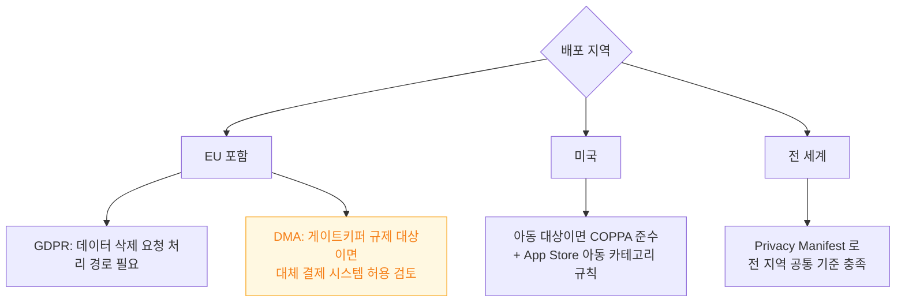
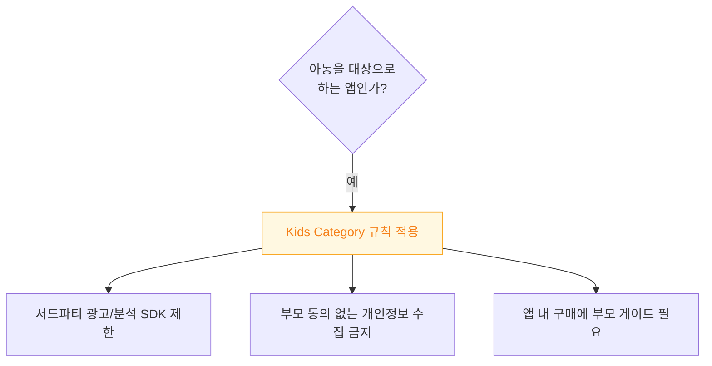

## 규제는 배포 지역마다 다르고 그에 따라 신고·구현 의무가 달라진다

### 개념 (What)

"전 세계에 하나의 빌드"를 배포하는 것이 App Store 의 기본 모델이지만, **규제는 지역별로 다르고 일부는 코드 자체의 분기를 요구한다.** 어느 지역에 배포하느냐에 따라 준수해야 할 의무 목록이 달라진다.

| 규제 | 적용 지역 | 요구하는 것 |
| :--- | :--- | :--- |
| **GDPR** | EU | 데이터 접근·삭제·이동권, 명시적 동의 |
| **DMA** | EU | (게이트키퍼 플랫폼 대상) 대체 결제, 사이드로딩 관련 iOS 변화 |
| **CCPA/CPRA** | 미국 캘리포니아 | 데이터 판매 옵트아웃 |
| **아동 개인정보보호(COPPA 등)** | 미국 등 | 아동 대상 앱의 데이터 수집 제한 |
| **수출 규정** | 배포 국가별 | [암호화 신고](export-compliance-applies-to-encryption-not-just-cryptography-apis.md) |

### 왜 필요한가 (Why)



**GDPR 은 EU 사용자에게만 적용되지만, 앱이 전 세계에 배포되면 어차피 그 요구를 구현해야 한다.** 지역별 빌드를 따로 만들지 않는 이상, 가장 엄격한 지역의 요구가 사실상 전체 기준이 된다.

### GDPR — 구현이 필요한 실제 기능

문서 준수가 아니라 **동작하는 기능**으로 요구된다.

```swift
// 데이터 접근권: 사용자가 자기 데이터를 내보낼 수 있어야 한다
func exportUserData() -> Data { /* 서버 API 또는 로컬 데이터 취합 */ }

// 삭제권: 계정과 연관 데이터를 실제로 지워야 한다
func deleteAccount() async throws {
    try await api.deleteAllUserData()
    clearLocalCache()
}
```

| 권리 | 앱이 구현해야 하는 것 |
| :--- | :--- |
| 접근권 | 데이터 내보내기 기능 |
| **삭제권** | 계정 삭제 시 서버·로컬 데이터 완전 삭제 |
| 동의 철회 | [추적 동의](../../05_security_privacy/apple-app-tracking-privacy.md)와 별개로 명시적 동의 철회 경로 |

**"계정 삭제" 버튼이 실제로 서버 데이터까지 지우지 않으면**, 앱 자체는 통과해도 사업자가 법적 책임을 진다.

### DMA — EU 의 게이트키퍼 규제

**대형 플랫폼(게이트키퍼로 지정된 사업자)에만 적용**되며, 일반 개발자에게 직접적인 코드 의무는 제한적이다. 그러나 이로 인해 iOS 자체의 정책이 EU 지역에서 달라졌다.

```swift
// DMA 영향으로 EU 에서 대체 결제 링크가 허용되는 경우가 생겼다
// (일반 3.1.1 규칙과 달리 EU 특별 조항 적용 가능)
```

**대체 앱 마켓, 사이드로딩, 대체 결제**가 EU 지역에서만 다르게 동작할 수 있다는 것이 핵심이며, 해당되는 앱은 App Store Connect 에서 지역별 조건을 별도로 검토해야 한다.

### 아동 대상 앱 — 별도 카테고리 규칙



**일반 앱보다 훨씬 엄격한 심사**를 받는다. 광고 SDK 하나가 사용자 식별자를 수집하는 것만으로도 반려될 수 있다.

### Privacy Manifest — 지역 무관 공통 기반

지역별 규제가 제각각이어도, [Privacy Manifest](../../05_security_privacy/apple-privacy-and-tcc-details.md) 는 **모든 지역에 공통으로 요구되는 최소 선언**이다. 이것부터 정확히 하면 대부분의 지역별 요구의 절반은 이미 충족된다.

### 관찰 가능한 증거

```bash
# Privacy Manifest 존재 확인 (전 지역 공통 최소 요건)
find MyApp.app -name "PrivacyInfo.xcprivacy"

# App Store Connect 에서 배포 지역 목록 확인 및 조정
# (특정 규제가 부담스러운 지역은 배포 대상에서 제외하는 것도 선택지)
```

**App Store Connect > 가격 및 지역 가용성**에서 배포 지역을 좁히는 것도 규제 부담을 낮추는 실무적 방법이다. 모든 지역에 배포할 의무는 없다.

### 연관 문서

- [심사 반려는 임의적이지 않고 소수의 가이드라인 주변에 몰린다](rejections-cluster-around-a-few-guidelines.md)
- [수출 규정은 암호화 사용 여부만으로도 신고 대상이 된다](export-compliance-applies-to-encryption-not-just-cryptography-apis.md)
- [apple-privacy-and-tcc-details](../../05_security_privacy/apple-privacy-and-tcc-details.md)
- [apple-app-tracking-privacy](../../05_security_privacy/apple-app-tracking-privacy.md)

공식 문서: [App Review Guidelines — Legal](https://developer.apple.com/app-store/review/guidelines/#legal)
