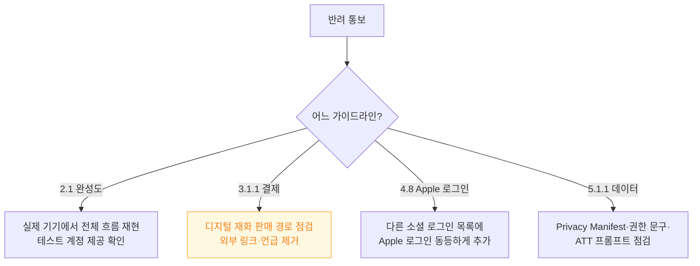
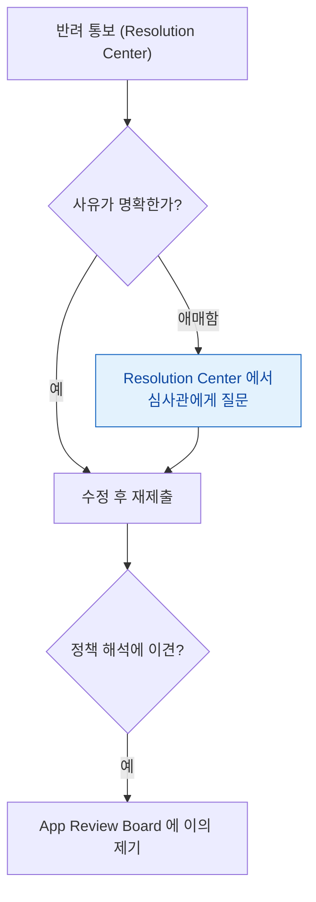

## 심사 반려는 임의적이지 않고 소수의 가이드라인 주변에 몰린다

### 개념 (What)

"심사가 랜덤하다"는 인식과 달리, 반려 사유는 몇 개 가이드라인에 **압도적으로 몰려 있다.** 이 패턴을 알면 제출 전 자체 점검으로 대부분을 사전에 걸러낼 수 있다.

| 가이드라인 | 흔한 반려 사유 |
| :--- | :--- |
| **2.1 앱 완성도** | 크래시, 미완성 기능, 깨진 링크 |
| **3.1.1 인앱 구매** | 디지털 재화를 외부 결제로 유도 |
| **4.8 Sign in with Apple** | 다른 소셜 로그인만 있고 Apple 로그인 누락 |
| **5.1.1 데이터 수집** | 권한 요청 시점/문구 부적절, Privacy Manifest 누락 |
| **2.3.1 메타데이터 불일치** | 스크린샷이 실제 앱과 다름 |

### 왜 필요한가 (Why)

각 가이드라인은 **판단 기준이 다르므로 처방도 다르다.**



### 3.1.1 — 가장 빈번하고 가장 오해가 많다

**"디지털 콘텐츠·기능"은 반드시 앱 내 구매(In-App Purchase)를 써야 한다.** 신용카드 결제 링크를 앱 안에 두거나, "웹사이트에서 더 저렴하게 구매하세요"라는 문구조차 반려 사유가 될 수 있다.

| 반드시 IAP | IAP 불필요 |
| :--- | :--- |
| 앱 내 프리미엄 기능 해제 | **실물 상품** (배달 앱의 음식) |
| 구독형 콘텐츠 | **오프라인에서 소비되는 서비스** (택시 요금) |
| 게임 내 화폐·아이템 | B2B SaaS 의 시트 라이선스 (조건부) |
| 광고 제거 | 이미 다른 플랫폼에서 구매한 콘텐츠 재생 (예: 이미 산 책) |

경계가 모호한 경우가 많으므로, **판단이 애매하면 App Review 제출 시 데모 계정과 설명을 상세히 남겨** 심사관이 맥락을 이해하게 한다.

### 4.8 — Sign in with Apple 필수 조건

다른 소셜 로그인(Google, Facebook 등)을 제공하면서 Apple 로그인을 빠뜨리면 반려된다. **이메일/비밀번호만 있는 경우는 이 규칙에서 예외**다.

```swift
// 다른 소셜 로그인과 "동등한 위치"에 노출해야 한다
// 목록 맨 아래에 작게 두는 것은 반려 사유가 될 수 있다
```

### 2.1 — 심사관이 실제로 쓸 수 있어야 한다

**App Review 정보에 테스트 계정과 재현 절차를 구체적으로 남기는 것**이 이 카테고리 반려를 가장 크게 줄인다.

```
App Review 정보 예시:
- 테스트 계정: reviewer@example.com / TestPass123!
- 핵심 기능 접근: 로그인 후 하단 탭 '지도' 선택
- 위치 권한 필요: 서울 좌표(37.5665, 126.9780)로 시뮬레이션 시 데이터 표시됨
- 결제 테스트: Sandbox 계정으로 자동 전환됨, 실결제 없음
```

심사관은 **실제 기기에서, 제한된 시간 안에** 앱을 테스트한다. 로그인이 막혀 있거나 핵심 기능에 도달할 수 없으면 그 자체로 반려된다.

### 반려 후 대응



**Resolution Center 에서 심사관과 직접 대화할 수 있다.** 반려 사유가 애매하면 무작정 수정하지 말고 먼저 질문한다. 정책 해석 자체에 이견이 있다면 **App Review Board** 에 정식으로 이의를 제기하는 절차도 있다.

### 관찰 가능한 증거

```bash
# 제출 전 자체 점검 — Privacy Manifest 존재 확인
find MyApp.app -name "PrivacyInfo.xcprivacy"

# ATS 예외가 배포 빌드에 남아 있는지 (5.1.1 관련 아님이지만 함께 점검)
plutil -p MyApp.app/Info.plist | grep -A10 NSAppTransportSecurity
```

**제출 전 체크리스트**

- [ ] 테스트 계정과 재현 절차를 App Review 정보에 기재
- [ ] 디지털 재화 판매 경로에 외부 결제 언급 없음
- [ ] 소셜 로그인이 있다면 Apple 로그인 포함
- [ ] 스크린샷이 실제 최신 UI 와 일치
- [ ] 모든 링크·기능이 실제로 동작

### 연관 문서

- [규제는 지역마다 다르고 무엇을 신고해야 하는지가 다르다](regulations-differ-by-region-and-what-must-be-declared.md)
- [수출 규정은 암호화 사용 여부만으로도 신고 대상이 된다](export-compliance-applies-to-encryption-not-just-cryptography-apis.md)
- [apple-privacy-and-tcc-details](../../05_security_privacy/apple-privacy-and-tcc-details.md)
- [08-signing-and-distribution-failure](../../00_foundations/diagnostic-runbooks/08-signing-and-distribution-failure.md)

공식 문서: [App Review Guidelines](https://developer.apple.com/app-store/review/guidelines/)
