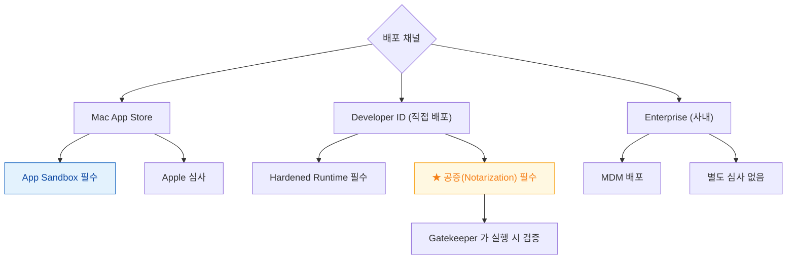
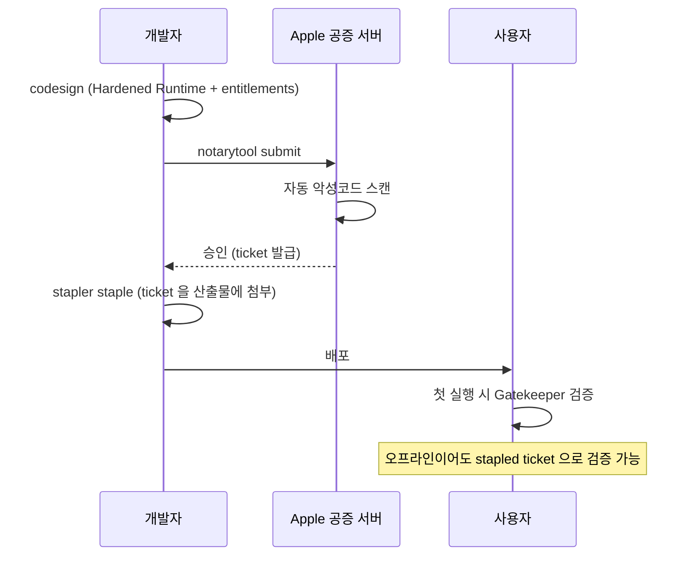

## 배포 채널이 서명 방식·공증 필요 여부·심사 절차를 결정한다

### 개념 (What)

"어떻게 배포하는가"를 먼저 정해야 서명 방식이 정해진다. iOS/iPadOS 는 App Store 가 사실상 유일한 채널이지만, macOS 는 세 가지 채널이 **완전히 다른 서명·검증 절차**를 요구한다.



### 왜 필요한가 (Why)

**공증(Notarization)** 을 빠뜨리는 것이 macOS 배포 실패의 가장 흔한 원인이다. Apple 심사를 받지 않는 직접 배포이기 때문에, 대신 **자동화된 악성코드 스캔**을 통과해야 Gatekeeper 가 실행을 허용한다.

| 상태 | 사용자 경험 |
| :--- | :--- |
| 서명 없음 | "확인되지 않은 개발자" — 실행 매우 번거로움 |
| 서명만 있음 (공증 없음) | 여전히 경고 표시 |
| **서명 + 공증 + stapled** | 경고 없이 즉시 실행 |

### Hardened Runtime — App Sandbox 와 다른 층

```swift
// App Sandbox: 파일·네트워크 등 리소스 접근 격리
// Hardened Runtime: 프로세스 자체의 무결성 보호
```

| | App Sandbox | Hardened Runtime |
| :--- | :--- | :--- |
| 막는 것 | 리소스 접근 범위 | 코드 인젝션, 디버거 부착, 서명 안 된 코드 로드 |
| 필수 대상 | Mac App Store | **공증 대상 전부** |
| 완화 방법 | entitlement 로 허용 범위 확장 | 예외 entitlement로 완화 (JIT 등) |

Hardened Runtime 을 켜면 서명 안 된 dylib 를 로드하는 플러그인 구조가 깨질 수 있다. 완화하려면 `com.apple.security.cs.disable-library-validation` 같은 entitlement 가 필요하며, **완화할수록 공증 심사가 더 엄격해진다.**

### 공증 절차



```bash
# 공증 제출
xcrun notarytool submit MyApp.zip --keychain-profile "AC_PASSWORD" --wait

# 결과에 실패 사유가 담긴 로그 요청
xcrun notarytool log <submission-id> --keychain-profile "AC_PASSWORD"

# 승인된 ticket 을 산출물에 첨부 (오프라인 검증 가능하게)
xcrun stapler staple MyApp.app
```

**`staple` 을 빠뜨리면** 사용자가 오프라인 상태에서 처음 실행할 때 검증에 실패할 수 있다.

### iOS 배포는 왜 공증이 없는가

iOS/iPadOS 는 App Store 가 유일한 배포 채널(Enterprise 제외)이므로, **Apple 심사 자체가 공증의 역할**을 겸한다. Ad Hoc 배포조차 App Store Connect 를 통해 빌드가 검증된다.

### 관찰 가능한 증거

```bash
# Gatekeeper 판정 확인 (배포 전 자체 점검)
spctl -a -vvv -t install MyApp.app

# 공증 상태 확인
xcrun stapler validate MyApp.app

# 코드 서명 + Hardened Runtime 플래그 확인
codesign -dvvv MyApp.app 2>&1 | grep -i "flags\|runtime"
```

| `spctl` 결과 | 의미 |
| :--- | :--- |
| `rejected (the code is not signed)` | 서명 자체 없음 |
| `rejected ... not notarized` | 서명은 있으나 공증 안 됨 |
| `accepted, source=Notarized Developer ID` | 정상 |

### 연관 문서

- [인증서·App ID·프로비저닝 프로파일 세 개가 정확히 일치해야 서명이 성립한다](three-party-trust-chain-must-agree.md)
- [apple-sandbox-and-security](../../05_security_privacy/apple-sandbox-and-security.md)
- [apple-macos-system](../../07_platforms/apple-macos-system.md)
- [08-signing-and-distribution-failure](../../00_foundations/diagnostic-runbooks/08-signing-and-distribution-failure.md)

공식 문서: [Notarizing macOS software before distribution](https://developer.apple.com/documentation/security/notarizing-macos-software-before-distribution)
