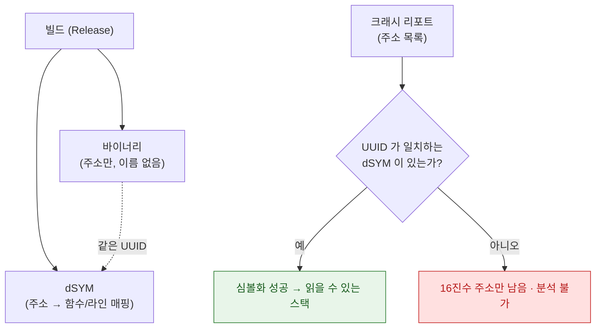

## dSYM 은 빌드마다 다르고 UUID 가 정확히 일치해야 크래시 스택이 복원된다

### 개념 (What)

Release 빌드는 최적화와 함께 **디버그 심볼을 바이너리에서 분리**한다. 그 결과 크래시 리포트에는 함수 이름이 아니라 메모리 주소만 남는다. **`dSYM`(debug symbol) 파일이 그 주소를 다시 함수 이름과 소스 라인으로 되돌리는 유일한 열쇠**다.

핵심 제약: 이 매핑은 **정확히 그 빌드 산출물에만** 유효하다. 같은 소스를 다시 빌드해도 dSYM 이 달라질 수 있다.



### 왜 필요한가 (Why)

**UUID 로 짝을 맞춘다.** 바이너리와 dSYM 은 각각 UUID 를 갖고, 이 값이 일치해야 매핑이 성립한다. 아키텍처마다도 별도 UUID 를 갖는다(예: arm64 와 arm64e 가 다르다).

| 실패 시나리오 | 원인 |
| :--- | :--- |
| "심볼화할 수 없음" | dSYM 을 보관하지 않음 |
| 함수 이름은 나오는데 틀림 | **다른 빌드의 dSYM** 을 잘못 매칭 |
| 일부 프레임만 심볼화됨 | 서드파티 프레임워크의 dSYM 누락 |
| 확장 크래시가 심볼화 안 됨 | [앱 확장은 별도 바이너리이자 별도 dSYM](../../01_system_internals/ipc-and-process/app-extension-process-model.md) |

### 빌드마다 dSYM 을 보관해야 하는 이유

```bash
# 매 아카이브마다 UUID 를 기록해 두면 나중에 정확한 dSYM 을 찾을 수 있다
dwarfdump --uuid MyApp.app.dSYM
dwarfdump --uuid MyApp.app/MyApp     # 바이너리 쪽 UUID 와 비교
```

App Store 빌드는 **Xcode Organizer 나 App Store Connect 가 dSYM 을 보관**하지만, **Bitcode 가 폐지된 이후로는 업로드 시점의 dSYM 이 곧 최종본**이다. CI 에서 아카이브를 만든다면 **그 dSYM 을 별도로 아카이브해 보관하는 것**이 필수다.

```bash
# 아카이브에서 dSYM 추출 (CI 파이프라인에 포함)
find MyApp.xcarchive/dSYMs -name "*.dSYM" -exec cp -r {} ./dsyms/ \;
```

### 서드파티 크래시 리포터를 쓴다면

Crashlytics, Sentry 같은 도구는 **자체적으로 dSYM 을 업로드받아 보관**한다. CI 빌드 단계에 업로드를 반드시 포함해야 하며, 빠뜨리면 프로덕션 크래시가 영원히 심볼화되지 않는다.

```bash
# 예: 빌드 후 스크립트로 자동 업로드 (도구마다 형식 다름)
./scripts/upload-dsym.sh MyApp.xcarchive/dSYMs
```

### 심볼화 방법

```bash
# App Store 심사 후 다운로드한 크래시 로그를 직접 심볼화
xcrun atos -o MyApp.app.dSYM/Contents/Resources/DWARF/MyApp \
  -arch arm64 -l <load_address> <crash_address>

# .crash 리포트 파일 전체를 한 번에
symbolicatecrash MyApp.crash MyApp.app.dSYM > readable.crash
```

**`-l <load_address>`(로드 주소)를 정확히 넣어야 한다.** 크래시 리포트 상단의 바이너리 이미지 목록에 있는 슬라이드 주소이며, 이것이 틀리면 전혀 엉뚱한 함수가 나온다.

### `MetricKit` 의 진단 데이터와의 관계

[`MXDiagnosticPayload`](../../06_testing_performance/performance/metrickit-collects-what-you-cannot-reproduce.md) 로 받는 크래시·행(hang) 스택도 **같은 심볼화 과정**이 필요하다. 시스템이 기기에서 직접 심볼화해 전달하기도 하지만, 커스텀 프레임워크는 여전히 dSYM 매칭이 필요할 수 있다.

### 관찰 가능한 증거

```bash
# 바이너리와 dSYM 의 UUID 일치 확인 (심볼화 전 필수 점검)
dwarfdump --uuid MyApp.app/MyApp
dwarfdump --uuid MyApp.app.dSYM

# 여러 아키텍처가 섞인 경우 각각 비교
lipo -info MyApp.app/MyApp
```

두 UUID 가 다르면 심볼화 자체가 원리적으로 불가능하다. **다른 파일을 찾는 것 외에는 방법이 없다.**

### 연관 문서

- [인증서·App ID·프로비저닝 프로파일 세 개가 정확히 일치해야 서명이 성립한다](three-party-trust-chain-must-agree.md)
- [워치독 종료는 예외 코드로 원인 구간을 구분할 수 있다](../../01_system_internals/ipc-and-process/watchdog-termination-codes.md)
- [MetricKit 은 개발 기기에서 재현할 수 없는 실사용자 데이터를 모은다](../../06_testing_performance/performance/metrickit-collects-what-you-cannot-reproduce.md)

공식 문서: [Building and running an app that adopts app extensions](https://developer.apple.com/documentation/xcode/adding-a-crash-reporting-framework-to-your-app)
