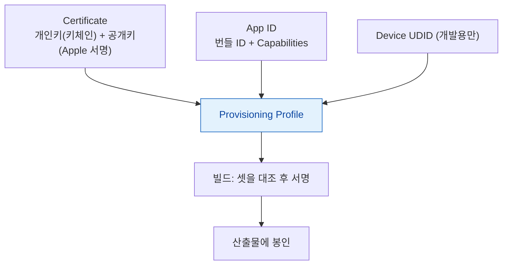
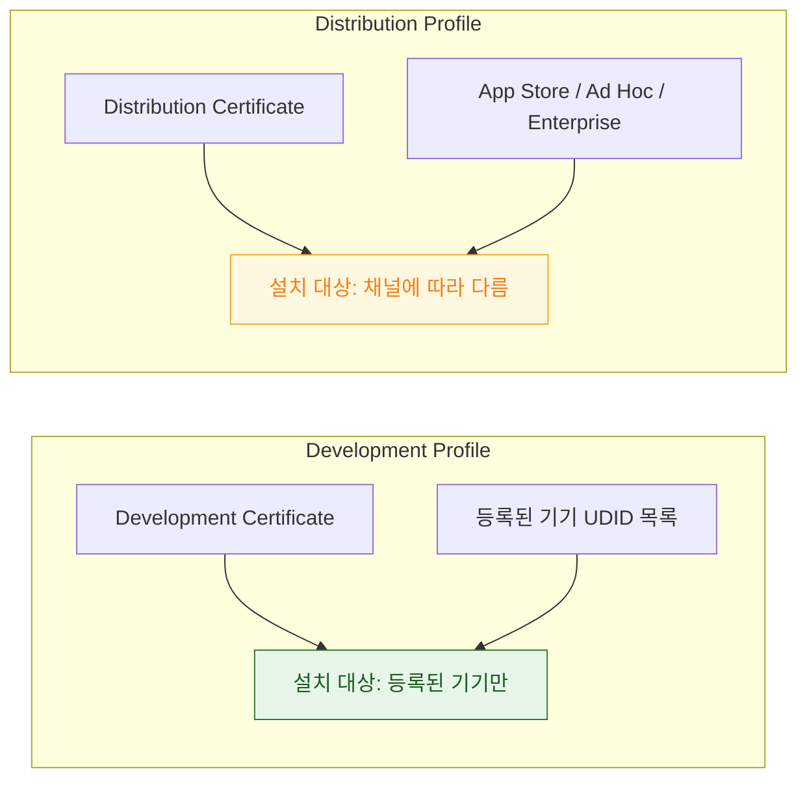

## 인증서·App ID·프로비저닝 프로파일 세 개가 정확히 일치해야 서명이 성립한다

### 개념 (What)

Apple 의 서명 체계는 세 개의 독립된 요소가 **삼각형으로 서로를 참조**해야 성립한다. 하나만 어긋나도 빌드나 설치가 실패한다.

| 요소 | 답하는 질문 | 발급 주체 |
| :--- | :--- | :--- |
| **Certificate** | 나는 누구인가 (개발자/팀) | Apple (키체인에 개인키 보관) |
| **App ID** | 이 앱은 무엇인가 (번들 ID + 사용 가능 능력) | Apple Developer 포털 |
| **Provisioning Profile** | 이 조합을 이 기기/채널에서 허용하는가 | 포털이 위 둘을 묶어 발급 |



**[entitlement](../../05_security_privacy/apple-security-entitlements.md) 는 이 삼각형의 산출물이다.** App ID 가 허용한 능력 집합이 프로파일에 담기고, 서명 시 앱의 entitlements 파일과 대조된다.

### 왜 필요한가 (Why)

세 요소가 각각 다른 시점에 다른 사람이 바꿀 수 있다는 것이 문제의 근원이다.

| 시나리오 | 무엇이 어긋났나 |
| :--- | :--- |
| 팀원이 새 기기를 추가했는데 나는 못 씀 | 개발용 프로파일이 그 기기 UDID 를 모름 → 재발급 필요 |
| Capabilities 탭에서 켰는데 실행 안 됨 | App ID 는 갱신됐지만 **프로파일을 재생성 안 함** |
| 인증서가 만료돼 팀 전체 빌드 실패 | Certificate 축이 깨짐 — 재발급 후 전원 재다운로드 |
| 배포 빌드는 되는데 확장만 실패 | [앱 확장이 별도 App ID + 별도 프로파일](../../01_system_internals/ipc-and-process/app-extension-process-model.md)을 가짐 |

**"Capabilities 탭을 켜는 것"은 App ID 만 바꾼다.** 프로파일은 그 변경을 자동으로 반영하지 않으므로 재생성이 필요하다. Xcode 의 자동 서명(Automatic Signing)은 이 재생성을 대신해 주지만, **수동 서명이나 CI 환경에서는 사람이 직접 챙겨야 한다.**

### 개발용 vs 배포용의 구조적 차이



| | Development | App Store | Ad Hoc | Enterprise |
| :--- | :--- | :--- | :--- | :--- |
| 기기 등록 필요 | 예 (100대 한도) | 아니오 | 예 (100대 한도) | 아니오 |
| 배포 경로 | Xcode 직접 설치 | App Store | 직접 배포 (등록 기기만) | 사내 MDM |
| [`aps-environment`](../../04_system_services/notifications/apns-token-is-bound-to-environment-and-bundle.md) | sandbox | production | production | production |

**개발 빌드와 TestFlight 빌드는 다른 인증서로 서명된다.** "개발에서는 되는데 TestFlight 에서 안 된다"는 대부분 이 차이에서 온다.

### 관찰 가능한 증거

```bash
# 산출물에 실제로 서명된 entitlement (설정이 아니라 결과물을 본다)
codesign -d --entitlements :- MyApp.app

# 임베드된 프로파일의 내용 — 허가된 기기·능력·만료일
security cms -D -i MyApp.app/embedded.mobileprovision

# 팀의 서명 인증서 목록과 유효 기간
security find-identity -v -p codesigning

# 등록된 프로비저닝 프로파일 (로컬 캐시)
ls ~/Library/MobileDevice/Provisioning\ Profiles/
```

**핵심 진단**: `codesign` 출력의 entitlement 목록과 `security cms` 출력의 허가 목록을 **diff** 한다. 앱이 요구하는 항목이 프로파일의 허가 목록에 없으면 그것이 원인이다.

### 연관 문서

- [Entitlement 는 코드 서명에 봉인되므로 런타임이 아니라 빌드·프로비저닝 시점에 확정된다](../../05_security_privacy/apple-security-entitlements.md)
- [AMFI 는 exec 시점에 코드 서명과 entitlement 를 커널에서 강제한다](../../01_system_internals/kernel-and-driver/amfi-code-signature-enforcement.md)
- [배포 채널이 서명 방식과 검증 절차를 결정한다](distribution-channel-determines-signing-and-review.md)
- [08-signing-and-distribution-failure](../../00_foundations/diagnostic-runbooks/08-signing-and-distribution-failure.md)

공식 문서: [Code Signing Guide](https://developer.apple.com/library/archive/documentation/Security/Conceptual/CodeSigningGuide/Introduction/Introduction.html)
