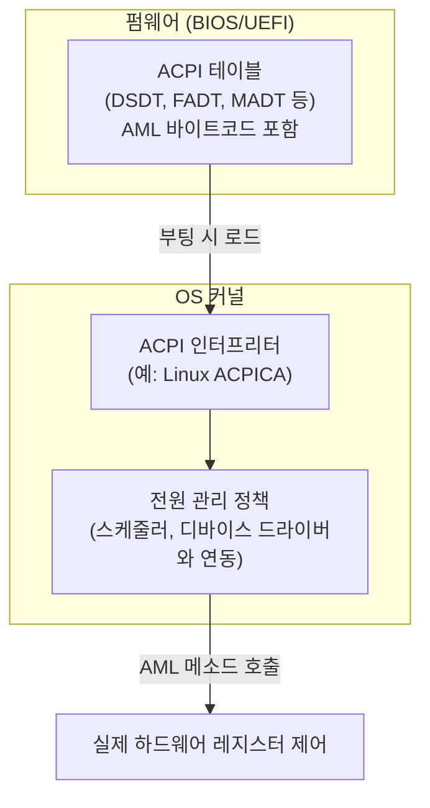
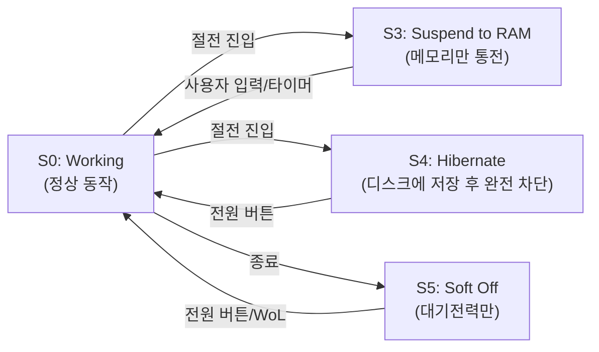

## ACPI 란 무엇인가

**ACPI(Advanced Configuration and Power Interface)** 는 운영체제가 하드웨어의 전원 상태와 하드웨어 설정(디바이스 열거, 인터럽트 라우팅 등)을 **표준화된 방식**으로 제어할 수 있게 해주는 인터페이스 규격이다. 1996년 Intel, Microsoft, Toshiba 가 공동으로 발표했다.

ACPI 의 핵심 구조는 **펌웨어(BIOS/UEFI)가 부팅 시점에 일련의 테이블을 메모리에 준비해 두고, OS 가 그 테이블을 읽어 하드웨어를 제어**하는 방식이다. 테이블에는 단순한 데이터뿐 아니라 **AML(ACPI Machine Language)** 이라는 바이트코드로 작성된 제어 메소드(예: "이 디바이스의 전원을 끄려면 이 레지스터에 이 값을 써라")가 들어 있어서, OS 는 특정 칩셋의 하드웨어 세부사항을 몰라도 AML 인터프리터를 통해 표준화된 방식으로 전원을 제어할 수 있다.

### 왜 표준화가 필요했나

ACPI 이전에는 **APM(Advanced Power Management)** 이라는 훨씬 단순한 체계가 쓰였다. APM 은 전원 관리 로직 대부분이 BIOS 안에 있었고, OS 는 BIOS 에게 "졸려" 정도의 아주 제한적인 신호만 보낼 수 있었다. 문제는 이 방식이 **제조사마다 구현이 제각각**이라, 노트북마다 절전 모드 진입/복귀 동작이 다르고 버그도 많았다. OS 입장에서는 "지금 정확히 어떤 디바이스가 켜져 있고 어떤 상태인지" 를 세밀하게 알 방법이 없었다.

ACPI 는 전원 관리의 **정책 결정권을 BIOS 에서 OS 로 옮겼다**. BIOS/펌웨어는 하드웨어를 서술하는 테이블만 제공하고, "언제 절전 모드로 들어갈지, 어떤 디바이스를 먼저 끌지" 같은 실제 판단은 OS 커널이 한다. 이렇게 하면 OS 가 실행 중인 프로세스, 열려 있는 네트워크 연결, 사용자 입력 등 실제 시스템 상태를 종합적으로 고려한 전원 관리 정책을 세울 수 있다.



## ACPI 전원 상태 (S-States)

ACPI 는 시스템 전체의 전원 상태를 **S0 ~ S5** 로 정의한다.

| 상태 | 이름 | 설명 |
|---|---|---|
| **S0** | Working | 정상 동작 상태. CPU, 메모리, 모든 디바이스가 켜져 있고 코드가 실행됨 |
| **S1** | Standby (Power on Suspend) | CPU 클럭만 정지. 메모리와 대부분의 디바이스 상태는 유지. 복귀가 매우 빠르지만 절전 효과는 작음. 현대 하드웨어에서는 거의 쓰이지 않음 |
| **S2** | (거의 사용 안 됨) | CPU 전원까지 차단하되 캐시는 flush. S1과 S3 사이의 중간 단계로 실제 구현은 드묾 |
| **S3** | Suspend to RAM (Sleep) | CPU, 대부분의 칩셋 전원 차단. 메모리(RAM)에만 전원을 유지해 시스템 상태를 보존. 흔히 말하는 "노트북 뚜껑 닫으면 자는 잠자기 모드" |
| **S4** | Suspend to Disk (Hibernate) | 메모리 내용 전체를 디스크의 스왑/하이버네이션 파일에 기록한 뒤, 메모리를 포함한 전원을 완전히 차단. 복귀 시 디스크에서 메모리 상태를 복원. S3보다 느리지만 전원이 완전히 끊겨도 상태가 보존됨 |
| **S5** | Soft Off | 완전히 꺼진 상태이지만, 메인보드에 대기 전력이 남아 있어 Wake-on-LAN 등 특정 이벤트로 다시 켤 수 있음. 일반적인 "종료" 버튼을 눌렀을 때의 상태 |



디바이스 단위에도 별도의 전원 상태(**D0~D3**, D0가 완전 동작, D3가 완전 차단)가 있고, 프로세서 단위 유휴 상태(**C-states**, C0가 실행 중, C1~C3+ 로 갈수록 더 깊은 유휴 상태)도 ACPI 가 정의한다. 시스템 S-state 는 이런 하위 디바이스/프로세서 상태들을 조합해 만들어지는 상위 개념이다.

```bash
# Linux에서 지원되는 sleep state 확인
cat /sys/power/state
# freeze mem disk

# S3(mem)로 절전 진입
echo mem > /sys/power/state

# S4(disk)로 하이버네이트 진입
echo disk > /sys/power/state

# ACPI 테이블 확인 (디버깅)
ls /sys/firmware/acpi/tables/
acpidump > acpi_dump.dat
```

## 왜 서버/데스크탑은 ACPI suspend 를, 모바일은 자체 방식을 쓰는가

서버와 데스크탑 리눅스는 ACPI S3/S4 를 그대로 활용해 절전을 구현한다. PC 하드웨어 생태계가 ACPI 규격을 중심으로 표준화되어 있어서, 커널은 펌웨어가 제공하는 ACPI 테이블만 해석하면 다양한 제조사의 메인보드에서 동일한 방식으로 절전을 제어할 수 있기 때문이다.

반면 모바일(Android) 은 순수 ACPI S3 방식을 그대로 쓰지 않는다. 모바일 기기는 화면이 꺼진 뒤에도 네트워크 연결 유지, 푸시 알림 수신, 백그라운드 동기화처럼 "완전히 멈추지는 않지만 대부분의 하드웨어는 재워야 하는" 매우 세밀한 절전 요구가 끊임없이 발생한다. 이를 ACPI 의 굵직한 S-state 전환만으로 다루기는 어렵기 때문에, 리눅스 커널 기반이면서도 훨씬 더 빈번하고 세밀한 자동 절전/기상 제어가 필요했다. 이런 배경에서 나온 것이 커널의 **autosleep**/**wakelock(suspend blocker)** 메커니즘과, 그 위에서 유저스페이스 정책을 조정하는 Android 의 SystemSuspend 데몬이다. 다만 이 세부 구현은 Android 지식베이스의 관련 노트에서 별도로 다룬다.

## 연결 문서

- **kernel** - Tickless kernel 등 커널의 전력 관리 관련 설계
- [boot-sequence](boot-sequence.md) - 펌웨어가 부팅 시 ACPI 테이블을 준비하는 과정과의 관계
