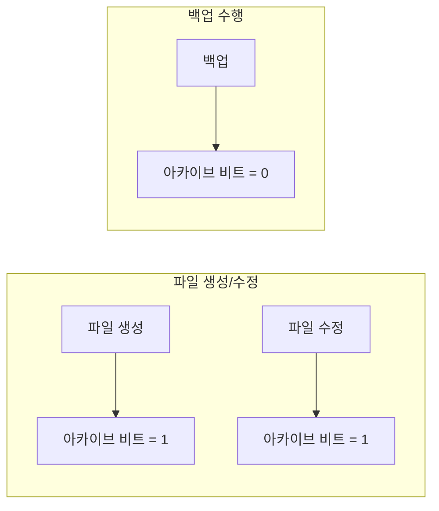
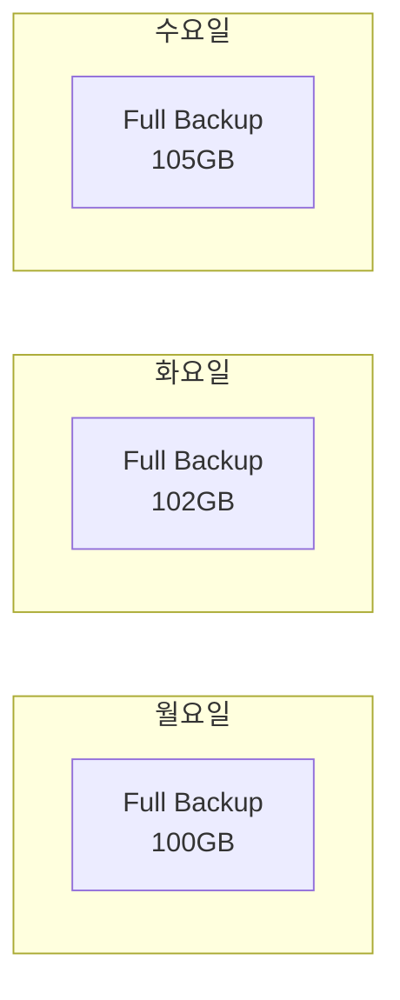
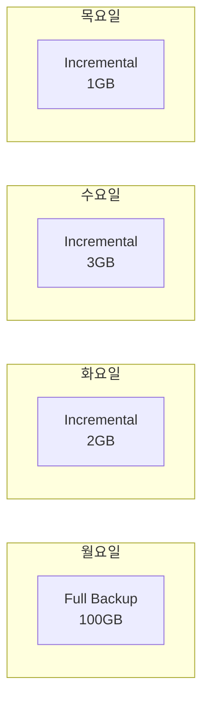
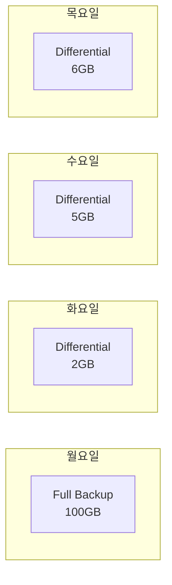

## 🌐 개요 (Overview)

**백업(Backup)** 은 데이터 가용성을 보장하기 위해 원본 데이터의 복사본을 만드는 과정입니다. 백업 방식은 **아카이브 비트(Archive Bit)** 의 해제 여부에 따라 구분됩니다.

## 📊 아카이브 비트 (Archive Bit)

### 정의

파일이 **마지막 백업 이후 변경되었는지**를 나타내는 플래그입니다.

```plaintext
아카이브 비트 = 1: 파일이 변경됨 (백업 필요)
아카이브 비트 = 0: 파일이 백업됨 (변경 없음)
```

### 동작 방식



---

## 📦 백업 유형

### 1. 전체 백업 (Full Backup)

**선택된 모든 파일**을 백업합니다.



**특징**:
| 항목 | 값 |
|------|-----|
| 백업 대상 | 선택된 **모든 파일** |
| 아카이브 비트 | **해제 (0 으로 설정)** |
| 백업 시간 | **가장 김** |
| 복구 시간 | **가장 빠름** |
| 저장 공간 | **가장 많이 필요** |

**장점**:
- 복구가 단순하고 빠름
- 하나의 백업 세트만 필요

**단점**:
- 백업 시간이 오래 걸림
- 저장 공간 많이 사용

---

### 2. 증분 백업 (Incremental Backup)

**마지막 백업(Full 또는 Incremental) 이후 변경된 파일**만 백업합니다.



**특징**:
| 항목 | 값 |
|------|-----|
| 백업 대상 | 아카이브 비트 = 1 인 파일만 |
| 아카이브 비트 | **해제 (0 으로 설정)** |
| 백업 시간 | **가장 빠름** |
| 복구 시간 | **가장 오래 걸림** |
| 저장 공간 | **가장 적게 필요** |

**복구 시 필요한 것**:
```plaintext
목요일 복구 = Full(월) + Inc(화) + Inc(수) + Inc(목)
→ 4개의 백업 세트 필요!
```

**장점**:
- 백업 시간이 가장 빠름
- 저장 공간 효율적

**단점**:
- 복구 시 모든 증분 백업 필요
- 하나라도 손상되면 복구 불가

---

### 3. 차등 백업 (Differential Backup)

**마지막 전체 백업 이후 변경된 모든 파일**을 백업합니다.



**특징**:
| 항목 | 값 |
|------|-----|
| 백업 대상 | 마지막 Full 이후 변경된 모든 파일 |
| 아카이브 비트 | **해제하지 않음 (유지)** |
| 백업 시간 | 중간 (점점 증가) |
| 복구 시간 | 중간 |
| 저장 공간 | 중간 (점점 증가) |

**복구 시 필요한 것**:
```plaintext
목요일 복구 = Full(월) + Diff(목)
→ 2개의 백업 세트만 필요!
```

**장점**:
- 복구 시 Full + 마지막 Diff 만 필요
- 증분보다 복구가 빠름

**단점**:
- 시간이 지날수록 백업 크기 증가
- 전체 백업보다 복구 느림

---

## 📊 비교 요약

| 특성 | Full | Incremental | Differential |
|------|------|-------------|--------------|
| **백업 대상** | 전체 | 마지막 백업 이후 변경 | 마지막 Full 이후 변경 |
| **아카이브 비트** | 해제 | 해제 | **유지** |
| **백업 시간** | 김 | **빠름** | 중간 |
| **복구 시간** | **빠름** | 김 | 중간 |
| **저장 공간** | 많음 | **적음** | 중간 |
| **복구 필요 세트** | 1 개 | Full + 모든 Inc | **Full + 마지막 Diff** |

---

## 🔄 백업 스케줄 예시

### 주간 스케줄 (권장)

```plaintext
일요일: Full Backup (전체)
월~토: Incremental 또는 Differential

증분 방식:
- 일: Full (100GB)
- 월: Inc (2GB)   복구 시: Full + 월
- 화: Inc (3GB)   복구 시: Full + 월 + 화
- 수: Inc (1GB)   복구 시: Full + 월 + 화 + 수
- ...

차등 방식:
- 일: Full (100GB)
- 월: Diff (2GB)  복구 시: Full + 월
- 화: Diff (5GB)  복구 시: Full + 화
- 수: Diff (6GB)  복구 시: Full + 수
- ...
```

### 3-2-1 백업 규칙

```plaintext
3: 최소 3개의 데이터 복사본 유지
2: 2가지 다른 미디어에 저장 (HDD, 테이프, 클라우드 등)
1: 1개는 오프사이트(원격지)에 보관
```

---

## 💡 실무 도구

### Linux (tar, rsync)

```bash
# 전체 백업
tar -cvpzf /backup/full_$(date +%Y%m%d).tar.gz /home

# 증분 백업 (rsync 활용)
rsync -av --link-dest=/backup/prev /home /backup/inc_$(date +%Y%m%d)

# 차등 백업 시뮬레이션
find /home -newer /backup/.full_timestamp -print | \
    tar -cvpzf /backup/diff_$(date +%Y%m%d).tar.gz -T -
```

### Windows

```powershell
# Windows Server Backup
wbadmin start backup -backupTarget:E: -include:C: -systemState -quiet

# 예약 작업으로 백업 스케줄
schtasks /create /tn "DailyBackup" /tr "wbadmin start backup..." /sc daily /st 02:00
```

## 🔗 연결 문서 (Related Documents)

- [[filesystems]] - 파일시스템과 저장소
- [[raid-technologies]] - RAID 를 통한 데이터 보호
- [[lvm]] - 논리 볼륨과 스냅샷 백업
- [[linux-log-management]] - 백업 로그 관리
