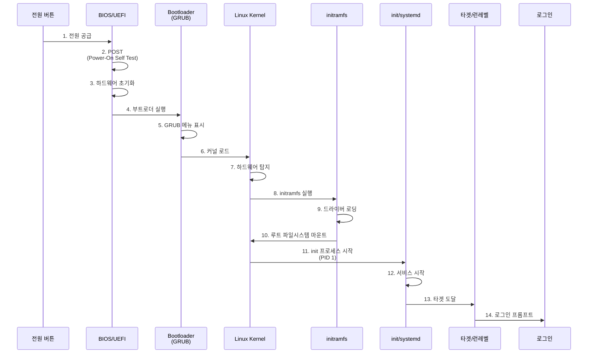
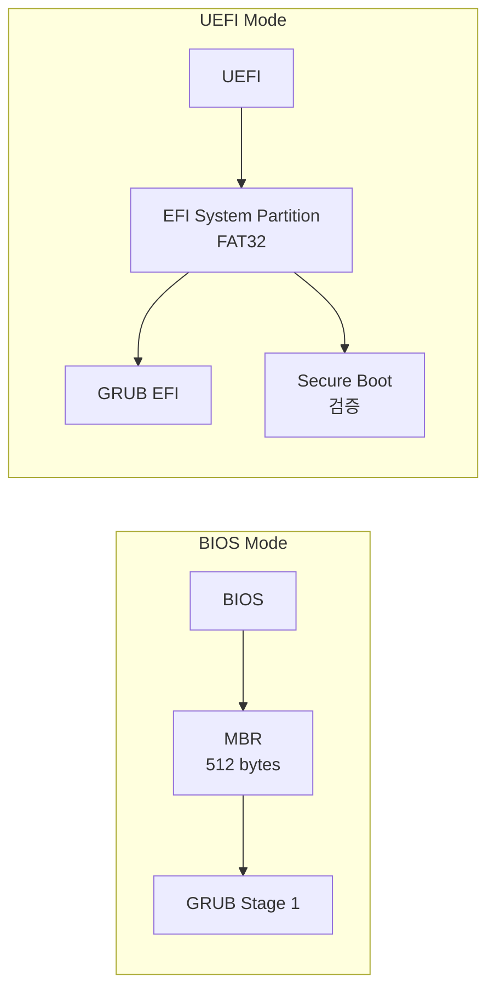

## 🌐 개요 (Overview)

**부팅 (Booting)** 은 컴퓨터 전원을 켰을 때 하드웨어를 초기화하고 [[kernel|운영체제 커널]]을 메모리에 로드하여 실행 가능한 상태로 만드는 과정입니다.

## 🔄 부팅 프로세스 전체 흐름 (Complete Boot Flow)



## 1️⃣ BIOS / UEFI 단계

### BIOS (Basic Input/Output System)

**레거시 방식** (1980년대~):
- **16비트 모드**: 제한적인 메모리 접근
- **MBR 부팅**: 디스크 첫 512바이트에서 부트로더 실행
- **제약**: 2TB 디스크 제한, 4개 주 파티션만 가능

**동작 과정**:
1. **POST (Power-On Self Test)**: CPU, RAM, 디스크 등 하드웨어 테스트
2. **부팅 순서 확인**: HDD, SSD, USB, CD-ROM 등
3. **MBR 읽기**: 디스크의 첫 섹터 (512바이트) 실행
4. **부트로더로 제어 이전**

### MBR 구조 상세

**MBR (Master Boot Record)**는 디스크의 첫 512바이트로, 다음과 같이 구성됩니다:

| 영역 | 크기 | 설명 |
| :--- | :---: | :--- |
| **Boot Loader (Boot Code)** | 446 bytes | 부트스트랩 코드 (GRUB Stage 1 등) |
| **Partition Table** | 64 bytes | 4개 파티션 정보 (각 16 bytes) |
| **Magic Number (Boot Signature)** | 2 bytes | `0x55AA` (유효한 MBR임을 표시) |
| **합계** | **512 bytes** | 정확히 1 섹터 |

> [!IMPORTANT]
> **시험 Tip**: MBR = **446 + 64 + 2 = 512 bytes**. Boot Loader 446바이트, Partition Table 64바이트 (4개 × 16바이트), Magic Number 2바이트 (`0x55AA`)를 기억하세요.

```bash
# MBR 백업 및 확인
dd if=/dev/sda of=mbr_backup.bin bs=512 count=1

# MBR 끝 2바이트 (Magic Number) 확인
hexdump -C mbr_backup.bin | tail -1
# 출력: 000001f0  ... 55 aa
```

### UEFI (Unified Extensible Firmware Interface)

**현대적 방식** (2000년대~):
- **GUI 인터페이스**: 마우스 지원, 고해상도
- **GPT 지원**: 2TB 이상 디스크, 128개 파티션
- **Secure Boot**: 서명된 부트로더만 실행 (악성코드 방지)
- **EFI 시스템 파티션**: FAT32, 100~500MB
- **네트워크 부팅**: PXE 부팅 지원



## 2️⃣ 부트로더 - GRUB

**GRUB2 (GRand Unified Bootloader version 2)**:
- 가장 널리 사용되는 Linux 부트로더
- 멀티 부팅 지원 (Windows, Linux 등)
- 커널 파라미터 편집 가능

### GRUB 설정 파일

**주요 설정**: `/etc/default/grub`
```bash
GRUB_TIMEOUT=5                    # 부팅 대기 시간 (초)
GRUB_DEFAULT=0                    # 기본 부팅 항목 (0부터 시작)
GRUB_CMDLINE_LINUX="quiet splash" # 커널 파라미터
GRUB_DISABLE_RECOVERY="true"      # 복구 모드 비활성화
```

**자동 생성 파일**: `/boot/grub2/grub.cfg`
- 직접 편집하지 않음!
- 재부팅 시 덮어씌워질 수 있음

### GRUB 명령어
```bash
# GRUB 설치
sudo grub2-install /dev/sda

# 설정 파일 재생성
sudo grub2-mkconfig -o /boot/grub2/grub.cfg

# 기본 커널 확인
sudo grubby --default-kernel
```

### 부팅 시 GRUB 편집
1. 부팅 중 **ESC** 또는 **Shift** 키 (GRUB 메뉴 표시)
2. 원하는 항목에서 **e** 키 (편집)
3. 커널 라인에 파라미터 추가:
   - `single` 또는 `1`: 싱글 유저 모드 (복구)
   - `systemd.unit=emergency.target`: 응급 모드
   - `init=/bin/bash`: bash 셸로 직접 부팅
4. **Ctrl+X**: 편집한 설정으로 부팅

## 3️⃣ 커널 로딩

### 커널 이미지
- **위치**: `/boot/vmlinuz-<version>`
- **압축**: gzip 또는 bzip2로 압축
- **로딩**: GRUB이 메모리에 압축 해제하여 로드

```bash
# 현재 커널 버전
uname -r
# 출력 예: 5.15.0-91-generic

# 커널 파일 확인
ls -lh /boot/vmlinuz-*
```

### 주요 커널 파라미터
- `quiet`: 부팅 메시지 최소화
- `splash`: 부팅 스플래시 화면 표시
- `ro`: 루트 파일시스템을 읽기 전용으로 마운트
- `root=/dev/sda1`: 루트 파일시스템 지정
- `init=/bin/bash`: 대체 init 프로세스

## 4️⃣ initramfs (Initial RAM Filesystem)

### 역할
초기 램 디스크로, 실제 루트 파일시스템을 마운트하기 전에 필요한 드라이버를 로드합니다.

**왜 필요한가?**
- 커널은 모든 디바이스 드라이버를 포함할 수 없음 (크기 증가)
- 루트 파일시스템이 LVM, RAID, 암호화된 경우 특수 모듈 필요
- initramfs에 필요한 드라이버만 포함


### 위치 및 관리
```bash
# initramfs 파일 위치
ls -lh /boot/initramfs-*

# Debian/Ubuntu: initramfs 재생성
sudo update-initramfs -u

# RHEL/CentOS: dracut으로 생성
sudo dracut --force

# initramfs 내용 확인
lsinitrd /boot/initramfs-$(uname -r).img
```

## 5️⃣ Init 시스템

### [[init-systems|systemd]] (현대적 init)
대부분의 최신 Linux 배포판이 사용하는 init 시스템입니다.

**특징**:
- **병렬 시작**: 서비스를 동시에 시작하여 부팅 속도 향상
- **의존성 관리**: 서비스 간 의존성 자동 해결
- **소켓 활성화**: 필요 시에만 서비스 시작
- **표준화**: 대부분의 주요 배포판 채택

**PID 1**: `/sbin/init` → `/lib/systemd/systemd`

### 런레벨과 타겟 (Runlevels and Targets)

전통적인 SysV init 런레벨과 systemd 타겟의 매핑:

| 런레벨 | 설명 | systemd 타겟 |
|--------|------|--------------|
| 0 | 시스템 종료 | `poweroff.target` |
| 1 | 싱글 유저 모드 (복구) | `rescue.target` |
| 3 | 멀티 유저 텍스트 모드 | `multi-user.target` |
| 5 | 멀티 유저 그래픽 모드 | `graphical.target` |
| 6 | 재부팅 | `reboot.target` |

```bash
# 기본 타겟 확인
systemctl get-default

# 기본 타겟 변경
sudo systemctl set-default multi-user.target

# 타겟으로 전환 (재부팅 없이)
sudo systemctl isolate graphical.target
```

### 📝 부팅 후 실행 스크립트 (/etc/rc.d/rc.local)

모든 부팅 프로세스가 완료된 후, 사용자 정의 스크립트를 실행하고 싶을 때 사용하는 전통적인 파일입니다.

*   **파일 경로**: `/etc/rc.d/rc.local` (보통 `/etc/rc.local`로 심볼릭 링크됨)
*   **특징**: `systemd` 기반 시스템에서도 호환성을 위해 유지되지만, 실행 권한(`chmod +x`)이 있어야 작동합니다.
*   **용도**: 부팅 시 특정 데몬 시작, 방화벽 규칙 적용, 하드웨어 설정 변경 등.

> [!CAUTION]
> **콘솔 모드와 런레벨**:
> *   런레벨 3 (multi-user.target)은 텍스트 모드(Console Mode)로 부팅됨을 의미합니다. 
> *   이 환경에서는 `TTY1`~`TTY6`까지의 가상 콘솔을 사용할 수 있으며, GUI 데몬은 실행되지 않습니다.

## 🛠️ 부팅 문제 해결 (Troubleshooting)

### 1. 싱글 유저 모드 진입
```
1. GRUB 메뉴에서 'e' 키
2. 커널 라인 끝에 추가: single 또는 systemd.unit=rescue.target
3. Ctrl+X로 부팅
```

### 2. 응급 모드 (Emergency Mode)
```
커널 파라미터: systemd.unit=emergency.target
- 최소한의 환경
- 루트 파일시스템만 읽기 전용으로 마운트
```

### 3. 부팅 로그 확인
```bash
# 현재 부팅 로그
journalctl -b

# 이전 부팅 로그
journalctl -b -1

# 커널 메시지
dmesg

# 에러 메시지만
dmesg | grep -i error
journalctl -p err -b
```

### 4. 일반적인 문제

#### GRUB 손상
```bash
# Live USB로 부팅 후
sudo mount /dev/sda1 /mnt
sudo mount --bind /dev /mnt/dev
sudo mount --bind /proc /mnt/proc
sudo mount --bind /sys /mnt/sys
sudo chroot /mnt
grub2-install /dev/sda
grub2-mkconfig -o /boot/grub2/grub.cfg
```

#### fstab 오류
```bash
# 싱글 유저 모드에서
mount -o remount,rw /
nano /etc/fstab
# 잘못된 항목 수정 또는 주석 처리
```

#### 커널 패닉
```bash
# 이전 커널로 부팅 (GRUB 메뉴에서 선택)
# 또는 커널 파라미터 조정
```

## ⏱️ 부팅 시간 분석

```bash
# 전체 부팅 시간
systemd-analyze

# 서비스별 시간
systemd-analyze blame

# 의존성 그래프 (SVG)
systemd-analyze plot > boot.svg
```

## 🔗 연결 문서 (Related Documents)

- [[kernel]] - 리눅스 커널의 상세 설명
- [[init-systems]] - systemd와 init 시스템
- [[filesystem-hierarchy-standard]] - `/boot` 디렉토리 구조
- [[process-states-lifecycle]] - init 프로세스 (PID 1)
