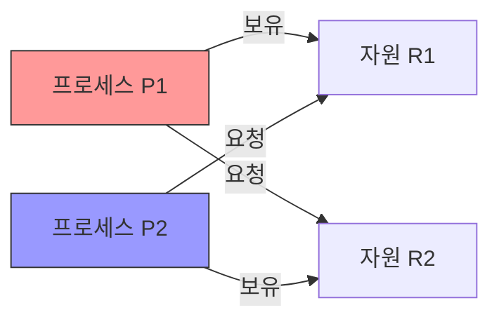
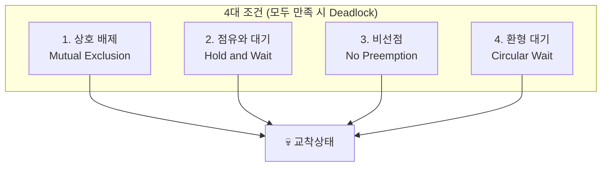
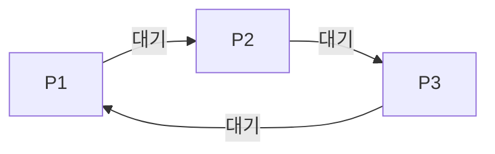
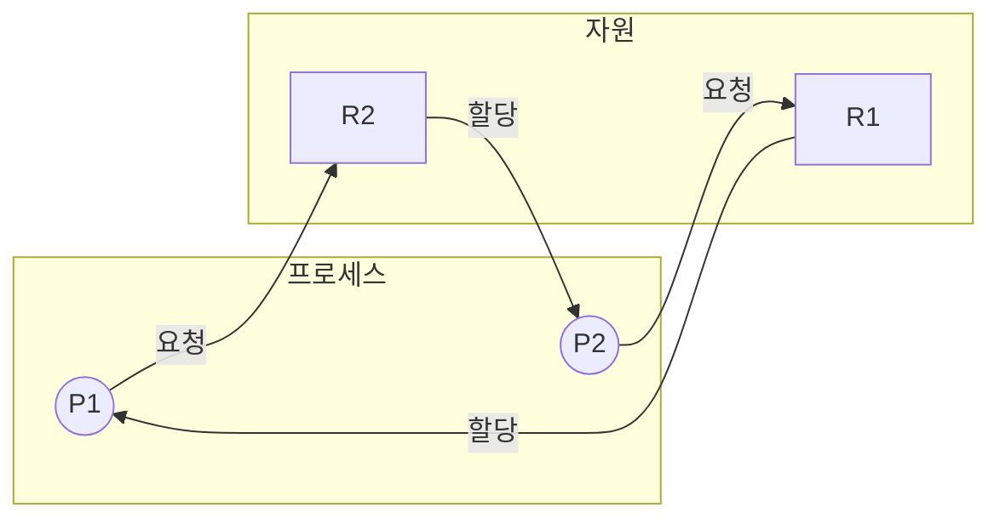

## 🌐 개요 (Overview)

**교착상태(Deadlock)** 는 둘 이상의 프로세스가 서로 상대방이 가진 자원을 기다리며 **무한정 대기**하는 상태입니다. 모든 프로세스가 진행할 수 없어 시스템이 멈춘 것처럼 보입니다.

## 🎯 교착상태 예시

### 일상적 비유

```plaintext
🚗 좁은 다리에서 마주친 두 차량

차량 A: "B가 후진해야 내가 갈 수 있어"
차량 B: "A가 후진해야 내가 갈 수 있어"

→ 둘 다 양보하지 않으면 영원히 대기
```

### 시스템 예시



```c
// 교착상태 발생 코드 예시
// 스레드 1
pthread_mutex_lock(&mutex_A);    // A 획득
pthread_mutex_lock(&mutex_B);    // B 대기 (스레드 2가 보유)

// 스레드 2
pthread_mutex_lock(&mutex_B);    // B 획득
pthread_mutex_lock(&mutex_A);    // A 대기 (스레드 1이 보유)

// → 교착상태!
```

## 📊 교착상태 발생 4대 조건

교착상태가 발생하려면 **4가지 조건이 모두 동시에** 만족해야 합니다.



### 1. 상호 배제 (Mutual Exclusion)

- 자원은 **한 번에 한 프로세스만** 사용할 수 있음
- 다른 프로세스가 사용 중이면 대기해야 함

```plaintext
예: 프린터는 한 번에 한 문서만 출력 가능
```

### 2. 점유와 대기 (Hold and Wait)

- 자원을 **보유한 상태에서 다른 자원을 기다림**
- 최소 하나의 자원을 점유하면서 추가 자원 요청

```plaintext
예: 파일 A를 열고 있으면서 파일 B를 열기 위해 대기
```

### 3. 비선점 (No Preemption)

- 다른 프로세스의 자원을 **강제로 빼앗을 수 없음**
- 자원은 프로세스가 자발적으로 해제해야 함

```plaintext
예: 다른 프로세스가 사용 중인 메모리를 강제로 회수 불가
```

### 4. 환형 대기 (Circular Wait)

- 대기 프로세스들이 **원형으로 자원을 기다림**
- P1 → P2 → P3 → ... → Pn → P1 형태의 순환



---

## 🛡️ 교착상태 해결 방법

### 1. 예방 (Prevention)

**4대 조건 중 하나를 부정**하여 발생을 원천 차단합니다.

| 조건 | 부정 방법 | 문제점 |
|------|----------|--------|
| **상호 배제** | 자원 공유 허용 | 일부 자원은 공유 불가 |
| **점유와 대기** | 필요한 모든 자원을 한 번에 할당 | 자원 낭비, 기아 가능 |
| **비선점** | 자원 강제 회수 허용 | 작업 손실 위험 |
| **환형 대기** | 자원에 번호 부여, 순서대로만 요청 | 유연성 감소 |

**환형 대기 부정 예시**:
```c
// 모든 자원에 고유 번호 할당
// 항상 낮은 번호 → 높은 번호 순서로만 요청

// 자원 번호: mutex_A = 1, mutex_B = 2

// 올바른 순서
pthread_mutex_lock(&mutex_A);    // 1번 먼저
pthread_mutex_lock(&mutex_B);    // 2번 나중

// 잘못된 순서 (금지)
pthread_mutex_lock(&mutex_B);    // 2번 먼저 X
pthread_mutex_lock(&mutex_A);    // 역순 요청 금지
```

### 2. 회피 (Avoidance)

교착상태가 발생할 **가능성을 피해갑니다**. 시스템이 항상 **안전 상태(Safe State)** 를 유지하도록 합니다.

#### 안전 상태 (Safe State)

모든 프로세스가 정상 종료될 수 있는 **안전 순서(Safe Sequence)** 가 존재하는 상태입니다.

```plaintext
안전 상태: 교착상태 발생 가능성 = 0%
불안전 상태: 교착상태 발생 가능성 > 0% (반드시 발생하는 것은 아님)
```

#### 은행원 알고리즘 (Banker's Algorithm)

Dijkstra가 고안한 교착상태 회피 알고리즘입니다.

**기본 개념**:
- 은행이 대출을 승인하듯이 자원 할당을 결정
- 대출(자원 할당) 후에도 모든 고객(프로세스)을 만족시킬 수 있는지 확인
- 불가능하면 요청 거부

**자료구조**:
```plaintext
n = 프로세스 수, m = 자원 종류 수

Available[m]: 사용 가능한 자원 수
Max[n][m]: 각 프로세스의 최대 요구량
Allocation[n][m]: 현재 할당된 자원
Need[n][m]: 추가로 필요한 자원 (Max - Allocation)
```

**예제**:
```plaintext
프로세스 5개, 자원 종류 3개 (A, B, C)
전체 자원: A=10, B=5, C=7

             Allocation    Max        Need
             A  B  C      A  B  C     A  B  C
    P0       0  1  0      7  5  3     7  4  3
    P1       2  0  0      3  2  2     1  2  2
    P2       3  0  2      9  0  2     6  0  0
    P3       2  1  1      2  2  2     0  1  1
    P4       0  0  2      4  3  3     4  3  1

Available = (10-7, 5-2, 7-5) = (3, 3, 2)

안전 순서 찾기:
1. P1 실행 가능 (Need 1,2,2 ≤ Available 3,3,2)
   → 완료 후 Available = (5, 3, 2)
2. P3 실행 가능 (Need 0,1,1 ≤ Available 5,3,2)
   → 완료 후 Available = (7, 4, 3)
3. P4 실행 가능...
4. P2 실행 가능...
5. P0 실행 가능...

안전 순서: <P1, P3, P4, P2, P0> → 안전 상태!
```

### 3. 탐지 (Detection)

교착상태를 **허용하고 발생 여부를 주기적으로 확인**합니다.

#### 자원 할당 그래프 (Resource Allocation Graph)



**사이클이 존재하면 교착상태 가능성**:
- 각 자원이 1개씩만 있으면: 사이클 = 교착상태
- 다중 인스턴스면: 사이클이 있어도 교착상태 아닐 수 있음

### 4. 복구 (Recovery)

교착상태가 **탐지되면 해결**합니다.

#### 프로세스 종료 (Kill)

| 방법 | 설명 | 장단점 |
|------|------|--------|
| **모두 종료** | 교착상태 프로세스 전체 종료 | 확실하지만 비용 큼 |
| **하나씩 종료** | 하나씩 종료하며 교착상태 해제 확인 | 오버헤드, 선택 기준 필요 |

**종료 대상 선정 기준**:
- 우선순위가 낮은 프로세스
- 실행 시간이 짧은 프로세스
- 사용 자원이 적은 프로세스
- 남은 작업이 많은 프로세스

#### 자원 선점 (Preemption)

교착상태 프로세스로부터 **자원을 강제 회수**합니다.

```plaintext
문제점:
1. 희생자 선택: 어떤 프로세스의 자원을 뺏을까?
2. 롤백: 빼앗긴 프로세스는 어디까지 되돌려야 하나?
3. 기아: 같은 프로세스가 계속 희생될 수 있음
```

---

## 💡 실무 예시

### Linux에서 교착상태 탐지

```bash
# 프로세스 상태 확인
ps aux | grep " D "
# D 상태 = Uninterruptible Sleep (I/O 대기 등)

# 락 정보 확인 (커널 락)
cat /proc/locks

# 스레드 상태 확인
cat /proc/<PID>/status | grep State

# 시스템 콜 추적
strace -p <PID> -f
```

### 교착상태 방지 코딩

```c
// 방법 1: 락 순서 정하기
// 항상 mutex_A → mutex_B 순서로 획득

void safe_operation() {
    pthread_mutex_lock(&mutex_A);
    pthread_mutex_lock(&mutex_B);
    // 작업
    pthread_mutex_unlock(&mutex_B);
    pthread_mutex_unlock(&mutex_A);
}

// 방법 2: try_lock 사용
void try_operation() {
    if (pthread_mutex_trylock(&mutex_A) == 0) {
        if (pthread_mutex_trylock(&mutex_B) == 0) {
            // 작업
            pthread_mutex_unlock(&mutex_B);
        }
        pthread_mutex_unlock(&mutex_A);
    }
    // 실패하면 나중에 재시도
}

// 방법 3: 타임아웃
struct timespec timeout = {.tv_sec = 5, .tv_nsec = 0};
int result = pthread_mutex_timedlock(&mutex, &timeout);
if (result == ETIMEDOUT) {
    // 타임아웃 처리
}
```

### 데이터베이스 교착상태

```sql
-- 트랜잭션 1
BEGIN;
UPDATE accounts SET balance = balance - 100 WHERE id = 1;
-- 여기서 트랜잭션 2가 id=2를 락
UPDATE accounts SET balance = balance + 100 WHERE id = 2;  -- 대기

-- 트랜잭션 2
BEGIN;
UPDATE accounts SET balance = balance - 50 WHERE id = 2;
-- 여기서 트랜잭션 1이 id=1을 락
UPDATE accounts SET balance = balance + 50 WHERE id = 1;   -- 대기

-- 교착상태! DB가 자동으로 하나를 롤백
```

```bash
# MySQL 교착상태 확인
SHOW ENGINE INNODB STATUS\G
# LATEST DETECTED DEADLOCK 섹션 확인
```

## 📊 해결 방법 비교

| 방법 | 장점 | 단점 |
|------|------|------|
| **예방** | 확실한 방지 | 자원 낭비, 성능 저하 |
| **회피** | 안전 상태 유지 | 사전 정보 필요, 복잡 |
| **탐지** | 자원 활용 극대화 | 검사 오버헤드 |
| **복구** | 실용적 | 작업 손실 가능 |

## 🔗 연결 문서 (Related Documents)

- [[process-states-lifecycle]] - 프로세스 상태와 생명주기
- [[process-scheduling]] - 프로세스 스케줄링
- [[ipc-mechanisms]] - 프로세스 간 통신과 동기화
