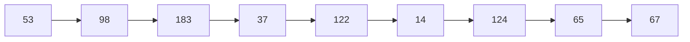
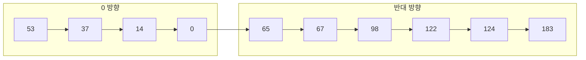

## 🌐 개요 (Overview)

**디스크 스케줄링**은 하드디스크의 **탐색 시간(Seek Time)** 을 줄이기 위해 헤드 이동 순서를 결정하는 기법입니다.

## 🎯 디스크 접근 시간 구성


| 구성 요소 | 설명 | 특징 |
|----------|------|------|
| **탐색 시간 (Seek Time)** | 헤드가 원하는 트랙으로 이동하는 시간 | 가장 큼, 최적화 대상 |
| **회전 지연 (Rotational Latency)** | 원하는 섹터가 헤드 아래로 오는 시간 | 디스크 회전 속도에 의존 |
| **전송 시간 (Transfer Time)** | 데이터를 실제로 읽거나 쓰는 시간 | 가장 작음 |

```plaintext
총 접근 시간 = 탐색 시간 + 회전 지연 + 전송 시간

예: 7200 RPM 디스크
회전 시간 = 60/7200 = 8.33ms (한 바퀴)
평균 회전 지연 = 4.17ms (절반)
```

## 📊 디스크 스케줄링 알고리즘

### 공통 예제

```plaintext
디스크: 0 ~ 199 트랙
현재 헤드 위치: 53
요청 큐: 98, 183, 37, 122, 14, 124, 65, 67
```

---

### 1. FCFS (First Come First Served)

**요청 순서대로** 처리합니다.

```plaintext
이동 순서: 53 → 98 → 183 → 37 → 122 → 14 → 124 → 65 → 67

트랙 이동:
53 → 98  : |98-53| = 45
98 → 183 : |183-98| = 85
183 → 37 : |37-183| = 146
37 → 122 : |122-37| = 85
122 → 14 : |14-122| = 108
14 → 124 : |124-14| = 110
124 → 65 : |65-124| = 59
65 → 67  : |67-65| = 2

총 이동 거리: 640 트랙
```



**장점**: 구현 단순, 공정함
**단점**: 비효율적 (멀리 왔다 갔다)

---

### 2. SSTF (Shortest Seek Time First)

**현재 헤드 위치에서 가장 가까운 트랙**을 먼저 처리합니다.

```plaintext
이동 순서: 53 → 65 → 67 → 37 → 14 → 98 → 122 → 124 → 183

트랙 이동:
53 → 65  : 12
65 → 67  : 2
67 → 37  : 30
37 → 14  : 23
14 → 98  : 84
98 → 122 : 24
122 → 124: 2
124 → 183: 59

총 이동 거리: 236 트랙 (FCFS보다 훨씬 적음!)
```

**장점**: 탐색 시간 최소화
**단점**: **기아 현상(Starvation)** - 멀리 있는 요청이 무한정 대기

---

### 3. SCAN (Elevator Algorithm)

**한쪽 끝까지 이동하며 처리**한 후 방향을 전환합니다.

```plaintext
헤드 방향: 0 방향으로 이동 중

이동 순서: 53 → 37 → 14 → 0 → 65 → 67 → 98 → 122 → 124 → 183

트랙 이동:
53 → 37  : 16
37 → 14  : 23
14 → 0   : 14  (끝까지)
0 → 65   : 65  (방향 전환)
65 → 67  : 2
67 → 98  : 31
98 → 122 : 24
122 → 124: 2
124 → 183: 59

총 이동 거리: 236 트랙
```



**장점**: 기아 현상 없음, 공정
**단점**: 끝에서 기다린 요청에 불리

---

### 4. C-SCAN (Circular SCAN)

**한쪽 방향으로만 처리**하고, 끝에 도달하면 처음으로 복귀합니다.

```plaintext
헤드 방향: 199 방향으로 이동

이동 순서: 53 → 65 → 67 → 98 → 122 → 124 → 183 → 199 → 0 → 14 → 37

트랙 이동:
53 → 65  : 12
65 → 67  : 2
67 → 98  : 31
98 → 122 : 24
122 → 124: 2
124 → 183: 59
183 → 199: 16 (끝까지)
199 → 0  : 199 (처음으로 복귀, 서비스 없음)
0 → 14   : 14
14 → 37  : 23

총 이동 거리: 382 트랙
```

**장점**: 안쪽/바깥쪽 트랙 차별 해소 (균등한 대기 시간)
**단점**: 이동 거리가 더 길 수 있음

---

### 5. LOOK / C-LOOK

SCAN/C-SCAN과 유사하나, **더 이상 요청이 없으면 끝까지 가지 않고** 즉시 방향 전환/복귀합니다.

#### LOOK

```plaintext
이동 순서: 53 → 37 → 14 → 65 → 67 → 98 → 122 → 124 → 183
(0까지 가지 않음 - 14가 마지막 요청)

총 이동 거리: 208 트랙
```

#### C-LOOK

```plaintext
이동 순서: 53 → 65 → 67 → 98 → 122 → 124 → 183 → 14 → 37
(199까지 가지 않고 183에서 복귀)
(0까지 가지 않고 14로 점프)

트랙 이동:
53 → 65  : 12
65 → 183 : 118 (중간 생략)
183 → 14 : 169 (점프, 실제 이동 아님)
14 → 37  : 23

실제 헤드 이동: 153 트랙
```

**장점**: 불필요한 이동 제거
**단점**: 구현이 약간 더 복잡

---

## 📊 알고리즘 비교

| 알고리즘 | 이동 거리 | 장점 | 단점 |
|---------|----------|------|------|
| **FCFS** | 640 | 단순, 공정 | 비효율적 |
| **SSTF** | 236 | 효율적 | 기아 가능 |
| **SCAN** | 236 | 기아 없음 | 끝에서 불리 |
| **C-SCAN** | 382 | 균등 대기 | 이동 거리 ↑ |
| **LOOK** | 208 | 효율적 | - |
| **C-LOOK** | 153 | 가장 효율적 | - |

---

## 💡 실무에서의 디스크 스케줄링

### Linux I/O 스케줄러

```bash
# 현재 스케줄러 확인
cat /sys/block/sda/queue/scheduler
# [mq-deadline] kyber bfq none

# 스케줄러 변경
echo "bfq" | sudo tee /sys/block/sda/queue/scheduler
```

**Linux 스케줄러 종류**:

| 스케줄러 | 설명 | 용도 |
|---------|------|------|
| **mq-deadline** | 요청에 데드라인 설정 | 범용 |
| **bfq** | 예산 기반 공정 큐잉 | 데스크톱, 지연 민감 |
| **kyber** | 고성능 저지연 | 고속 SSD |
| **none** | 스케줄링 없음 | NVMe SSD |

### SSD vs HDD

```plaintext
HDD:
- 물리적 헤드 이동 → 탐색 시간이 중요
- SCAN, C-LOOK 등 스케줄링 효과적

SSD:
- 전자적 접근 → 탐색 시간 거의 없음
- 스케줄링 효과 미미
- none 또는 mq-deadline 사용
```

```bash
# 디스크 타입 확인
lsblk -d -o name,rota
# NAME ROTA
# sda  1     (HDD: 회전 = 1)
# nvme 0     (SSD: 회전 = 0)
```

### 디스크 성능 테스트

```bash
# 순차 읽기 성능
hdparm -t /dev/sda
# Timing buffered disk reads: 500 MB in 3.00 seconds = 166.67 MB/sec

# 랜덤 읽기 성능 (fio)
fio --name=random-read --ioengine=libaio --iodepth=32 \
    --rw=randread --bs=4k --direct=1 --size=1G --numjobs=1
```

## ⚠️ 파일시스템과의 관계

파일 시스템의 블록 배치 전략도 디스크 성능에 영향을 줍니다.

```plaintext
1. 연속 할당 (Contiguous Allocation)
   - 파일을 연속된 블록에 저장
   - 순차 읽기 빠름
   - 외부 단편화 문제

2. 연결 할당 (Linked Allocation)
   - 블록이 다음 블록을 가리킴
   - 순차 읽기 느림 (헤드 이동 多)

3. 인덱스 할당 (Indexed Allocation)
   - 인덱스 블록에 위치 저장
   - 랜덤 접근 효율적
   - [[inode]] 방식이 이에 해당
```

## 🔗 연결 문서 (Related Documents)

- [[filesystems]] - 파일시스템 (ext4, XFS, Btrfs)
- [[inode]] - 인덱스 할당과 inode
- [[lvm]] - 논리 볼륨 관리
- [[virtual-memory]] - 스왑과 디스크 I/O
