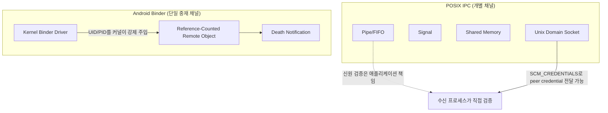

## POSIX IPC와 Android Binder는 신원 검증·수명 관리·동시성 제어 방식이 다르다

>**핵심 명제**: Android는 POSIX IPC(Pipe, Signal, Shared Memory, Unix Domain Socket)를 배제하지 않는다 — Zygote 소켓, 표준입출력 파이프, Ashmem/`memfd_create` 공유 메모리처럼 커널 하위 계층에서 지금도 쓰인다. 다만 앱과 시스템 서비스 사이의 주력 통신 계층으로는 **Binder**라는 별도의 커널 중재 object-capability IPC를 도입했다. 둘의 차이는 "더 빠르다/느리다"가 아니라 **호출자 신원을 누가 보증하는지, 원격 객체의 생존을 누가 추적하는지, 동시 호출을 어떻게 제한하는지**가 근본적으로 다르다는 데 있다.

배경 지식: 이 문서는 POSIX 쪽 4개 메커니즘 각각의 상세 동작은 [POSIX Pipe와 FIFO 계약](posix-pipe-and-fifo-contracts.md), [POSIX Signal 계약](posix-signal-contracts.md), [공유 메모리와 mmap 계약](shared-memory-and-mmap-contracts.md), [Unix Domain Socket 계약](unix-domain-socket-contracts.md)에 미룬다. Binder 쪽 상세는 [Binder IPC](../../mobile/android/01_system_internals/ipc-and-process/binder-ipc.md)(단일 정본)와 그 하위 원자 노트([전송 버퍼와 1MB 제한](../../mobile/android/01_system_internals/ipc-and-process/binder-transaction-lifetime.md), [Thread Pool과 교착 상태](../../mobile/android/01_system_internals/ipc-and-process/binder-thread-pool.md), [oneway 통신](../../mobile/android/01_system_internals/ipc-and-process/oneway-binder-transactions.md))에 미룬다. 이 문서는 그 둘을 나란히 놓고 **왜 다른 설계를 택했는지**만 다룬다.

---

### 초보자를 위한 쉽게 이해하는 비유

- **POSIX IPC (동네 우체통과 전화선)**: 파이프는 한쪽 방향으로만 흐르는 종이 전달 홈통, 시그널은 초인종, 공유 메모리는 두 집이 벽을 뚫어 만든 공동 창고, Unix 소켓은 두 집 사이의 전용 전화선이다. 각각 별도의 인프라이고, "이 편지를 보낸 사람이 진짜 그 사람인지"는 받는 쪽이 알아서 확인해야 한다.
- **Binder (신분증 검사가 있는 사설 택배 시스템)**: 모든 배송이 커널이라는 단일 관제탑을 거친다. 관제탑은 발신자 신분증(UID/PID)을 위조 불가능하게 직접 확인해서 동봉하고, 수취인이 이사(프로세스 종료)를 가면 발신자에게 "그 집은 없어졌다"고 자동으로 알려준다(death notification).



---

### 1. 신원 검증: 누가, 언제 보증하는가

- **POSIX 쪽**: Pipe와 System V/POSIX Shared Memory 자체에는 호출자 신원 개념이 없다 — 파일 디스크립터를 쥐고 있으면 누구든 접근할 수 있고, 신원 확인은 전적으로 애플리케이션의 책임이다. 예외적으로 Unix Domain Socket은 `SO_PEERCRED`/`SCM_CREDENTIALS`로 커널이 상대측 실제 UID/PID/GID를 전달해줄 수 있어(위조 불가능), POSIX IPC 중 유일하게 Binder와 유사한 커널 신원 보증을 제공한다 — Android의 Zygote 소켓과 `installd` 같은 native 데몬이 이 방식으로 호출자를 검증한다.
- **Binder 쪽**: 모든 Binder transaction에 커널이 호출자의 실제 UID/PID를 강제로 실어 보낸다(`Binder.getCallingUid()`/`getCallingPid()`). 서비스 코드가 이 값을 신뢰할 수 있는 이유는 클라이언트가 값을 직접 써넣는 게 아니라 커널 드라이버가 프로세스 자격증명을 읽어 주입하기 때문이다.

### 2. 수명 관리: 상대가 죽으면 누가 알려주는가

- **POSIX 쪽**: 대부분 스스로 확인해야 한다. Pipe는 쓰기 측이 다 닫히면 읽기 측이 EOF를 받고, Shared Memory는 상대 프로세스가 죽어도 `shm_unlink()` 전까지 커널에 잔류한다(참조 문서: [공유 메모리와 mmap 계약](shared-memory-and-mmap-contracts.md)의 "경계 조건" 절). 능동적인 "상대가 죽었다" 통지 메커니즘은 기본으로 없다.
- **Binder 쪽**: 클라이언트가 들고 있는 원격 객체 참조(handle)는 커널이 참조 카운트를 관리하는 대상이다. 서버 프로세스가 죽으면 커널이 `linkToDeath()`로 등록해둔 `DeathRecipient` 콜백을 클라이언트에게 자동으로 호출해준다 — 이게 없으면 클라이언트는 이미 죽은 프로세스를 향해 handle을 쥔 채 응답 없는 호출로 멈추게 된다.

### 3. 동시성 제어: 동시 호출을 어떻게 제한하는가

- **POSIX 쪽**: Pipe/Socket은 커널 버퍼가 가득 차면 쓰기 측이 블록되는 자연스러운 backpressure가 있다. Shared Memory는 커널이 동시성을 전혀 통제하지 않으므로 세마포어/뮤텍스를 애플리케이션이 직접 결합해야 한다([공유 메모리와 mmap 계약](shared-memory-and-mmap-contracts.md) 참고).
- **Binder 쪽**: 서버 프로세스마다 [Binder Thread Pool](../../mobile/android/01_system_internals/ipc-and-process/binder-thread-pool.md)이 있고 기본 최대 스레드 수(15개)가 정해져 있다. 동시 요청이 이 한도를 넘으면 대기가 걸리고, 서로 동기 호출을 주고받는 두 프로세스가 이 한도를 동시에 소진하면 [교착 상태](../deadlock.md)에 빠질 수 있다. `oneway` 키워드는 호출자의 대기만 없앨 뿐 서버 쪽 스레드 풀 한도 자체는 없애지 않는다([oneway Binder](../../mobile/android/01_system_internals/ipc-and-process/oneway-binder-transactions.md)).

---

### 2. 핵심 비교표

| 축 | POSIX IPC | Android Binder |
| :--- | :--- | :--- |
| **채널 구조** | 목적별로 4가지 별도 메커니즘(Pipe/Signal/SHM/Socket) | 커널 드라이버 하나가 모든 typed RPC를 중재 |
| **호출자 신원** | 기본적으로 없음(Unix Socket의 `SO_PEERCRED`만 예외) | 커널이 모든 transaction에 UID/PID를 강제 주입 |
| **데이터 전달 방식** | 대부분 2회 복사(User→Kernel→User) 또는 Zero-Copy(SHM) | `mmap` 기반 1회 복사 |
| **상대 종료 통지** | 기본 없음(EOF/errno로 간접 추론) | `linkToDeath()`/`DeathRecipient`로 커널이 능동 통지 |
| **동시성 한도** | 커널 버퍼 크기(Pipe/Socket) 또는 무제한(SHM, 앱이 직접 통제) | 프로세스당 Binder Thread Pool 상한(기본 15) |
| **크기 제한** | 커널 버퍼 크기(Pipe 보통 64KB) 또는 SHM은 사실상 무제한 | Transaction 버퍼 프로세스당 약 1MB(공유 시 더 작음) |

---

### 3. 실제로 같이 쓰이는 예시

Android는 Binder만 쓰는 게 아니라 계층마다 다른 IPC를 조합한다.

```text
Zygote 프로세스 생성 요청     → Unix Domain Socket (SO_PEERCRED로 system_server 신원 확인)
앱 ↔ system_server 서비스 호출 → Binder (typed RPC, UID/PID 자동 주입)
대용량 프레임 버퍼 전달        → Ashmem / memfd_create (Binder로는 핸들만 전달, 실 데이터는 공유 메모리)
프로세스 종료 신호            → POSIX Signal (SIGKILL 등, 커널이 프로세스 자체를 대상으로 함)
```

즉 Binder는 "앱-프레임워크 경계의 신뢰 가능한 typed RPC"라는 특정 문제를 풀기 위한 선택이지, POSIX IPC 전체를 대체하는 범용 치환재가 아니다.

---

### 4. 관측 가능한 증거

```bash
# Binder 쪽: 프로세스별 thread pool 상태, 진행 중인 transaction
adb shell dumpsys binder

# POSIX 쪽: 프로세스가 실제로 열고 있는 소켓/파이프/공유메모리 확인
adb shell ls -la /proc/<PID>/fd
adb shell cat /proc/<PID>/maps | grep -E "socket|/dev/ashmem|/dev/shm"
```

- Binder 호출자 위조 시도는 애초에 불가능하다(커널이 값을 덮어씀) — 반면 앱이 직접 파싱하는 POSIX 메시지 payload 안에 자칭 UID를 적어 보내는 방식은 위조 가능하며 실제로 취약점 패턴이다.
- `DeathRecipient` 콜백이 호출되지 않고 앱이 멈춰 있다면, 상대가 죽지 않았거나(`binder_thread_read` 블록) 애초에 `linkToDeath()`를 등록하지 않은 버그다.

---

### 경계

- 이 문서는 "왜 두 방식이 다른 설계를 택했는가"까지만 다룬다. Binder의 내부 transaction 단계(call/copy/dispatch/reply)는 [Binder transaction lifetime](../../mobile/android/01_system_internals/ipc-and-process/binder-transaction-lifetime.md)이 정본이다.
- "Binder vs 전통 Linux Socket/Pipe의 메모리 복사 횟수·중앙 등록소" 비교는 이미 [Binder IPC](../../mobile/android/01_system_internals/ipc-and-process/binder-ipc.md)의 "핵심 비교표"가 다루므로 여기서 반복하지 않는다 — 이 문서는 그 표가 다루지 않는 신원 검증·수명 관리·동시성 제어 세 축에 집중한다.

---

### 관련 문서

- [IPC 메커니즘 개요](../ipc-mechanisms.md)
- [POSIX Pipe와 FIFO 계약](posix-pipe-and-fifo-contracts.md)
- [POSIX Signal 계약](posix-signal-contracts.md)
- [공유 메모리와 mmap 계약](shared-memory-and-mmap-contracts.md)
- [Unix Domain Socket 계약](unix-domain-socket-contracts.md)
- [Binder IPC](../../mobile/android/01_system_internals/ipc-and-process/binder-ipc.md) — Android 쪽 정본
- [IPC and process contracts](../../mobile/android/01_system_internals/ipc-and-process/binder-ipc.md) — Android IPC 전체 지도
- [Deadlock](../deadlock.md)

공식 문서: [Android Binder(AOSP)](https://source.android.com/docs/core/architecture/hidl/binder-ipc), [Unix man 7 unix (SO_PEERCRED)](https://man7.org/linux/man-pages/man7/unix.7.html)

검증일: 2026-08-10. Binder thread pool 기본 최대 15, transaction 버퍼 프로세스당 약 1MB, `linkToDeath()`/`DeathRecipient` 동작은 이미 vault 안에서 공식 문서 대조를 거친 `binder-ipc.md`/`binder-thread-pool-is-...md`/`binder-transaction-lifetime-is-...md`의 기존 검증을 재사용했다. `SO_PEERCRED`/`SCM_CREDENTIALS`는 Linux man page 원문으로 이번에 확인했다.
