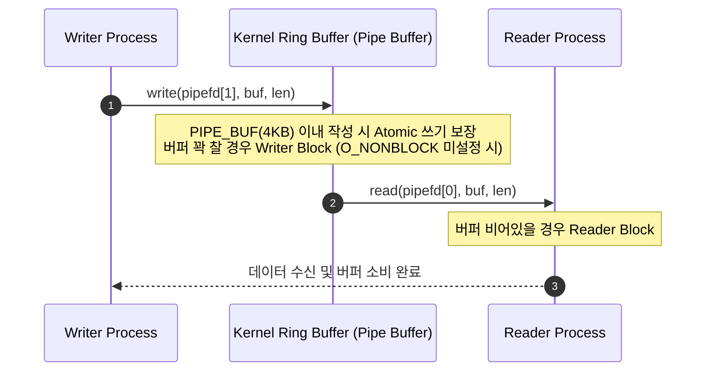

## 익명 파이프와 FIFO 는 커널 링 버퍼 기반의 단방향 바이트 스트림 통신이다

>**핵심 명제**: 익명 파이프(Anonymous Pipe)와 FIFO(Named Pipe)는 커널 메모리 내 링 버퍼(Ring Buffer)를 매개로 한 단방향 바이트 스트림 IPC 채널이다. 부모-자식 프로세스 간 혈연관계 제약 유무에 따라 구분되며, `PIPE_BUF` 크기 이내의 쓰기 작업에 대해 원자적(Atomic, 한 번에 완전하게 처리되는) 데이터 전송을 보장한다.

### 초보자를 위한 쉽게 이해하는 비유

- **파이프 (한 방향 수도관)**:
  - 부모 프로세스가 쓰기 끝 수도꼭지에 데이터를 "쓰면", 자식 프로세스가 읽기 끝 수도꼭지에서 받는다. 양쪽 방향으로 동시에 수도가 흐를 수 없고 일방향이다.
  - 수도관이 가득 차면 쓰는 쪽이 멈추고, 비어있으면 읽는 쪽이 기다린다 (블로킹).

- **FIFO/Named Pipe (공개된 일방향 우편 배송함)**:
  - 파이프와 달리 파일시스템에 이름이 붙은 특수 파일로 존재하므로, 혈연관계가 없는 두 프로그램도 그 이름을 알면 연결할 수 있다.

---

### 1. 내부 동작 메커니즘과 커널 버퍼



1. **커널 링 버퍼 (Kernel Ring Buffer)**
   - `pipe()` 시스템 콜 실행 시 커널은 메모리 상에 링 버퍼(순환 버퍼: 데이터가 채워지면 자동으로 순환하는 메모리 구조, 기본 Linux 기준 64KB, `fcntl(F_SETPIPE_SZ)`로 변경 가능)를 할당하고 읽기 전용(`pipefd[0]`)과 쓰기 전용(`pipefd[1]`) 파일 디스크립터(FD: 프로세스가 열린 파일이나 소켓을 식별하는 숫자) 쌍을 반환한다.
2. **Atomic Write(원자적 쓰기)와 `PIPE_BUF`**
   - Linux 환경에서 `PIPE_BUF` 크기(기본 4096 bytes / 4KB) 이내의 데이터를 `write()`할 경우 커널은 인터리빙(여러 프로세스의 데이터가 섞이는 현상) 없이 한 번에 완전하게 전송을 보장한다.
   - `PIPE_BUF`를 초과하는 전송 요청은 데이터가 분할되어 전송 중 다른 프로세스의 쓰기 데이터와 섞일 위험이 존재한다.
3. **익명 파이프 vs FIFO (Named Pipe) 차이**
   - **익명 파이프 (Anonymous Pipe)**: 파일시스템 노드가 존재하지 않으며, `fork()` 호출 시 파일 디스크립터 테이블이 복사되는 부모-자식 프로세스 간에만 전달 가능하다.
   - **FIFO (Named Pipe)**: `mkfifo()`를 통해 파일시스템 디렉터리에 VFS(Virtual File System: 다양한 파일시스템을 통합하는 커널 인터페이스) 노드로 노출된다. 혈연관계가 없는 완전히 독립적인 프로세스들이 파일 경로명(`open()`)을 통해 파이프 버퍼를 공유한다.

---

### 2. 구체적 실행 예시 코드 (C & Shell)

#### C 언어: 익명 파이프 기반 부모 - 자식 데이터 통신

```c
#include <stdio.h>
#include <stdlib.h>
#include <unistd.h>
#include <string.h>
#include <sys/wait.h>

#define BUFFER_SIZE 256

int main() {
    int pipefd[2];
    pid_t pid;
    char message[] = "IPC Pipe Test Message from Parent";
    char read_buf[BUFFER_SIZE];

    // 1. 커널 파이프 생성 (pipefd[0]: Read, pipefd[1]: Write)
    if (pipe(pipefd) == -1) {
        perror("pipe error");
        exit(EXIT_FAILURE);
    }

    pid = fork();
    if (pid < 0) {
        perror("fork error");
        exit(EXIT_FAILURE);
    }

    if (pid == 0) {
        // [자식 프로세스: Consumer]
        close(pipefd[1]); // 미사용 쓰기 끝 닫기

        ssize_t bytes_read = read(pipefd[0], read_buf, sizeof(read_buf) - 1);
        if (bytes_read > 0) {
            read_buf[bytes_read] = '\0';
            printf("[Child] Received: %s\n", read_buf);
        }
        close(pipefd[0]);
        exit(EXIT_SUCCESS);
    } else {
        // [부모 프로세스: Producer]
        close(pipefd[0]); // 미사용 읽기 끝 닫기

        write(pipefd[1], message, strlen(message));
        printf("[Parent] Sent: %s\n", message);
        close(pipefd[1]); // EOF 전달

        wait(NULL); // 자식 종료 대기
    }

    return 0;
}
```

#### Shell: FIFO (Named Pipe) 생성 및 디버깅

```bash
# 1. FIFO 스페셜 파일 생성
mkfifo /tmp/my_event_fifo

# 2. FIFO 파일 타입 확인 (p 표시)
ls -l /tmp/my_event_fifo
# prw-r--r-- 1 user group 0 Aug 5 11:42 /tmp/my_event_fifo

# 3. Terminal 1 (Reader/Consumer)
cat < /tmp/my_event_fifo

# 4. Terminal 2 (Writer/Producer)
echo "Event Data via FIFO" > /tmp/my_event_fifo
```

---

### 3. 관측 가능한 증거 (Observable Evidence)

1. **파이프 용량 및 파일 디스크립터 상태 확인 (`lsof` & `procfs`)**
   ```bash
   # 프로세스의 파이프 FD 조회
   lsof -p <PID> | grep FIFO
   
   # procfs를 통한 파이프 용량 및 버퍼 크기 확인
   ls -l /proc/<PID>/fd/
   # lr-x------ 1 user user 64 Aug 5 11:42 3 -> pipe:[123456]
   # l-wx------ 1 user user 64 Aug 5 11:42 4 -> pipe:[123456]
   ```

2. **비정상 관측 예외 (Broken Pipe)**
   - **`SIGPIPE` 시그널 / `EPIPE` 에러**: Reader 프로세스가 파이프의 읽기 끝(`pipefd[0]`)을 닫아버린 상태에서 Writer 가 `write()` 를 시도할 경우, 커널은 Writer 프로세스에 `SIGPIPE` 시그널을 발송하고 `EPIPE` (Broken pipe) 에러를 반환한다.

---

### 4. 경계 조건 및 주의사항

- **비동기 I/O (`O_NONBLOCK`)**: `fcntl(fd, F_SETFL, O_NONBLOCK)` 설정 없이 파이프가 가득 차면 `write()` 호출은 읽기 측이 버퍼를 비울 때까지 무한 블로킹된다.
- **양방향 통신의 위험성**: 하나의 파이프를 양방향으로 사용하면 데이터 데드락(Self-Deadlock)이 발생하므로 양방향 통신이 필요할 경우 반드시 2 개의 독립 파이프를 생성하거나 `socketpair()` 를 사용해야 한다.

---

### 관련 문서 및 다리

- [IPC 메커니즘 개요](../ipc-mechanisms.md) — OS IPC 전체 지도 및 비교
- [Unix Domain Socket 계약](./unix-domain-socket-contracts.md) — 파일시스템 기반 양방향 전이중 IPC
- [Binder IPC](../../mobile/android/01_system_internals/binder-ipc.md) — 파이프 스트림 한계를 극복한 객체 기반 IPC
