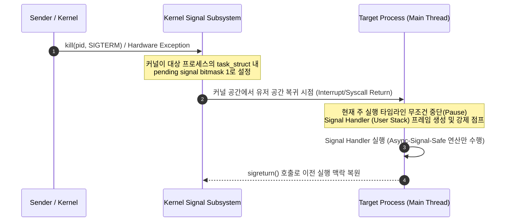

## POSIX Signal 은 커널이 프로세스의 실행 맥락을 제어하는 비동기 이벤트 알림 메커니즘이다

>**핵심 명제**: POSIX Signal은 프로세스에 예외적인 사건(하드웨어 예외, 소프트웨어 인터럽트, 사용자 명령)이 발생했음을 알리는 비동기 신호 메커니즘이다. 대용량 데이터 전달 용도가 아니며, 커널이 수신 프로세스의 실행 맥락(현재 실행 중인 코드의 상태와 위치)을 즉각 정지시키고 등록된 시그널 핸들러로 스레드를 전환시킨다. 시그널 핸들러 내부에서는 비동기 신호 안전(Async-Signal-Safe: 언제 어디서 호출되어도 안전한) 함수만 사용할 수 있는 엄격한 제약이 따른다.

### 초보자를 위한 쉽게 이해하는 비유

- **시그널 (긴급 벨)**:
  - 프로세스가 작업 중일 때 갑자기 벨이 울리고, 그 즉시 현재 작업을 멈추고 벨에 대응해야 한다.
  - 예: Ctrl+C를 누르면 (SIGINT) 실행 중인 프로그램이 즉시 중단된다.
  - 벨에 대응하는 방법(시그널 핸들러)은 매우 제한적이어야 한다. 복잡한 작업을 하다가 다른 작업이 끼어들면 큰 문제가 생기기 때문이다.

---

### 1. 내부 동작 메커니즘과 비동기 핸들러 (Async-Signal-Safety)



1. **Signal 전달 및 비동기 인터럽트 흐름**
   - 시그널이 발송되면 커널은 대상 프로세스의 `task_struct`(커널이 프로세스를 나타내기 위해 사용하는 데이터 구조) 내 시그널 펜딩 비트마스크(프로세스에 대기 중인 시그널이 있음을 표시하는 비트 패턴)를 갱신한다.
   - 프로세스가 시스템 콜 처리나 인터럽트 후 커널 공간에서 유저 공간으로 복귀하는 시점에 시그널을 감지하고, 유저 스레드의 EIP/RIP 레지스터(현재 실행 중인 코드 주소를 가리키는 CPU 레지스터)를 시그널 핸들러 주소로 재설정하여 점프시킨다.
2. **데이터 전달의 한계**
   - 표준 POSIX 시그널(`SIGINT`, `SIGKILL`, `SIGSEGV` 등)은 단지 "시그널 번호(정수)"만 전달할 수 있으며 실제 데이터 바이트를 실을 수 없다. (POSIX Real-time Signal `sigqueue()`의 `union sigval`을 제외하고는 순수 이벤트 알림 기능만 수행)
3. **비동기 신호 안전성 (Async-Signal-Safe)**
   - 시그널 핸들러는 언제 유저 코드의 어느 지점(예: `malloc()` 내부에서 락을 쥐고 있는 도중)에서나 실행될 수 있다.
   - 따라서 시그널 핸들러 안에서 Reentrant(재진입 가능: 동일 함수를 여러 번 호출해도 안전한)하지 않거나 내부 락을 사용하는 함수(예: `printf`, `malloc`, `free`, `pthread_mutex_lock`)를 호출하면 **데드락(상호 대기로 인한 영구 멈춤)** 또는 **메모리 오염**이 발생한다. `write()`, `read()`, `_exit()` 등 POSIX가 지정한 **Async-Signal-Safe 함수**만 호출해야 한다.

---

### 2. 구체적 실행 예시 코드 (`sigaction` 및 안전한 핸들러)

```c
#include <stdio.h>
#include <stdlib.h>
#include <unistd.h>
#include <signal.h>
#include <string.h>

// volatile sig_atomic_t: 시그널 핸들러에서 안전하게 원자적 접근 가능한 변수 타입
volatile sig_atomic_t graceful_shutdown_flag = 0;

void safe_signal_handler(int sig) {
    // async-signal-safe 한 write() 시스템 콜만 사용하여 로그 출력
    const char msg[] = "\n[Signal Handler] SIGINT Received! Setting shutdown flag...\n";
    write(STDOUT_FILENO, msg, sizeof(msg) - 1);
    
    graceful_shutdown_flag = 1; // 플래그 설정 후 즉시 리턴
}

int main() {
    struct sigaction sa;
    memset(&sa, 0, sizeof(sa));
    sa.sa_handler = safe_signal_handler;
    sigemptyset(&sa.sa_mask);
    sa.sa_flags = 0;

    // SIGINT (Ctrl+C) 핸들러 등록 (signal() 대신 sigaction() 권장)
    if (sigaction(SIGINT, &sa, NULL) < 0) {
        perror("sigaction error");
        exit(EXIT_FAILURE);
    }

    printf("Running Main Loop... Press Ctrl+C to stop.\n");
    while (!graceful_shutdown_flag) {
        sleep(1);
    }

    printf("[Main Thread] Graceful Shutdown Completed Cleanly.\n");
    return 0;
}
```

---

### 3. 관측 가능한 증거 (Observable Evidence)

1. **프로세스의 시그널 펜딩 및 블록 상태 확인 (`procfs`)**
   ```bash
   # 프로세스의 Signal 상태 16진수 비트마스크 조회
   cat /proc/<PID>/status | grep -i "sig"
   # SigPnd: 0000000000000000 (대기 중인 시그널)
   # SigBlk: 0000000000010000 (블록된 시그널 마스크)
   # SigIgn: 0000000000000004 (무시 설정된 시그널)
   # SigCgt: 0000000000000002 (핸들러가 등록된 시그널)
   ```

2. **비정상 관측 예외 (`SIGKILL` / `SIGSEGV` / `ANR Trace`)**
   - `SIGKILL`(9)과 `SIGSTOP`(19)은 커널이 즉시 수거하며 핸들러 등록 및 무시(`SIG_IGN`)가 불가능하다.
   - Android 시스템은 프로세스 응답 없음(ANR) 발생 시 target process 에 `SIGQUIT`(3)을 발송하여 `/data/anr/traces.txt` 에 스레드 덤프를 남기도록 유도한다.

---

### 4. 경계 조건 및 주의사항

- **`signal()` vs `sigaction()`**: 전통적 `signal()` API 는 System V 와 BSD 간 동작(핸들러 실행 후 기본 동작으로 자동 복구 여부 등)이 다르므로, 이식성 강화를 위해 반드시 `sigaction()` 을 사용해야 한다.

---

### 관련 문서 및 다리

- [IPC 메커니즘 개요](../ipc-mechanisms.md) — OS IPC 전체 지도 및 비교
- [Unix Domain Socket 계약](./unix-domain-socket-contracts.md) — FD 전달과 양방향 스트림 IPC
- [Android ANR Diagnostic Runbook](../../mobile/android/00_foundations/diagnostic-runbooks/02-anr.md) — SIGQUIT 기반 ANR trace 수집
