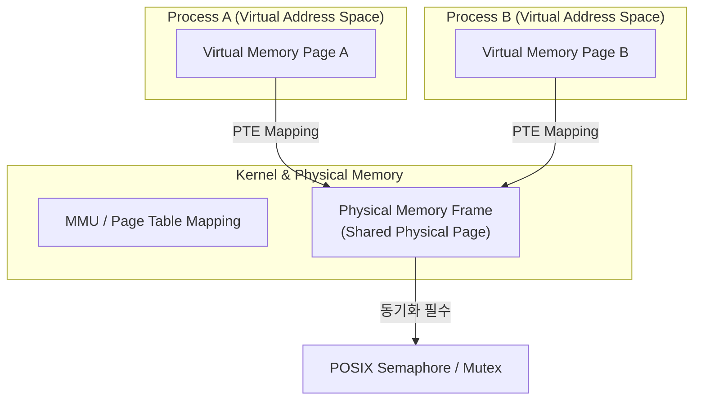

## 공유 메모리와 mmap 은 가상 메모리 페이지 테이블 매핑을 통한 최단 경로 Zero-Copy IPC 다

>**핵심 명제**: 공유 메모리(Shared Memory)와 `mmap` 은 커널을 통한 데이터 복사(Copy) 오버헤드 없이, 독립된 두 프로세스의 가상 주소 공간이 동일한 물리 메모리 프레임을 가리키도록 페이지 테이블(PTE)을 직접 매핑하는 가장 빠른 IPC 메커니즘이다. 데이터 전송 자체는 Zero-Copy 로 이루어지나, 동기화 Primitives(Semaphore, Mutex) 없이는 Race Condition 이 유발된다.

---

### 1. 내부 동작 메커니즘 (Virtual Address Space Mapping)



1. **페이지 테이블 매핑 (Page Table Mapping)**
   - `shmat()` 또는 `mmap(MAP_SHARED)` 호출 시, 커널 MMU(Memory Management Unit)는 두 프로세스의 가상 메모리 공간(Virtual Address Space) 상에 있는 페이지 엔트리(PTE)가 동일한 물리 메모리 페이지 프레임(Physical Page Frame)을 가리키도록 설정한다.
2. **Zero-Copy 이점과 버퍼 오버헤드 부재**
   - Socket, Pipe, Message Queue 가 커널 메모리 버퍼를 거치는 2-Copy 또는 1-Copy(mmap) 방식을 사용하는 것과 달리, 공유 메모리는 한 프로세스가 해당 메모리에 데이터를 쓰는 순간 즉시 다른 프로세스의 메모리 공간에 반영된다(Zero-Copy).
3. **Race Condition 과 동기화(Synchronization)의 필수성**
   - 공유 메모리는 데이터 전달 채널일 뿐 동기화 메커니즘을 제공하지 않는다.
   - 따라서 두 개 이상의 프로세스가 동시에 읽고 쓸 때 데이터 오염을 막기 위해 **POSIX Semaphore**나 **Process-Shared Mutex (`PTHREAD_PROCESS_SHARED`)**를 함께 결합하여 임계 영역(Critical Section)을 보호해야 한다.

---

### 2. 구체적 실행 예시 코드 (POSIX `shm_open` + `mmap`)

```c
#include <stdio.h>
#include <stdlib.h>
#include <string.h>
#include <fcntl.h>
#include <sys/mman.h>
#include <sys/stat.h>
#include <unistd.h>
#include <semaphore.h>

#define SHM_NAME "/my_posix_shm"
#define SEM_NAME "/my_posix_sem"
#define SHM_SIZE 1024

struct SharedData {
    sem_t mutex;
    char message[256];
};

int main() {
    // 1. POSIX Shared Memory 객체 생성 및 크기 설정
    int shm_fd = shm_open(SHM_NAME, O_CREAT | O_RDWR, 0666);
    ftruncate(shm_fd, sizeof(struct SharedData));

    // 2. 가상 주소 공간에 매핑 (MAP_SHARED)
    struct SharedData *shared_data = (struct SharedData *)mmap(
        NULL, sizeof(struct SharedData), PROT_READ | PROT_WRITE, MAP_SHARED, shm_fd, 0
    );

    // 3. 프로세스 간 공유 세마포어 초기화 (pshared = 1)
    sem_init(&shared_data->mutex, 1, 1);

    // 4. 임계 영역 동기화 진입 (Lock)
    sem_wait(&shared_data->mutex);
    strncpy(shared_data->message, "Shared Memory IPC with Zero-Copy!", sizeof(shared_data->message));
    printf("[Producer] Shared Data Written: %s\n", shared_data->message);
    sem_post(&shared_data->mutex); // UnLock

    // 5. 해제
    munmap(shared_data, sizeof(struct SharedData));
    close(shm_fd);
    // shm_unlink(SHM_NAME); // 제거 시 호출

    return 0;
}
```

---

### 3. 관측 가능한 증거 (Observable Evidence)

1. **공유 메모리 객체 및 매핑 상태 확인 (`procfs` & `ipcs`)**
   ```bash
   # POSIX 공유 메모리 파일 노드 확인
   ls -la /dev/shm/
   # -rw-r--r-- 1 user group 1024 Aug 5 11:42 my_posix_shm

   # 프로세스의 메모리 맵(maps)에서 Shared 매핑 확인
   cat /proc/<PID>/maps | grep "/dev/shm"
   # 7f9b8c000000-7f9b8c001000 rw-s 00000000 00:17 12345 /dev/shm/my_posix_shm

   # System V 공유 메모리 할당 현황 조회
   ipcs -m
   ```

2. **비정상 관측 예외 (`SIGSEGV` / Data Inconsistency)**
   - `shm_unlink()` 처리 후 분리되지 않은 dangling pointer 접근 시 `SIGSEGV` 발생
   - 동기화 세마포어 미적용 시 `dumpsys` 또는 메모리 모니터링 시 멀티스레드/멀티프로세스 환경에서 부분 작성된 깨진 데이터(Torn Read/Write) 관측

---

### 4. 경계 조건 및 안드로이드 차이점

- **전통적 POSIX SHM 의 한계**: System V/POSIX 공유 메모리는 프로세스가 파괴되어도 커널 상에 메모리가 잔류(`shm_unlink` 호출 전까지)하여 메모리 누수를 유발한다.
- **Android Ashmem (Anonymous Shared Memory)과의 차이**: Android 는 이 문제를 해결하기 위해 커널 레벨에서 **Pin/Unpin 메커니즘**과 **Low Memory Killer (LMK)** 연동 메모리 회수 수명을 결합한 `Ashmem` (현대 Android 는 `memfd_create` / `DMA-BUF`)을 도입했다.

---

### 관련 문서 및 다리

- [IPC 메커니즘 개요](../ipc-mechanisms.md) — OS IPC 전체 지도 및 비교
- [POSIX Pipe와 FIFO 계약](./posix-pipe-and-fifo-contracts.md) — 커널 링 버퍼 기반 단방향 IPC
- **POSIX IPC vs Android Binder & Ashmem 계약** — Ashmem 과 POSIX SHM 의 수명/보안 구조 차이
