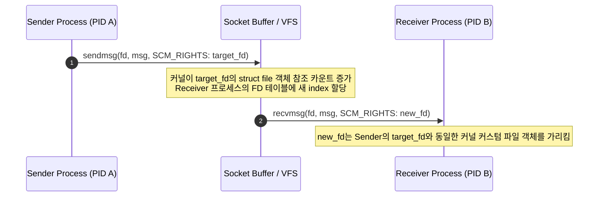

## Unix Domain Socket 은 양방향 전이중 통신과 프로세스 간 File Descriptor 패스스루를 지원한다

>**핵심 명제**: Unix Domain Socket(`AF_UNIX` / `AF_LOCAL`)은 동일 시스템 내 프로세스 간 양방향 전이중(Full-Duplex: 동시에 양쪽 방향 통신 가능) 데이터 전송을 지원하며, 파일 시스템 노드 또는 추상 네임스페이스(Abstract Namespace)를 주소로 사용한다. TCP/IP 프로토콜 스택 오버헤드가 없으며, `SCM_RIGHTS` 보조 데이터를 통해 프로세스 간에 커널 파일 디스크립터(File Descriptor: 열린 파일이나 소켓을 식별하는 정수 핸들)를 안전하게 전달하는 핵심 기능을 제공한다.

### 초보자를 위한 쉽게 이해하는 비유

- **Unix Domain Socket (집 안의 양방향 전화선)**:
  - 두 명이 동시에 통화하고 있는데, 파이프는 한 방향만 가능하고 소켓은 양방향이다.
  - 추상 네임스페이스는 전화번호 같은 것으로, 파일시스템에 실제 파일을 만들지 않아도 연결할 수 있다.

- **SCM_RIGHTS (파일을 넘겨주기)**:
  - 전화 통화 중에 물건을 직접 넘겨 줄 수는 없지만, 소켓을 통해 "파일 디스크립터"(어떤 파일을 열었다는 증명)를 넘겨주면 상대방이 그 파일을 그대로 사용할 수 있다.

---

### 1. 내부 동작 메커니즘과 SCM_RIGHTS (FD Passing)



1. **TCP/IP 대비 혜택과 커널 버퍼 전송**
   - `AF_INET`(TCP/IP) 소켓과 달리 IP 캡슐화, TCP 3-way handshake(연결 설정 과정), 체크섬 계산, 루프백 프로토콜 스택 통과 과정이 생략된다. 커널 내 수신/발신 버퍼 간의 단순 메모리 복사로 동작하여 높은 대역폭과 낮은 지연시간을 가진다.
2. **`SCM_RIGHTS`를 통한 File Descriptor 전달 (FD Passing)**
   - Unix Domain Socket의 가장 강력한 기능은 `sendmsg()` / `recvmsg()`의 보조 데이터(`struct cmsghdr`: 컨트롤 메시지를 담는 구조)를 통해 `SCM_RIGHTS` 컨트롤 메시지를 보낼 수 있다는 점이다.
   - 숫자 값(integer FD)만 전송되는 것이 아니라, **커널이 보내는 프로세스의 파일 디스크립터가 가리키는 `struct file` 커널 객체를 받는 프로세스의 FD 테이블에 새로 매핑하여 새로운 FD 인덱스를 할당**해 준다.
3. **주소 체계: Path-based vs Abstract Namespace**
   - **Path-based**: `/var/run/app.sock` 처럼 파일시스템 디렉터리에 생성되는 파일 노드. `unlink()`로 명시적으로 제거하지 않으면 파일이 남아있다.
   - **Abstract Namespace (Linux 전용)**: `sun_path[0] = '\0'` (null byte)로 시작하며 파일시스템 노드를 생성하지 않는다. 프로세스 종료 시 자동 소멸한다.

---

### 2. 구체적 실행 예시 코드 (SCM_RIGHTS FD 전달 C 구현)

```c
#include <stdio.h>
#include <stdlib.h>
#include <string.h>
#include <sys/socket.h>
#include <sys/un.h>
#include <unistd.h>
#include <fcntl.h>

// File Descriptor 보조 데이터 전송 함수
int send_fd(int socket_fd, int fd_to_send) {
    struct msghdr msg = {0};
    char buf[CMSG_SPACE(sizeof(int))];
    memset(buf, 0, sizeof(buf));

    struct iovec io = { .iov_base = "FD", .iov_len = 2 };
    msg.msg_iov = &io;
    msg.msg_iovlen = 1;

    msg.msg_control = buf;
    msg.msg_controllen = sizeof(buf);

    struct cmsghdr *cmsg = CMSG_FIRSTHDR(&msg);
    cmsg->cmsg_level = SOL_SOCKET;
    cmsg->cmsg_type = SCM_RIGHTS;
    cmsg->cmsg_len = CMSG_LEN(sizeof(int));
    memcpy(CMSG_DATA(cmsg), &fd_to_send, sizeof(int));

    return sendmsg(socket_fd, &msg, 0);
}
```

---

### 3. 관측 가능한 증거 (Observable Evidence)

1. **Unix Domain Socket 연결 상태 및 추상 네임스페이스 조회 (`ss` & `netstat`)**
   ```bash
   # 소켓 상태 및 활성 유닉스 소켓 경로 조회
   ss -x -a
   # u_str ESTAB 0 0 /var/run/dbus/system_bus_socket 12345 * 67890

   # Linux Abstract Namespace 소켓 조회 (@로 시작)
   netstat -xl | grep "@"
   # unix 2 [ ACC ] STREAM LISTENING 112233 @/tmp/dbus-abstract-sock
   ```

2. **Android 및 Linux 데몬 활용 예시**
   - **Android `zygote` 소켓**: SystemServer 및 자식 앱 프로세스 생성 요청을 `/dev/socket/zygote` Unix Domain Socket 을 통해 전달한다.
   - **Android Binder 와의 연관성**: Binder 역시 샌드박스 간 `ParcelFileDescriptor` 전달 시 내부적으로 커널 레벨 FD 구조체 참조를 복사하는데, 이 메커니즘의 근간이 `SCM_RIGHTS` 계약이다.

---

### 4. 경계 조건 및 주의사항

- **보안 자격 증명 (`SO_PEERCRED`)**: `AF_UNIX` 소켓은 `getsockopt(fd, SOL_SOCKET, SO_PEERCRED, &ucred, …)` 를 통해 소켓 연결 상대방의 실제 PID, UID, GID 자격증명을 커널이 보장하는 방식으로 검증할 수 있어 IPC 보안 게이트로 널리 쓰인다.

---

### 관련 문서 및 다리

- [IPC 메커니즘 개요](../ipc-mechanisms.md) — OS IPC 전체 지도 및 비교
- [POSIX Pipe와 FIFO 계약](./posix-pipe-and-fifo-contracts.md) — 단방향 스트림 IPC
- [Binder IPC](../../mobile/android/01_system_internals/ipc-and-process/binder-ipc.md) — ParcelFileDescriptor 전달과 UID 검증의 비교
